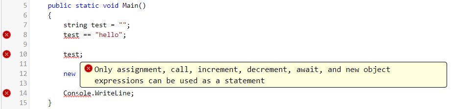

---
categories:
  - Coding
date: 2019-11-14T17:25:00Z
description: ""
draft: false
cover:
  image: photo-1517694712202-14dd9538aa97.jpg
slug: only-assignment-call-increment-decrement-await-and-new-object-expressions-can-be-used-as-a-statement
summary: This error might look a little cryptic at first glance, but it's fairly descriptive in explaining what's wrong. You're likely to come across this one before your first cup of coffee.
tags:
  - csharp
title: Only assignment, call, increment, decrement, await, and new object expressions can be used as a statement
---
This error might look a little cryptic at first, but what it's basically telling you is that what you typed isn't a valid C# statement. It probably looks really close though, because usually you just have a small typo.



First though, what's a [statement](https://docs.microsoft.com/en-us/dotnet/csharp/programming-guide/statements-expressions-operators/statements)? Well, it's every valid line (or in some cases, block) of code that makes up your program, for example:

- Assignments: `string name = "my string";`
- Calls: `MyOtherFunction();`
- Increments: `x++;`
- Decrements: `x--;`
- Await: `await myLongTask;`
- New object expressions: `new Person();`

In general, most statements should either modify a variable's value in-place, perform some side-effect (like a `foreach` block), or at least do something with the return value.

So if you get this error, double-check the line it's complaining about to make sure it's a valid statement, specifically one of the types listed in the error message itself.

## What should you check for?

Are you missing a set of parentheses?

```cs
Console.WriteLine
```

Did you use `==` instead of `=`?

```cs
string name;
name == Grant;
```

Did you combine elements of a property and method?  
```cs
public string Name() { get; set; }
```

Does your statement only return a value, but you're doing nothing with it?  

```cs
var hi = "Hello, "; hi + " Grant";`
```

If none of those do it for you, feel free to leave a comment below. Heck, post the offending line, and we'll debug it together - maybe I'll have something else to add to this list.
