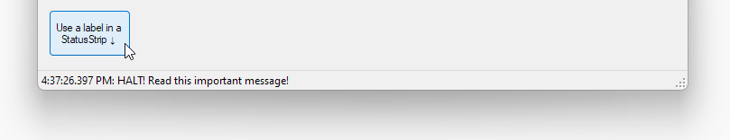

---
categories:
  - Explore
date: 2023-08-16T01:35:54Z
description: ""
draft: false
postimage: /banners/generic-explore-banner.webp
slug: other-ways-to-notify-user-besides-messagebox
summary: When sending notifications in a WinForms app, a MessageBox is the only way to go... or is it? Let's get creative and see what else we might do.
tags:
  - surviving-winforms
  - winforms
  - csharp
title: Simple ways to notify a user without a MessageBox in WinForms
---
I think all of us would agree that when we're notified about something, it's best to have it jammed in front of our faces, interrupting whatever else we're doing until we deal with it. The latest issue, whatever it is, is the most pressing and should demand our immediate attention. This is the way. 😑

Unfortunately, this really is the way for most WinForms apps I've seen. Whatever a user is doing at the moment, if they run into an issue, the defacto action is to just throw a MessageBox in front of them. Since most WinForms apps tend to be single-threaded, with only one thing being done at a time, most messages that pop up _are_ related to whatever the user is doing at the moment. Maybe that'll change if more devs adopt the [async/await pattern](https://grantwinney.com/using-async-await-and-task-to-keep-the-winforms-ui-more-responsive/), but that'll take a long time.

A `MessageBox` isn't the only way to notify a user that something has happened or needs attention though, so let's take a look at a few alternatives!

> The code in this post is available on [GitHub](https://github.com/grantwinney/Surviving-WinForms/tree/master/Presentation/Native/AlternativesToMessageBox), for you to use, expand upon, or just follow along while you read... and hopefully discover something new!

Before continuing, keep in mind that everything below should be taken with a grain of salt. I'm not selling anything here as the best idea for an app (ymmv and all that), but since most of the projects I've ever worked on included requirements for new messages to popup in front of the user, I thought it'd be fun to look at what _else_ we could do.

## StatusStrip

I tend to forget about the [StatusStrip](https://learn.microsoft.com/en-us/dotnet/desktop/winforms/controls/statusstrip-control-overview) control, since it's generally only used in [MDI forms](https://learn.microsoft.com/en-us/dotnet/desktop/winforms/advanced/multiple-document-interface-mdi-applications), which are present in most enterprisey type WinForms apps, but only on a single Form that's marked as MDI. There's no reason you can't add one in other places and positions though, as needed.

For this example, I used a [`Queue<T>`](https://learn.microsoft.com/en-us/dotnet/api/system.collections.generic.queue-1) to queue up some messages to show the user. Since the WinForms [Timer](https://learn.microsoft.com/en-us/dotnet/api/system.windows.forms.timer) operates on the same thread as the UI, it's safe to use the `Queue<T>` here.. otherwise you'd want a `ConcurrentQueue<T>` (which I use in a later example). The timer executes every 100 ms (the default), checking the queue for pending messages and displaying each for 3 seconds, one after another.

```csharp
readonly Queue<string> pendingMessages = new Queue<string>();

private void btnUseStatusStrip_Click(object sender, EventArgs e)
{
    pendingMessages.Enqueue($"{DateTime.Now:h:mm:ss.fff tt}: {MSG_TEXT}");
}

private async void timer1_Tick(object sender, EventArgs e)
{
    timer1.Stop();

    while (pendingMessages.Count > 0)
    {
        toolStripStatusLabelMessage.Text = pendingMessages.Dequeue();
        await Task.Delay(3000);
    }

    toolStripStatusLabelMessage.Text = "";
    timer1.Start();
}
```

The result is a simple message, out of the way yet still visible from anywhere, easily-readable yet not popping up in the user's face and stopping them in their tracks until they acknowledge it.



## FlowLayoutPanel

The [FlowLayoutPanel](https://learn.microsoft.com/en-us/dotnet/desktop/winforms/controls/flowlayoutpanel-control-overview) is a control that (I feel) doesn't get much love.. then again, it's WinForms so love is tough to come by, lol. I'm not sure I've ever actually used it at any place I worked, but I do tend to use it in examples like the one [in this post](https://grantwinney.com/call-an-async-method-from-a-synchronous-one/) because it makes placement of multiple controls much faster and easier.

This one adds messages as a new `Label` to the `FlowLayoutPanel`, where the `FlowDirection = TopDown`. After 3 seconds, they self-destruct. 💣

```csharp
private async void btnUseFlowLayoutPanel_Click(object sender, EventArgs e)
{
    await AddMessageToPanel($"{DateTime.Now:h:mm:ss.fff tt}: {MSG_TEXT}");
}

private async Task AddMessageToPanel(string message)
{
    var l = new Label { Text = message, AutoSize = true };
    flowLayoutPanelMessages.Controls.Add(l);
    await Task.Delay(3000);  // give user a few seconds to read it
    l.Dispose();
}
```

The result is a stack of messages in labels, aligned for us by the `FlowLayoutPanel`. No calculations of heights and positions to align everything, or using a single TextBox with `Multiline = True`.


## NotifyIcon / Windows Notification Area

Another good way to let the user know about something, and offload some of your own work at the same time, is to use a [NotifyIcon](https://learn.microsoft.com/en-us/dotnet/desktop/winforms/controls/notifyicon-component-overview-windows-forms) and display notifications using the [Windows notification area](https://learn.microsoft.com/en-us/windows/win32/shell/notification-area). Just drop a `NotifyIcon` on the Form and make a single line call (the timeout doesn't matter in most circumstances, since it's ignored on every version of Windows in the last 15 years).

```csharp
private void btnUseNotifyIcon_Click(object sender, EventArgs e)
{
    notifyIcon1.ShowBalloonTip(2000, MSG_CAPTION,
        $"{MSG_TEXT} ({DateTime.Now:h:mm:ss tt})", ToolTipIcon.Warning);
}
```

While this is convenient, it shouldn't be used for anything really vital because you have so little control over it. The user (depending on how much access they have on the system) can adjust notifications and even disable them altogether for individual (or all) apps.


## Use a separate Form

It's even possible to use a separate Form to display your notifications.. sort of like your own notification area. The way I've done it in my example, both Forms are running on the main UI thread, which may or may not be fine depending on the circumstance.

The Form that displays the messages has a static `ConcurrentQueue<T>` in it, [which is threadsafe](https://learn.microsoft.com/en-us/dotnet/api/system.collections.concurrent.concurrentqueue-1). It's not really necessary the way I'm using it here, but it's worth knowing it's available, especially if you're pushing messages to the queue from different threads.

```csharp
public static readonly ConcurrentQueue<string> Messages = new ConcurrentQueue<string>();

public frmMessages()
{
    InitializeComponent();
}

private void timer1_Tick(object sender, EventArgs e)
{
    timer1.Stop();

    while (Messages.Any())
        if (Messages.TryDequeue(out var message))
        {
            var l = new Label { Text = $"{message} (click to dismiss)", AutoSize = true };
            l.Click += (s, evt) => { l.Dispose(); if (flowLayoutPanel1.Controls.Count == 0) Hide(); };
            flowLayoutPanel1.Controls.Add(l);
            Show();
        }

    timer1.Start();
}
```

To use it from the other Form, just push a message to the concurrent queue. I don't like how I'm calling it here, directly accessing it on the other Form, but this is a simple example. I'll leave it to anyone who finds it intriguing to come up with a better way to architect their app.

```csharp
private void btnUseSeparateForm_Click(object sender, EventArgs e)
{
    if (msgForm == null)
    {
        msgForm = new frmMessages();
        msgForm.Show();
    }

    frmMessages.Messages.Enqueue($"{DateTime.Now:h:mm:ss.fff tt}: {MSG_TEXT}");
}
```

The result is a small popup Form with some messages in them. Click a message to remove it. Remove all messages and the second Form hides itself until there's something else to display.


## Everything all at once...

And here's everything in one go.


Like I said earlier, these are just little examples to be taken with a grain of salt. The point is, a `MessageBox` is not the _only_ way to send notifications to users. Depending on your needs, maybe something here will work or at least get the creative juices flowing.. and I'm sure there are _plenty_ of more robust ways out there for the intrepid dev. Good luck!
