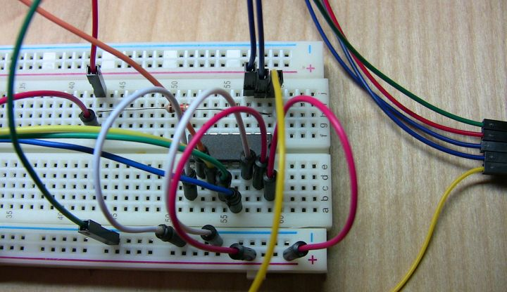
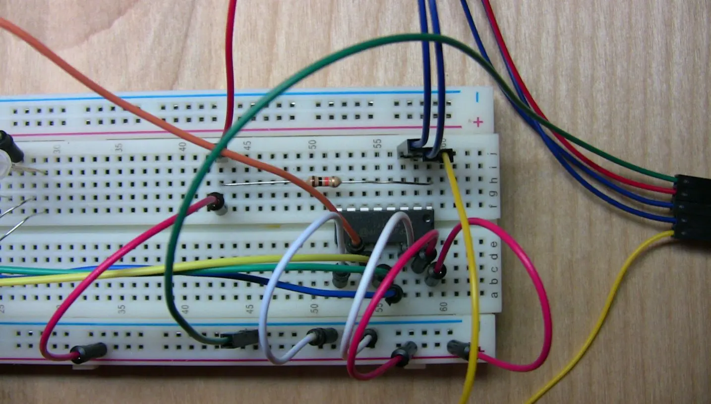
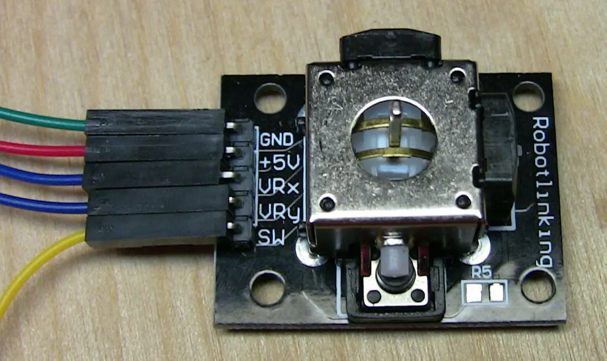
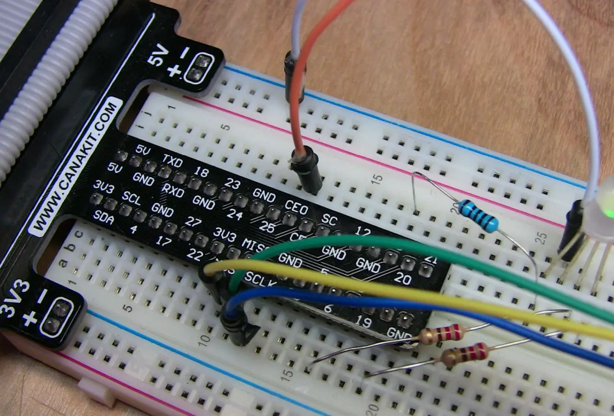
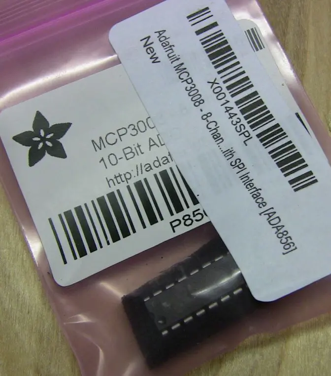
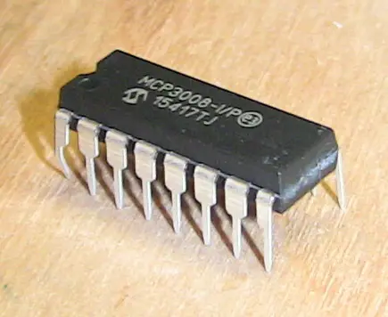
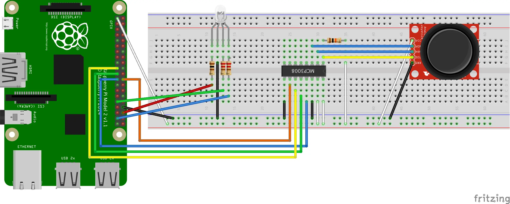
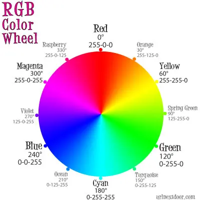

---
categories:
  - Exploring
date: 2016-09-24T13:30:49Z
description: ""
draft: false
cover:
  image:
slug: raspberry-pi-analog-joystick
tags:
  - raspberry-pi
  - python
title: Connecting an Analog Joystick to the Raspberry Pi
---
One of the best things about the Raspberry Pi is its GPIO pins. They’re just sitting there, waiting to be connected to all kinds of interesting peripherals so your Pi can interact with the world around it. We can [send alerts](https://grantwinney.com/raspberry-pi-flash-led-for-new-email/), attach sensors, and even plug cards like the [Sense HAT](https://www.raspberrypi.org/products/sense-hat/) over top of the pins to do even more.

A few months ago, I bought a set of 37 sensor modules. I knew they wouldn’t directly interface with the Pi, but that it was entirely possible to do it, so they were set aside for later. Well, it's time to try one out, and I figure the mini-joystick might offer some interesting opportunities!

## Materials

There are a few things we need first:

- **Raspberry Pi Starter Kit**  
    A decent starter kit includes the Pi, adapter, memory card, case, breadboard and cobbler, wires and LEDs, etc.
- **Long Breadboard**  
    Some of the kits come with a shorter breadboard, but a longer board gives us more space to work, allowing for more wires, LEDs, switches, etc.
- **Kuman 37 Sensor Module Kit for Arduino**  
    That's the one I got, but I'm sure there's plenty of similar ones. Mine came with a joystick control (which I used for this post), and a load of other sensors and input devices. There was no documentation, but I found a [link to (somewhat sparse) instructions for each module](https://mega.nz/#F!LElQwT6R!Tj6SclwUfajz1ZihF_s2Mw) on Amazon.
- **Male to female jumper wires**  
    We need wires to connect the joystick to the breadboard.
- **Adafruit MCP3008 – 8-Channel 10-Bit ADC With SPI Interface [ADA856]**  
    A tiny chip that bridges the gap between an analog control and the Pi. It’s cheaper directly from [Adafruit](https://www.adafruit.com/products/856), but watch out for shipping. If you’re buying several instead of just one like me, consider Adafruit’s site. [Here's the datasheet](http://www.microchip.com/wwwproducts/en/en010530).

## Interfacing with Analog Controls

The joystick is an analog control, consisting of two potentiometers that send a variable voltage depending on the position of the joystick (here’s a [video that shows how they work](https://www.youtube.com/watch?v=MXFvWLrpVSk)), and it won’t just connect directly to the GPIO pins on the Pi. If your joystick can be pressed down like mine can, then that bonus button just has an on/off state and can be connected directly to any regular GPIO pin. But I’ll wire it up same as the potentiometers, since that’s what the articles linked below do as well.

To get it to work, we need to learn a little about the SPI bus protocol and how to enable it on the Pi, then how to wire up a small chip that uses SPI to bridge the gap between analog controls and the Pi. Fortunately, there’s a set of helpful tutorials on the Raspberry Pi Spy website, which I'd suggest checking out:

- [Enabling The SPI Interface On The Raspberry Pi](http://www.raspberrypi-spy.co.uk/2014/08/enabling-the-spi-interface-on-the-raspberry-pi/)
- [Using A Joystick On The Raspberry Pi Using An MCP3008](http://www.raspberrypi-spy.co.uk/2014/04/using-a-joystick-on-the-raspberry-pi-using-an-mcp3008/)
- [Analogue Sensors On The Raspberry Pi Using An MCP3008](http://www.raspberrypi-spy.co.uk/2013/10/analogue-sensors-on-the-raspberry-pi-using-an-mcp3008/)

The first link shows how to enable the Serial Peripheral Interface (SPI) bus on certain GPIO pins. Method 1 worked fine for me – just open up a config screen in Raspbian and select the SPI option.

The second link walks through wiring up the MCP3008 chip, providing the bridge between the joystick and Pi. The third link isn't necessary, but it’s got some helpful info in it that’s not in the other one. I suggest reading both.

Also, for changing colors on an RGB LED, it may help to read about [pulse-width modulation (PWM)](https://grantwinney.com/raspberry-pi-pulse-width-modulation/).

Here are some pictures and a diagram of my setup, although the author of the linked articles provides a good set of pics too. There’s some additional stuff in my circuit that’s not in his, namely the RGB LED and resistors/wires to make it work. I used a 100Ω resistor for red and 220Ω for green and blue, [same as here](https://grantwinney.com/raspberry-pi-pulse-width-modulation/).

2.jpg)













### Fritzing Diagram



If you’d like, you can [download the original Fritzing file](Joystick-Color-Wheel.fzz) and play around with it.

## Reading Input

You should’ve already verified that Python Spidev ([pi-spydev](https://github.com/doceme/py-spidev)) was installed after you enabled SPI. We’ll need that for reading input from the analog device.

Since I’ve been [messing with an RGB LED](https://grantwinney.com/raspberry-pi-pulse-width-modulation/) lately, I thought it’d be interesting to map the position of the joystick to the RGB color wheel and then light up the LED appropriately. Imagine the X-axis running horizontal above Blue and Green, and the Y-axis running vertical through Red and Cyan.



Here’s the code in its entirety:

```python
import math
import RPi.GPIO as GPIO
import spidev
 
# Open SPI bus
spi = spidev.SpiDev()
spi.open(0, 0)
 
# Define sensor channels (3 to 7 are unused)
mcp3008_switch_channel = 0
mcp3008_x_voltage_channel = 1
mcp3008_y_voltage_channel = 2
 
# Define RGB channels
red_led = 36
green_led = 31
blue_led = 37
 
 
def read_spi_data_channel(channel):
    """
    Read in SPI data from the channel and return a coordinate position
    :param channel: integer, between 0-7
    :return: integer, between 0-1023 indicating joystick position
    """
 
    adc = spi.xfer2([1, (8+channel) << 4, 0])
    return ((adc[1] & 3) << 8) + adc[2]
 
 
def convert_coordinates_to_angle(x, y, center_x_pos, center_y_pos):
    """
    Convert an x,y coordinate pair representing joystick position,
    and convert it to an angle relative to the joystick center (resting) position
    :param x: integer, between 0-1023 indicating position on x-axis
    :param y: integer, between 0-1023 indicating position on y-axis
    :param center_x_pos: integer, indicating resting position of joystick along x-axis
    :param center_y_pos: integer, indicating resting position of joystick along y-axis
    :return: integer, between 0-359 indicating angle in degrees
    """
 
    dx = x - center_x_pos
    dy = y - center_y_pos
    rads = math.atan2(-dy, dx)
    rads %= 2 * math.pi
    return math.degrees(rads)
 
 
def adjust_angle_for_perspective_of_current_led(angle, led):
    """
    Take the current LED into account, and rotate the coordinate plane 360 deg to make PWM calculations easier
    :param angle: integer, between 0-359 indicating current angle of joystick position
    :param led: 'R', 'G', 'B', indicating the LED we're interested in
    :return: integer, between 0-359 indicating new angle relative to the current LED under consideration
    """
 
    led_peak_angle = 90 if led == 'R' else (210 if led == 'B' else 330)
    return ((angle - led_peak_angle) + 360) % 360
 
 
def calculate_next_pwm_duty_cycle_for_led(angle, led):
    """
    Calculate the next PWM duty cycle value for the current LED and joystick position (angle)
    :param angle: integer, between 0-359 indicating current angle of joystick position
    :param led: 'R', 'G', 'B', indicating the LED we're interested in
    :return: integer, between 0-100 indicating the next PWM duty cycle value for the LED
    """
 
    angle = adjust_angle_for_perspective_of_current_led(angle, led)
    if 120 < angle < 240:
        return 0
    elif angle <= 120:
        return 100 - (angle * (100 / 120.0))
    else:
        return 100 - ((360 - angle) * (100 / 120.0))
 
 
def is_joystick_near_center(x, y, center_x_pos, center_y_pos):
    """
    Compare the current joystick position to resting position and decide if it's close enough to be considered "center"
    :param x: integer, between 0-1023 indicating position on x-axis
    :param y: integer, between 0-1023 indicating position on y-axis
    :param center_x_pos: integer, indicating resting position of joystick along x-axis
    :param center_y_pos: integer, indicating resting position of joystick along y-axis
    :return: boolean, indicating whether or not the joystick is near the center (resting) position
    """
 
    dx = math.fabs(x - center_x_pos)
    dy = math.fabs(y - center_y_pos)
    return dx < 20 and dy < 20
 
 
def main():
    """
    Initializes GPIO and PWM, then sets up a loop to continually read the joystick position and calculate the next set
    of PWM value for the RGB LED. When user hits ctrl^c, everything is cleaned up (see 'finally' block)
    :return: None
    """
 
    # Center positions when joystick is at rest
    center_x_pos = 530
    center_y_pos = 504
 
    GPIO.setmode(GPIO.BOARD)
    GPIO.setup([red_led, green_led, blue_led], GPIO.OUT, initial=GPIO.LOW)
 
    pwm_r = GPIO.PWM(red_led, 300)
    pwm_g = GPIO.PWM(green_led, 300)
    pwm_b = GPIO.PWM(blue_led, 300)
 
    pwm_instances = [pwm_r, pwm_g, pwm_b]
 
    for p in pwm_instances:
        p.start(0)
 
    try:
        while True:
            # If joystick switch is pressed down, turn off LEDs
            switch = read_spi_data_channel(mcp3008_switch_channel)
            if switch == 0:
                for p in pwm_instances:
                    p.ChangeDutyCycle(0)
                continue
 
            # Read the joystick position data
            x_pos = read_spi_data_channel(mcp3008_x_voltage_channel)
            y_pos = read_spi_data_channel(mcp3008_y_voltage_channel)
 
            # If joystick is at rest in center, turn on all LEDs at max
            if is_joystick_near_center(x_pos, y_pos, center_x_pos, center_y_pos):
                for p in pwm_instances:
                    p.ChangeDutyCycle(100)
                continue
 
            # Adjust duty cycle of LEDs based on joystick position
            angle = convert_coordinates_to_angle(x_pos, y_pos, center_x_pos, center_y_pos)
            pwm_r.ChangeDutyCycle(calculate_next_pwm_duty_cycle_for_led(angle, 'R'))
            pwm_g.ChangeDutyCycle(calculate_next_pwm_duty_cycle_for_led(angle, 'G'))
            pwm_b.ChangeDutyCycle(calculate_next_pwm_duty_cycle_for_led(angle, 'B'))
 
            # print("Position : ({},{})  --  Angle : {}".format(x_pos, y_pos, round(angle, 2)))
 
    except KeyboardInterrupt:
        pass
 
    finally:
        for p in pwm_instances:
            p.stop()
        spi.close()
        GPIO.cleanup()
 
 
if _name_ == '_main_':
    main()
```

I wrote the `adjust_angle_for_perspective_of_current_led` function to make calculations easier. Imagine a 360 degree circle overlaying the color wheel. Each color (red, blue, green) is separated by 120 degrees. So if red is at 90 (the top), then blue is at 210 and green is at 330. That function rotates the imaginary circle, placing the LED we’re concerned about at 0 degrees.

The `is_joystick_near_center` function was necessary because the joystick is not that accurate. Even when it’s sitting still, the readings coming off it fluctuate a bit. That’s not a huge deal when the joystick is positioned far away from the center, but imagine what happens when the position is near center and the X and Y coordinates keep jumping around the vertex of our “angle”. The angle varies wildly, so that when the joystick is “at rest”, the color flickers all over the place on the LED. So instead, I just display white if you’re near center.

If you clone the repo, you'll see a separate file with tests in it. To run the tests in this project, first install the [DDT (Data-Driven Tests) package for Python unit testing](https://technomilk.wordpress.com/2012/02/12/multiplying-python-unit-test-cases-with-different-sets-of-data/) via pip.

## See it in Action

[You can see it in action here](https://res.cloudinary.com/dxm4riq52/video/upload/v1583294278/Raspberry%20Pi/Connecting_an_Analog_Joystick_to_the_Raspberry_Pi_nylfzo.mp4).

If you have a question about any of the code, leave a comment below and I’ll try to clarify. There’s one tricky piece in the `read_spi_data_channel()` function, and that’s the call to `spi.xfer2()`. Suffice to say, that’s the pi-spydev module doing work.

If you want, check out the [spidev_module.c](https://github.com/doceme/py-spidev/blob/master/spidev_module.c) file and do a search for “xfer2″. It’s roughly 100 lines of C code.
