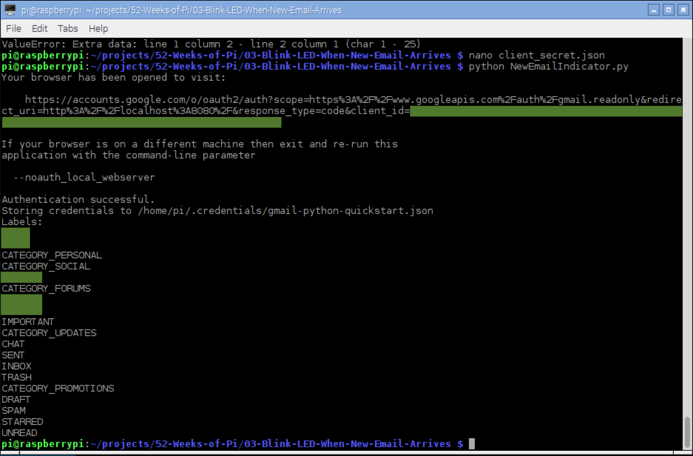
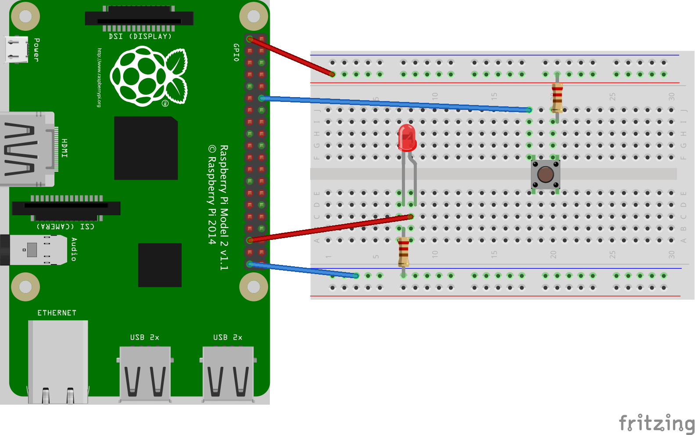
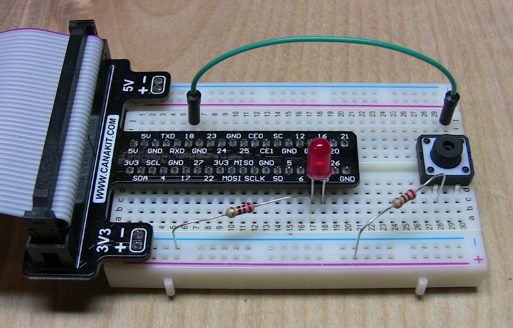
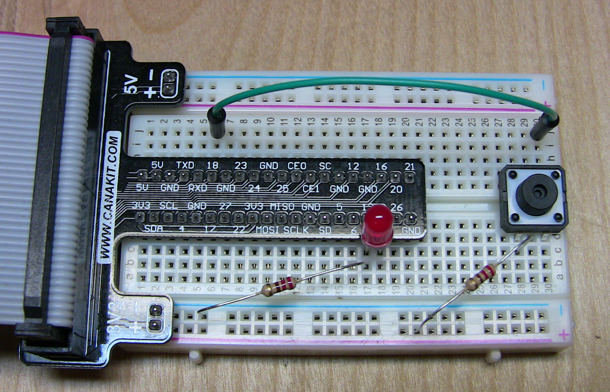

---
categories:
  - Raspberry Pi
date: 2016-05-28T21:19:25Z
description: ""
draft: false
cover:
  image: photo-1581869399661-d6b14e4f6121.jpg
slug: raspberry-pi-flash-led-for-new-email
summary: Let's learn how to flash an LED on the Raspberry Pi when someone sends us a new email.
tags:
  - raspberry-pi
  - python
title: Flash an LED on Your Raspberry Pi When You Get New Email
aliases:
  - /how-to-flash-an-led-on-your-raspberry-pi-when-you-get-new-email
---
Let's create an email notification system using the Raspberry Pi. It'll check for new email, and flash an LED when we get one.

## Connecting to Gmail

The circuit will be extremely straight-forward, so let’s focus on the more difficult part first – connecting to an email service.

We need to create a secure connection to our email provider, so we can find out when new mail arrives. Do a quick search, and you’ll likely find scripts [like this one](http://stackoverflow.com/a/642988) where you just connect with your username, password and a few other pieces of info depending on who the provider is. But what you can do will be extremely limited, and the code will be fragile.

### Find the Official API

The preferred option is to check whether your email provider has already provided an “official” way to connect to their system and retrieve data from it. These are commonly referred to as APIs, or application programming interfaces.

When a company provides an API, that means they’ve put real time and effort into exposing certain areas of their system to you (although you’ll still have to do some work of your own, as we’ll see), and you can access those systems in relative confidence that how you’re connecting won’t just change or break.

Most of the major email services provide an API, including [MS Office](https://learn.microsoft.com/en-us/outlook/rest/get-started), [Yahoo Mail](https://developer.yahoo.com/sign-in-with-yahoo), and [Gmail](https://developers.google.com/gmail/api/quickstart/python). Gmail is the only service I use, so that’s the one I focused on here.

### Authenticating

With Gmail, the API was my only option. Every time I tried a Python script I found, I’d get the following error:

> _imaplib.error: [ALERT] Application-specific password required: https://support.google.com/accounts/answer/185833 (Failure)_

The problem is that [I have 2-Step Verification enabled](https://support.google.com/accounts/answer/185833), and the script can’t get past that. That’s okay… 2FA is a good thing, and we don’t want to disable that. There’s another, more secure and stable, way to access a Gmail account.

Google provides an API for connecting to most of their systems (including Gmail), along with tutorials to implement it in multiple languages (including Python). We can use the API to access messages or pretty much any other aspect of our email account.

This process involves entering a few details on their side, and then they assign you some special numbers (a “client id” and a “client secret”). You download those numbers in a special file called “client_secret.json” and include it with your script, which in turn helps prove that the script is authorized to access your account.

Follow their [Python Quickstart](https://developers.google.com/gmail/api/quickstart/python). Note the other languages on the left too, if you’d rather try one of those. After you authenticate, their sample script prints a list of your email tags:



### Getting the Unread Mail Count

Once authenticated, their API gives you access to all kinds of useful info about your account. We’ll just modify the [sample script](https://developers.google.com/gmail/api/quickstart/python#step_3_set_up_the_sample) they provided.

Most of their script is just about authenticating to Gmail, so don’t touch any of that. The following two lines got the list of labels above, and those are the ones we’ll change.

```python
results = service.users().labels().list(userId='me').execute() 
labels = results.get('labels', [])
```

But what do we change them to? To find out which API calls we need to make, we’ll delve into the [APIs Explorer for the Gmail API](https://developers.google.com/apis-explorer/#p/gmail/v1/). It’s a nice tool, where you can browse through all the available API calls, and even try them out, all from within your browser.

The one we need is [gmail.users.messages.list](https://developers.google.com/apis-explorer/#p/gmail/v1/gmail.users.messages.list), so we can get a list of messages (and then count them). But we’re not interested in *all *email, just a subset. How do we do that?

Check out that screen capture above again. There’s a hidden label called “UNREAD” that’ll work nicely. The API allows you to place filters (such as `userId='me'`) inside the call to `list()`, and one of them is a query string (denoted as `q=...` below).

```python
messages = service.users().messages().list(userId='me', q='is:inbox + is:unread').execute()
unread_count = messages['resultSizeEstimate']
```

By using `is:inbox + ``is:unread` we can get emails with _both_ of those labels. The [json](http://developers.squarespace.com/what-is-json/) response we get back includes two keys – one is a list of messages, while the other is the number of messages. We can use the latter to get our message count.

```json
{
 "messages": [
  {
   "id": "xxxxxxxxxxxxxxxx",
   "threadId": "xxxxxxxxxxxxxxxx"
  }
 ],
 "resultSizeEstimate": 1
}
```

Here’s the main portion of the script. I split most of the Gmail stuff into a separate file. The code that does the actual authorization to Gmail is in yet another file, which you can find along with the rest of the code.

Gmail.py:

```python
from apiclient import errors
import threading
import time
import RPi.GPIO as GPIO
import GmailAuthorization
 
PIN = 35
CHECK_INTERVAL = 30
 
service = None
unread_count = 0
 
 
def refresh():
    global unread_count
    try:
        messages = service.users().messages().list(userId='me', q='is:inbox + is:unread').execute()
        unread_count = messages['resultSizeEstimate']
    except errors.HttpError as error:
        print('An error occurred: {0}'.format(error))
 
 
def indicator():
    while True:
        if unread_count > 0:
            GPIO.output(PIN, not GPIO.input(PIN))
        else:
            GPIO.output(PIN, GPIO.LOW)
        time.sleep(0.5)
 
 
def monitor():
    while True:
        refresh()
        time.sleep(CHECK_INTERVAL)
 
 
def start_indicator():
    t = threading.Thread(target=indicator)
    t.daemon = True
    t.start()
 
 
def start_monitor():
    t = threading.Thread(target=monitor)
    t.daemon = True
    t.start()
 
 
def load_service():
    global service
    service = GmailAuthorization.get_service()
 
 
def start():
    load_service()
    start_indicator()
    start_monitor()
```

NewEmailIndicator.py:

```python
import RPi.GPIO as GPIO
import Gmail
 
CHECK_NOW_PIN = 12
 
 
def initialize_gpio():
    GPIO.setmode(GPIO.BOARD)
    GPIO.setup(Gmail.PIN, GPIO.OUT)
    GPIO.setup(CHECK_NOW_PIN, GPIO.IN, pull_up_down=GPIO.PUD_DOWN)
    GPIO.add_event_detect(CHECK_NOW_PIN, GPIO.RISING, callback=check_mail_now, bouncetime=1000)
 
 
def check_mail_now(_):
    Gmail.refresh()
 
 
def main():
    try:
        initialize_gpio()
        Gmail.start()
        raw_input("\nPress any key to exit.\n")
    finally:
        GPIO.cleanup()
 
 
if _name_ == '_main_':
    main()
```

## Designing the Circuit

Once we’ve got a script that’ll connect to an email account, retrieve the data we’re interested in, and turn a GPIO pin on or off based on what we find, the next step is to create the circuit.

It’s a fairly simple one, limited to just an LED and a resistor, connecting board pin 35 to ground. I’ve also added a button (and second resistor) to the circuit, connected to board pin 12, that allows us to immediately check for new email without waiting for the interval. That way, we can change `CHECK_INTERVAL` to some less-frequent number like 60 (a minute), but then press the button if we don’t feel like waiting. That’s what the `add_event_detect` line is for in the above code.



Here are some photos of the actual circuit.





Questions? Comments? Hit me up in the comments section below.

## **More Reading**

Some extra reading if you’re interested. Just some stuff I came across while doing research for this project:

**Gmail**

- [Python Quickstart](https://developers.google.com/gmail/api/quickstart/python)
- [Gmail API Client Library for Python](https://developers.google.com/api-client-library/python/apis/gmail/v1)
- [Gmail API Reference](https://developers.google.com/gmail/api/v1/reference/)
- [Gmail API: Users.messages:list](https://developers.google.com/gmail/api/v1/reference/users/messages/list)
- [Google APIs Explorer: Gmail](https://developers.google.com/apis-explorer/#p/gmail/v1/)
- [Google APIs Explorer (gmail.users.messages.list)](https://developers.google.com/apis-explorer/#p/gmail/v1/gmail.users.messages.list)
- [Python library for accessing resources protected by OAuth 2.0](https://github.com/google/oauth2client)
- [Python client library for Google’s discovery based APIs](https://github.com/google/google-api-python-client)

**Raspberry Pi**

- [What is a Breadboard and How to use it](http://www.tweaking4all.com/hardware/breadboard)
- [RPi.GPIO update and detecting BOTH rising and falling edges](http://raspi.tv/2014/rpi-gpio-update-and-detecting-both-rising-and-falling-edges)

**Python**

- [Errors and Exceptions](https://docs.python.org/2/tutorial/errors.html)
- [A Python module to control the GPIO on a Raspberry Pi](https://sourceforge.net/projects/raspberry-gpio-python/)
