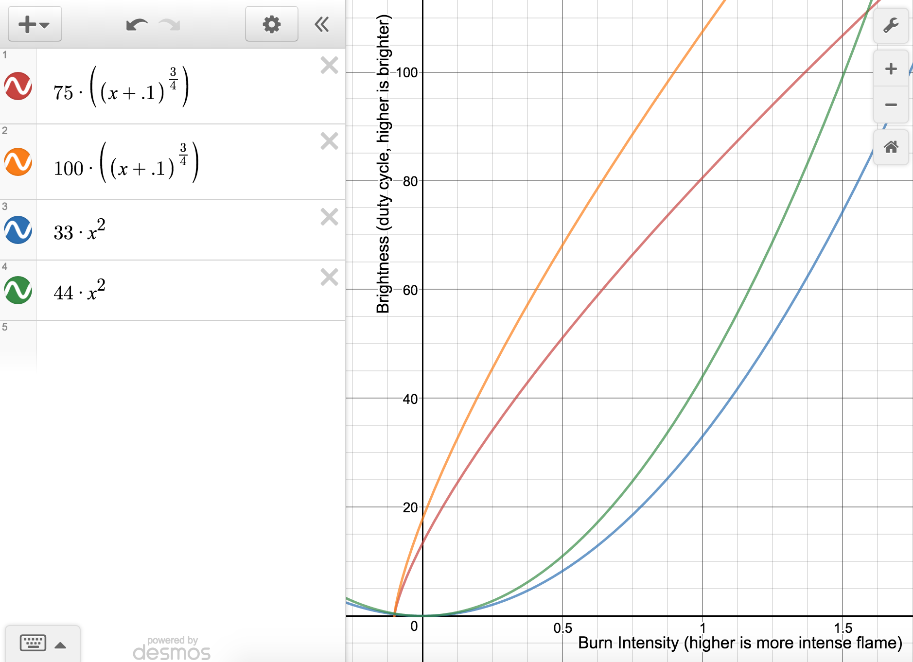
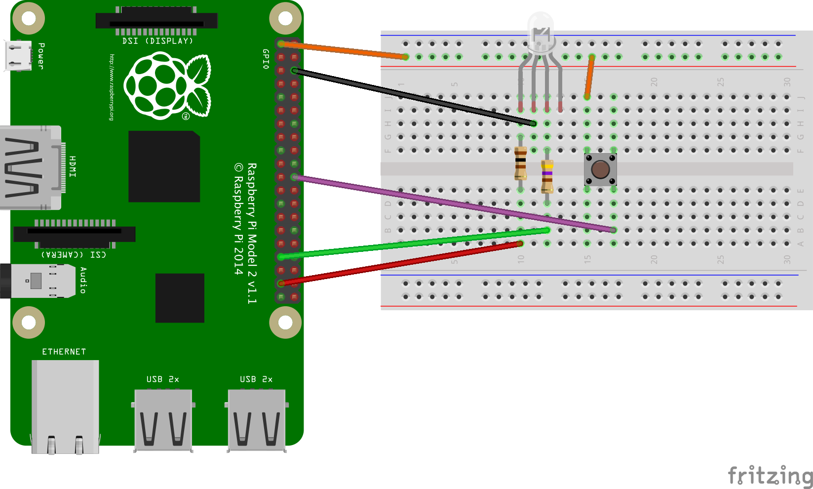

---
categories:
  - Raspberry Pi
date: 2016-08-29T22:34:44Z
description: ""
draft: false
cover:
  image:
slug: raspberry-pi-flickering-candle
tags:
  - raspberry-pi
  - python
title: Creating a Flickering Candle Using an RGB LED on the Raspberry Pi
---
After [getting PWM (pulse-width modulation) to work with an RGB LED](https://grantwinney.com/raspberry-pi-pulse-width-modulation/) last week, I was trying to think of what else I could do with an LED that demonstrated changes in color as well as intensity.

I’m not sure why – maybe it was because we lost power in our neighborhood recently – but I thought a flickering candle could be an interesting little challenge…

## Materials

In order to test this out, you’ll need a few things.

- An RGB LED
- A button
- A breadboard
- A T-cobbler (optional, but makes life easier when wiring up to GPIO pins)
- A range of resistors
- A few jumper wires (male-to-male if using a T-cobbler, otherwise male-to-female)

If you don’t have the above, you can buy kits on Amazon. Personally, after I bought the Pi by itself, I purchased a kit by CanaKit on Amazon, and haven’t had any problems with it. I don't see much from CanaKit now, but there's others, or the [CamJam EduKit](https://thepihut.com/collections/raspberry-pi-store/products/camjam-edukit?ref=grant-winney) _(note that none of these comes with a Pi)._

If you need the Raspberry Pi unit itself, the Pi is more expensive than it used to be on Amazon, apparently due to component shortages. It might be worth checking out [rpilocator](https://rpilocator.com/?ref=grant-winney) for a better price with other resellers, although you may have to wait awhile to get your Pi then, as many of the resellers seem to be sold out.

## Concepts

There’s a few concepts to cover before getting to the circuit and Python code.

### Pulse-Width Modulation

Once you have an LED wired up with a resistor, it’s either on at its current brightness, or it’s off. You can’t dim it or brighten it without changing the resistor. But you can make it _appear_ to be dimmer or brighter, by telling the Pi to quickly flash it on and off many times a second (frequency), along with telling it _how long_ to keep it on and off each time it flashes (duty cycle).

That’s called pulse-width modulation, or PWM. The [RPi.GPIO library](https://pypi.python.org/pypi/RPi.GPIO) can simulate PWM with any of the GPIO pins you’d normally use to power an LED. [Here’s a sample implementation from their documentation](https://sourceforge.net/p/raspberry-gpio-python/wiki/PWM/). And here’s a short snippet of my own:

```python
p = GPIO.PWM(37, 300)
p.start(0)
p.ChangeDutyCycle(75)
```

The first thing you have to do is set the channel and frequency. So here, we’ll say channel 37 is connected to one of the colors on our RGB LED, and it’ll be pulsed on and off 300 times a second. I don’t know what the practical limit is… I honestly didn’t see much difference between 100 and 300, and definitely didn’t see any difference above 300. If you set it too low (try setting it to 10), the pulsing will be slow enough for your eye to pick up on, and the effect is that it looks choppy.

The second adjustment is the duty cycle. By specifying 75, we’re telling it to keep the red LED on for 75% of each pulse, then off for 25%. That’s going to result in a relatively bright LED. Changing that setting to 25 will cause it to be dimmer. A setting of 100 is full on, as if you weren’t using PWM, and 0 is off.

Let's look at another short example.

```python
pRed = GPIO.PWM(37, 300)
pRed.start(100)
pRed.ChangeDutyCycle(75)
 
pGreen = GPIO.PWM(33, 300)
pGreen.start(0)
pGreen.ChangeDutyCycle(25)
```

The PWM for each color is set separately. Assuming red is connected to pin 37, and green to pin 33, the above code is telling the Pi to show red 75% of the time and green 25% of the time, resulting in a color that’s a mixture of red and green, but more red than green. It’s also initializing the duty cycle for red and green to 100 and 0, respectively, which turns the red LED fully on and the green LED off.

Now let’s talk about how we’re going to get the color we’re looking for out of the RGB LED.

### The RGB Color Wheel

Grab some milk and cookies and join me on the floor for a lesson on the color wheel. Our LED consists of red, green and blue, so we need the RGB wheel.

To create the yellow/orange of a candle, we’ll start with lots of red. Then we’ll add enough green to pull the balance towards orange or yellow. We don’t need any blue at all. As the candle “burns down”, we can remove some of the red (to make it look dimmer) and a lot more of the green (to change it from yellow to orange and finally red).


### Algorithms

That code snippet up above would give us a nice orange color. But it won’t look very natural if it’s always the same brightness and color. We need some sort of randomness or fluctuation in color and intensity over time, to make the candle “flicker”.

Here’s a very simple implementation. All it does is, 20x a second, randomly change the duty cycle for the LEDs. Red is lit up between 75% and 100% of the time, and green is lit between 15% and 25% of the time. The result should be an orangish color that flickers slightly, since the amount of red and green is changing.

```python
def red_light():
    p = GPIO.PWM(R, 300)
    p.start(100)
    while True:
        p.ChangeDutyCycle(random.randint(75, 100))
        time.sleep(.05)
 
def green_light():
    p = GPIO.PWM(G, 300)
    p.start(0)
    while True:
        p.ChangeDutyCycle(random.randint(15, 25))
        time.sleep(.05)
```

My first actual attempt was something like that; then I just kept hacking away at it until I had something that sorta worked, but not well. As the LEDs got dimmer, there was too much green, making the flame look odd. I needed to see what the algorithm actually _looked_ like, and for that I turned to an [online graphing calculator](https://www.desmos.com/calculator) by [Desmos](https://twitter.com/Desmos).

I wanted an algorithm that would adjust the brightness (intensity) and color, in order to attain a flickering effect. What’s more, I wanted the candle to “burn down”, getting dimmer and more red as time goes on.

In the following graph (from the Desmos site), the x-axis represents how long the candle has been burning. It starts at 1, and should get dimmer and deeper red as it moves towards 0. The green LED should fall randomly within the range of the blue-green lines, while the red LED should fall between the red-orange lines.

While red is always significantly higher than green (when the LEDs first turn on and are at a burn intensity of 1, green is between 33-44 duty cycle and red is between 75-100), as the candle burns down and burn intensity decreases to 0, red maintains a strong presence while green is fazed out more quickly. That should result in a strong reddish color as it burns down.



But what happens when the candle burns down completely? We’ll add a way to “fan the flame” and make it get brighter again, by adding a button. More on that below…

## Circuit Design

Using an LED with multiple colors is a little more complicated than a single-color LED. You need to connect a separate GPIO pin to each color (and connect the common cathode to ground); then, by enabling or disabling each individual pin, you can create any color you need. What’s more, by using PWM to dim or brighten the LEDs, we’ll be able to create any shade we want on the color wheel. Since we won’t be using blue, we won’t even bother to connect a wire to the anode for the blue LED.

The RGB LED in the diagram below is oriented with the flat side on the left. If you take a close look at your own LED, there should be a flat side too. The pins, from left to right, are **red**, ground, **green**, **blue**.



The red LED is connected through a 100Ω resistor to pin 37. The green LED is connected through a 470Ω resistor to pin 33. Both pins are set to output, in order to light the LED. Since we don’t need the blue LED, there’s nothing connected to it.

_I originally had a 220Ω resistor connected to the green LED, but at low intensities (when the duty cycle was low), green overpowered red and the candle took on a distinctly green hue. I switched to a larger resistor, which made green less intense, and allowed the “flame” to be more on the red end. Depending on your exact LED, you may have to play with resistors to get the right mix of colors as well._

The button is connected to 3.3v and pin 22, which is set to input. When the button is pressed, it’ll change a value that makes the flame brighter and more yellow again.

## Python Code

The “x” in the equations up above is represented by the “intensity” variable in the code below. It starts at 1.0, and drops every quarter-second. The algorithm takes that variable into account, adjusting the red and green LEDs, and making the candle appear to burn down.

There’s an event for the button on pin 22, which “fans the flame” by increasing the “intensity” variable towards 1.0 again. That has the effect of making the candle appear brighter and more yellow.

```python
import RPi.GPIO as GPIO
import threading
import time
import random
import math
 
R = 37
G = 33
BUTTON = 22
pwms = []
intensity = 1.0
 
def initialize_gpio():
    GPIO.setmode(GPIO.BOARD)
    GPIO.setup([R, G], GPIO.OUT, initial=GPIO.LOW)
    GPIO.setup(BUTTON, GPIO.IN, pull_up_down=GPIO.PUD_DOWN)
    GPIO.add_event_detect(BUTTON, GPIO.FALLING, fan_the_flame, 250)
 
def red_light():
    p = GPIO.PWM(R, 300)
    p.start(100)
    pwms.append(p)
    while True:
        p.ChangeDutyCycle(min(random.randint(75, 100) * math.pow(intensity + 0.1, 0.75), 100) if intensity > 0 else 0)
        rand_flicker_sleep()
 
def green_light():
    p = GPIO.PWM(G, 300)
    p.start(0)
    pwms.append(p)
    while True:
        p.ChangeDutyCycle(random.randint(33, 44) * math.pow(intensity, 2) if intensity > 0 else 0)
        rand_flicker_sleep()
 
def rand_flicker_sleep():
    time.sleep(random.randint(3, 10) / 100.0)
 
def burning_down():
    global intensity
    while True:
        intensity = max(intensity - .01, 0)
        time.sleep(.25)
 
def fan_the_flame(_):
    global intensity
    intensity = min(intensity + 0.25, 1.0)
 
def light_candle():
    threads = [
        threading.Thread(target=red_light),
        threading.Thread(target=green_light),
        threading.Thread(target=burning_down)
    ]
    for t in threads:
        t.daemon = True
        t.start()
    for t in threads:
        t.join()
 
def main():
    try:
        initialize_gpio()
        print("\nPress ^C (control-C) to exit the program.\n")
        light_candle()
    except KeyboardInterrupt:
        pass
    finally:
        for p in pwms:
            p.stop()
        GPIO.cleanup()
 
if _name_ == '_main_':
    main()
```

## Demo

[Here’s a short demo of it working](https://res.cloudinary.com/dxm4riq52/video/upload/v1583296495/Raspberry%20Pi/Candle_Simulation_Using_an_RGB_LED_and_PWM_zutojp.mp4). The effect is much better with the lights off, but unfortunately that makes everything somewhat grainy. The flickering effect doesn’t carry over quite as well as I wanted in the video, but you get the idea.

## Final Thoughts

What do you think? Did you come up with a better solution? Maybe resistors that worked better, or a slightly adjusted algorithm?

Maybe you could use a 10mm LED instead of a 5mm, and see if the larger bulb changes the effect. Or place the LED inside a plastic cube so that the whole thing looks like it’s glowing and flickering…


If this inspires you on some project you’re working on, or you find a way to do something better with it, or I left out some detail and you have questions, let me know in the comments below. Good luck!
