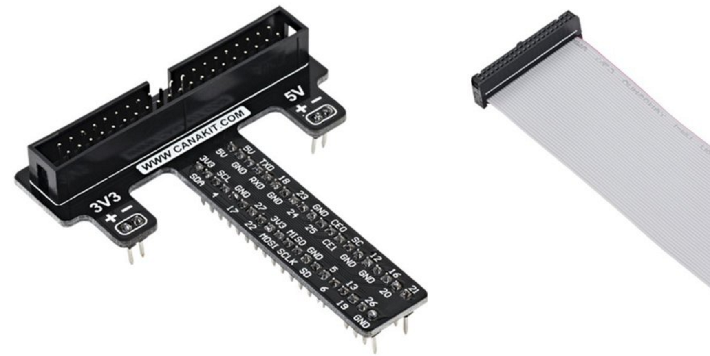
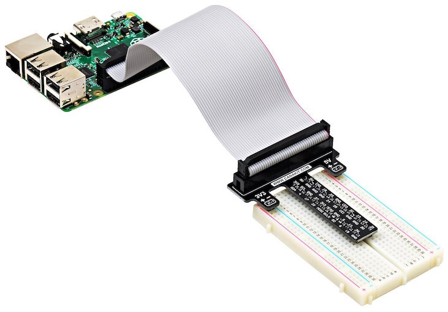
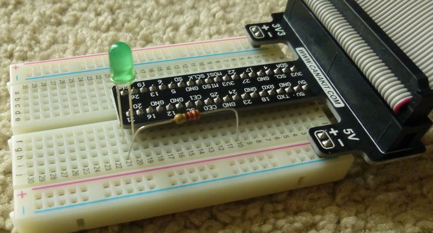
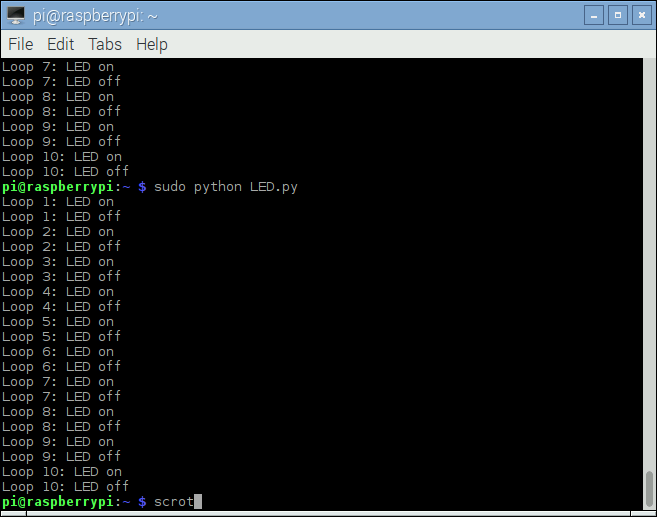

---
categories:
- raspberry-pi
- Python
- Coding
date: "2016-03-26T16:37:30Z"
description: ""
draft: false
cover:
  image: breadboard-single-led-circuit.jpg
slug: raspberry-pi-making-an-led-blink
summary: I unboxed my Raspberry Pi a few weeks ago and started learning Python. Let's code the "Hello World" of the Pi, and make an LED blink.
tags:
- raspberry-pi
- python
- coding
title: Hello World for the Raspberry Pi - Making an LED Blink
aliases:
- /hello-world-for-the-raspberry-pi-making-an-led-blink
---
I finally unboxed my Pi a few weeks ago, and since then I’ve been learning some Python - the primary language of the Pi.

You can do fun things with it out-of-the-box, like running and modifying the Python games that install with Raspbian (as well as writing your own), or playing around with [MIT’s Scratch program](https://scratch.mit.edu/) (which also comes preinstalled). Or you could try another OS, like the [OpenElec media platform](http://www.htpcbeginner.com/install-openelec-on-raspberry-pi-linux/) that turns your Pi into a photo gallery / movie streamer (something a few of us were playing around with at the a recent user group).

But a whole new world opens up when you start experimenting with the GPIO (General Purpose Input/Output) pins. By turning them on or off, and sending (or receiving) signals through them, you can interact with other devices and react to the surrounding environment.

## A Brave New World (GPIO and Sensors)

One way to use the GPIO pins is with a piece of hardware called a [HAT](https://www.raspberrypi.org/blog/introducing-raspberry-pi-hats/), which sits on top of the Pi and plugs directly into the pins, adding a new set of functionality. For example, the [Sense HAT](https://www.raspberrypi.org/products/sense-hat/) provides multiple sensors and a grid of RGB LEDs (they can be set to any color), and is even being used on the ISS by ESA astronaut [Tim Peake](https://twitter.com/astro_timpeake) as part the [Astro Pi](https://astro-pi.org/) competition.

A second option is to buy a kit with random peripherals that you can connect to, and signal through, the GPIO pins. Kits vary, but generally include a breadboard, LEDs and resistors at a minimum. Some offer switches, small motors and fans, sensors, and more.

If you're just starting out, look for one of the CanaKit or Vilros "complete starter" kits on Amazon or similar. They'll run about $75 - $100, but I've had good luck with them, and they're highly rated, and the kit should come with some extras that help you get started playing around quickly. Go for the Pi 4 unless cost is an issue and you want to save a little money.

The main difference is that the HAT provides an out-of-the-box set of features, whereas the kit takes longer to setup but allows you to customize the configuration. And you don’t have to choose one or the other, as the HAT leaves the GPIO pins accessible.

The kit above cost me about $20. There are less expensive options like the [CamJam EduKit](https://thepihut.com/collections/camjam-edukit/products/camjam-edukit) that runs about $7, which is good for a tight budget, but the kit I got comes with more of everything, as well as a cobbler and ribbon cable.

## The Cobbler

Sounds like the villain in a Batman movie…

The cobbler is the black T-shaped device above, sitting on the red padding material. They can come in different shapes and sizes, like [this smaller one for the original Pi](https://learn.adafruit.com/adafruits-raspberry-pi-lesson-4-gpio-setup/the-gpio-connector). The images below, from the CanaKit product page, show it in more detail. It plugs into the breadboard, bridging all 40 pins from your Pi to the breadboard.



  
Cobbler and ribbon, connected to the Pi  



Without a cobbler, as with the EduKit set, you’ll have to connect individual wires from the GPIO pins on the Pi to your breadboard. That’s not difficult, and would allow for more flexibility depending on what you’re trying to do, but it could be tedious and an unnecessary step. The cobbler eliminates wires that might get tangled up, and the one I got is clearly labeled, so you can tell at a glance which GPIO pin is mapped where on the breadboard.

Anyway, I got my kit quickly (thank you Amazon Prime!) and pulled it out this weekend to try the “Hello World” of Pi hardware…

## Blinking an LED (Hello World)

Making an LED blink is simple once you know how, and it’s about the smallest project you can complete that makes your Pi _do_ something in the outside world.

If you don’t have one of those cobbler boards, then you can just follow along with the The PiHut tutorial titled “[Turning on an LED with your Raspberry Pi’s GPIO Pins](https://thepihut.com/blogs/raspberry-pi-tutorials/27968772-turning-on-an-led-with-your-raspberry-pis-gpio-pins)“. It’s short, has good images demonstrating where everything goes, and even includes a nice explanation of what each line of the short Python program is doing at the end. Read through it once or twice and go for it!

In my case, there was no need to make the connections from the Pi to the breadboard, seen as black and orange wires in the tutorial. The cobbler takes care of that. But I did stare at the diagram for a few minutes, trying to envision how to modify it without accidentally frying something.

### Breadboard Setup

Unlike the tutorial, I used pin 21 for the longer (anode) side of the LED _(again,_ [_read the tutorial first_](https://thepihut.com/blogs/raspberry-pi-tutorials/27968772-turning-on-an-led-with-your-raspberry-pis-gpio-pins)_),_ then connected the shorter (cathode) side to an empty row. This allowed me to add a resistor to the same row as the cathode side, and then complete the circuit by connecting to one of the “ground” terminals. Hopefully that makes more sense once you take a look at the image below, showing my setup.

Also, if you’re wondering why to even bother with the resistor, I was too. From what little I understand, once the LED lights up it offers no resistance at all, so you’ve basically got a short-circuit. Things may work for awhile, but you could drastically shorten the lives of both the LED and the Pi. From the aforementioned tutorial:

> You must ALWAYS use resistors to connect LEDs up to the GPIO pins of the Raspberry Pi. The Raspberry Pi can only supply a small current (about 60mA). The LEDs will want to draw more, and if allowed to they will burn out the Raspberry Pi. Therefore putting the resistors in the circuit will ensure that only this small current will flow and the Pi will not be damaged. Resistors are a way of limiting the amount of electricity going through a circuit; specifically, they limit the amount of ‘current’ that is allowed to flow.

Ultimately, here’s how I laid it out. The resistor I used was only 220 Ω (the tutorial recommends 330 Ω), but it worked okay.



### Python Script

After you create the circuit, you still need to signal the GPIO pin, in order to turn on the LED.

I wrote a short program (modified from the tutorial), which loops 10 times. Each time, it signals pin 21 once to turn the LED on for a quarter-second, then again to turn it off for a quarter-second. The effect is a light that blinks twice a second for 5 seconds.

```python
import RPi.GPIO as GPIO
import time
 
pin = 21         # The pin connected to the LED
iterations = 10  # The number of times to blink
interval = .25   # The length of time to blink on or off
 
GPIO.setmode(GPIO.BCM)
GPIO.setwarnings(False)
GPIO.setup(pin, GPIO.OUT)
 
# The parameters to "range" are inclusive and exclusive, respectively,
#  so to go from 1 to 10 we have to use 1 and 11 (add 1 to the max)
for x in range(1, iterations+1):
 
    print "Loop %d: LED on" % (x)
    GPIO.output(pin, GPIO.HIGH)
    time.sleep(interval)
 
    print "Loop %d: LED off" % (x)
    GPIO.output(pin, GPIO.LOW)
    time.sleep(interval)
```

### Console Output

Here’s the output that prints to the console while the LED blinks. That last word, “scrot”, is the command for taking a full-screen capture with the Scrot app in Raspbian.



### It’s Aliiiiive!

Feeling invulnerable, I got crazy and tried _two_ LEDs. Slow down, right? 😏

I just wanted to see it operate both ([and you can too](https://res.cloudinary.com/dxm4riq52/video/upload/q_auto/v1583296287/Raspberry%20Pi/Blinking_LED_via_the_Raspberry_Pi_2_eyvjjs.mp4)), and it did, albeit the green LED seemed a bit dimmer. When I tried to use blue with red or green, the blue didn’t light up. I assume that’s because it uses more power than the resistor was allowing through.

If I’m wrong about that assumption, I’d be interested in hearing the real reason. I assumed all the LEDs were identical other than color, but the blue is brighter than the red or green. And there’s a white LED with four wires that I haven’t tried it yet, but I’d bet it’s brighter than blue.

## Where can I purchase the hardware?

If you want any of the accessory hardware you saw here, including the T-shaped cobbler and cable _(it’s very handy to not have to wire up all the individual GPIO pins!),_ you can pick up a kit on Amazon - I've found Canakit and Vilros to be good brands, but I'm sure there's others too.

## Where can I go from here?

Try out these easy projects, to get more familiar with the Raspberry Pi:

- [Building a Morse Code Transmitter on a Raspberry Pi](https://grantwinney.com/raspberry-pi-morse-code-transmitter/)
- [Generating Morse Code on the Raspberry Pi Using a Button on a Breadboard](https://grantwinney.com/raspberry-pi-morse-code-transmitter-v2/)
- [How to Flash an LED on Your Raspberry Pi When You Get New Email](https://grantwinney.com/raspberry-pi-flash-led-for-new-email/)

## What else did I learn this week?

More (completely random) things I learned this week.

### Taking Screen Captures in Raspbian

If you want to be able to take screen shots on the Pi, you need to install an app called “scrot”:

```none
sudo apt-get install scrot
```

Then just run “scrot” from the command line and it’ll take a full-screen capture and place it in the current working directory, wherever you happen to be in the command window when you call the command.

### The GPIO Library (aka, don’t reinvent the wheel)

There’s a Python library called Rpi.GPIO that makes it easier to access and manipulate the GPIO pins. Here’s a few useful commands:

```python
import Rpi.GPIO           # You have to import the library to use the commands in it
 
GPIO.setmode(GPIO.BOARD)  # Recommended! "Board" numbering mode, consistent between models
GPIO.setmode(GPIO.BCM)    # "Broadcom" numbering mode, could change between models of Pi
 
GPIO.setup(13, GPIO.OUT)  # Set the pin direction. In this case, sending signals out.
GPIO.output(13, True)     # Turn the pin "on". Could use: True/False, 1/0, GPIO.HIGH/GPIO.LOW
```

### Courses, Demos and Random Notes

- [Demo of an LED blinking](https://www.coursera.org/learn/raspberry-pi-platform/lecture/vJ5Az/lecture-2-3-demo-of-a-blink), as seen in [The Raspberry Pi Platform and Python Programming for the Raspberry Pi](https://www.coursera.org/learn/raspberry-pi-platform) course on Coursera.
- [Interfacing with the Raspberry Pi](https://www.coursera.org/learn/raspberry-pi-interface), another course on Coursera. Now that I’ve got the breadboard, I’ll be trying this out.
- I’m also taking [Programming for Everybody (Getting Started with Python)](https://www.coursera.org/learn/python/) on Coursera.
- [Tkinter Library](https://www.coursera.org/learn/raspberry-pi-platform/lecture/xyVag/lecture-3-2-tkinter-library), a Python library for GUI development _(no clue about this yet, just noting it)_

When programming in Python, there are online Python editors, but personally I just installed the free [PyCharm IDE](https://www.jetbrains.com/pycharm/) from JetBrains and that went well enough.

By using [VNC (Virtual Network Computing)](https://www.raspberrypi.org/documentation/remote-access/vnc/) and following a tutorial on [How to give your Raspberry Pi a Static IP Address](https://www.modmypi.com/blog/tutorial-how-to-give-your-raspberry-pi-a-static-ip-address), I’m now able to connect to the Pi from other machines. Maybe I’ll write something up on how I did that. It’s convenient to not have* *to plug it into the TV or use a spare mouse/keyboard with it unless I want to.
