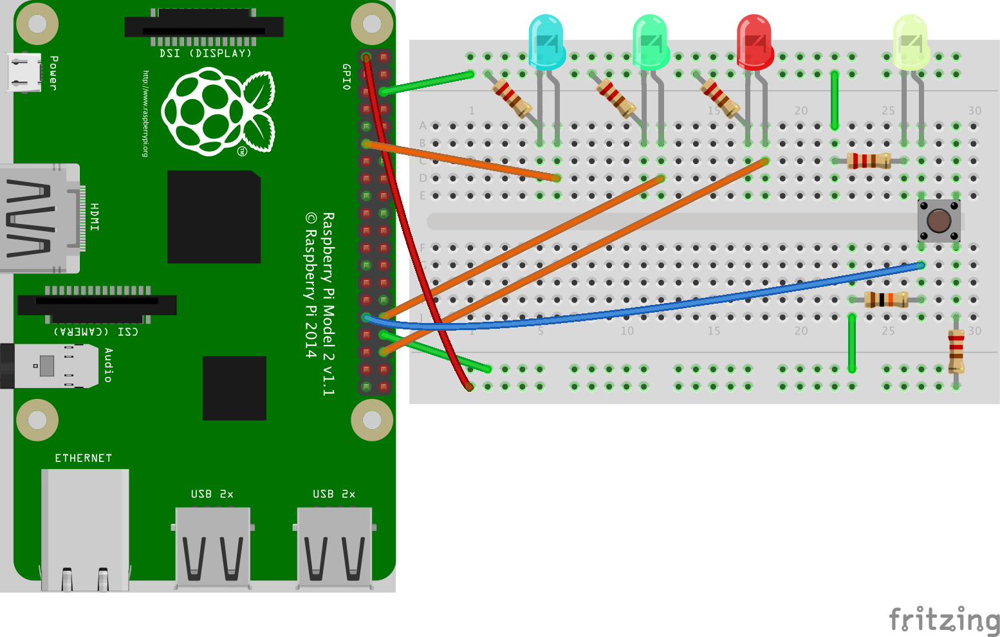
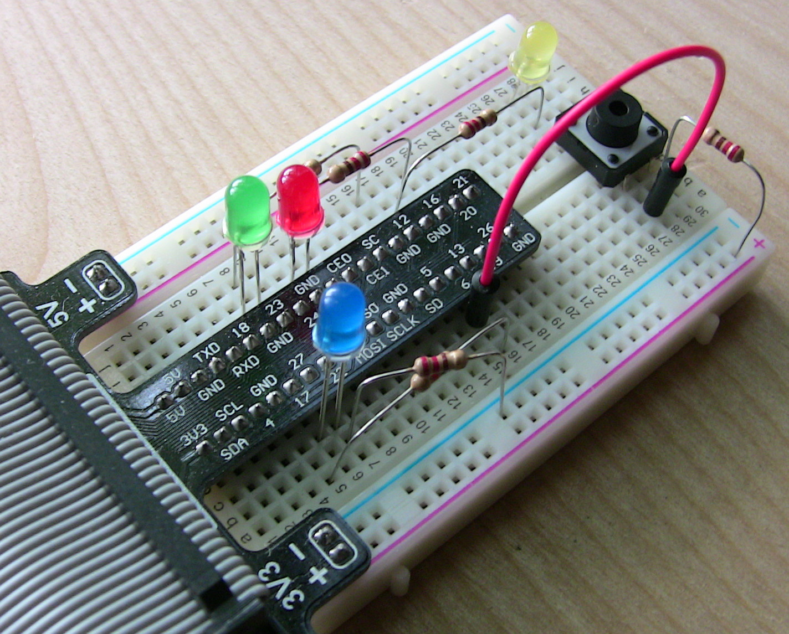
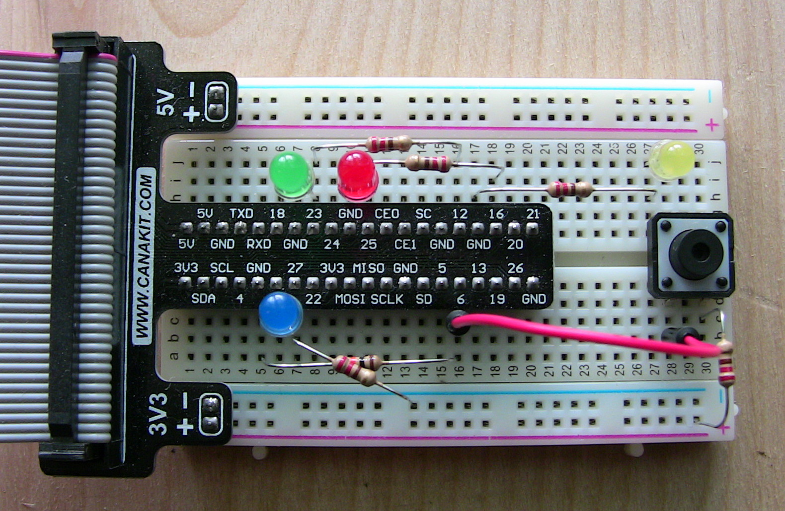
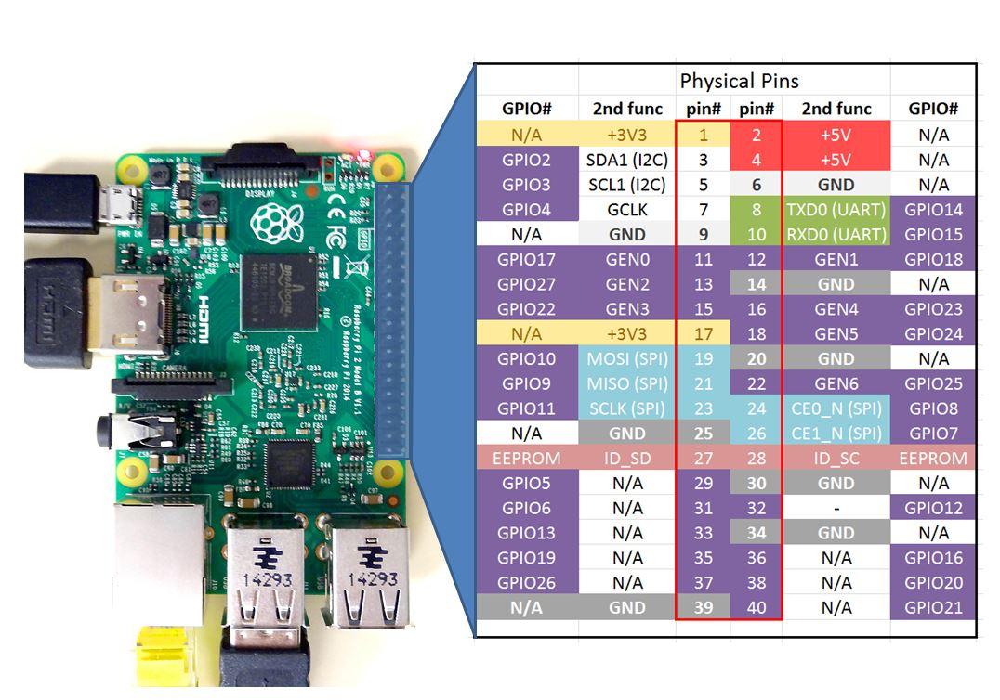
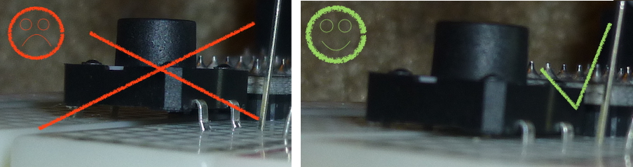

---
categories:
- Raspberry PI
- Coding
- Python
date: "2016-05-19T06:10:28Z"
description: ""
draft: false
cover:
  image: morse-code-button-click-1.jpg
slug: raspberry-pi-morse-code-transmitter-v2
summary: I created a morse code generator before based on entering a string at the
  console. Now I extended it to generate a message by clicking a button.
tags:
- Raspberry PI
- Coding
- Python
title: Building a Morse Code Transmitter on a Raspberry Pi (version 2)
---
Last month, [I created a morse code generator](https://grantwinney.com/building-a-morse-code-transmitter-on-a-raspberry-pi/). It accepts user input from the console, translates it into morse code, and blinks an LED to “transmit” the message.

I decided to build on that a bit, adding a button to the circuit that allows me to generate morse code from a button click. The clicks are read in by a GPIO pin, and interpreted by a Python script.

## Defining the Rules

We should always figure out what a program is going to do _before_ we start writing it, so here are a few rules to guide us:

- Dots and dashes will be entered using the rules on timing outlined in “[What is Morse Code?](https://grantwinney.com/building-a-morse-code-transmitter-on-a-raspberry-pi/#What_isMorse_Code)“
- An acceptable tolerance will be built into the timing, since it’s difficult to keep an exact rhythm.
- Blink a blue LED to the rhythm of the “base time”, to help with timing.
- Interpret dots and dashes using International Morse Code (IMC)
- The _message separator_ [prosign](https://en.wikipedia.org/wiki/Prosigns_for_Morse_code) AR ·-·-· will indicate the end of the message, after which the script will display its interpretation.
- When a dot or dash is timed correctly, blink green LED 3x; otherwise, blink red 3x
- When a dot/dash sequence (indicated by a gap equal to 3 dots) is interpreted
- - as a valid letter/number, blink a green LED 3x,
    - as invalid/unrecognized, blink a red LED 3x and discard the sequence.

That might not be everything, but it does give us a general direction to run.

## Designing the Circuit

Now let’s decide what we need in a circuit, based on the rules we just laid out.

- A button to “transmit” dots and dashes.
- A line from 3.3v, thru a 220Ω resistor, to one side of the button (let’s call it side 1).
- A line from the other side of the button (side 2) to pin 31 (GPIO 6).
- A 10kΩ pulldown resistor from pin 31 to ground. _(_[_more on pulldown resistors_](https://grantwinney.com/using-pullup-and-pulldown-resistors-on-the-raspberry-pi/)_)_
- A yellow LED and 220Ω resistor from side 2 of the button, to ground.
- A red LED and 220Ω resistor connecting pin 36 (GPIO 16) to ground.
- A green LED and 220Ω resistor connecting pin 32 (GPIO 12) to ground.
- A blue LED and 220Ω resistor connecting pin 11 (GPIO 17) to ground.

Here’s the kind of layout I planned out.



In retrospect, that resistor connecting the cathode side of the yellow LED to ground won’t hurt, but it’s unnecessary, since there’s already a resistor connecting 3.3v to the button.

And here are a few pictures of the actual board after I wired it up:






## Writing the Script

Here’s the python script. Make sure you copy [InternationalMorseCode.py](https://github.com/grantwinney/52-Weeks-of-Pi/blob/master/02-Send-Morse-Code-Via-Button-Click/InternationalMorseCode.py) from GitHub too, and place it in the same directory you're running this script from.

```python
import datetime
import threading
import time
import RPi.GPIO as GPIO
import InternationalMorseCode as ICM
 
BASE_TIME_SECONDS = 1.0
TOLERANCE = BASE_TIME_SECONDS / 2.0
 
# Initialize GPIO settings
def initialize_gpio():
    GPIO.setmode(GPIO.BOARD)
    GPIO.setup([11, 32, 36], GPIO.OUT)  # LEDs: Blue (metronome), Green (ok), Red (error)
    GPIO.setup(31, GPIO.IN)
    GPIO.output([32, 36], GPIO.LOW)
    GPIO.add_event_detect(31, GPIO.BOTH, callback=intercept_morse_code)
 
# Blink a blue LED on/off (one full cycle per BASE_TIME_SECONDS)
def metronome():
    while True:
        GPIO.output(11, not GPIO.input(11))
        time.sleep(BASE_TIME_SECONDS / 2.0)
 
def initialize_metronome():
    t = threading.Thread(target=metronome)
    t.daemon = True
    t.start()
 
# Blink an LED on and off a few times rapidly, to signal success or failure
def signal_to_user(channel):
    for num in range(1, 3):
        GPIO.output(channel, GPIO.HIGH)
        time.sleep(0.1)
        GPIO.output(channel, GPIO.LOW)
        time.sleep(0.1)
 
def initialize_signal(channel):
    threading.Thread(target=signal_to_user, args=(channel,)).start()
 
last_edge = GPIO.LOW
press = datetime.datetime.now()
release = datetime.datetime.now()
 
# Intercept a rise or fall on pin 31 (button press/release)
def intercept_morse_code(channel):
    global last_edge, press, release
 
    # Button pressed - determine if start of new letter/word
    if GPIO.input(channel) == GPIO.HIGH and last_edge == GPIO.LOW:
        last_edge = GPIO.HIGH
        press = datetime.datetime.now()
        detect_termination()
 
    # Button released - determine what the input is
    elif GPIO.input(channel) == GPIO.LOW and last_edge == GPIO.HIGH:
        last_edge = GPIO.LOW
        release = datetime.datetime.now()
        interpret_input()
 
sequence = ""
letters = []
words = []
 
# Detect whether most recent button press is start of new letter or word
def detect_termination():
    global sequence
 
    if sequence == "":
        return
 
    delta = calc_delta_in_sec(release, press)
 
    # Check for start of new letter (gap equal to 3 dots)
    if (delta >= ((BASE_TIME_SECONDS * 3) - TOLERANCE)) and (delta <= ((BASE_TIME_SECONDS * 4) + TOLERANCE)):
        process_letter()
 
    # Check for start of new word (gap equal to 7 dots - but assume anything > 7 dots is valid too)
    elif delta >= ((BASE_TIME_SECONDS * 7) - TOLERANCE):
        process_word()
 
    # If it's not a new letter or word, and it's a gap greater than a single dot, tell the user
    elif delta > (BASE_TIME_SECONDS + TOLERANCE):
        print("")
 
# Process letter
def process_letter():
    global sequence
    character = ICM.symbols.get(sequence, '')
 
    if character != '':
        print("Interpreted sequence " + sequence + " as the letter: " + character)
        letters.append(character)
        sequence = ""
        initialize_signal(32)
        return True
    else:
        print('Invalid sequence: ' + sequence + " (deleting current sequence)")
        sequence = ""
        initialize_signal(36)
        return False
 
# Process word
def process_word():
    if process_letter():
        word = ''.join(letters)
        letters[:] = []
        if word == "AR":
            print("End of transmission. Here's your message: " + ' '.join(words))
            print('\nClearing previous transmission. Start a new one now...\n')
            words[:] = []
        else:
            words.append(word)
 
# Interpret button click (press/release) as dot, dash or unrecognized
def interpret_input():
    global sequence
 
    delta = calc_delta_in_sec(press, release)
 
    if (delta >= (BASE_TIME_SECONDS - TOLERANCE)) and (delta <= (BASE_TIME_SECONDS + TOLERANCE)):
        sequence += '.'
        print(str(delta) + " : Added dot to sequence:  " + sequence)
        initialize_signal(32)
    elif (delta >= ((BASE_TIME_SECONDS * 3) - TOLERANCE)) and (delta <= ((BASE_TIME_SECONDS * 3) + TOLERANCE)):
        sequence += '-'
        print(str(delta) + " : Added dash to sequence: " + sequence)
        initialize_signal(32)
    else:
        print(str(delta) + " : Unrecognized input!")
        initialize_signal(36)
 
def calc_delta_in_sec(time1, time2):
    delta = time2 - time1
    return delta.seconds + (delta.microseconds / 1000000.0)
 
try:
    initialize_gpio()
    initialize_metronome()
    message = raw_input("\nPress any key to exit.\n")
 
finally:
    GPIO.cleanup()
 
print("Goodbye!")
```

Hopefully most of this is self-explanatory, maybe with a little bit of studying the code. I’ll address a few points though. If you have questions about the rest of it, leave a comment and I’ll try to clarify it.

### Metronome

If you’re unfamiliar with a metronome, it’s just a device that makes a regular beat or sound, to mark rhythm. I added an LED that blinks one cycle (on and off) per “base time”. All the code does is look at the current state of the LED (on or off), and flips it.

`GPIO.output(11, not GPIO.input(11))`

The `t.daemon` piece causes it stop running the thread when the program ends. Otherwise, the light just keeps on blinking!

### Success or Failure

The `signal_to_user` method simply takes a pin and turns it on and off a few times, rapidly. That gives us the flashing green and red LEDs.

Note that both of these methods run in a separate thread, so as not to freeze up the main thread that our program is running on. You can [read more about threading in Python here](https://pymotw.com/2/threading/).

### Detecting Button Clicks

The only thing we’re interested in is when a button was pressed and is then released, or vice versa. It’s possible, even with a pulldown resistor, to occasionally detect two presses or two releases in a row. Some of that is even due to the button itself… I’ve seen the duplicate events more often when I don’t push the button as forcefully, probably causing something inside to float between connected and disconnected a few times really quickly.

You can apply a “bouncetime” when you setup the pin, which tells it to ignore duplicate button presses that are really close together. But I preferred to just detect it and correct it myself, which is what I’m doing in `intercept_morse_code` with the `last_edge` stuff.

## More Resources

**Courses**

If you’re interested, Coursera has a series of courses on Python, two of which are called [Getting Started with Python](https://www.coursera.org/learn/python) and [Python Data Structures](https://www.coursera.org/learn/python-data). There’s another course I’ve started working through too, called [Interfacing with the Raspberry Pi](https://www.coursera.org/learn/raspberry-pi-interface).

**Reference Card**

Here’s a reference card from [toptechboy.com](http://www.toptechboy.com/raspberry-pi/raspberry-pi-with-lesson-26-controlling-gpio-pins-in-python/) that shows what the pins do on the Pi. If you don’t have a cobbler that plugs into your breadboard, and you have to wire up individual GPIO pins on the Pi to your breadboard, you’ll want to keep this handy.



**Hardware**

If you want any of the accessory hardware you saw here, including the T-shaped cobbler and cable _(it’s very handy to not have to wire up all the individual GPIO pins!),_ you can pick up the same set I did, called the [CanaKit Raspberry Pi GPIO Breakout Board Bundle](https://amzn.to/2TwfVcL).

I wouldn’t suggest it if I didn’t like it. It’s affordable _(in keeping with the spirit of the whole Pi movement),_ has good reviews, and I’ve used most of the parts in it now and haven’t had a problem with a single one.

**Helpful Links**

- [Simple Guide to the RPi GPIO Header and Pins](http://www.raspberrypi-spy.co.uk/2012/06/simple-guide-to-the-rpi-gpio-header-and-pins/)
- [International Morse Code – Sounds](http://morsecode.scphillips.com/morse.html)
- [International Morse Code – Dots and Dashes](http://morsecode.scphillips.com/morse2.html)
- [An Introduction to Python Lists](http://effbot.org/zone/python-list.htm)
- [Manage Concurrent Threads](https://pymotw.com/2/threading/) (Python)

## Final Thoughts

This project led me down the path of detecting the pin edges (whether the button is pressed or not, 1 or 0, on or off, high or low), and other pin-related concepts like bounce time. [I wrote more about what I learned](https://grantwinney.com/using-pullup-and-pulldown-resistors-on-the-raspberry-pi/).

Quick note about buttons. When you use one on your breadboard for the first time, it might feel like it only goes so far. Be sure to give it a good firm push so it’s flush with the breadboard, otherwise it won’t come into contact like it should. Mine looked like it was in at first, but wasn’t registering clicks very well.



## Demo

[Here's a demo if you want to see it working](https://res.cloudinary.com/dxm4riq52/video/upload/v1583296485/Raspberry%20Pi/Generating_Morse_Code_on_the_Raspberry_Pi_Using_a_Button_on_a_Breadboard_aezrwv.mp4).
