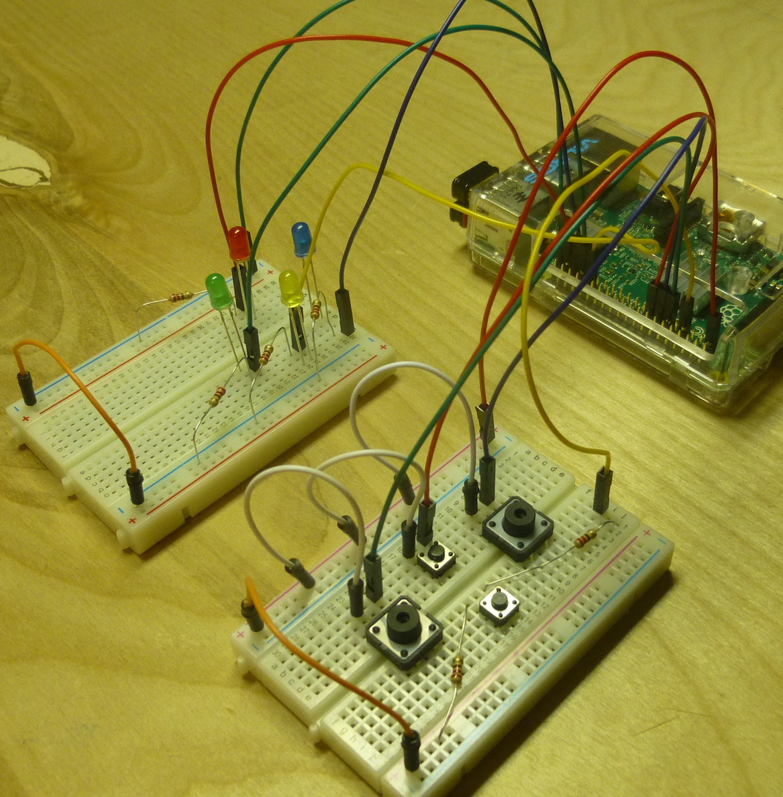
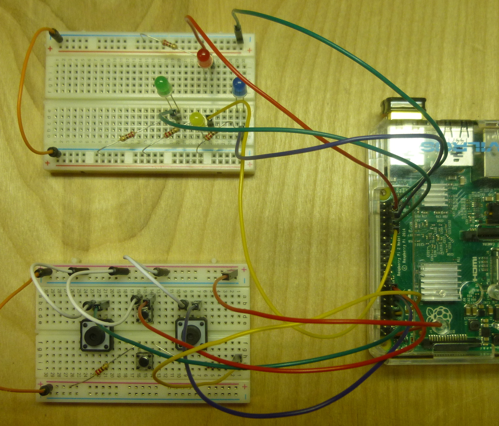
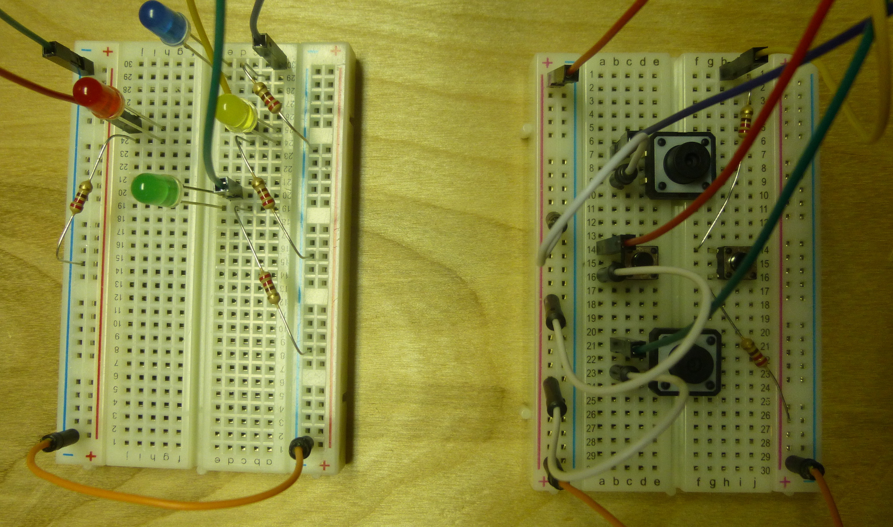
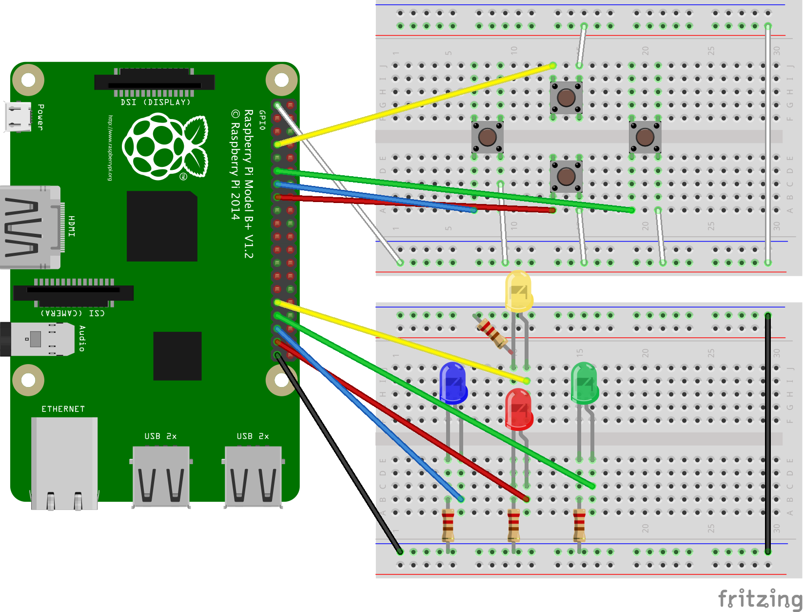

---
categories:
  - Build
date: 2016-07-28T08:09:41Z
description: ""
draft: false
cover:
  image:
slug: raspberry-pi-simon-game-clone
summary: Let's recreate the Simon game of the 1980s using a Raspberry Pi and Sonic Pi!
tags:
  - raspberry-pi
  - sonic-pi
  - python
title: A Simon Game Clone for the Raspberry Pi
aliases:
  - /creating-a-simon-game-clone-on-the-raspberry-pi
---
Have you been around long enough to remember the popular _Simon_ game from the 70s and 80s? There’ve been plenty of remakes over the years, but I had one of the originals when I was younger.

It’s a game of patterns that tests your memory. It flashes a color and sounds a corresponding tone, which you repeat. Then it repeats the same color/tone and adds a new one. The pattern keeps getting longer and longer. Technically, it could go on forever, but I think you “won” after 20 or 30 colors… not that I ever got close!

## Initial Setup of a Simon Clone

Let's recreate the Simon game on the Raspberry Pi, in spirit at least, if not in exact gameplay and aesthetics!

### Configuring the GPIO Pins

I like to have a function that’s run once at the beginning, and contains all the GPIO-related setup stuff, like which pins will read input vs which will output a signal, etc.

```python
def initialize_gpio():
    GPIO.setmode(GPIO.BOARD)
    GPIO.setup(LIGHTS, GPIO.OUT, initial=GPIO.LOW)
    GPIO.setup(BUTTONS, GPIO.IN, pull_up_down=GPIO.PUD_DOWN)
    for i in range(4):
        GPIO.add_event_detect(BUTTONS[i], GPIO.FALLING, verify_player_selection, 400 if use_sounds else 250)
```

We’re giving the buttons a pull-down resistor to make sure we get a clear “False / 0” reading while the button _isn’t_ pressed, and the circuit is open. [Read more about the importance of pull-down (and pull-up) resistors](https://grantwinney.com/raspberry-pi-using-pullup-and-pulldown-resistors/).

The loop just attaches each button click to a function. We can get away with using the same function because it passes in the channel that triggered it. Actually, we’re only concerned with the button release (`GPIO.FALLING`) – I didn’t want it firing every time a button was pressed _and_ released.

That last number is just a “bouncetime” in milliseconds, which ignores multiple clicks in under whatever time we specify. Ideally it wouldn’t be necessary, but buttons (esp the cheap buttons I have) can register several clicks when you only click them once, due to parts wiggling around and a flaky connection inside the button.

### Using Arrays for Easy Reference

I stored the GPIO pin numbers for the lights and buttons, and the related musical notes, in arrays. It makes it easier to reference them from the code. When the player presses the “red” button, I detect `BUTTONS[1]` and then light up `LIGHTS[1]` and play `NOTES[1]`.

```python
# green, red, blue, yellow
LIGHTS = [33, 37, 35, 31]
BUTTONS = [11, 15, 13, 7]
NOTES = ["E3", "A4", "E4", "Cs4"]
```

And here’s how I used them. What I ended up actually doing was detecting which button was pressed, and at what index that button was located in the BUTTONS array, and then using the same index in the other arrays, to find the right light and musical note.

```python
play_note(NOTES[BUTTONS.index(channel)])
 
led = LIGHTS[BUTTONS.index(button_channel)]
```

### Threading

Threads are your friend, so get used to the concept. The programs we use are capable of running multiple streams of logic in multiple threads, essentially doing many things at once. That’s how everything from operating systems like Raspbian, down to tiny programs like this one, work.

In this program, I split off the main game play into a separate thread. The call to “join” just makes sure the main thread doesn’t proceed (which would end the program) until the other thread ends. That leaves me open in the future to having the main thread do something apart from the rest of the program. Or I could fire up more threads to do additional work.

```python
def start_game_monitor():
    t = threading.Thread(target=start_game)
    t.daemon = True
    t.start()
    t.join()
```

And here’s what the other thread is doing. Until the player loses and decides _not_ to play again, it’ll add colors to the pattern, show them to the player, and then wait for the player to repeat the pattern. If the player loses and decides to play again, the variables are reset and the loop continu

```python
while True:
    add_new_color_to_pattern()
    display_pattern_to_player()
    wait_for_player_to_repeat_pattern()
    if is_game_over:
        print("Game Over! Your max score was {} colors!\n".format(current_level-1))
        play_again = input("Enter 'Y' to play again, or just press [ENTER] to exit.\n")
        if play_again == "Y" or play_again == "y":
            reset_board_for_new_game()
            print("Begin new round!\n")
        else:
            print("Thanks for playing!\n")
            break
    time.sleep(2)
```

When we finally wait for the player to repeat a pattern, all we do is the following loop – check a couple variables, then sleep for a tenth of a second and check again.

This effectively pauses execution of the current thread (not really, it’s still running but it’s not doing much), preventing anything else from happening until one of those variables is set to True (either the player wins the level or the game is over). We can get away with it because the functions we attached to the button click events earlier run in their own thread too.

```python
def wait_for_player_to_repeat_pattern():
    while not is_won_current_level and not is_game_over:
        time.sleep(0.1)
```

We end up with a few threads running. One at the start of the program, which fires off a second thread that runs the rest of the game, and a third that intercepts button clicks and calls the function we specified.

### Building a pattern

In order to build up the pattern, we choose a random number from 0 to 3. If, for example, the number 2 is chosen, then blue is the newest color added to the pattern. We can use the selected number with our arrays, to light the correct LED and play the correct sound.

```python
def add_new_color_to_pattern():
    global is_won_current_level, current_step_of_level
    is_won_current_level = False
    current_step_of_level = 0
    next_color = random.randint(0, 3)
    pattern.append(next_color)
```

## Musical notes, Sonic Pi and the sonic-pi-cli Gem

If you haven’t heard of it before, [Sonic Pi](http://sonic-pi.net) is a synthesizer that lets you program music. It was written by [Sam Aaron](https://twitter.com/samaaron), with the Pi in mind (it’s in its name after all), but you can run it on Windows or OS X too. It’s capable of amazing stuff, and I’ve only very, _very_ lightly scratched the surface. I used it previously with the Pi to create a [grandfather clock that played the westminster chimes](https://grantwinney.com/creating-music-with-sonic-pi-on-raspberry-pi/).

At the very least, read the section entitled _What is OSC?,_ install the ruby gem and try playing some notes _(make sure Sonic Pi is open)._

### Recreating Simon’s notes

Once that’s setup and working, it should work from the Python script too. The notes, which I grabbed from [Wikipedia](https://en.wikipedia.org/wiki/Simon_(game)), don’t sound exactly the same as the original game, from what I could find of it on YouTube. Not sure the octave is right… probably missing several things. Whatever the reason, the effect is the same – four colors, four notes.

Simon’s tones … were designed to always be harmonic, no matter what order they were played in, and consisted of an A major triad in second inversion which resembles a Trumpet fanfare:

- E-note (blue, lower right)
- csharp-note (yellow, lower left)
- A-note (red, upper right)
- E-note (green, upper left, an octave lower than blue)

### Passing notes to Sonic Pi

Once everything else is working, it’s a one-liner to pass commands to Sonic Pi, like _`_play :A4_`_ or similar.

```python
def play_note(note):
    if use_sounds:
        call(["sonic_pi", "play :" + note])
```

Making calls to Sonic Pi takes up resources, and doing it as rapidly as I am (with each button click) makes things a little unstable. I don’t fully understand why yet, but I hope to figure it out eventually. In the meantime, I included a “use_sounds” flag you can set to enable/disable sound. Try leaving it True to test everything out with musical notes, but then set it to False in order to experience better (and more reliable) game play.

One of the things you’ll hear in programming, if you haven’t already, is the DRY principle. That stands for “don’t repeat yourself”. I didn’t copy the “call” line above into multiple places in the code. If I needed to make a change to the process call later, it’d be tougher if I had to hunt down everywhere I called it (especially across multiple files and projects, in a large program). So I created a single method that simply takes in the note, and then only write that line of code once. That turned out to be helpful when I added the `use_sounds` flag later, and I only had to update one place.

### Optimizing for Sonic Pi

The first four lines of the program make calls to the “sonic_pi” process.

The first two affect performance. When we request Sonic Pi to play a note for us, there’s a slight delay of about 200ms or so. It makes the Python program respond faster, but there’s a slight disconnect between when a button is pressed and when the note is actually played. By setting `set_sched_ahead_time` to 0, we tell it to play the note as soon as possible to when we called it.

The Pi isn’t all that powerful though, and it’s running an OS and other programs in the background, in addition to this program and having Sonic Pi open, at the very least. So even though the note plays closer to when the button is clicked, it causes the program to be a bit more sluggish. That’s why I added the flag that disables sound, so you can try it out both ways.

Setting “debug” mode to false just gives a slight perf boost.

The last two calls affect how the notes sound. Setting `use_synth` to “pulse” makes the notes a bit more clipped and louder. The BPM (beats per minute) is usually 60, so setting `use_bpm` to 100 causes the notes to finish quicker too.

```python
def main():
    try:
        call(["sonic_pi", "set_sched_ahead_time! 0"])
        call(["sonic_pi", "use_debug false"])
        call(["sonic_pi", "use_synth :pulse"])
        call(["sonic_pi", "use_bpm 100"])
        os.system('cls' if os.name == 'nt' else 'clear')
        print("Begin new round!\n")
        initialize_gpio()
        start_game_monitor()
    finally:
        GPIO.cleanup()
```

Finally, you may have noticed a commented-out import statement.

I created a GPIOmock.py script that contains all the same calls as RPi.GPIO, but instead of doing anything with the GPIO pins it just prints a line of text describing what the call _would_ do. That way, I can develop on a machine that’s not the Pi, and doesn’t have the RPi.GPIO package installed. I created it by referencing the comments available in the `source/py_gpio.c` file in the [RPi.GPIO module](https://pypi.python.org/pypi/RPi.GPIO) available on [GitHub](https://github.com/Tieske/rpi-gpio/blob/master/source/py_gpio.c).

Copy the file into the same directory as this script, then comment out the `import RPi.GPIO` line and uncomment this one:

```python
# import GPIOmock as GPIO
```

If you’re interested in seeing a much cooler script running in Sonic Pi, [someone recreated the NES Mario theme](https://gist.github.com/xavriley/87ef7548039d1ee301bb)! Copy lines 18-21 into a tab in Sonic Pi, and then all that stuff in the `theme_a`, `theme_b`, etc blocks.

### Caveats

There are definitely some issues with sound. There’s a lag, which leads to ghost button clicks that mess up the gameplay. Disabling sound fixes it, and makes the game work just fine. So it’s definitely some issue with me passing a command to Sonic Pi to play each note.

There are other options for playing sounds too, which I won’t cover here. One of them is [PyAudio](https://pypi.python.org/pypi/PyAudio), and I found some examples easily with a quick search.

## The Circuit

Here are images and diagrams of the circuit I created. It connects four GPIO pins to the buttons (to receive input when they’re clicked), and four more pins to the LEDs (to send out a signal to light them up).

### Pictures

The resistors connecting the bottom button to 3.3v and the GPIO pin are just there because wires would’ve been too large, and in the way of my fingers.







### Diagram

Here's the [fritzing](http://fritzing.org/) diagram for the circuit:



### Demonstration

[Watch a demo here](https://res.cloudinary.com/dxm4riq52/video/upload/v1583332659/Raspberry%20Pi/Creating_a_Simon_Clone_on_the_Raspberry_Pi_ejdi8v.mp4).

## Materials

_**You’ll need 4 buttons.**_ That doesn’t seem like much, but many of these kits only come with two. I’m not sure why they don’t throw more in. Unless you’ve got extras laying around, you’ll need to find some - I grabbed a 50 pk off eBay for about $4.

I usually use the T-Cobbler that comes with the CanaKit sets, which makes it much easier to connect specific GPIO pins where they need to go. If you’re interested, check out their [Pi 2 Ultimate Starter Kit](https://www.amazon.com/gp/product/B00G1PNG54/ref=as_li_tl?ie=UTF8&camp=1789&creative=9325&creativeASIN=B00G1PNG54&linkCode=as2&tag=gwin04-20&linkId=d3b9704a7ee049261493e9113d01675c) or [Pi 3 Ultimate Starter Kit](https://www.amazon.com/gp/product/B01C6Q4GLE/ref=as_li_tl?ie=UTF8&camp=1789&creative=9325&creativeASIN=B01C6Q4GLE&linkCode=as2&tag=gwin04-20&linkId=5e06cbdecd6e1411799d573a3306ab01), and look for the black T shaped board in the images. Those kits include the Pi, an adapter and case, and other items you’ll need like LEDs, wires and resistors.

In this case though, space was tight with all the LEDs and buttons, and I have some unfinished projects setup on my larger bread boards, so I used jumper wires to connect the pins instead of the T-Cobbler. I had about a million wires that could connect one point on the breadboard to another (male-to-male), but none that could connect the GPIO pins to the board (male-to-female). I purchased a pack of [Phantom YoYo Jumper wires, male to female](https://www.amazon.com/gp/product/B00AC4NQYG/ref=as_li_tl?ie=UTF8&camp=1789&creative=9325&creativeASIN=B00AC4NQYG&linkCode=as2&tag=gwin04-20&linkId=a8a976ac13290414e33f1bb4ba21b67a), and haven’t had an issue with any of them so far.

If you try it, let me know how it goes, especially if you make improvements or run into problems you had to solve!

## Helpful Links

- [Sonic Pi Cheat Sheet](http://www.cl.cam.ac.uk/projects/raspberrypi/sonicpi/media/sonic-pi-cheatsheet.pdf)
- [RPi.GPIO Usage Examples](https://sourceforge.net/p/raspberry-gpio-python/wiki/Examples/)
- [Tuning Sonic Pi for best performance](https://gist.github.com/rbnpi/2c6d2da3246f64f4d97e)
