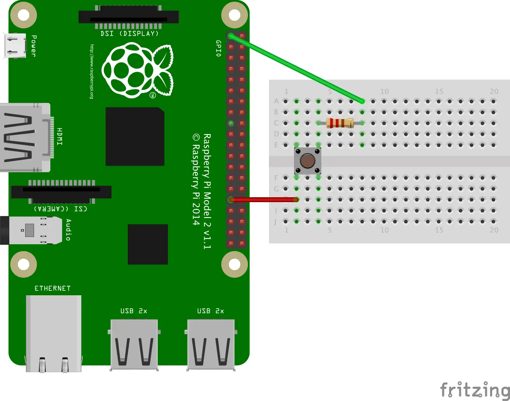
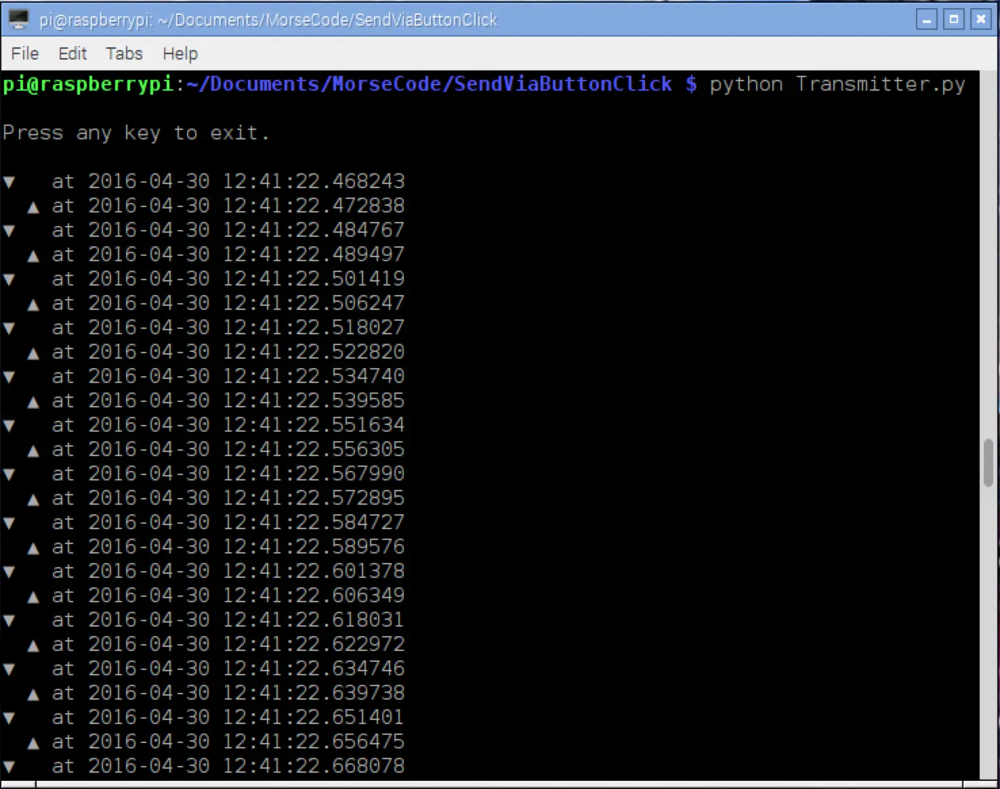
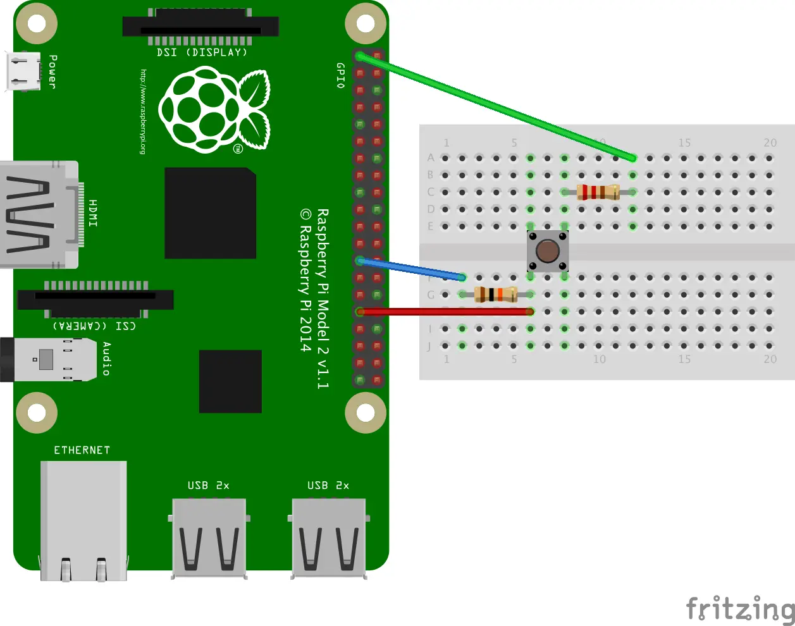

---
categories:
  - Raspberry Pi
date: 2016-05-09T07:30:30Z
description: ""
draft: false
cover:
  image:
slug: raspberry-pi-using-pullup-and-pulldown-resistors
summary: When you start out creating circuits with the Raspberry Pi and its GPIO pins, there's an unexpected but important concept to understand, called "floating". To adjust for it, you need to understand how to use pullup and pulldown resistors.
tags:
  - raspberry-pi
  - python
title: Using PullUp and PullDown Resistors on the Raspberry Pi
aliases:
  - /using-pullup-and-pulldown-resistors-on-the-raspberry-pi
---
When you start out creating circuits with the Raspberry Pi and its GPIO pins, there's an unexpected but important concept to understand, called "floating".

## Shopping List

If all you've got right now is the Raspberry Pi, you'll want a kit with all the basics to get you up and running with simple projects - assuming it's in your budget. There are a lot of options. I've had good luck with kits from Vilros and CanaKit before, but I don't see much from them on Amazon anymore.

If you're on a tighter budget, you'll need at least:

- raspberry-pi with micro USB adapter (~$50-75 ideally, although prices have shot up on Amazon - more on that below)
- A few resistors, wires and a button. A basic starter kit should have these, or get the [CamJam EduKit](https://thepihut.com/collections/raspberry-pi-store/products/camjam-edukit) - £5 (~$7)
- A breadboard and either some wires to connect it to the Pi, or a T-Cobbler and ribbon (for a much easier and cleaner connection) - $5 - $15
- _.... a decent kit is much less headache the first time around!_

If you need the Raspberry Pi unit itself, the Pi is more expensive than it used to be on Amazon, apparently due to component shortages. It might be worth checking out [rpilocator](https://rpilocator.com/) for a better price with other resellers, although you may have to wait a little longer to get your Pi then.

## A Simple Circuit

Imagine you're creating a circuit using a breadboard. Something very simple – a button, some wire and a power source (like the 3.3v pin on the Pi). You just want to be able to click a button to complete the circuit. Maybe it looks something like this.



The above circuit connects 3.3v through a switch and ~~220Ω resistor~~, to pin #6.

_**NOTE: One reader left a comment about my use of a 220Ω resistor**__, with a link to an authoritative site that has an article on the_ [_electrical specifications_](http://www.mosaic-industries.com/embedded-systems/microcontroller-projects/raspberry-pi/gpio-pin-electrical-specifications#rpi-gpio-input-voltage-and-output-current-limitations) _for the Pi's GPIO pins. In it, the author states that one should "never source or sink more than 0.5 mA into an input pin", although they don't explain why. According to an_ [_electrical calculator_](https://www.rapidtables.com/calc/electric/watt-volt-amp-calculator.html)_,_ _**you'd need at least a 7kΩ resistor to drop below the recommended 0.5 mA.**_ _A 10kΩ resistor should work fine too, which is what I've seen used in other examples. (Thanks Randall Stevens.)_

That won't be very useful though, without a script to read the state of the circuit and take some action, even if it's just displaying a message. So here's a small Python script that does that for us. It detects when the circuit is opened or closed, and displays a message with a timestamp.

```python
# coding=utf-8
 
import RPi.GPIO as GPIO
import datetime
 
def my_callback(channel):
    if GPIO.input(channel) == GPIO.HIGH:
        print('\n▼  at ' + str(datetime.datetime.now()))
    else:
        print('\n ▲ at ' + str(datetime.datetime.now())) 
 
try:
    GPIO.setmode(GPIO.BCM)
    GPIO.setup(6, GPIO.IN)
    GPIO.add_event_detect(6, GPIO.BOTH, callback=my_callback)
 
    message = raw_input('\nPress any key to exit.\n')
 
finally:
    GPIO.cleanup()
 
print("Goodbye!")
```

Here we specify the board numbering system, and then setup a pin to read input. Next we attach a `my_callback` function to the pin, so that some code runs whenever the circuit is closed or opened (the button is pressed or released). The code just displays a simple message with the current date and time.

Running the above script, I'd expect to see a pattern of output like this, showing the timestamp for each time I press and then release the button.

```none
▼  at 2016-04-30 12:26:44.124712
 ▲ at 2016-04-30 12:26:44.399541
▼  at 2016-04-30 12:26:44.857414
 ▲ at 2016-04-30 12:26:45.032816
▼  at 2016-04-30 12:26:45.397896
 ▲ at 2016-04-30 12:26:45.666379
▼  at 2016-04-30 12:26:46.015800
```

Instead_,_ I see this, with 10 more screens just like it, in about 5 seconds:



The circuit keeps bouncing up and down, all over the place, only stopping when I press the button and close the circuit. That behavior has a name – floating.

When the circuit isn’t closed, it’s not simply "off". Instead, it’s said to be "floating". When the circuit is open, the GPIO pin is still accepting input, and it picks up on all kinds of stuff in the environment, even static electricity. If you’re using wires in your circuit, they act like antennas, amplifying what the pin would pick up by itself.

## Defining a Few Terms

Let's define a few other terms too.

**Circuit**

Your circuit is the collection of all the connections you’ve made, using wires, resistors, LEDs, buttons, GPIO and other pins, etc.

It can be closed (like when you press a button, and a signal is able to traverse from one end to the other), or it can be open (a button is not pressed, or there’s some other break in the circuit).

An open circuit is like a long train of dominos, where you've removed 4 or 5 from the middle. You can try sending a signal from one end, but it's never going to bridge the gap.


**High / Low**

Each GPIO pin has two states. You can call them on or off, high or low, 1 or 0, etc. A pin is set "high" when it's outputting 3.3v or reading in 3.3v, and "low" when it's off. The GPIO library calls these two states `GPIO.HIGH` and `GPIO.LOW`, and the library also helps you determine which state a pin is in.

**Rising Edge**

The moment a GPIO pin changes to a HIGH state.

**Falling Edge**

The moment a GPIO pin changes to a LOW state.

**Bouncetime**

You can specify a time during which repeat events will be ignored. For example, you can specify a bouncetime of 500 ms. That means that if you press a button multiple times in under half a second (or maybe the button's a bit loose and registers a click multiple times), subsequent clicks after the first one will be ignored for a brief time.

**Output**

Pins can be set to read input or send output, but not both at once. If a pin is set to output, the Pi can either send out 3.3 volts (`HIGH`), or not (`LOW` or 0 volts).

**Input**

If a pin is set to input, then the circuit must be closed for it read that input. In my case, that means pressing the button down in order to read `HIGH` or `1` (since I'm connected to 3.3v... if my pin were connected to ground, it'd read `LOW` or `0` when closed).

But what about when I'm not pressing the button in the above circuit? It should be `LOW` or `0`, right? That's where the problem lies. Since the circuit is open, the GPIO pin could be reading all kinds of things from the environment, and it's fairly sensitive. We need a way to force the pin to `LOW` (also known as "pull down") when the circuit is open (or to `HIGH` if the original circuit was connected to ground, also known as a "pull up").

**Floating**

When you should be using a pull down or pull up resistor, but aren't, the status is said to be "floating". That is, the pin and any wires connected to it pick up on random radiation and electromagnetic signals from the environment. When the circuit is open, it's not HIGH or LOW, but somewhere in between.

**Pull Down**

When you have a circuit that connects 3.3v to a GPIO pin, it'll read HIGH when the circuit is closed. When it's open, it could read anything. You need a "pull down" resistor connecting your circuit to ground, so that it reads LOW when the circuit is open. _(I'll show this in effect later.)_

**Pull Up**

Similarly, if you have a circuit connecting your GPIO pin to ground when it's closed, it'll read `LOW`. You need a "pull up" resistor so that, when it's open, it defaults to the `HIGH` state.

In both cases, the button has no resistance (or at least, less resistance), and so when the circuit is closed it short-circuits around the pull up or pull down resistor and reads the other value. Hopefully this will make more sense with a couple demonstrations.

**Strong**

Strong resistors versus weak resistors only has meaning relative to one another. A lower value resistor is going to be stronger, in that it allows more current to flow through.

**Weak**

The weaker resistor will be the higher value one, which allows less current to flow through it.

**Internal Resistors**

In my circuit, I added a 10kΩ resistor to the breadboard, so I could see the circuit. The Pi has its own 1.8kΩ internal resistors that you can use, though, and I’ll show you how to use both.

## Revisiting the Simple Circuit

Let's check out our simple circuit again, and think about how to fix the floating problem.

### Option 1: Adding a Pull-Down Resistor to the Breadboard

Here's the circuit again. I shifted everything to the right a little bit, to make room for two things – a 10kΩ resistor and a wire, which effectively short-circuits pin #6 to ground. This forces (pulls down) the circuit into an "off" or 0 state when the button isn't being pushed, preventing the ups and downs we saw earlier.



All of the examples I've seen elsewhere use 10kΩ, and according to at least [one authoritative source](http://www.mosaic-industries.com/embedded-systems/microcontroller-projects/raspberry-pi/gpio-pin-electrical-specifications#rpi-gpio-input-voltage-and-output-current-limitations) you should stick with that (per my comment in the "A Simple Circuit" section above). A higher value resistor allows less current to flow through.

### Option 2: Enabling an Internal Pull-Down Resistor in the Code

Another option is to leave our circuit the way it was originally, but enable one of the internal resistors that reside on the Pi itself.

That's done by passing a value for `pull_up_down` to the `GPIO.setup()` function, as seen below. By specifying a value of `GPIO.PUD_DOWN`, we effectively add a pulldown resistor to our circuit.

```python
# coding=utf-8
 
import RPi.GPIO as GPIO
import datetime
 
def my_callback(channel):
    if GPIO.input(channel) == GPIO.HIGH:
        print('\n▼  at ' + str(datetime.datetime.now()))
    else:
        print('\n ▲ at ' + str(datetime.datetime.now()))
 
try:
    GPIO.setmode(GPIO.BCM)
    GPIO.setup(6, GPIO.IN, pull_up_down=GPIO.PUD_DOWN)
    GPIO.add_event_detect(6, GPIO.BOTH, callback=my_callback)
 
    message = raw_input('\nPress any key to exit.\n')
 
finally:
    GPIO.cleanup()
 
print("Goodbye!")
```

## Demos

[Here's a short video showing what I see](https://res.cloudinary.com/dxm4riq52/video/upload/q_auto:eco/v1583296431/Raspberry%20Pi/Demonstration_of_a_Pulldown_Resistor_gejypz.mp4) (with and without) the pulldown resistor, and [here's a better video](https://www.youtube.com/watch?v=wxjerCHCEMg), in which James Lewis explains the same concept, except he's using a TI LaunchPad instead of a Raspberry Pi.

## Resources

- [How does python GPIO bouncetime parameter work](http://raspberrypi.stackexchange.com/q/14105/44926)?
- [GPIO: Raspberry Pi Models A and B](https://www.raspberrypi.org/documentation/usage/gpio/)
- [GPIO: Raspberry Pi Models A+, B+, 2B and 3B](https://www.raspberrypi.org/documentation/usage/gpio-plus-and-raspi2/README.md)
- [Tutorial: Raspberry Pi GPIO Pins and Python](http://makezine.com/projects/tutorial-raspberry-pi-gpio-pins-and-python/)
- [Multiple threaded callback interrupts in Python](http://raspi.tv/2013/how-to-use-interrupts-with-python-on-the-raspberry-pi-and-rpi-gpio-part-3)
- [RPi.GPIO update and detecting BOTH rising and falling edges](http://raspi.tv/2014/rpi-gpio-update-and-detecting-both-rising-and-falling-edges)
- [RasPi.TV RPi.GPIO Quick Reference “cheat sheet”](http://raspi.tv/2013/rpi-gpio-basics-7-rpi-gpio-cheat-sheet-and-pointers-to-rpi-gpio-advanced-tutorials)
- [RPi.GPIO basics 6 – Using inputs and outputs together with RPi.GPIO – pull-ups and pull-downs](http://raspi.tv/2013/rpi-gpio-basics-6-using-inputs-and-outputs-together-with-rpi-gpio-pull-ups-and-pull-downs#pullup)
- [Pull-up and Pull-down Resistor Usage on Input or Output MCU Pins](http://electronics.stackexchange.com/a/58545/109152)
- [GPIO Electrical Specifications, Raspberry Pi Input and Output Pin Voltage and Current Capability](http://www.mosaic-industries.com/embedded-systems/microcontroller-projects/raspberry-pi/gpio-pin-electrical-specifications#rpi-gpio-input-voltage-and-output-current-limitations)
A three-parter by Alex at RasPi.TV, titled _"How to use interrupts with Python on the Raspberry Pi and RPi.GPIO"._

- [How to use interrupts… Part 1](http://raspi.tv/2013/how-to-use-interrupts-with-python-on-the-raspberry-pi-and-rpi-gpio)
- [How to use interrupts… Part 2](http://raspi.tv/2013/how-to-use-interrupts-with-python-on-the-raspberry-pi-and-rpi-gpio-part-2)
- [How to use interrupts… Part 3](http://raspi.tv/2013/how-to-use-interrupts-with-python-on-the-raspberry-pi-and-rpi-gpio-part-3)

If you're brand new to Python…

- [Automate the Boring Stuff with Python](https://automatetheboringstuff.com/)

And if you just can't get your fill of Pi_,_ check out my list of resources on GitHub:

- [314 (or so) Awesome Raspberry Pi Resources](https://github.com/grantwinney/314-or-so-awesome-raspberry-pi-resources)
