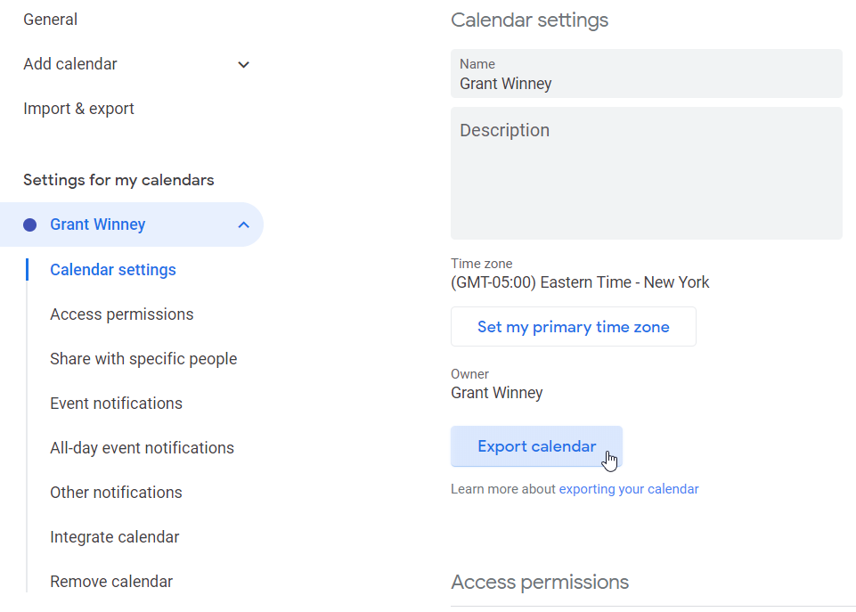

---
categories:
- Google
- Privacy
date: "2019-12-09T23:44:00Z"
description: ""
draft: false
cover:
  image: photo-1596526131083-e8c633c948d2.jpg
slug: replacing-gmail-with-mailbox-org
summary: Google provides some amazing tools, but at what cost to privacy? One of the biggest blockers in eliminating them has been finding a reliable and affordable replacement for email (and ideally, calendar, documents, tasks, etc too). Well I may have finally found it, in Mailbox.org.
tags:
- google
- privacy
title: Replacing Gmail (and its office suite) with Mailbox.org
---
I had a gmail account for 10 years, and was perfectly happy but for the nagging issue of privacy and [gobbling up](https://www.nytimes.com/2019/11/11/business/google-ascension-health-data.html) [our data](https://www.cnbc.com/2019/11/01/google-to-acquire-fitbit-valuing-the-smartwatch-maker-at-about-2point1-billion.html). Finding a reliable and affordable replacement with a full suite of office tools wasn't easy though.

After trying a few others, I discovered [mailbox.org](https://mailbox.org/en/), an email provider that values enhanced security and privacy over serving up ads. After spending the last week getting it setup the way I want it, I think I've finally found my replacement for gmail et al.

---

## Getting Started

[Register for an account](https://register.mailbox.org/en) and off you go.. easy peasy. Once you're in, click the gear icon and change your features. There's a nice little slider to increase mail and cloud (document) storage, and it shows what other features are enabled to. Pay is "as you go", and there's quite a few options depending on just how much of a geek you are... or what your privacy requirements are.

As you can see, I have a whopping $2 in my account, good for 2 months of basic usage. The free 30 day account ain't bad for trying it out, but hey I'm rolling in washingtons over here. 💸

---

## Using Your Own Domain

Setup is far easier if you just use the default mailbox.org domain, buuuut.. I love to complicate things. Seriously though, after changing gmail.com to protonmail.com and now to mailbox.org (and being realistic that I may want to change services again someday, and since I already have a domain for this blog), it just makes sense to make this the last email address change I'll ever have to make.

Mailbox.org provides a detailed doc on [setting up e-mail addresses for your domain](https://kb.mailbox.org/en/private/custom-domains/using-e-mails-with-a-custom-domain/). You'll definitely have to be comfortable configuring your own domain setup, but it's not _that_ hard if you're willing to do some research. I can only share what I do personally.

My domain name is currently registered with Namecheap, which I configured to [forward all traffic to the DigitalOcean nameservers](https://www.digitalocean.com/community/tutorials/how-to-point-to-digitalocean-nameservers-from-common-domain-registrars), where I host this blog. Everything (web traffic, emails, etc) goes through Namecheap to DO, where the actual config is done.

The first thing you'll see in Mailbox.org when you try to setup an alias to your own domain is a warning telling you to add a TXT record to your DNS settings. They have to do that to verify you have access to the domain, otherwise _anyone_ could claim _any_ domain for their own. [That would be Bad](https://www.youtube.com/watch?v=9wrEEd1ajz4&t=28).

After you've proven you're the owner, you see this instead. Now you can add some MX records to your DNS settings, directing all traffic from (in my case) DigitalOcean to Mailbox.org's several servers (note the "priority" setting). 🐢🐢🐢🌎

_But wait, there's more!_ You may have proven who you are to Mailbox.org, but that's not enough for other providers like Gmail, who will mark your messages as possible spam and unceremoniously dump them in the recipient's spam folder. Fun.

To fix that, you need another DNS entry. Use a tool like [this one](https://mxtoolbox.com/SuperTool.aspx?action=spf) to check for an SPF record - if you don't find one, you need one, and you can [find instructions here](https://kb.mailbox.org/en/private/custom-domains/using-e-mails-with-a-custom-domain/#Usinge-mailaddressesofyourdomain-Step3:HowtosettheSPFrecords).

Give it time to take effect, then check it with the website again, and everything should be much greener and happier. Either this tells Gmail how to check Mailbox.org to verify you, or it causes Mailbox.org to attach some meta data to requests that Gmail uses, or... whatever. I don't care, my stuff ain't going to spam anymore. 💚

Here's my full DNS records, which might help someone. Not sure why the bottom 3 NS records are in there, but I think they were there by default so I'm leaving 'em. There's also a reference in their docs to adding a record for [DKIM](https://blog.woodpecker.co/cold-email/spf-dkim/#dkim), but that doesn't seem to be necessary... maybe I'll revisit it later.

---

## Syncing Mail, Calendar, Contacts to Your Phone

To sync everything with Android, you'll need to take advantage of the CardDAV and CalDAV protocols, which are standards for synchronizing contacts and calendar/todo items, respectively. The [DAVx⁵](https://play.google.com/store/apps/details?id=at.bitfire.davdroid) app can do all that for you - it's working great so far.

### Install DAVx⁵

1. Disable "battery optimization" per the app's suggestion, and allow the app to run in the background, otherwise I don't see how it'll allow updates.
2. On the right bottom, press the orange "+" symbol.
3. Choose “Login with URL and user name”.  
    base url: [https://dav.mailbox.org](https://dav.mailbox.org/)  
    user name: your mailbox.org primary email  
    password: your mailbox.org password _(not thrilled with having to supply my password instead of a per-app code where permissions can be restricted)_
4. Give the name an account if it prompts you (I can't remember..).
5. You should be prompted to allow certain permissions, like calendar, tasks and contacts. Might as well, otherwise it probably can't do what it needs to do.
6. You should see CardDAV (for syncing contacts) and CalDAV (for syncing calendars and tasks).
7. Choose the folders to sync.

### Install ICSx⁵

While DAVx⁵ by itself can sync calendars, you'll need one more piece if you want to subscribe to webcal calendars (with an .ics extension), and that's [ICSx⁵](https://play.google.com/store/apps/details?id=at.bitfire.icsdroid). You can [read about the difference in protocols](https://www.davx5.com/faq/subscribe-ics-file) here, but in a nutshell DAVx⁵ lets you sync events (2-way), and ICSx⁵ lets you subscribe to events (1-way).

### Test mail

When I used the default "email" app that came with the flavor of Android running on a Huawei phone, it automatically sync'd up with emails based on whatever magic DAVx5 does. After changing phones and losing access to whatever default app that was, I changed over to [BlueMail](https://play.google.com/store/apps/details?id=me.bluemail.mail) and like it so far.

You'll have to enter your email and password (I really wish they implemented oauth or similar, to grant them access solely to email), but according to BlueMail, that data never lands in their hands, nor do emails land on their servers:

- BlueMail uses SSL, STARTTLS and OAuth enforcing certificate check by default.
- BlueMail sends and receives emails directly to and from the user's email server.
- Passwords are never transferred to the BlueMail’s servers.
- Emails are never stored on BlueMail's servers.

### Test the Calendar and Contact apps

You should be able to use the Google Calendar app like you would for any other calendar, instead of the ugly default Android calendar app. Create an "test" calendar entry on Mailbox.org, let it sync (you can adjust settings in the mobile app), and make sure it carried over. Same goes for contacts too...

Don't forget to go into the Google Calendar app settings (if you use it) and uncheck the calendar built into Gmail, otherwise you'll have two personal calendars showing. I've been using [Business Calendar 2](https://play.google.com/store/apps/details?id=com.appgenix.bizcal) - it's got more features than the stock app.

---

## Migrating to Mailbox.org

If you decide to make the move, here's how. Ymmv of course.

### Migrate Calendar

Export your calendar from Gmail and upload the file into Mailbox.org to import it. Although you can't delete your primary Gmail calendar, you can click the "Delete" button to wipe out all events in one go.

### Migrate Contacts

Export your contacts in CSV format, and Mailbox.org can consume them pretty easily. There was a little cleanup to do, but nothing major.

### Migrate Gmail

There's no getting around this one - you'll have to login to each billing provider and service and update your email. If you don't want to send out a blanket email to everyone in your address book, or if you're worried you might've missed a few services, here's 3 filters I setup that might help you too:

- After deleting my calendar events, the system sends daily reminders that I have absolutely nothing planned. Don't need those..
- Everything sent to me that _isn't_ flagged as spam is forwarded to my new email.
- Everything that's spam is deleted.

You probably want to wait 6 months to make sure there wasn't some random bill or service you forgot to change, but when you're ready, you can [delete your Gmail account](https://myaccount.google.com/deleteservices) while leaving the rest of your Google account intact. There might be someone you know who tries sending email and it fails, but then you probably weren't that close anyway. You're just doing all kinds of purging today, aintcha?

Be sure to [download your data first](https://takeout.google.com/?hl=en), at least your emails... to their credit, Google does a nice job of making it easy for you to download all your data for all their services.

---

## Other Features (disposable addresses, security, etc)

They also provide a bunch of other awesome sauce right out of the box. If you've ever pondered what happens to your digital life when you pass away, well, so have they apparently. I don't know how they confirm someone's died, but presumably once they receive a request to release it, they can (at your instruction) grant it or delete it. Not sure how it'd hold up in court, but it's interesting.

The built-in disposable addresses are awesome as well. I spent a few hours porting my online accounts to my new email, and closed quite a few that I hadn't used in a long time. That is an _incredibly_ painful and frustrating experience, especially when there's no obvious way to even close the account. So, at the very least, I spun up a disposable address, changed it in those services and confirmed it, then deleted the address. At that point, they're effectively dead to me. 👍

While enabling 2FA, I noticed this message. Since SMS is the [least](https://authy.com/blog/security-of-sms-for-2fa-what-are-your-options/) [secure](https://www.theverge.com/2017/9/18/16328172/sms-two-factor-authentication-hack-password-bitcoin) way to 2FA (and also won't work if you go outside your coverage area), I was actually glad to see it.

So far I'm super happy with this service, and consider $1/mo a steal for an ad-free, creepy-dig-through-my-data-free experience. If I need more aliases, cloud space, or convince my wife to jump on board with the "team" settings, I'll gladly play $2.50/mo for it too.
