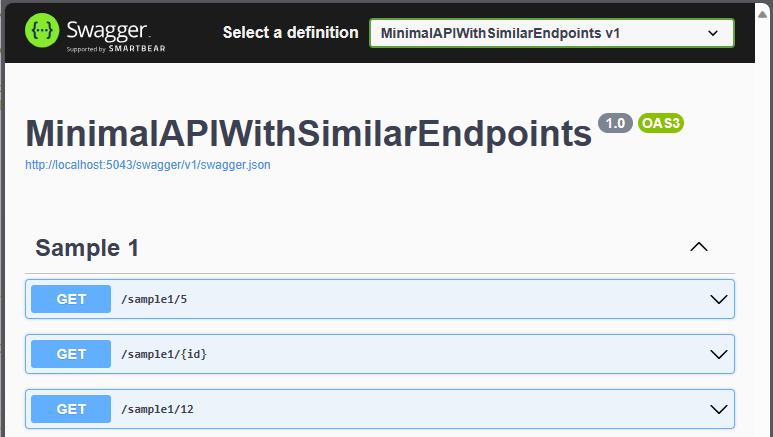
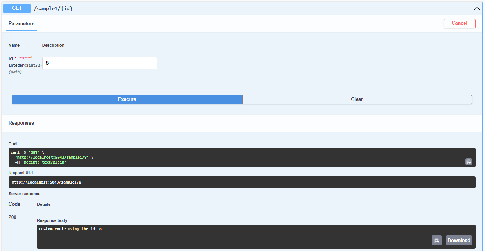

---
categories:
- API
- Swagger
- asp-net-core
- minimal-api
- Reflections
date: "2023-12-12T22:48:16Z"
description: ""
draft: false
cover:
  image: photo-1459231978203-b7d0c47a2cb7.jpg
slug: similar-endpoints-swagger-pages-and-a-devops-fail
summary: After an unexpected debugging session, some thoughts on APIs, similar endpoints, swagger, and an ugly DevOps fail.
tags:
- api
- swagger
- asp-net-core
- minimal-api
- reflection
title: Similar endpoints, swagger pages, and a DevOps fail
---
The great thing about being a developer is there's no shortage of interesting problems to solve, new concepts to learn, and ideas to bring to life. The annoying thing about being a developer is there's no end to the problems that need solving, an interminable number of things to learn, and 30 new ideas to replace every completed one. To paraphrase Tolkien, "It's a dangerous business, sitting at your keyboard. You step into the code, and if you don't keep your seat, there's no knowing where you might be swept off to."

_... sorry._

Last week, I was pulled into assisting with an issue where a new API endpoint appeared to be returning a 500 error. First, we checked the logs. If you have them, that's a great place to start. If you don't have them, then.. not so much. Logging is a good thing to learn more about though _(see? there's no end...),_ and in the world of C# that usually means learning NLog, which [I've written](https://grantwinney.com/log-errors-in-winforms-with-nlog/) about [before](https://grantwinney.com/how-to-log-messages-to-multiple-targets-with-nlog/). But I digress...

> The code in this post is available on [GitHub](https://github.com/grantwinney/BlogCodeSamples/tree/master/Frameworks/AspNetCore/MinimalAPIWithSimilarEndpoints), for you to use, expand upon, or just follow along while you read... and hopefully discover something new!

The logs indicated that an older (but similar) API endpoint seemed to be intercepting the call, and throwing a 500 error because it couldn't handle the payload. That's interesting, because it _is_ possible to get yourself a bit turned around when you've got several similar routes, especially when one of them matches on a pattern. Take this small [Minimal API](https://learn.microsoft.com/en-us/aspnet/core/fundamentals/minimal-apis/overview) for example:

```csharp
app.MapGet("/sample1/5", () => "Specific route for id: 5")
   .WithTags("Sample 1");

app.MapGet("/sample1/{id}", (int id) => $"Custom route using the id: {id}")
   .WithTags("Sample 1");

app.MapGet("/sample1/12", () => "Specific route for id: 12")
   .WithTags("Sample 1");
```

Technically, that middle route will match on _any_ integer sent to the `GET /sample1` endpoint, but if you happen to send (in this case) 5 or 12, it'll match the more specific one. The behavior seems consistent with (although I can't imagine how it'd be related to) what you'll see if you create a method that uses generics, and then create an overload on that method for a specific type.

```none
GET http://localhost:5043/sample1/5
// Specific route for id: 5

GET http://localhost:5043/sample1/8
// Custom route using the id: 8

GET http://localhost:5043/sample1/12
// Specific route for id: 12
```

In our case, the more specific endpoint was the older one, and the new (but similar) one had pattern matching in it. So it made sense that, in just the right circumstances, maybe the old one was intercepting the call.

We ran the same code locally and tried again. That's usually a good next step, since you can set break points and see how far the logic runs before it goes off the rails. Of course it's not so helpful when it works just fine locally, and hits the correct endpoint.. which it naturally did.

_"Works on my machine!"_

At this point, it sure seemed like the new code _didn't_ get deployed. Except according to our Azure DevOps environment, a deploy had definitely taken place. The keyword here is "a" deploy.. but not the one we needed. I'll get to that in a second.

A nice feature of APIs written in ASP.NET Core using Visual Studio is that you get a [Swagger UI](https://swagger.io/tools/swagger-ui/) page out of the box, if you choose. You can configure it later if you want, too. Here's the one it generated for my previous examples. It lists all the available endpoints, and even lets you plug in values and try them out.





This can be _really_ helpful, and was for us, because I opened the one for our deployed environment and, hmmm.. the new endpoint wasn't even listed. We had the record of a deploy in DevOps, it had succeeded without errors, and yet clearly had failed to actually, well.. deploy.

_You had one job, DevOps._

So, about that "'a' deploy" comment above. Without getting too far into the weeds, Azure DevOps splits the deployment process into two parts - [builds and releases](https://blog.bitsrc.io/separating-build-and-release-pipelines-for-effective-devops-2b0ad5b74af1). The first half is where you compile and package your code, and the second half is where you bundle the output of one or more builds together and send them off to a test server (or wherever you want).

Our build process was broken because someone deleted something they probably shouldn't have; but more significantly, it was something that DevOps shouldn't have _let_ them delete. It was a value that our jobs require, and DevOps should've been aware of it, much like a foreign key that prevents you from deleting records in table2 that are referenced in table1.

In our case, there was apparently no "foreign key" type of concept, and even worse, the jobs didn't try to run and then throw an error - they simply (silently) failed to run. In the end, we figured it out, re-added the missing value, and all was well again. Shame on DevOps though. I'd much rather deal with a loud, obvious problem than a stealthy, under-the-radar, invisible one! 🤬
