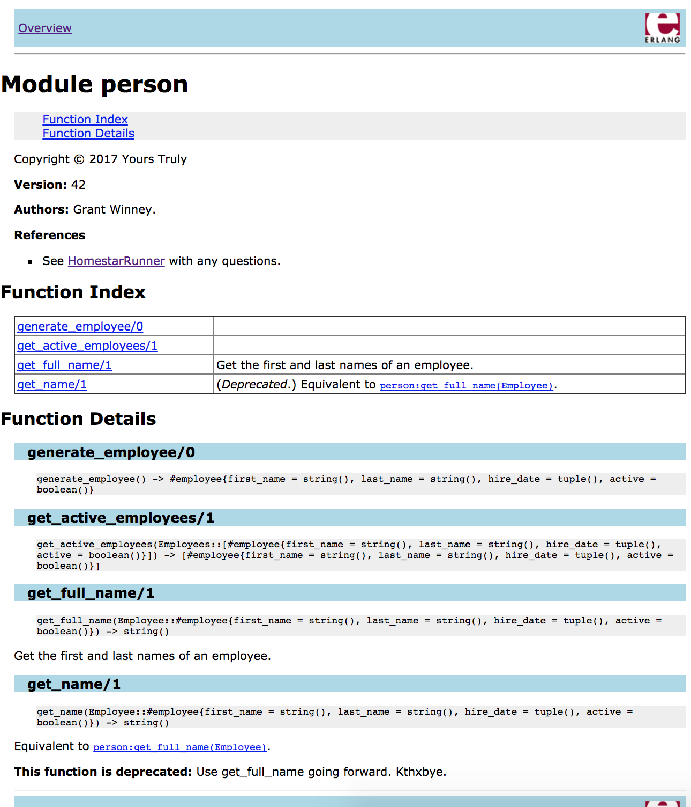

---
categories:
- Erlang
- Coding
date: "2017-11-01T16:50:27Z"
description: ""
draft: false
cover:
  image: tiger-2864785_1920.jpg
slug: taming-the-erlang-beast
summary: Becoming an Erlang developer has not always been easy, but over the last couple of years I've learned a few ways to tame the beast. It doesn't need to become any other language, but there's definitely room for improving the developer experience!
tags:
- erlang
- coding
title: Taming the Erlang Beast
aliases:
- /5-ways-to-tame-the-erlang-beast
---
When I started programming in Erlang professionally, it was a steeper climb than I had anticipated. There's a _lot_ that's different from C# - static vs dynamic types, object-oriented vs functional, the immutability of variables and heavy emphasis on pattern-matching and recursion. It's a very different way of thinking. And unfortunately for me, there's no Visual Studio for Erlang to hold your hand.

Over the last couple of years I've learned a few ways to tame the Erlang beast. It doesn't need to become C# or any other language, but there's definitely room for improving the developer experience.

## Dialyzer

[Dialyzer](http://erlang.org/doc/man/dialyzer.html) is a static analysis tool that reports when you're attempting to pass the wrong types between functions, have unreachable code, etc.

First, you have to run a command like this, in order to build up a persistent lookup table (PLT) containing type information for modules of the Erlang standard library. That information in turn is used by the actual analysis.

```erlang
dialyzer --build_plt --apps erts kernel stdlib
```

If we run Dialyzer against the following module, we'll be presented with a few warnings. Note that this module would have compiled just fine, and then would've thrown an exception at runtime.

```erlang
-module(dialsample).
-export([function1/0]).

function1() ->
    add_lists_of_ages(20, 25).
    
add_lists_of_ages(Ages1, Ages2) ->
    Ages1 ++ Ages2.

unused_function() ->
    ok.
```

Let's break the following output down a bit, in case it's the first time you've seen Dialyzer in action. It's warning us that since we're using the `++` operator, the first parameter to `add_lists_of_ages` _must_ be a list of something (anything). So it knows that passing `20` as the first parameter is going to fail. It's also warning us that `unused_function` will never be called, since it's not exported and nothing in the module calls it.

```none
> dialyzer --src dialsample.erl

dialsample.erl:4: Function function1/0 has no local return
dialsample.erl:5: The call dialsample:add_lists_of_ages(20,25) will never return since it differs
  in the 1st argument from the success typing arguments: ([any()],any())

dialsample.erl:7: Function add_lists_of_ages/2 has no local return
dialsample.erl:8: The call erlang:'++'(Ages1::20,Ages2::25) will never return since it differs in
  the 1st argument from the success typing arguments: ([any()],any())

dialsample.erl:10: Function unused_function/0 will never be called
```

Dialyzer is helpful by itself, but it's even more powerful when used with specs, which I'll cover next. If you'd like to learn more about Dialyzer, start here:

- [Dialyzer, a DIscrepancy AnaLYZer for ERlang programs](http://erlang.org/doc/man/dialyzer.html) (official docs)
- [Type Specifications and Erlang](http://learnyousomeerlang.com/dialyzer) (Learn You Some Erlang)

## Specs

Erlang is strongly typed (like C#, Java and others), but it's dynamic (not static) typed. That means it has [distinct data types](http://erlang.org/doc/reference_manual/data_types.html), but it resolves them at runtime instead of compile time - in other words, you don't realize you've screwed up until your code is executed and blows up in your face.

Even when everything is working smoothly, it's absolutely painful to revisit a function that accepts multiple data types months later and try to expand on it. Or refactor it. Or just look at it.

Dialyzer is powerful on its own, but coupling it with [specs](http://erlang.org/doc/reference_manual/typespec.html#id80050) dials things up to 11. Here's the above example again, but including specs this time.

```erlang
-module(dialsample).

-export([function1/0]).

-spec function1() -> [pos_integer()].
function1() ->
    add_lists_of_ages(20, 25).

-spec add_lists_of_ages([pos_integer()], [pos_integer()]) -> [pos_integer()].
add_lists_of_ages(Ages1, Ages2) ->
    Ages1 ++ Ages2.
```

Now when we run Dialyzer it recognizes that the function should receive (and return) lists of positive integers (and not just lists of anything).

```none
dialsample.erl:6: Function function1/0 has no local return
dialsample.erl:7: The call dialsample:add_lists_of_ages(20,25) will never return since the success typing
  is ([any()],any()) -> any() and the contract is ([pos_integer()],[pos_integer()]) -> [pos_integer()]
  
dialsample.erl:10: Function add_lists_of_ages/2 has no local return
dialsample.erl:11: The call erlang:'++'(Ages1::20,Ages2::25) will never return since it differs in the
  1st argument from the success typing arguments: ([any()],any())
```

Dialyzer always errs on the side of caution though, so as not to provide false-positive warnings. In other words, you get the most bang for your buck if you add specs to as much of your codebase as possible. The more you do, the more accurate and helpful Dialyzer becomes.

- [Types and Function Specifications](http://erlang.org/doc/reference_manual/typespec.html) (official docs)
- [Types (or lack thereof)](http://learnyousomeerlang.com/types-or-lack-thereof) (Learn You Some Erlang)

## Records

[Records](http://erlang.org/doc/reference_manual/records.html) are glorified tuples, but provide some real benefits over a simple tuple. You can group information together under a name (the name of the record, also the first element of the tuple) and access all the fields in it by name too.

I suggest using a record whenever you identify a few parameters that all seem to be related. It's somewhat analogous to grouping fields together into a class in other languages.

Let's look at a small module that defines a record and then acts on it. Notice how it's defined, then used in `generate_employee()`, and then accessed in the last two functions. The alternative would be to pass around all those individual fields as separate ungrouped fields, but that could become a maintenance nightmare quickly.

```erlang
-module(person).

-record(employee,
        { first_name :: string(),
          last_name :: string(),
          hire_date :: tuple(),
          active :: boolean() }).

-export([generate_employee/0, get_name/1, get_active_employees/1]).

-spec generate_employee() -> #employee{}.
generate_employee() ->
    #employee { first_name = "Jane",
                last_name = "Doe",
                hire_date = {{2017,10,31},{6,1,55}},
                active = true }.

-spec get_name(#employee{}) -> string().
get_name(Employee) ->
    io:format(Employee#employee.first_name ++ " " ++ Employee#employee.last_name ++ "\n").

-spec get_active_employees([#employee{}]) -> [#employee{}].
get_active_employees(Employees) ->
    lists:filter(fun(Employee) -> Employee#employee.active =:= true end, Employees).
```

```none
10> c(person).
{ok,person}
11> person:get_name(person:generate_employee()).
Jane Doe
ok
12> person:get_active_employees([person:generate_employee()]).
[{employee,"Jane","Doe",{{2017,10,31},{6,1,55}},true}]
```

- [Records: Programming Examples](http://erlang.org/doc/programming_examples/records.html) (official docs)
- [A Short Visit to Common Data Structures: Records](http://learnyousomeerlang.com/a-short-visit-to-common-data-structures#records) (Learn You Some Erlang)

## EDoc

If you've been a programmer for longer than a few months you know we love to argue about certain things. Tabs vs spaces for example. I say one letter per line.


[_https://xkcd.com/1285_](https://xkcd.com/1285)

The necessity of comments is another sticking point. Some love them, some think they're evil incarnate. Personally, I think comments are fine, but that the "why" of the code is more important than the "what". Not having any comments _anywhere_, no documentation or anything, is less than ideal. Write a large chunk of code, then check it in with a dozen other programmer's large chunks of code, then step away from the thing for a few months and try to remember what you did and why.

Erlang has a documentation system called [EDoc](http://erlang.org/doc/apps/edoc/chapter.html), which allows you document your code and even generate HTML page from it. Here's the previous example again, this time with comments added.

```erlang
%% @author Grant Winney
%% @copyright 2017 Yours Truly
%% @reference See <a href="http://homestarrunner.com">HomestarRunner</a> with any questions.
%% @version 42
-module(person).

-record(employee,
        { first_name :: string(),
          last_name :: string(),
          hire_date :: tuple(),
          active :: boolean() }).

-export([generate_employee/0, get_name/1, get_full_name/1, get_active_employees/1]).

-spec generate_employee() -> #employee{}.
generate_employee() ->
    #employee { first_name = "Jane",
                last_name = "Doe",
                hire_date = {{2017,10,31},{6,1,55}},
                active = true }.

%% @deprecated Use get_full_name going forward. Kthxbye.
%% @equiv person:get_full_name(Employee)
-spec get_name(#employee{}) -> string().
get_name(Employee) ->
    io:format(Employee#employee.first_name ++ " " ++ Employee#employee.last_name ++ "\n").

%% @doc Get the first and last names of an employee.
-spec get_full_name(#employee{}) -> string().
get_full_name(Employee) ->
    io:format(Employee#employee.first_name ++ " " ++ Employee#employee.last_name ++ "\n").

-spec get_active_employees([#employee{}]) -> [#employee{}].
get_active_employees(Employees) ->
    lists:filter(fun(Employee) -> Employee#employee.active =:= true end, Employees).
```

Once you've added comments, you can easily generate an HTML document from the erl shell with a one-liner, and the results are pretty good. Compare the page below to the comments above - is everything there?

```erlang
edoc:files(["person.erl"]).
```



I really like the "Learn You Some Erlang" site, but unfortunately there's nothing on there about EDoc! Lots of info in the official docs though.

- [Welcome to EDoc](http://erlang.org/doc/apps/edoc/chapter.html)
- [EDoc Reference Manual](http://erlang.org/doc/apps/edoc/)

## EUnit

You should strive to write tests for all your code. Well, as much as it makes sense. And not because someone wrote about it in a book or sold you on it at a conference, but because it just makes good sense. Once you write some code, or refactor it, or change any code _around_ it, you should test everything to make sure it still works. Do you want to test it manually every time, or would you rather it happens automatically? Please tell me you said automatically.

Erlang comes with a unit testing suite called EUnit, which you can use to test isolated blocks of your code. It's similar in vein to testing suites used by other languages, like NUnit, JUnit, xUnit (see a pattern yet?), etc.

Here's the same code as before, stripped of all the EDoc and spec stuff, but with EUnit tests now. The first test is making sure employees' full names are returned as expected, while the second makes sure that only active employees are returned.

```erlang
-module(eunitsample).

-record(employee,
        { first_name :: string(),
          last_name :: string(),
          hire_date :: tuple(),
          active :: boolean() }).

-export([generate_employee/0, get_name/1, get_active_employees/1]).

generate_employee() ->
    #employee { first_name = "Jane",
                last_name = "Doe",
                hire_date = {{2017,10,31},{6,1,55}},
                active = true }.

get_name(Employee) ->
    Employee#employee.first_name ++ " " ++ Employee#employee.last_name.

get_active_employees(Employees) ->
    lists:filter(fun(Employee) -> Employee#employee.active =:= true end, Employees).


%%%%%%%%%%%%%%%%
%% EUNIT TESTS
%%%%%%%%%%%%%%%%

-include_lib("eunit/include/eunit.hrl").

get_name_test_() ->
    [
        ?_assertEqual("Jack Bauer", get_name(#employee { first_name = "Jack", last_name = "Bauer" })),
        ?_assertEqual("Diana Prince", get_name(#employee { first_name = "Diana", last_name = "Prince" }))
    ].

get_active_employees_returns_active_employee_test() ->
    Employees = [#employee { first_name = "Someone1", active = true },
                 #employee { first_name = "Someone2", active = false },
                 #employee { first_name = "Someone3", active = true }],
    ActiveEmployees = get_active_employees(Employees),
    
    %% we should only get the two "active" records back
    ?assertEqual(2, length(ActiveEmployees)),
    
    %% ...which should include "Someone1" and "Someone3"
    ?assertNotEqual(false, lists:keyfind("Someone1", #employee.first_name, ActiveEmployees)),
    ?assertNotEqual(false, lists:keyfind("Someone3", #employee.first_name, ActiveEmployees)),
    
    %% ...but not "Someone2"
    ?assertEqual(false, lists:keyfind("Someone2", #employee.first_name, ActiveEmployees)).
```

To run these tests, just pop into an erl shell, recompile and run them:

```none
> c(eunitsample).
{ok,eunitsample}
> eunit:test(eunitsample).
  All 3 tests passed.
ok
```

Tests are a great form of documentation. Sure, you can document with EDoc what these functions do and why they exist, but that doesn't stop bugs. Now if anyone changes `get_name` to return only a first name, or adds an additional filter to `get_active_employees` that changes the results, the tests will fail. And this is HUGE in a language like Erlang, where nearly anything that might go wrong will do so at runtime.

- [EUnit - a Lightweight Unit Testing Framework for Erlang](http://erlang.org/doc/apps/eunit/chapter.html) (official docs)
- [EUnit: The need for tests](http://learnyousomeerlang.com/eunit) (Learn You Some Erlang)

# Did I miss anything?

If you use any of these - or hopefully all of them! - you should find that the wild Erlang beast is greatly tamed. You'll have cleaner, more predictable, less buggy code.

These certainly aren't all the tools in an Erlang developer's toolbox. What else do you like to use? Share your thoughts below so I can learn more too!
