---
categories:
  - Coding
date: 2021-06-07T12:56:43Z
description: ""
draft: false
cover:
  image: photo-1572033201021-28947382ff95.jpg
slug: using-async-await-and-task-to-keep-the-winforms-ui-more-responsive
summary: Using the async/await pattern in WinForms is an easy win, helping prevent one of the most annoying user experiences - a frozen UI.
tags:
  - threading
  - surviving-winforms
  - csharp-5
  - csharp
  - async
title: Using Async, Await, and Task to keep the WinForms UI responsive
---
For most of my dev career, I've been in C# shops. That doesn't mean _every_ project required C# exclusively, but most of them did. I've also used React, Ruby, C++, Erlang.. whatever's called for. But large company or small, if you're a C# dev, sooner or later you'll likely find yourself supporting a WinForms app. And crystal reports, but we shan't speak of that here. 😑

WinForms is 20 years old, but doesn't show signs of disappearing anytime soon. It still exists in [.NET 5.0](https://docs.microsoft.com/en-us/dotnet/desktop/winforms/?view=netdesktop-5.0) (the successor to .NET Core 3.1), and will exist in [.NET 6.0](https://dotnet.microsoft.com/download/dotnet/6.0) later this year. Web design, SAAS, and the cloud are all the rage, but not everyone is looking to upgrade or trusts their data to someone else's server. For a lot of people in rural or developing areas, the Internet is spotty at best, so the move to all web-based apps may not be an option!

In light of all that, and because the flagship app where I'm currently employed is written in WinForms, I'm going to start a series of posts that explore how we can make it, well... suck less. The .NET Framework was very, _very_ different 20 years ago, but old paradigms continue on. No one wants to change the original code, and it's easier to introduce new code using the same old design patterns.

> The code in this article is available on [GitHub](https://github.com/grantwinney/SurvivingWinForms/tree/master/Threading/AsyncAwait), for you to use or just follow along with.

But even if we don't want to overhaul a huge app, can't we leave the place cleaner than we found it? So let's check out something that can improve nearly any area of code, if used carefully - threading using the async/await pattern.

## What is Async / Await?

We don't do single-threaded in real life. Imagine just standing there while the washer finishes cleaning your clothes, or the coffee machine brews your favorite java. Worse yet, you _can't_ move until the clothes are clean. Everything around you just freezes in place. It's ridiculous.

But it's a _lot_ easier to think that way, isn't it? Things are so much more predictable when you know one thing will happen at a time, that task A will end before task B begins. But just like in real life everyone would be _seriously_ annoyed with you, in app dev life the user is annoyed. It's easy, but not right.

A much better user experience is to run tasks separately from the UI thread, and even better is to run _multiple_ things separately and safely. To let a job run in the background while the user moves on to something else... or at least sees progress instead of a frozen UI.

The .NET Framework has had different ways of doing this for a long time, but the async/await pattern in .NET 4.5 is easier than ever before. We can group chunks of code together, run them separately from one another and the main UI thread, and we can tell the app when it should wait for certain threads to complete before going any further. Let's take a look at an example.

## Example 1: Running everything from the UI

The most common thing to do in a WinForms app (in my experience) is to just keep adding more and more code, without thinking about where it's running... which usually means the UI thread by default. The problem is that a long-running job running on the UI thread freezes the app. Even short job will lock the UI for a half-second here, a full second there, even if we've gotten used to it.

In the [BreakfastSingleThread class](https://github.com/grantwinney/Surviving-WinForms/blob/master/Threading/AsyncAwait/AsyncAwait/Breakfast.cs#L175), I've written a couple dozen methods for making a full breakfast. They're not doing any real work.. just sleeping for a fraction of a second or so, then continuing. When you click the "Run on Main Thread" button, it kicks off the process with this: _(ignore the inline method passed to the ctor - I'm passing messages to the TextBox control, but that's not important right now)_

```csharp
var bmt = new BreakfastSingleThread((text) => txtMainThread.AppendText(text + Environment.NewLine));

bmt.MakeBreakfast();
```

Watch below how, while the job is running, the UI is completely unresponsive. I can't resize or move, buttons don't respond... but when it's done, the UI plays catchup and processes all the pending messages in the queue.

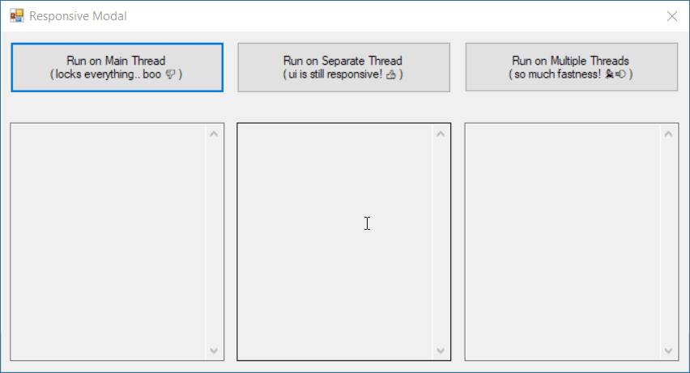

## Example 2: Moving logic to a separate thread

So how easy is it to take advantage of async/await, in order to not block the UI? You can change the second line in the above example to this, which tells it to run the code in a separate thread but then wait for it.

```csharp
await Task.Run(() => bmt.MakeBreakfast());
```

Now the UI thread is left available to process other events, so the progress bar animates, buttons are responsive, and the window can be resized and moved. You can disable anything you don't want the user to do (like I did with the button), but the UI itself doesn't lock up. _With one line of code!_

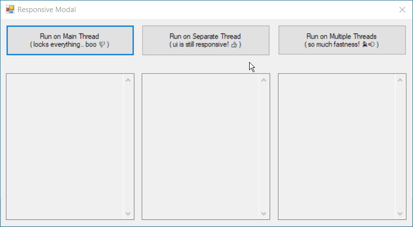

## Example 3: Moving logic to many separate threads

That previous example was a quick win. The UI was responsive again, but it's still running everything concurrently, so it takes the same amount of time by the end.

Running things in _separate_ threads would be a much larger win, but there's more changes to make in the code, and we have to be more careful about what we're calling, and when we have to wait (await) for certain parts to finish before moving on with others.

To support multiple threads, I rewrote the previous class and named it [BreakfastMultipleThreads.cs](https://github.com/grantwinney/Surviving-WinForms/blob/master/Threading/AsyncAwait/AsyncAwait/Breakfast.cs#L204). The changes are pretty significant. Many of the methods have been changed to support async operations.

- The method signatures have changed from `void` to `async Task`. If you try to use `void Task`, you'll get a syntax error and VS will offer to change it for you.
- The main "work" in each method (a sleepy thread) is moved inside a separate task. When the task is complete (we `await` it), the message is printed. I could've called `await Task.Delay(2000)` but felt the way I did it made it clearer that we could've been running other (more realistic) code.

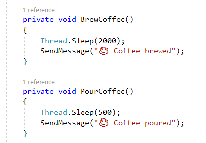

Before

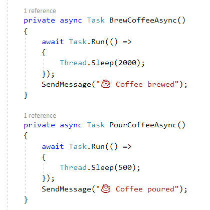

After

- Methods that called several other methods one at a time in order, like the steps for brewing a cup of coffee, still call them in order, but now we `await` for each task to complete before proceeding.
- Not all methods were converted to async though. The steps for cooking eggs were not, so they're all grouped inside a single task together.

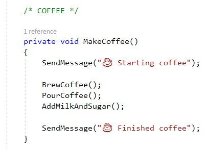

Before

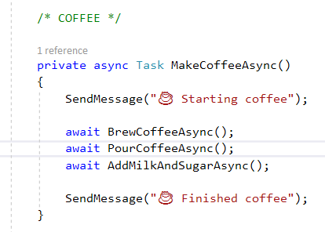

After

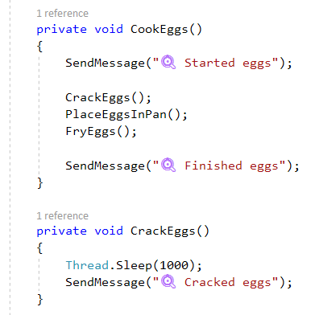

Before

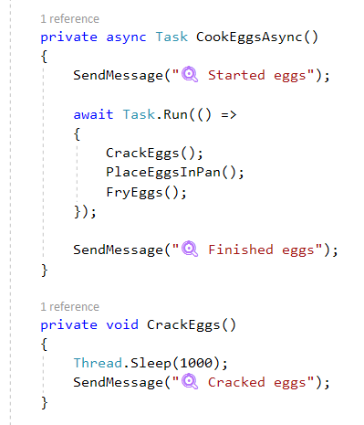

After

- Methods that can be executed at the same time, like cooking bacon and eggs, or pouring the orange juice while the coffee brews, are run in separate tasks at the same time. _**(big win!)**_
- Obviously certain things just can't be. You can't make the sandwich until everything's cooked. You can't pour the coffee while it's still brewing.

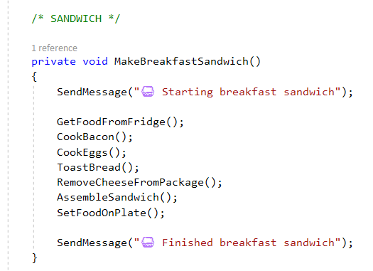

Before

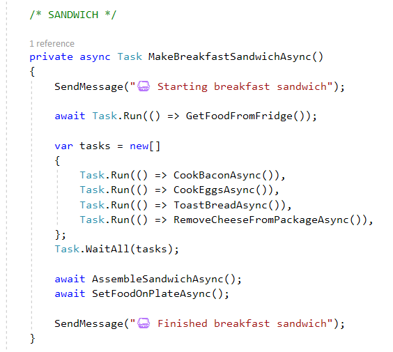

After

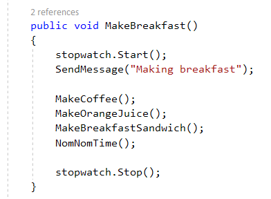

Before

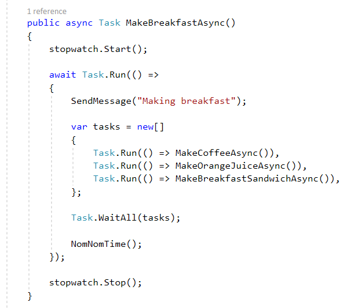

After

The real time saver here is running multiple tasks. We're no longer staring at the coffee machine, or waiting on the bacon until the eggs are fried. We're doing everything pretty much how we'd make an actual breakfast, getting one thing going and then starting another while that finishes.

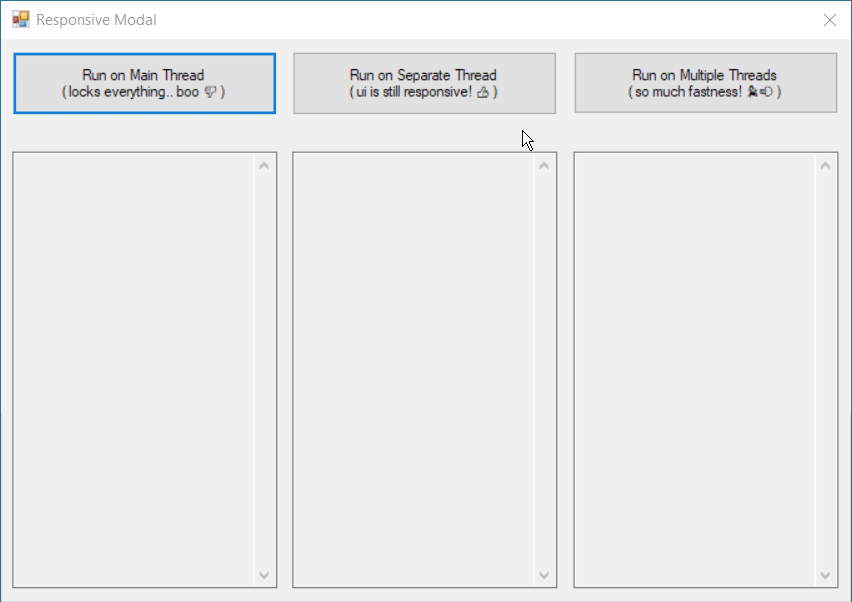

The result is pretty drastic! Even though I picked random sleep values that don't mean much by themselves, it's easy to see that multithreading is faster. If you look at the order of things in the last pane though, you'll see that it never finishes steps out of order, because I was careful about what I told it to kick off in parallel, and when to `await` for steps to finish before proceeding.

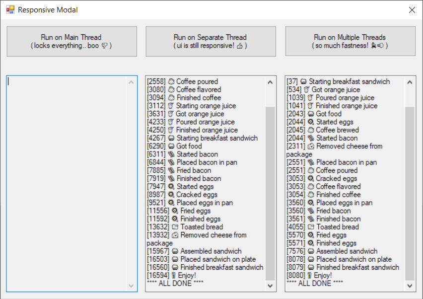

I made one more change too. In the second example, I sent messages back to the UI thread to write them out, but when that happens, it pauses my task for a moment while the UI handles it. In the third example, I used the [`Progress<T>` class](https://docs.microsoft.com/en-us/dotnet/api/system.progress-1?view=net-5.0) that was introduced in .NET 4.5 instead.

```csharp
// frmResponsiveModal.cs

var progress = new Progress<string>();
progress.ProgressChanged += (s, message) =>
{
    if (!txtMultipleThreads.IsDisposed)
        txtMultipleThreads.AppendText(message + Environment.NewLine);
};

var bmt = new BreakfastMultipleThreads(progress);
await Task.Run(() => bmt.MakeBreakfastAsync());


// BreakfastMultipleThreads.cs

private void SendMessage(string text)
{
    progress.Report($"[{ stopwatch.ElapsedMilliseconds }] {text}");
}
```

I don't know the ins and outs of how this differs yet, but the effects are pretty noticeable when you run all three examples at once. Check out how the three examples behave. When the one that blocks the UI thread runs, it does what it always does - freezes the whole UI. But when it completes, two things happen:

1. The example using `Progress<T>` immediately prints out all the rest of its messages as if no time has elapsed, and completes. It's clear that it continued running and completed, but its updates for the UI were stored.
2. The example _not_ using it was frozen in place, waiting on the main UI thread. When it continues, the stopwatch reports that 16.4 seconds has elapsed - the time it took the first example to complete.

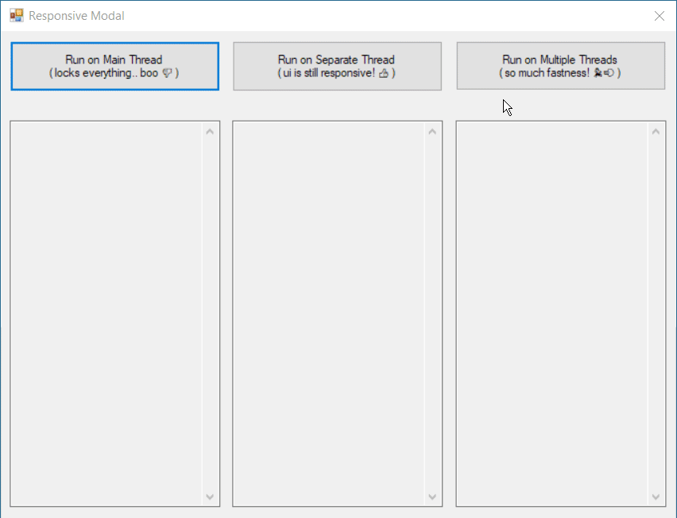

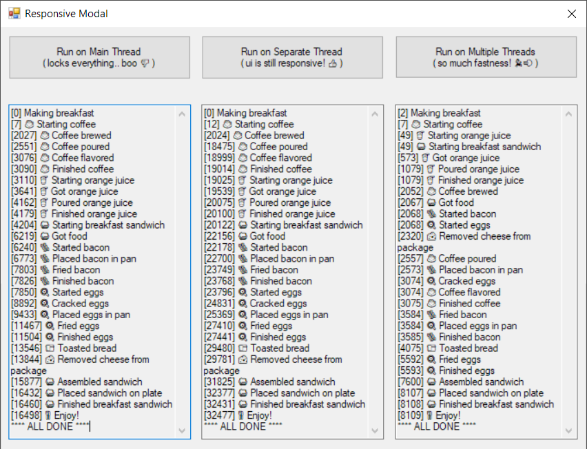

## Learn more

If you want to learn much more than I can include in a post, check out these great tutorials on YouTube by [Tim Corey](https://www.iamtimcorey.com/). The first one covers most of what I covered here, while the second one covers some advanced topics like the `Progress<T>` class.

[C# Async / Await - Make your app more responsive and faster with asynchronous programming - YouTube](https://www.youtube.com/watch?v=2moh18sh5p4)  
[C# Advanced Async - Getting progress reports, cancelling tasks, and more - YouTube](https://www.youtube.com/watch?v=ZTKGRJy5P2M)

If you prefer reading, check out [Bill Wagner's article on async programming](https://learn.microsoft.com/en-us/dotnet/csharp/asynchronous-programming/async-scenarios) too.

And finally, if you've got something that's _already_ async, like a BackgroundWorker, and you want to convert it to a Task, I wrote about that here:

[Converting a BackgroundWorker to a Task with TaskCompletionSource](https://grantwinney.com/convert-backgroundworker-to-task-with-taskcompletionsource/)
