---
categories:
- aws-lambda
- AWS
- ghost-blog
date: "2018-06-01T17:28:01Z"
description: ""
draft: false
cover:
  image: photo-1502116789488-8f0c6d794de6.jpg
slug: using-aws-lambda-and-tweetinvi-to-tweet-a-random-ghost-blog-post
summary: If you've got a Twitter account, and a blog with a lot of content, sharing
  your posts can be a nice way to help someone out, and drive a little extra traffic
  to your site. Here's how you can automate the process on your Ghost blog - for free!
tags:
- aws-lambda
- aws
- ghost-blog
title: Tweet random posts from a Ghost blog using AWS Lambda
---
If you've got a Twitter (now X) account, and a blog with a lot of content, sharing your posts from time to time can be a nice way to drive a little extra traffic to your site. Plus, sharing your experience and knowledge could very well help someone out who would not have found your post otherwise.

Manually selecting and sharing posts is time consuming, and using a third-party service could get costly and/or lack flexibility in selecting older posts. What if you could have the best of both worlds, and automate posting random blog posts for free? Thanks to some great OSS libraries, and AWS Lambda (which has a generous [free tier plan](https://aws.amazon.com/lambda/pricing/#Lambda_pricing_details)), you can.

I'll explain a little more about how I did it, but here's the tl;dr if you just want to try it out. I get it - sometimes the best way to learn something is to dig in and get your hands dirty as soon as possible.

## Usage

This is a C# console app that runs in AWS Lambda. You can schedule it to run as often as you like. Maybe once or twice a day to start.

### Clean up existing tags

Before you do anything else, you might want to revisit your existing tags (under `settings/tags`) and clean certain things up. Here's what I'd recommend (or you can leave them as-is and modify my code to handle them).

- Remove any leading `#` from tags, since the app prepends a `#` to each tag.
- If you have any characters in tags that won't translate well to Twitter hashtags, either remove them in Ghost, or add them to `var pattern = new Regex("[- ]");` in my project so they get removed before posting the tweet.
- This is a good time to revisit _all_ your tags and just remove/rename ones that won't look good in Twitter.
- While you're at it, you might want to revisit your posts as well - anything you forgot about that you'd rather not post to Twitter?

Other stuff to think about:

- You can leave spaces and hyphens - the app will remove them.
- You can leave leading numbers, since Twitter seems to handle those just fine.
- Any `#` will be replaced with `sharp` (c# » csharp), and `.` with `dot` (.net » dotnet).

### Get the code and compile it

1. Clone the repo: `https://github.com/grantwinney/BlogCodeSamples`
2. Find the project under "Misc/TweetRandomPostFromAGhostBlog" and build it, either in Visual Studio or at the command line.
3. Find the `bin` directory on disk, and drill down until you get to the assemblies (dll files), most likely in `bin/Debug/netcoreapp3.1`
4. Select all the files inside `netcoreapp3.1` (but not the directory itself) and zip them up. You'll be uploading these to an AWS Lambda function later.

### Create a Twitter app

[Register a new app with Twitter](https://developer.twitter.com/en/apps)... yeah, it'll be an app with one user. You'll get a prompt to "please apply for a Twitter developer account", so pick "something else" as the reason, share how you'll use it, deselect everything but _"Will your app use Tweet ... functionality?",_ and paste something similar in again for that field.

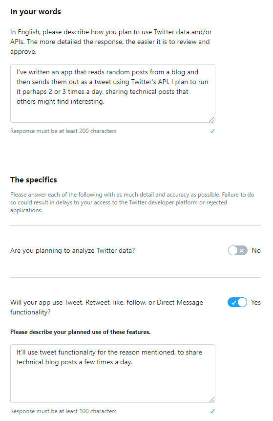

When you get the email for your new developer account (mine was nearly immediate), click the link and give your app a unique name. I just used [a random GUID](https://www.passwordrandom.com/query?command=guid) - the name doesn't really matter. I think it creates the app outside of a project. If it does, delete it, create a project, and then create the app inside that. Note the API key and secret for your app - you'll need those in a bit.

Under "App permissions", change the default "read" permissions to "read and write", since the app needs to be able to send tweets and not just read them. Then click back into your new app and press "Generate" under the "Access token & secret" section, and note the additional access token and secret that are generated - you'll need those in a bit too! _(Make sure it says "created with read and write permissions" underneath it.)_

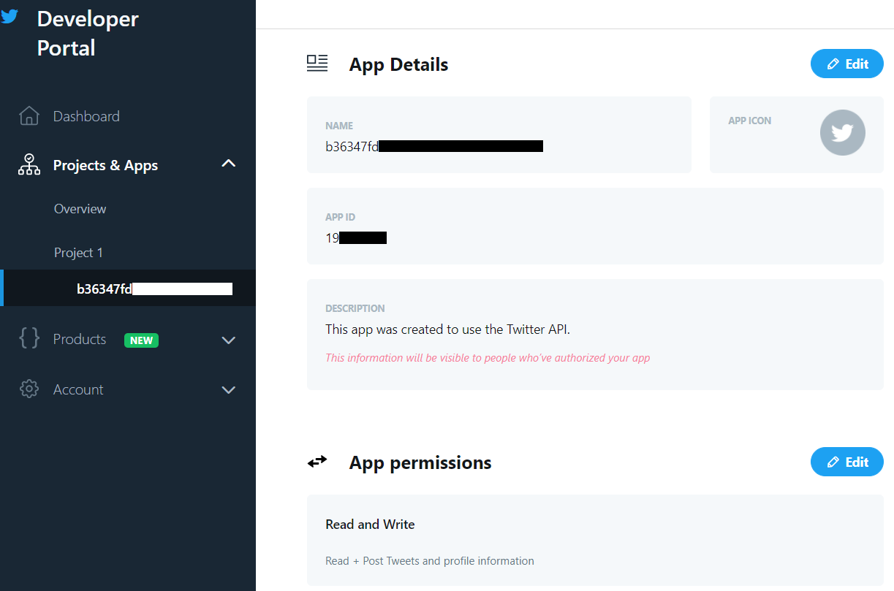

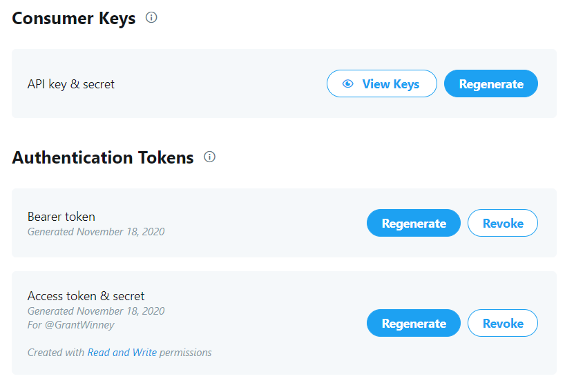

### Setup AWS Lambda

Open the [AWS Free Tier](https://aws.amazon.com/free) page and create an account if you don't already have one. Then open the Products dropdown and look for AWS Lambda, or [just go here](https://aws.amazon.com/lambda). Click the button in middle of the page, leave "root" selected, and enter your credentials. You should end up at [console.aws.amazon.com/lambda](https://console.aws.amazon.com/lambda), on a screen like this:

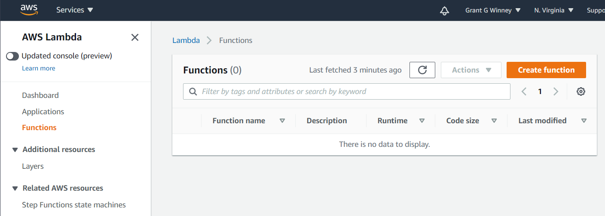

Now you need to create a new Lambda function.

1. Create a new function (author from scratch) and choose `C# (.NET Core 3.1)` for the runtime.
2. The name of the function doesn't matter, nor does the role it makes you create.
3. Under "Function code", upload the zip file you previously created.
4. Under "Runtime settings", change the handler to: `TweetRandomFeedItem::TweetRandomFeedItem.Program::Main`

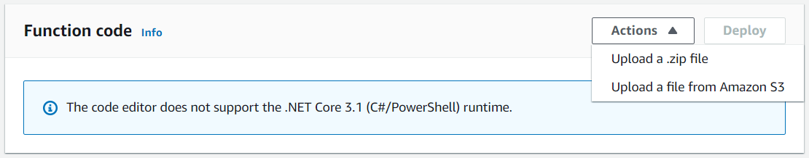

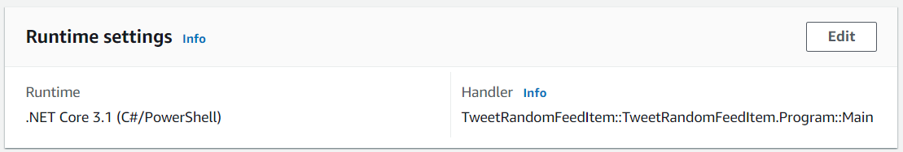

Under "Basic settings", decrease the memory to 128MB and increase the timeout to a minute. For me, it generally takes about 15-20 seconds to run, and uses 50MB or less of memory.

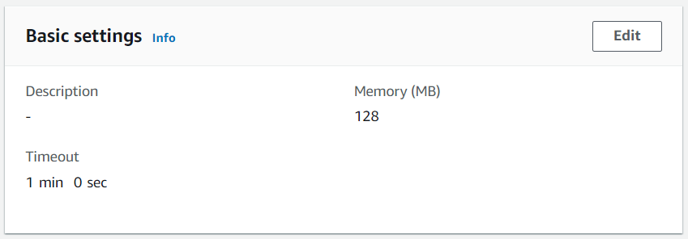

### Create the environment variables

I make heavy use of [environment variables](https://docs.aws.amazon.com/lambda/latest/dg/env_variables.html), so that credentials and other settings can easily be changed without having to recompile the code and upload it again. Here's a description of each field you can set.

**Required**

Go to the settings page for your blog, click Integrations, and then Add Custom Integration. Provide a name, and then note the values on the next page.

- `API_URL` - Set this to the API URL you get above, so the app can find your blog.
- `ADMIN_API_KEY` - Set this to the Admin API Key you get above, to authenticate with your blog.

These values all come from your Twitter account, from the app you created before.

- `TWITTER_CONSUMER_KEY` / `TWITTER_CONSUMER_SECRET` - Set these to the values for API key & secret under the "Consumer Keys" header after you create an app.
- `TWITTER_USER_ACCESS_TOKEN` / `TWITTER_USER_ACCESS_TOKEN_SECRET` - Set these to the Access token & secret you created separately under "Authentication Tokens".

**Optional**

- `POST_RETRIEVAL_LIMIT` - The number of posts to retrieve, from which a random post will be selected. (defaults to 9999999, basically "all posts")
- `TAGS_TO_TWEET` - A comma-delimited list of tags (no spaces after each comma) to consider when selecting a random post. (defaults to empty string, which means tags are ignored)
- `TAGS_TO_REMOVE` - A comma-delimited list of tags (again, no spaces after commas) to not include in the tweet message. This doesn't affect whether the post is selected, just how it looks in a tweet. (defaults to empty string too)
- `TWITTER_MAX_TAG_COUNT` - If you tend to use a lot of tags for blog posts, this limits how many are used in your tweet to the first `n`. (defaults to 3)
- `FACTOR_IN_AGE_OF_POST` - Set to "true" to make it more likely that a newer post will be selected than an older. (defaults to "false")

When you're done, it should look something like this:

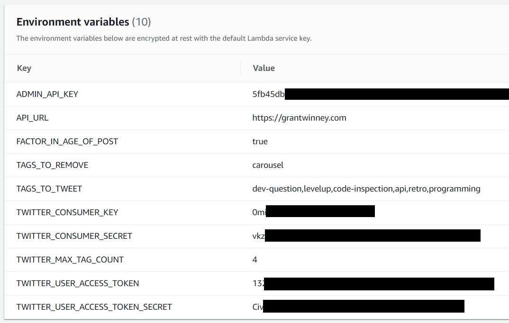

### Take it out for a spin!

That _should_ be everything you need to run the job. To try it out, hit the "**Test**" button in the top-right corner of the screen. It might have you configure a new "test event". Just do it, name it whatever, and change the code to an empty set of curly braces like `{}`.

If it seems to have done nothing, press "Test" again. Hopefully everything goes smoothly and you get a screen like this one. Check your Twitter feed - did it post one of your posts from your Ghost blog?

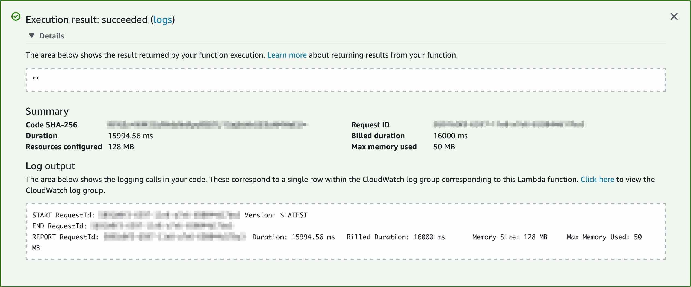

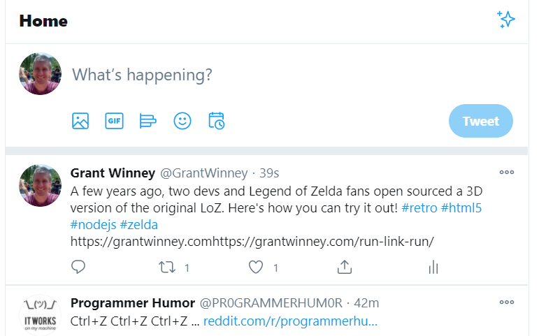

### Schedule it

If you're ready to let it do your work for you, schedule it to run via cron.

- Select "EventBridge (CloudWatch Events)" under "Add Trigger" in the Lambda configuration screen, and a new "Configure triggers" panel appears just below it.
- Select "Create a new rule" from the drop-down and give the new rule some random name.
- Enter a cron command in the "Schedule expression" box, such as `cron(0 12 * * ? *)` to run your job at 12 UTC every day. You can find more help in their developer guide: [Schedule expressions using rate or cron](https://docs.aws.amazon.com/lambda/latest/dg/services-cloudwatchevents-expressions.html)

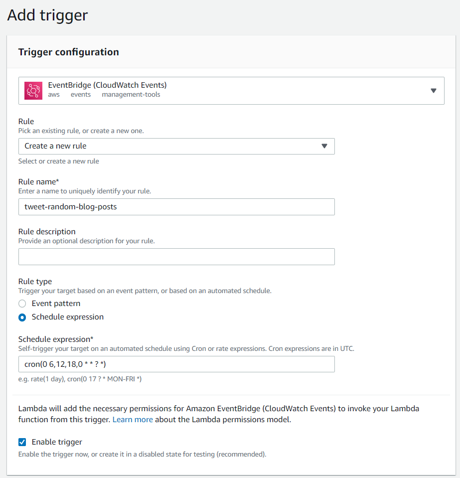

---

## The Stack

This project makes use of some nice OSS libraries. Oh, and there's even one that's mine, albeit it's not as finished as I'd like.

### Tweetinvi

[Twitter has a page that references libraries in different languages for their API](https://developer.twitter.com/en/docs/developer-utilities/twitter-libraries.html), including a handful for C#. Unfortunately, [TweetSharp is dead](https://web.archive.org/web/20240927005346/https://stackoverflow.com/questions/6705087/where-is-tweetsharp). Fortunately, [LinqToTwitter](https://github.com/JoeMayo/LinqToTwitter) and [Tweetinvi](https://github.com/linvi/tweetinvi) are both alive and kicking.

I looked at each, but they've both been recently updated, and each have a some open issues but a lot more closed ones. Someone's working on them, which is good! Both [Tweetinvi](https://github.com/linvi/tweetinvi/wiki/Introduction#compatibility) and [LinqToTwitter](https://www.nuget.org/packages/linqtotwitter) support .NET Core 2.0 too, which is required since [AWS Lambda runs on the .NET Core 2.0 runtime](https://visualstudiomagazine.com/articles/2018/01/17/aws-lambda-net-core.aspx).

After spending 15 minutes checking the two out, I decided to just go with Tweetinvi. I'm glad I did. It proved extremely easy to implement! I spent a couple evenings trying to write a my own library awhile back, but it's a complex task to tackle. I'm glad someone already did the work.

### GhostSharp

[GhostSharp](https://grantwinney.com/ghostsharp/) is a C# library I wrote that wraps the Ghost blog's v3 API, and allows you to programmatically manipulate your own Ghost blog site. You can modify posts and pages, upload images and themes, etc. It's available on [NuGet](https://www.nuget.org/packages/GhostSharp) if you're interested.

### AWS Lambda

I'm only just starting out with AWS Lambda, so I'm not sure what all it's capable of yet. A few days ago I created a function that keeps my personal Twitter timeline clean.. so far, it's awesome. Their [free tier plan](https://aws.amazon.com/lambda/pricing/#Lambda_pricing_details) is generous enough to let you try out _lots_ of different things before you need to pay a single penny.

---

## Thoughts? Comments?

Let me know how it goes, what you think of it, and whether you have any problems! This project is tightly coupled to the Ghost platform, but I also wrote a slightly more generic version, to [use your blog's RSS feed to randomly tweet](https://grantwinney.com/using-aws-lambda-to-tweet-random-posts-from-an-rss-feed/).
