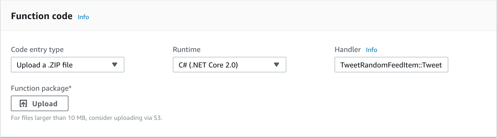
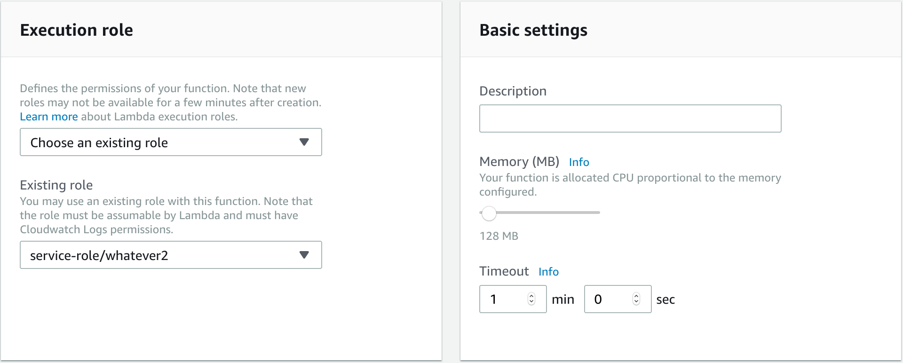
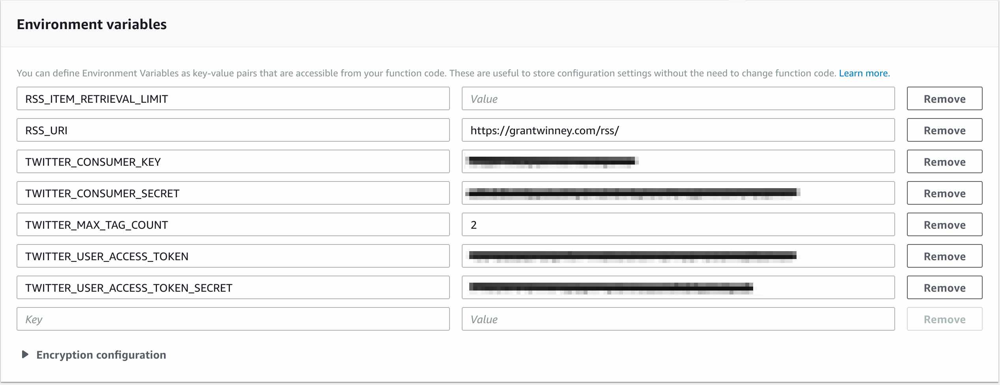
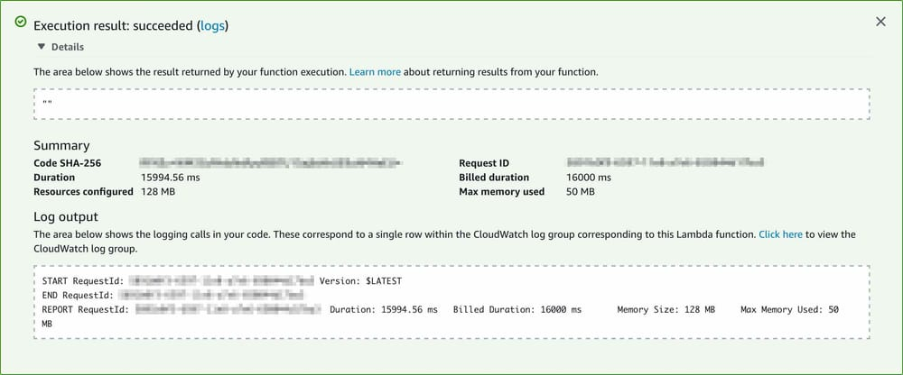
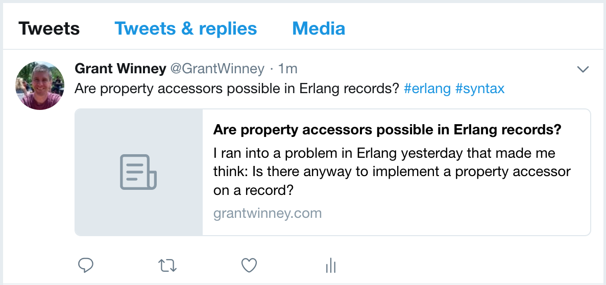

---
categories:
  - Builds
date: 2018-06-02T12:32:54Z
description: ""
draft: false
cover:
  image:
slug: using-aws-lambda-to-tweet-random-posts-from-an-rss-feed
summary: If you've got a Twitter account, and a blog with a lot of content, sharing your posts can be a nice way to help someone out, and drive a little extra traffic to your site. If your site generates an RSS feed, here's how you can automate the process - for free!
tags:
  - aws-lambda
  - aws
title: Tweet random blog posts from an RSS feed using AWS Lambda
---
Following on the heels of writing a small app to [tweet random posts from a Ghost blog using AWS Lambda](https://grantwinney.com/using-aws-lambda-and-tweetinvi-to-tweet-a-random-ghost-blog-post/), I thought I'd write a similar implementation that operated on an RSS feed instead of specifically just Ghost.

Manually selecting and sharing your blog posts on Twitter is time consuming, and using a third-party service could get costly and/or lack flexibility in selecting older posts. What if you could have the best of both worlds, and automate posting random blog posts for free? Thanks to some great OSS libraries, and AWS Lambda (which has a generous [free tier plan](https://aws.amazon.com/lambda/pricing/#Lambda_pricing_details)), you can.

I'll explain a little more about how I did it, but here's the tl;dr if you just want to try it out. I get it - sometimes the best way to learn something is to dig in and get your hands dirty as soon as possible.

## Usage

This is a C# console app that runs in AWS Lambda. Schedule it to run as often as you like using Lambda's [cron scheduling](https://docs.aws.amazon.com/lambda/latest/dg/tutorial-scheduled-events-schedule-expressions.html) capabilities.

### Clean up existing tags

Before you do anything else, you might want to clean up tags/categories if they're included in your RSS feed. Here's what I'd recommend (or you can leave them as-is and modify my code to handle them).

- Remove any leading `#` from tags, since the app prepends a `#` to each tag.
- If you have any characters in tags that won't translate well to Twitter hashtags, either remove them or add them to `var pattern = new Regex("[- ]");` in the code so they get removed before posting the tweet.
- This is a good time to revisit _all_ your tags and just remove/rename ones that won't look good in Twitter.
- While you're at it, you might want to revisit your posts as well - anything you forgot about that you'd rather not post to Twitter?

Other stuff to think about:

- You can leave spaces and hyphens - the app will remove them.
- You can leave leading numbers, since Twitter seems to handle those just fine.
- Any existing `#` will be replaced with `sharp` (c# » csharp), and `.` with `dot` (.net » dotnet).

### Grab the code

1. Clone the repo: `https://github.com/grantwinney/BlogCodeSamples`
2. Find the project under "Misc/TweetRandomFeedItem" and build it, either in Visual Studio or at the command line.
3. Find the `bin` directory on disk, and drill down until you get to the assemblies (dll files), most likely in `bin/Debug/netcoreapp2.0`
4. Select all the files inside `netcoreapp2.0` (but not the directory itself) and zip them up. You'll be uploading these to an AWS Lambda function.

### Create a Twitter app

You'll need to [register a new app with Twitter](https://apps.twitter.com/) (an app with one user - you!). The name of your app doesn't matter, but it does have to be unique system-wide (not just unique in your account).

To get the values you need for the app to post to Twitter, generate an "access" token under the "Keys and Access Tokens" section, and note these four pieces of data: _Consumer Key, Consumer Secret, Access Token,_ and _Access Token Secret_

### Setup AWS Lambda

Now you need to create a new Lambda function. Here's a brief [intro to setting up AWS Lambda](https://vickylai.com/verbose/free-twitter-bot-aws-lambda/#setting-up-aws-lambda), which you may want to check out. Once you're signed up, continue on...

1. Create a new function (author from scratch) and choose `C# (.NET Core 2.0)` for the runtime.
2. The name of the function, and the role it makes you create, don't matter.
3. Upload the zip file you previously created.
4. Set the handler as `TweetRandomFeedItem::TweetRandomFeedItem.Program::Main`

1. Under "Basic settings", decrease the memory to 128MB and increase the timeout to a minute. For me, it generally takes about 15-20 seconds to run, and uses 50MB or less of memory.

### Create the environment variables

I use quite a few [environment variables](https://docs.aws.amazon.com/lambda/latest/dg/env_variables.html), so credentials and other settings can easily be changed between runs, without having to recompile the code and upload it again.

| Field                                                                                                                          | Required | Description                                                                                                                                                                                                                                                                                                                             |
| ------------------------------------------------------------------------------------------------------------------------------ | -------- | --------------------------------------------------------------------------------------------------------------------------------------------------------------------------------------------------------------------------------------------------------------------------------------------------------------------------------------- |
| `RSS_URI`                                                                                                                      | Yes      | The RSS feed to read in, like: `https://grantwinney.com/rss/`                                                                                                                                                                                                                                                                           |
| `RSS_ITEM_RETRIEVAL_LIMIT`                                                                                                     | No       | Specify the number of posts you want to retrieve.  If you omit this, or leave the value empty, the app will read the entire RSS feed.                                                                                                                                                                                             |
| `TWITTER_CONSUMER_KEY`   `TWITTER_CONSUMER_SECRET`   `TWITTER_USER_ACCESS_TOKEN`   `TWITTER_USER_ACCESS_TOKEN_SECRET` | Yes      | These values all come from your Twitter account. You need to create a new app to get these values, which allows you to post tweets.                                                                                                                                                                                                     |
| `TWITTER_MAX_TAG_COUNT`                                                                                                        | No       | Although tag spamming is somewhat prevalent on Facebook, and even more-so on Instagram, I don't see a lot of it on Twitter. If you tend to use a lot of tags for posts on your blog, then you can limit how many of those transfer to your tweet.  If you omit this, or leave the value empty, the app will use the first 3 tags. |

When you're done, it should look something like this:

### Take it out for a spin!

That _should_ be everything you need to run the job. To try it out, hit the "**Test**" button at the top of the screen. It might have you configure a new "test event". Just do it, name it whatever, and change the code to an empty set of curly braces like `{}`. Hopefully everything goes smoothly and you get a screen like this one.

Check your Twitter feed - did it post something from your RSS feed? My feed only returns the most recent 15 posts, but the app did pick one at random, and tweeted it:

### Schedule it

If you're ready to let it do your work for you, schedule it to run via cron.

- Select "CloudWatch Events" under "Add Trigger" in the Lambda configuration screen, and a new "Configure triggers" panel appears just below it.
- Select "Create a new rule" from the drop-down and give the new rule some random name.
- Enter a cron command in the "Schedule expression" box, such as `cron(0 12 * * ? *)` to run your job at 12 UTC every day.

---

## The Stack

This project makes use of some nice OSS libraries. Oh, and there's even one that's mine, albeit it's not as finished as I'd like.

### Tweetinvi

[Twitter has a page that references libraries in different languages for their API](https://developer.twitter.com/en/docs/developer-utilities/twitter-libraries.html), including a handful for C#. Unfortunately, [TweetSharp is dead](https://stackoverflow.com/q/6705087/301857). Fortunately, [LinqToTwitter](https://github.com/JoeMayo/LinqToTwitter) and [Tweetinvi](https://github.com/linvi/tweetinvi) are both alive and kicking.

I looked at each, but they've both been recently updated, and each have a some open issues but a lot more closed ones. Someone's working on them, which is good! Both [Tweetinvi](https://github.com/linvi/tweetinvi/wiki/Introduction#compatibility) and [LinqToTwitter](https://www.nuget.org/packages/linqtotwitter) support .NET Core 2.0 too, which is required since [AWS Lambda runs on the .NET Core 2.0 runtime](https://visualstudiomagazine.com/articles/2018/01/17/aws-lambda-net-core.aspx).

After spending 15 minutes checking the two out, I decided to just go with Tweetinvi. I'm glad I did. It proved extremely easy to implement! I spent a couple evenings trying to write a my own library awhile back, but it's a complex task to tackle. I'm glad someone already did the work.

### SyndicationFeedReaderWriter

I implemented a [SyndicationFeedReaderWriter](https://github.com/dotnet/SyndicationFeedReaderWriter) (available via [NuGet](https://www.nuget.org/packages/Microsoft.SyndicationFeed.ReaderWriter/)), which worked well. I did a little cleanup of the tags to remove illegal characters; nothing too crazy though. There's debate about [which characters](https://stackoverflow.com/q/36895543/301857) are [allowed in hashtags](https://stackoverflow.com/q/14823376/301857), so I decided to focus on _my_ tags. YMMV, and you may have to adjust the code accordingly.

### AWS Lambda

I'm only just starting out with AWS Lambda, so I'm not sure what all it's capable of yet. A few days ago I created a function that keeps my personal Twitter timeline clean.. so far, it's awesome. Their [free tier plan](https://aws.amazon.com/lambda/pricing/#Lambda_pricing_details) is generous enough to let you try out _lots_ of different things before you need to pay a single penny.

---

## Thoughts? Comments?

Let me know how it goes, what you think of it, and whether you have any problems!
