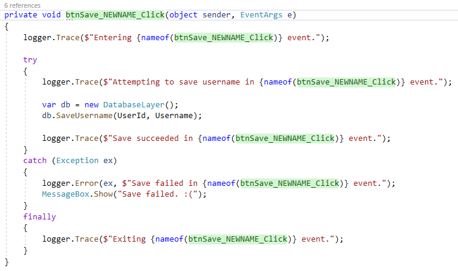
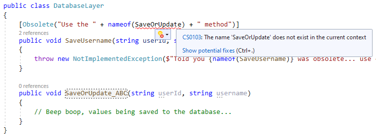
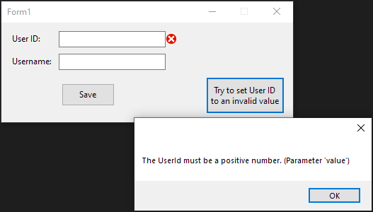

---
categories:
  - Coding
date: 2021-12-30T01:53:29Z
description: ""
draft: false
cover:
  image: photo-1514940269061-a79f23a95316.jpg
slug: using-nameof-to-avoid-magic-strings
summary: There's a lot of ways to make our code work for us. Let's check out using the nameof operator to avoid magic strings.
tags:
  - surviving-winforms
  - csharp-6
  - csharp
title: Using nameof to avoid magic strings in C#
---
Having magic strings in your code is definitely something to watch out for. What's a magic string? It's any string containing a value that might change, like an application setting, a timeout value, a method or class name, etc.

Imagine a single text field being validated in some WinForms app, and if the user inputs a value that's too short, it does 2 things - displays a message and logs a message for debugging purposes. Then someone comes along and says the username needs to be at least 12 characters. What're the odds it gets updated in the first instance, but not in the messages and logs? Those are magic strings.

```csharp
private void txtUsername_Validating(object sender, CancelEventArgs e)
{
    if (txtUsername.Text.Length < 10)
    {
        MessageBox.Show("Your username must be at least 10 characters. Please try again");
        logger.Trace("Username validation failed; value was less than 10 characters.");
    }
}
```

The fix is super easy, if not always easy to remember - just pull the value out into a single variable. To make life even easier, the next step might be to pull it out into some kind of application settings or other configuration file that can be changed without needing to recompile the entire app. But one step at a time...

```csharp
private const int minUsernameLength = 10;

private void txtUsername_Validating(object sender, CancelEventArgs e)
{
    if (txtUsername.Text.Length < minUsernameLength)
    {
        MessageBox.Show($"Your username must be at least {minUsernameLength} characters. Please try again");
        logger.Trace($"Username validation failed; value was less than {minUsernameLength} characters.");
    }
}
```

## What is the nameof expression?

There are different kinds of values that might need to be pulled out of magic strings. Some of them are business rule kind of logic, like above. Others are related more to our code, and concerns the devs more than end-users. Not everything has to be pulled out into a configuration file, but there are other ways to make our lives easier.

> The code in this article is available on <a href="https://github.com/grantwinney/Surviving-WinForms/tree/master/AntiPatterns/MagicStrings/NameOfVersusMagicStrings">GitHub</a>, if you'd like to follow along.

Introduced in C# 6, the `nameof` expression returns the name of the variable, type, or member (a method or class for example) that's passed to it. But the value you're passing to `nameof` is the method group, so if the name of that method changes, you'll actually get a compiler error!

This can be wildly helpful, but I think it's pretty underrated. Let's check out a few examples to see how it can make life a little easier for us.

## Using nameof in trace logging

Let's say you're working in a legacy app that's prone to some pretty weird bugs. Yep, stretches the imagination. So you have trace logging all over the place, and when a bug comes up you can crank things up to 11 in a test environment to get a better idea of what's failing and where.

You don't necessarily have a stack trace to log, so you want to write the name of the method in the call to LogTrace. But if there's a refactor, and someone changes some method names, what are the odds they'll miss your trace log messages. Pretty good.

Well, you can avoid that by using `nameof`.

```csharp
private void btnSave_Click(object sender, EventArgs e)
{
    logger.Trace($"Entering {nameof(btnSave_Click)} event.");

    try
    {
        logger.Trace($"Attempting to save username in {nameof(btnSave_Click)} event.");

        var db = new DatabaseLayer();
        db.SaveUsername(UserId, Username);

        logger.Trace($"Save succeeded in {nameof(btnSave_Click)} event.");
    }
    catch (Exception ex)
    {
        logger.Error(ex, $"Save failed in {nameof(btnSave_Click)} event.");
        MessageBox.Show("Save failed. :(");
    }
    finally
    {
        logger.Trace($"Exiting {nameof(btnSave_Click)} event.");
    }
}
```

Then not only will you get a compiler error that _forces_ you to update those messages if the method name changes, but doing a "rename" through Visual Studio will highlight all those instances in the log messages and rename them at the same time.



Try out the code yourself and check out the logs.

```none
2021-12-28 21:25:25.4810  Entering btnSave_Click event.
2021-12-28 21:25:25.4810  Attempting to save username in btnSave_Click event.
2021-12-28 21:25:25.5824  Save failed in btnSave_Click event.System.ArgumentOutOfRangeException: UserId cannot be empty (Parameter 'txtUserId')
   at NameOfVersusMagicStrings.Form1.get_UserId() in C:\Users\Grant\Code\SurvivingWinForms\AntiPatterns\MagicStrings\NameOfVersusMagicStrings\NameOfVersusMagicStrings\Form1.cs:line 21
   at NameOfVersusMagicStrings.Form1.btnSave_Click(Object sender, EventArgs e) in C:\Users\Grant\Code\SurvivingWinForms\AntiPatterns\MagicStrings\NameOfVersusMagicStrings\NameOfVersusMagicStrings\Form1.cs:line 40
2021-12-28 21:25:57.2668  Exiting btnSave_Click event.
```

## Using nameof in the Obsolete attribute

Let's check out another example.

When you mark a method as obsolete, it makes sense to redirect other developers to the newer one, but that's susceptible to the same problem as above. If the name of the newer method changes, your note may tell other devs to use something that doesn't exist anymore.

```csharp
public class DatabaseLayer
{
    [Obsolete("Use the " + nameof(SaveOrUpdate) + " method")]
    public void SaveUsername(string userId, string username)
    {
        throw new NotImplementedException($"Told you {nameof(SaveUsername)} was obsolete... use {nameof(SaveOrUpdate)}!");
    }

    public void SaveOrUpdate(string userId, string username)
    {
        // Beep boop, values being saved to the database...
    }
}
```

By using `nameof`, renaming the other method will cause a compilation error and force you to go changing the name everywhere.



With C# 10, you're supposed to be able to use string interpolation in the Obsolete attribute itself, like this. But I tried it, and when I add the `$` to the string, it still marks the method as deprecated, but it ignores the message and the "error" flag when it's set to true. Hopefully they get that fixed.

```csharp
[Obsolete($"Use the {nameof(SaveOrUpdate)} method")]
```

## Using nameof in a property accessor

I think you can see where this is going, so we'll just check out one more example.

If you wanted to, you could even use `nameof` from within a property. I've never done this, but [Microsoft](https://docs.microsoft.com/en-us/dotnet/csharp/language-reference/operators/nameof) has an example in their docs where they throw an exception when trying to set an invalid value (like below).

```csharp
public string UserId
{
    get => txtUserId.Text;
    set => txtUserId.Text = int.TryParse(value, out int userId) && userId > 0
               ? value
               : throw new ArgumentOutOfRangeException(nameof(value), $"The {nameof(UserId)} must be a positive number.");
}i
```

You could turn around and display that message to the user, or maybe just log it and display something a little more friendly.



I'm sure there's a lot more places you could use this too. If you come up with any good ones (or any bad ones, lol) let me know in a comment below!

If you found this content useful, and want to learn more about a variety of C# features, check out [my GitHub repo](https://github.com/grantwinney/CSharpDotNetExamples), where you'll find links to plenty more blog posts and practical examples.
