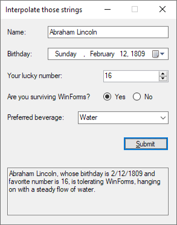

---
categories:
  - Learn
date: 2022-09-19T10:30:18Z
description: ""
draft: false
cover:
  image:
slug: using-string-interpolation-to-craft-readable-strings
summary: The longer I write software, the more I come to appreciate clear code. String interpolation in C# is just one more way to help us do that.
tags:
  - surviving-winforms
  - csharp-6
  - csharp
title: Using string interpolation to craft readable strings in C#
---
The longer I've been writing software, the more I've come to appreciate clear code. One of the toughest challenges in software development is understanding someone else's code - or your own after a few months, heh. If you're supporting an older app, you're spending as much (or more) time understanding what someone wrote 20 years ago than writing new code. Anything that makes it easier is a welcome thing!

When C# 6.0 was released around 2015, it introduced a new feature called string interpolation. Interestingly, string interpolation was introduced in JavaScript with ES6 the same year. If you haven't heard of it before (not unreasonable, since it can take years to stumble on a new feature, especially if you're working in an older app that doesn't use it), it helps us build strings in a much more readable fashion than what we had before.

It always helps to look at some examples, so here's a little WinForms app that collects a few pieces of info about a user and displays a short message.



Lets take a quick look at what came before, so we can appreciate what we've got now!

## The + operator

The most basic way of building a string, and what we've always had in C#, is to simply add everything together. It's choppy looking, it's tough to tell what the full message will look like at runtime, and it encourages errors like forgetting an extra space somewhere, so that allthewordsruntogether. Oops.

```c#
// string concatenation
// https://docs.microsoft.com/en-us/dotnet/csharp/how-to/concatenate-multiple-strings
var message = txtName.Text + ", whose birthday is " + dtpBirthday.Value.ToString("d") + " and favorite number is "+ numLuckyNumber.Value 
    + ", is " + (rdoYes.Checked ? "tolerating" : "dreading") + " WinForms, hanging on with a steady flow of " + cboBeverage.Text.ToLower() + ".";
```

## String.Format

The static [string.Format](https://docs.microsoft.com/en-us/dotnet/api/system.string.format) method improved things, letting us create a single string with placeholders and formatting, so it's a lot easier to envision how it'll look. In the example below, it's easier to see what the string will look like at runtime.

```c#
// string format
// https://docs.microsoft.com/en-us/dotnet/api/system.string.format
var message = string.Format("{0}, whose birthday is {1:d} and favorite number is {2}, is {3} WinForms, hanging on with a steady flow of {4}.",
    txtName.Text, dtpBirthday.Value, numLuckyNumber.Value, rdoYes.Checked ? "tolerating" : "dreading", cboBeverage.Text.ToLower());
```

Plus, you can store the formatted string for later use (in a variable inside a class, or even in a separate file to read out later), and then use it wherever you need it. You can't do that with string interpolation.

```c#
var fmtStr = "{0}, whose birthday is {1:d} and favorite number is {2}, is {3} WinForms, hanging on with a steady flow of {4}."

var message1 = string.Format(fmtStr, txtName.Text, dtpBirthday.Value, numLuckyNumber.Value, rdoYes.Checked ? "tolerating" : "dreading", cboBeverage.Text.ToLower());
var message2 = string.Format(fmtStr, "Bob", DateTime.Now, 1, "loving", "coffee");
var message3 = string.Format(fmtStr, "Marcus Antoninus", DateTime.Now.AddYears(-1900), 5, "unsure about", "wine");
```

Still, the values are listed _after_ the string, so you have to scan back and forth to see what goes where. It's also really easy to rearrange the placeholders, or insert new ones, and end up replacing a placeholder with the wrong value when something gets out of order.

## String Interpolation

[String interpolation](https://docs.microsoft.com/en-us/dotnet/csharp/tutorials/string-interpolation) was introduced in [.NET 6.0](https://docs.microsoft.com/en-us/dotnet/csharp/whats-new/csharp-version-history#c-version-60), increasing the readability of crafting strings even more. Notice how you can evaluate code like ternary operators inline with the rest of the string. You can read the string and it looks like it will for the user - well, to a developer's eyes anyway.

```c#
// string interpolation
// https://docs.microsoft.com/en-us/dotnet/csharp/tutorials/string-interpolation
var message = $"{txtName.Text}, whose birthday is {dtpBirthday.Value:d} and favorite number is {numLuckyNumber.Value}, "
    + $"is {(rdoYes.Checked ? "tolerating" : "dreading")} WinForms, hanging on with a steady flow of {cboBeverage.Text.ToLower()}.";
```

You can use the verbatim symbol if you need to, as well, such as to ignore special characters like backslashes.

```c#
var message = $@"Storing {txtName.Text}'s speeches in ""c:\users\{string.Join("", txtName.Text.Split(' ')).ToLower()}""";

// Output: Storing Abraham Lincoln's speeches in "c:\users\abrahamlincoln"
```

Of course, anything can be taken to an extreme and become unreadable again. If you add a bunch of nested ternary operators just to try and keep everything in one string, it'd be better to just define them _before_ the string.

If you want to learn even more about strings, check out Microsoft's documentation on [using string interpolation](https://docs.microsoft.com/en-us/dotnet/csharp/tutorials/exploration/interpolated-strings-local) and [more ways to concatenate strings](https://learn.microsoft.com/en-us/dotnet/csharp/how-to/concatenate-multiple-strings).

And if you want to learn more about a variety of C# features, check out [my GitHub repo](https://github.com/grantwinney/CSharpDotNetExamples), where you'll find links to plenty more blog posts and practical examples.
