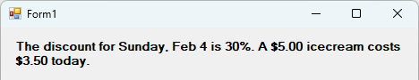
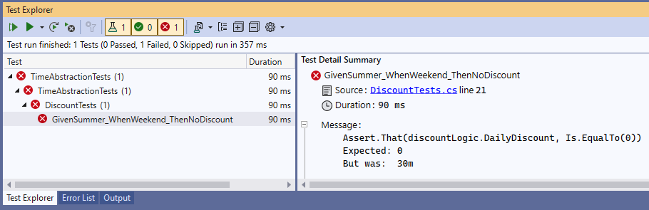
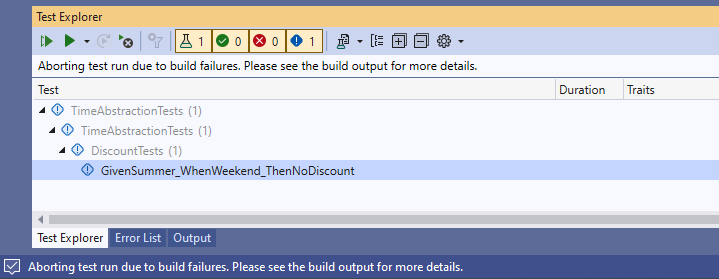

---
categories:
  - Learn
date: 2024-02-05T05:07:51Z
description: ""
draft: false
postimage: /banners/generic-learning-banner.webp
slug: using-timeprovider-and-faketimeprovider-in-winforms
summary: Testing .NET code involving time has always been a pain, but the TimeProvider class (backported to the .NET Framework) gives us awesome new tools.
tags:
  - csharp-12
  - time-provider
  - datetime-handling
  - fake-time-provider
title: Using TimeProvider and FakeTimeProvider in WinForms
---
Each new version of .NET brings great new tools. We got generics and LINQ in .NET 2 and 3, the [async/await model](https://grantwinney.com/using-async-await-and-task-to-keep-the-winforms-ui-more-responsive/) in .NET 4.5, and [string interpolation](https://grantwinney.com/using-string-interpolation-to-craft-readable-strings) in .NET 4.6. Okay, that last one's not in the same league as the other ones, but I use string interpolation _all_ the time.

Unfortunately for those of us working on legacy WinForms apps, we don't often get to use the latest and greatest, like [generic math support](https://grantwinney.com/csharp-generic-math-support/) or [list patterns](https://grantwinney.com/whats-a-list-pattern-in-csharp) from .NET 7. One new feature from .NET 8 though – the `TimeProvider` class – _is_ available to .NET Framework users. Let's see how.

## Backporting TimeProvider

Without getting into all the basics here (I've already written about [TimeProvider, testing TimeProvider](https://grantwinney.com/how-to-use-timeprovider-and-faketimeprovider/), and [testing TimeProvider timers](https://grantwinney.com/how-to-use-timeprovider-and-faketimeprovider-to-test-timers/) before), one of the nice things the .NET team did for us was to backport `TimeProvider`.

It's available for use in earlier .NET versions, including .NET Framework 4.62 and above, thanks to the [Microsoft.Bcl.TimeProvider](https://www.nuget.org/packages/Microsoft.Bcl.TimeProvider/#readme-body-tab) NuGet package:

> Microsoft.Bcl.TimeProvider provides time abstraction support for apps targeting .NET 7 and earlier, as well as those intended for the .NET Framework. For apps targeting .NET 8 and newer versions, referencing this package is unnecessary, as the types it contains are already included in the .NET 8 and higher platform versions.

## Using TimeProvider in WinForms

I'll try to keep this fairly simple, but we should setup a few things first before we get to the good stuff.

> The code in this post is available on [GitHub](https://github.com/grantwinney/Surviving-WinForms/tree/master/Time/TimeAbstraction), for you to use, expand upon, or just follow along while you read... and hopefully discover something new!

### Reference the TimeProvider Package

The first thing we need to add is a reference to [Microsoft.Bcl.TimeProvider](https://www.nuget.org/packages/Microsoft.Bcl.TimeProvider/#readme-body-tab) – won't get very far without that. 😄

### Configure Dependency Injection

And while we could just reference `TimeProvider.System` directly to access the new class, that makes it tough to do any meaningful testing later on. So let's configure the app for Dependency Injection, by referencing the [Microsoft.Extensions.DependencyInjection](https://www.nuget.org/packages/Microsoft.Extensions.DependencyInjection/) package and then creating a separate class to register any dependencies.

Right now, all we need is `TimeProvider.System`, so that whenever a request is made for the abstract `TimeProvider` class, the [singleton](https://grantwinney.com/difference-between-singleton-scoped-transient/) instance is returned instead:

```csharp
public class Services
{
    public static IServiceProvider ServiceProvider { get; set; }

    public static void RegisterServices()
    {
        var services = new ServiceCollection();

        services.AddSingleton(TimeProvider.System);

        ServiceProvider = services.BuildServiceProvider();
    }

    public static T Get<T>() where T : class
    {
        return (T)ServiceProvider.GetService(typeof(T));
    }
}
```

We can call the above code from the `Program.cs` file, right before showing the main form:

```csharp
static void Main()
{
    Application.EnableVisualStyles();
    Application.SetCompatibleTextRenderingDefault(false);
    Services.RegisterServices();  // register the dependencies
    Application.Run(new Form1());
}
```

### Using TimeProvider (directly from the Form)

After requesting an instance of `TimeProvider` once in the constructor, getting the local time from anywhere is a simple one-liner. While we're at it, let's create a timer too, to update the displayed time every second.

```csharp
readonly TimeProvider tp;

public Form1()
{
    InitializeComponent();

    tp = Services.Get<TimeProvider>();

    var timer = tp.CreateTimer(
        callback: (state) => Invoke(new Action(() =>
            tslCurrentTimeUpdate.Text = tp.GetLocalNow().ToString("T"))),
        state: null,
        dueTime: TimeSpan.Zero,
        period: TimeSpan.FromSeconds(1));
}

private void Form1_Shown(object sender, EventArgs e)
{
    tslCurrentTimeOnce.Text = tp.GetLocalNow().ToString("T");
}
```

Here's the `StatusStrip` area of the app while running the app. The time on the left never changes, while the time on the right is refreshed every second.


### Using TimeProvider (from a separate class)

Ideally, we should try to keep business logic out of code-behind files as much as possible (using patterns like [MVP](https://grantwinney.com/its-possible-to-test-a-winforms-app-using-mvp/)), so let's create a `DiscountLogic` class to play around with `TimeProvider` some more.

It has one property (for returning a discount percentage based on the current date) and one method (for returning a discounted price, based on the discount percentage). By accepting a `TimeProvider` in the constructor, and implementing an interface, we set things up nicely later on for testing.

```csharp
public class DiscountLogic : IDiscountLogic
{
    readonly TimeProvider _timeProvider;

    public DiscountLogic(TimeProvider timeProvider)
    {
        _timeProvider = timeProvider;
    }

    public decimal DailyDiscount
    {
        get
        {
            var now = _timeProvider.GetLocalNow();
            var discountPercent = 0;

            if (now.DayOfWeek != DayOfWeek.Saturday && now.DayOfWeek != DayOfWeek.S
                discountPercent += 10;

            discountPercent +=
                now.Month >= 11 || now.Month <= 2 ? 30 :      // Nov, Dec, Jan, Feb
                now.Month >= 3 && now.Month <= 5 ? 20 :       // Mar, Apr, May
                now.Month >= 9 && now.Month <= 10 ? 10 : 0;   // Sep, Oct

            return discountPercent;
        }
    }

    public decimal GetDiscountPrice(decimal originalPrice)
    {
        return originalPrice * ((100 - DailyDiscount) / 100);
    }
}

public interface IDiscountLogic
{
    decimal DailyDiscount { get; }
    decimal GetDiscountPrice(decimal originalPrice);
}
```

One more line in the `Services.cs` class registers the new class:

```csharp
services.AddTransient<IDiscountLogic, DiscountLogic>();
```

And then back in the Form, we can get an instance of `DiscountLogic` and display a message about today's discount:

```csharp
private void Form1_Shown(object sender, EventArgs e)
{
    var dl = Services.Get<IDiscountLogic>();
    lblDiscount.Text =
        $"The discount for {tp.GetLocalNow().ToString("dddd, MMM d")} is {dl.DailyDiscount}%. " +
        $"A $5.00 icecream costs ${dl.GetDiscountPrice(5):N2} today.";
}
```



## Testing TimeProvider Using FakeTimeProvider

There's a `FakeTimeProvider` class that helps us test `TimeProvider`, provided by the [Microsoft.Extensions.TimeProvider.Testing](https://www.nuget.org/packages/Microsoft.Extensions.TimeProvider.Testing#readme-body-tab) package. We'll add that to an NUnit test project, which happens to target .NET 6. I'd prefer to be able to target the .NET Framework but I'm not sure it's possible – more on that later.

### Fast-forwarding through time

Here's where the power of all this really shows. Testing code that uses time has always been difficult.. and limited.

We might write a test that simply calls the `DailyDiscount` property to see what the percentage is for today. Of course, based on the logic, if it's not a summer weekend when the following test runs, it'll fail. We need a way to fake out what time it is.

```csharp
[Test]
public void GivenSummer_WhenWeekend_ThenNoDiscount()
{
    Assert.That(discountLogic.DailyDiscount, Is.EqualTo(0));
}
```



The `FakeTimeProvider` class lets us jump to a future date, like the tests below that jump forward _(in the US)_ to a summer weekend and then a winter weekday, to make sure the appropriate discount (if any) is applied for different times of the year.

```csharp
[TestFixture]
public class DiscountTests
{
    private FakeTimeProvider fakeTimeProvider;
    private DiscountLogic discountLogic;

    [SetUp]
    public void Setup()
    {
        fakeTimeProvider = new FakeTimeProvider();
        fakeTimeProvider.SetLocalTimeZone(TimeZoneInfo.Utc);

        discountLogic = new DiscountLogic(fakeTimeProvider);
    }

    [Test]
    public void GivenSummer_WhenWeekend_ThenNoDiscount()
    {
        fakeTimeProvider.SetUtcNow(DateTimeOffset.Parse("7/27/2024"));

        Assert.That(discountLogic.DailyDiscount, Is.EqualTo(0));
        Assert.That(discountLogic.GetDiscountPrice(5), Is.EqualTo(5m));
    }

    [Test]
    public void GivenWinter_WhenWeekday_ThenLargeDiscount()
    {
        fakeTimeProvider.SetUtcNow(DateTimeOffset.Parse("2/2/2024"));

        Assert.That(discountLogic.DailyDiscount, Is.EqualTo(40));
        Assert.That(discountLogic.GetDiscountPrice(8), Is.EqualTo(4.8m));
    }
```

It's worth noting in the above code that I set the local time zone to UTC (something else `FakeTimeProvider` lets us do), to avoid any weirdness with the test suite running in different timezones on different systems and potentially failing.

### It doesn't work with .NET Framework... maybe

The `TimeProvider` works with .NET Framework 4.6.2, so it makes sense that `FakeTimeProvider` would too – and it claims it does on the NuGet package page. But when I created a test project using that version, it wouldn't run my tests.



There was a warning in the Error List panel that suggested setting a flag, which seems like overkill (assuming it works at all).

> Microsoft.Extensions.TimeProvider.Testing 8.1.0 doesn't support net462 and has not been tested with it. Consider upgrading your TargetFramework to net6.0 or later. You may also set <SuppressTfmSupportBuildWarnings>true</SuppressTfmSupportBuildWarnings> in the project file to ignore this warning and attempt to run in this unsupported configuration at your own risk.

So as far as I can tell, we can't use `FakeTimeProvider` in a .NET Framework test suite, although a test suite running a newer version of .NET shouldn't have a problem testing a legacy WinForms app. Targeting .NET 6 in the test suite works fine.

If someone finds a workaround, or that I missed something, I'd love to know what it is!
