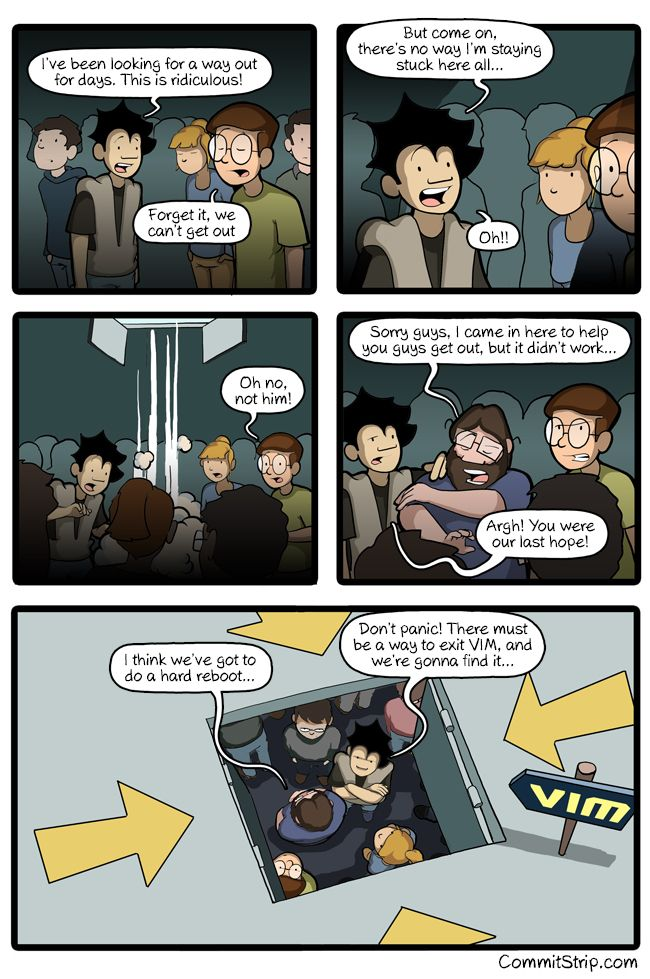
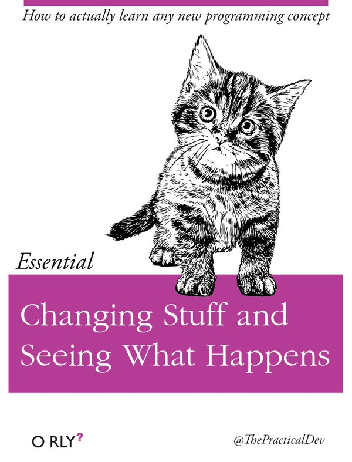
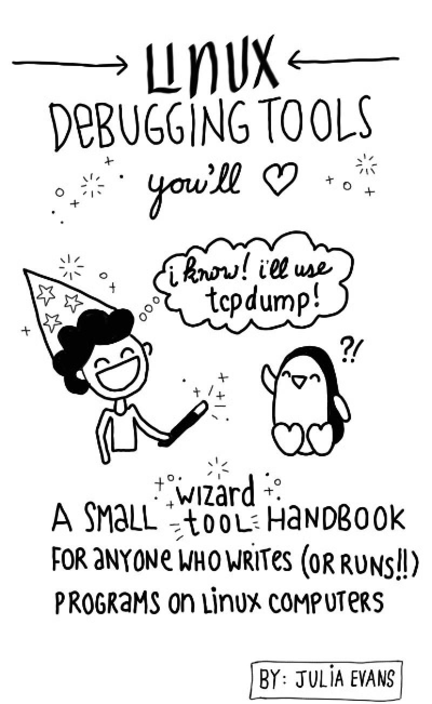
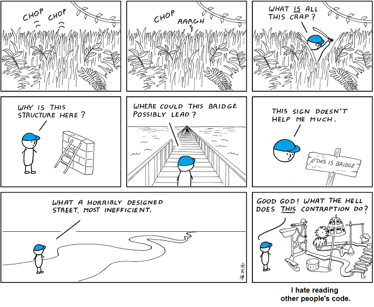

---
categories:
- Reflections
date: "2019-02-10T18:58:54Z"
description: ""
draft: false
cover:
  image: photo-1514329926535-7f6dbfbfb114.jpg
slug: web-comics-for-devs
summary: Need a comic break? Here's some web comics I've stumbled upon over the years
  - the funny, sarcastic, informative, and just plain weird.
tags:
- Reflections
title: Fun web comics for developers
---
Who couldn't use a little light-heartedness in their day? Or dry humor if that's what you're looking for? Or something educational in an easy to digest format?

Enjoy! _(I know I will...)_

---

## CommitStrip

[CommitStrip](https://www.commitstrip.com/) is a fun comic about life as a developer, especially web development. The stories are the shared results of a group of devs from Europe and Asia, and if you've been a dev for any amount of time they'll hit close to home. 😃

[Trapped - CommitStrip](http://www.commitstrip.com/en/2017/05/29/trapped/)

  

---

## XKCD

[XKCD](https://xkcd.com/) by Randall Munroe is one of those comics it's tough to avoid, assuming you wanted to try. Like Seinfeld, they're so numerous and relatable they're quoted everywhere. He also writes [What If?](https://what-if.xkcd.com/)... serious scientific answers to absurd questions.

[Estimation](https://xkcd.com/612/) / [Compiling](https://xkcd.com/303/) / [Nerd Sniping](https://xkcd.com/356/) (XKCD)

---

## O RLY? Book Covers

Once in awhile an O RLY? _(parody of O'Reilly)_ book cover pops up somewhere online. Who writes them? Where are they posted? I have no clue. They hit close to home too, but usually in a _"too true.. too damn true"_ kinda way. 😏

Here's [a collection of book covers](https://boyter.org/2016/04/collection-orly-book-covers/), and you can even [generate your own](https://dev.to/rly).

  

---

## PHD Comics

[PHD Comics](http://phdcomics.com/comics/most_popular.php) by [Jorge Cham](http://jorgecham.com/) has been around a _long_ time, for Interweb standards anyway. It's a collection of hundreds (thousands?) of comics about university life... and probably a fair amount of other stuff too. Oh, and [he has a book](https://www.amazon.com/gp/product/0735211515) I'm thinking about getting.

[Programming for Non-Programmers - PHD Comics](http://phdcomics.com/comics.php?f=1690)

[Gravitational Waves Explained - PHD Comics](http://phdcomics.com/comics/archive.php?comicid=1853)

  

---

## The Oatmeal

[The Oatmeal](https://theoatmeal.com/) by Matthew Inman is hit or miss for me personally, but the degradation of social skills of a remote worker is pretty darned funny. 🧦

[Why working at home is both awesome and horrible - The Oatmeal](http://theoatmeal.com/comics/working_home)

---

## MonkeyUser

[MonkeyUser](https://www.monkeyuser.com/) by Cornel and Constantin is another funny comic about life as a dev. The comic below is completely believable with some of the test suites in old monolithic apps. 💀

[Tests Optimization - MonkeyUser](https://www.monkeyuser.com/2018/test-optimization/)

---

## Zines

[Julia Evans' zines](https://jvns.ca/zines/) are a really cool idea. What better way to learn about an array of topics than in graphic form? Go check them out and learn something new!

[Linux Debugging Tools You'll Love - Julia Evans](https://jvns.ca/debugging-zine.pdf)

---

## Abstruse Goose

Abstruse Goose ***was*** a comic about random topics... although quite a few seemed to be about development. There's a few archives laying around, but the most organized and accessible I've seen is the [Abstruse Goose Archive](https://github.com/s-macke/Abstruse-Goose-Archive) on GitHub.

---

## Invisible Bread

[Invisible Bread](http://invisiblebread.com) by Justin Boyd has a lot of just plain fun stuff. He's a developer too, but the comics are all over the place. Oh, and go read his about page for a secret. 🤫

[My Wallet - Invisible Bread](http://invisiblebread.com/2013/07/my-wallet/)
