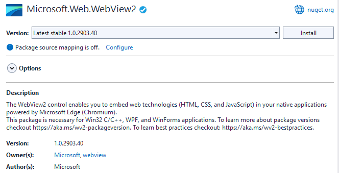
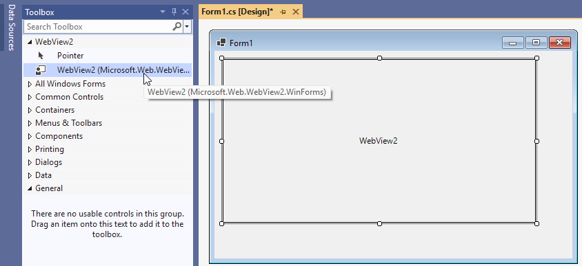
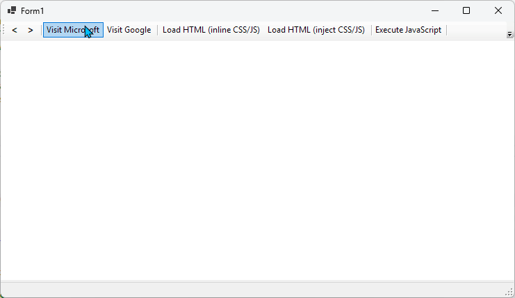
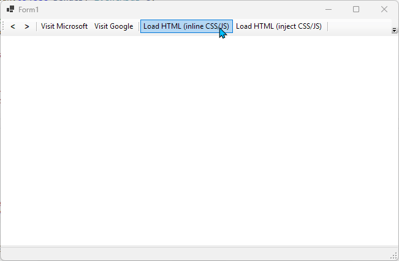
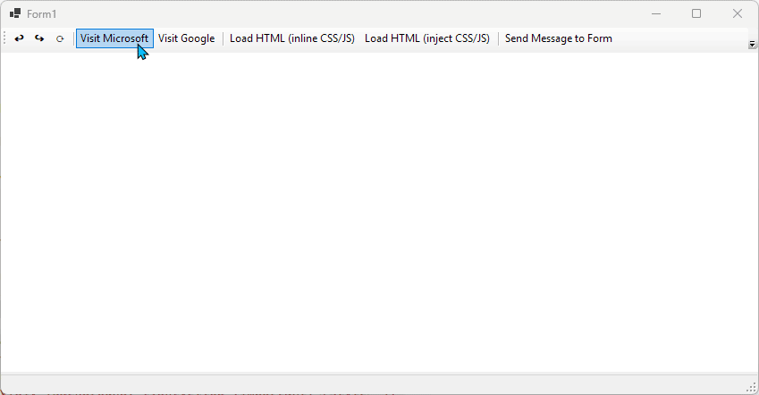
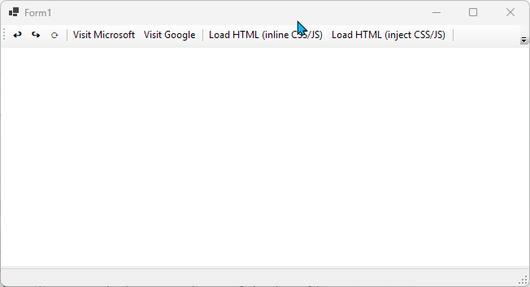
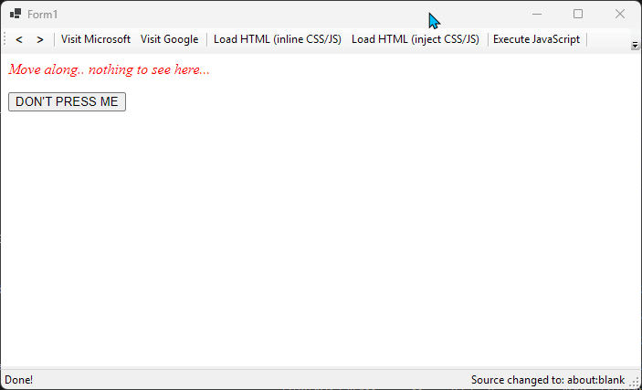
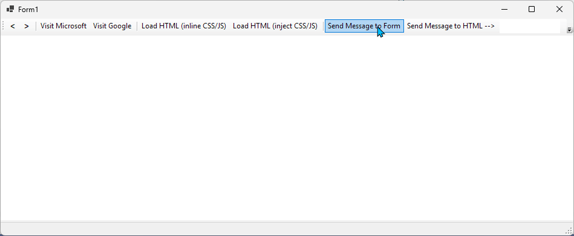

---
categories:
  - surviving-winforms
  - dotnet-5
  - WinForms
date: 2025-01-17T22:41:08Z
description: ""
draft: false
cover:
  image: pexels-55570-196645.jpg
slug: webview2-a-browser-for-winforms
summary: In .NET 5, WinForms got a WebView2 control for displaying web pages.. even ones we create on-the-fly while the app's running. Let's kick the tires.
tags:
  - winforms
  - winforms
  - dotnet-5
title: WebView2, a browser for WinForms in .NET 5
---
When one thinks of WinForms, one does _not_ generally think of the web at the same time, unless it's how they wish they could move their app from one to the other. However, there's a number of controls for displaying web pages in a WinForms app, and with .NET 5 we got a new one called [WebView2](https://learn.microsoft.com/en-us/dotnet/desktop/winforms/whats-new/net50?view=netdesktop-9.0#new-controls).

> The code in this post is available on [GitHub](https://github.com/grantwinney/Surviving-WinForms/tree/master/.NET%2005/WebView2Sample), for you to use, extend, or just follow along while you read... and hopefully discover something new along the way!

I spent a couple evenings playing around and barely scratched the surface. Here's what I learned.

## What is WebView2?

The WebView2 control is, in [their own words](https://learn.microsoft.com/en-us/dotnet/api/microsoft.web.webview2.winforms.webview2?view=webview2-dotnet-1.0.2903.40#remarks), a wrapper around the [WebView2 COM API](https://aka.ms/webview2), which in a more general sense "allows you to embed web technologies (HTML, CSS, and JavaScript) in your native apps [using] Microsoft Edge as the rendering engine to display the web content". Since [Edge is based on Chromium](https://support.microsoft.com/en-us/microsoft-edge/download-the-new-microsoft-edge-based-on-chromium-0f4a3dd7-55df-60f5-739f-00010dba52cf) ([as are most major browsers](https://en.wikipedia.org/wiki/Chromium_(web_browser)#Browsers_based_on_Chromium)), it's effectively a wrapper around Chromium.

Basically, we get a Chromium-based browser in our app, similar to other third-party tools like [CefSharp](https://grantwinney.com/hosting-a-simple-webpage-in-winforms-with-cefsharp/), [DotNetBrowser](https://teamdev.com/dotnetbrowser/), etc.

## Initializing WebView2

The WebView2 control is [available on NuGet](https://www.nuget.org/packages/Microsoft.Web.WebView2). Just fire up a WinForms app, install the package, and (in VS2022 at least) it appears in the "Toolbox" fairly quickly. From there, we can drag and drop it onto a Form and we're off the races...





Adding WebView2 to a WinForms project

After that, the control should be initialized: _(maybe, probably.. read on)_

```csharp
public Form1()
{
    InitializeComponent();

    InitializeWebView2();
}

async void InitializeWebView2()
{
    await webView2.EnsureCoreWebView2Async();
}
```

Nearly everything on the WebView2 control is accessed through a `CoreWebView2` property. Per the docs, that property is `null` initially because creating it is an expensive operation, but in a little test app like this we want it right away. By calling `EnsureCoreWebView2Async()`, the `CoreWebView2` property is guaranteed to be initialized, so that subsequent calls won't throw a null reference exception.

## Navigate to a Website

Navigating to a site is super easy - just call the `Navigate()` method. The only catch is it has to start with "https" or "http":

```csharp
// Load Microsoft
webView2.CoreWebView2.Navigate("https://microsoft.com");
```

Done! lol



## Load Custom HTML

Alternatively, we can throw together some HTML on-the-fly (up to 2 MB) and pass that to the control instead, like this:

```csharp
// Load HTML with inline JS/CSS
webView2.NavigateToString(
    """
    <html>
        <head>
            <style>p{color:green; font-weight:bold}</style>
        </head>
        <body>
            <p>Not much to see here.....</p>
            <button onClick="alert('Unbelievable...')">DON'T PRESS ME</button>
        </body>
    </html>
    """);
```

Or instead of including the CSS and JavaScript in the HTML, we can inject it separately with a call to `AddScriptToExecuteOnDocumentCreatedAsync()`:

```csharp
// Define some JS and CSS to add to the page after it loads
var scriptID = await webView2.CoreWebView2.AddScriptToExecuteOnDocumentCreatedAsync(
    """
    document.addEventListener('readystatechange', evt => {
        if (document.readyState === 'complete') {
            document.getElementById('btn')
                .addEventListener('click', function() {alert('Just.. why?')});
            document.head.insertAdjacentHTML('beforeend',
                '<style>p{color:red; font-style:italic}</style>');
        }
    });
    """);

// Load HTML sans JS/CSS
webView2.NavigateToString(
    """
    <p>Move along.. nothing to see here...</p>
    <button id='btn'>DON'T PRESS ME</button>
    """);

webView2.CoreWebView2.RemoveScriptToExecuteOnDocumentCreated(scriptID);
```

The "AddScript..." method runs before the HTML has actually been parsed, so I was getting javascript errors aplenty when I tried to access `document.head`, `document.getElementById()`, etc. Checking that the [readyState](https://developer.mozilla.org/en-US/docs/Web/API/Document/readyState#interactive) for the document is "complete" seems to work. Probably a better way, who knows.



The last line of code is worth mentioning too, where I call `RemoveScriptToExecuteOnDocumentCreated()`. Once a script is added, it'll stick around and run again anytime a new document is loaded. To see what I mean, we can add something like this to the `InitializeWebView2()` method:

```csharp
// Scripts like this one run on every page load
// until you call RemoveScriptToExecuteOnDocumentCreated()
await webView2.CoreWebView2.AddScriptToExecuteOnDocumentCreatedAsync(
    """
    document.addEventListener('readystatechange', evt => {
        if (document.readyState === 'complete') {
            document.head.insertAdjacentHTML('beforeend',
                '<style>body,div {background: lightyellow !important}</style>');
        }
    });
    """);
```

Now the body and div on every page loaded has a light yellow background:



I remove the script so that it won't load for the next page, but I have no clue what the best practices are around calling that. It seems to leave the scripts loaded as-is on the page just fine, but navigating back and forth breaks things, like the red text below that reverts back to black as I navigate around.



Like I said, barely scratching the surface here. 😄

## Execute a Script

It's super easy to execute a one-off script against the loaded document too:

```csharp
// Execute a script in the top-level document
webView2.ExecuteScriptAsync("alert('Hi there, hello.')");
```

No matter what page is loaded, it works the same:



## Send Messages Back and Forth

It's also possible to communicate between the loaded website and the `Form`. We can subscribe to both events in the `InitializeWebView2()` method, one a WinForms event, and the other a JavaScript event listener:

```csharp
async void InitializeWebView2()
{
    await webView2.EnsureCoreWebView2Async();

    // Handle messages from WinForms to the WebView2
    await webView2.CoreWebView2.AddScriptToExecuteOnDocumentCreatedAsync(
        "window.chrome.webview.addEventListener('message', evt => alert(evt.data));");

    // Handle messages from the WebView2 to WinForms
    webView2.WebMessageReceived += (s, e) =>
        MessageBox.Show(e.TryGetWebMessageAsString());
}
```

Now we can create some C# code that'll send a message to our website...

```csharp
// See the "InitializeWebView2()" method, where we tell the WebView2 control
// what to do with messages we send to it... display them in an alert box
webView2.CoreWebView2.PostWebMessageAsString(txtMsgToSendToHtml.Text);
```

... and some JS that'll send messages back to our Form:

```csharp
// Add a button that, upon clicking, sends a message to WinForms
webView2.NavigateToString(
    """
    <html>
        <head>
            <style>button {color:blue; font-weight:bold}</style>
        </head>
        <body>
            <p>Press the button to send a message to the Form, which will display it in a MessageBox.</p>
            <input type="text" id="user_msg" value="Type your message here...">
            <button onclick="window.chrome.webview.postMessage(document.getElementById('user_msg').value);">
                SEND MESSAGE
            </button>
        </body>
    </html>
    """
);
```

Now we can send messages back and forth:



## Subscribe to Events

There's all kinds of events we can subscribe to, like when navigation has started or completed, or the source in the control has changed (which is how I'm changing the text at the bottom of the Form in all the above images).

If you want the usual browser buttons, you can subscribe to those too:

```csharp
btnGoBack.Click += (s, e) => webView2.CoreWebView2.GoBack();
btnGoFwd.Click += (s, e) => webView2.CoreWebView2.GoForward();
btnReload.Click += (s, e) => webView2.CoreWebView2.Reload();
```

I think that's enough for now though!

## Learn More

Microsoft has quite a bit of documentation to sift through, some of which I already linked to above. There's tons of info on [WebView2](https://learn.microsoft.com/en-us/microsoft-edge/webview2/landing/) in general, [WebView2 in WinForms](https://learn.microsoft.com/en-us/microsoft-edge/webview2/get-started/winforms) specifically, and a [discussion forum on GitHub](https://github.com/MicrosoftEdge/WebView2Feedback/discussions?discussions_q=is%3Aopen+winform) if you just need to vent.

If you found this content useful and would like to learn more, check out my [Surviving WinForms](https://github.com/grantwinney/surviving-winforms) repo, where you'll find links to plenty more blog posts and practical examples!