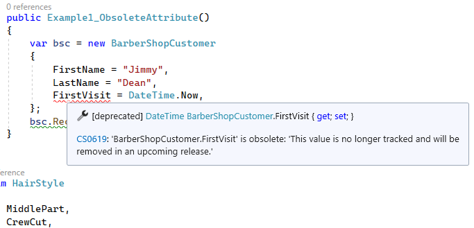
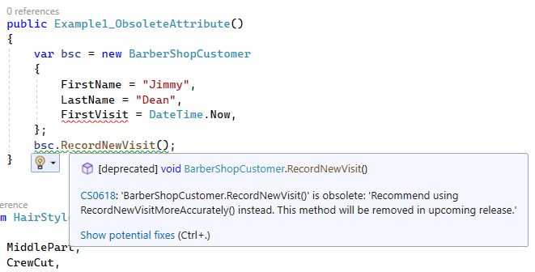

---
categories:
- C# 11
- C#
- Attributes
- Metadata
- Coding
date: "2023-08-23T15:52:21Z"
description: ""
draft: false
cover:
  image: photo-1571907483091-fbe746bee132.jpg
slug: what-are-generic-attributes
summary: Generic attributes increase the flexibility of a very early .NET feature.
  Let's try using them and see how it keeps our code DRY.
tags:
- C# 11
- C#
- Attributes
- Metadata
- Coding
title: What are generic attributes in C# 11?
---
For the uninitiated, [attributes](https://learn.microsoft.com/en-us/dotnet/csharp/advanced-topics/reflection-and-attributes/) provide a way to attach extra metadata to a variety of C# elements. They're built into the .NET Framework (like [Description](https://learn.microsoft.com/en-us/dotnet/api/system.componentmodel.descriptionattribute)), third-party libraries (like NUnit's [TestFixture](https://docs.nunit.org/articles/nunit/writing-tests/attributes/testfixture.html)), and you can even [define your own](https://learn.microsoft.com/en-us/dotnet/csharp/advanced-topics/reflection-and-attributes/attribute-tutorial). While they don't directly affect your code, per se, they generally affect your application in some way, like how it compiles or what the user sees at runtime.

## A review of traditional attributes

The [Obsolete](https://learn.microsoft.com/en-us/dotnet/api/system.obsoleteattribute) attribute, for example, is a built-in one used by the compiler to warn other developers that some element is (or soon will be) deprecated.

```csharp
class BarberShopCustomer
{
    public string Name { get; set; } = string.Empty;
    [Obsolete("This value is no longer tracked and will be removed in an upcoming release.", true)]
    public DateTime FirstVisit { get; set; }
    public DateTime LastVisit { get; private set; }

    [Obsolete($"Recommend using {nameof(RecordNewVisitMoreAccurately)}() instead. This method will be removed in upcoming release.")]
    public void RecordNewVisit()
    {
        LastVisit = DateTime.Today;
    }

    public void RecordNewVisitMoreAccurately()
    {
        LastVisit = DateTime.Now;
    }
}
```





If you want to see other examples of attribute usage, here's an article I wrote a few years ago, but today I want to look at a new feature we got in C# 11 called generic attributes.

The new [generic attribute](https://learn.microsoft.com/en-us/dotnet/csharp/whats-new/csharp-11#generic-attributes) brings (as the name suggests) the power of generics to attributes; in other words, an Attribute that can apply to more than one type. When I read this, it wasn't immediately obvious to me how this would be useful. I mean, I get how assigning metadata to an element to indicate that it's obsolete, or is an initializer for tests, or should be serialized is beneficial... but what do we get from passing the _type_ to the Attribute?

Well, other times we opt in for using generics, like [`List<T>`](https://learn.microsoft.com/en-us/dotnet/api/system.collections.generic.list-1) or with [Generic Math](https://grantwinney.com/whats-generic-math-support-in-csharp/), it's because we have a series of methods and whatever else that can be reused, and only the type of object being acted upon changes. So what's a case where we can use attributes in the same way? Validation comes to mind as one possibility...

> The code in this post is available on [GitHub](https://github.com/grantwinney/CSharpDotNetExamples/tree/master/C%23%2011/GenericAttributes), for you to use, expand upon, or just follow along while you read... and hopefully discover something new!

## A traditional attribute with room to improve

Let's see how we'd create our own validation attributes using what came before. We'll start with a class like this one, with some integer and double values in it that need to be validated.

```csharp
class Moon
{
    public string Name { get; set; }

    public string DiscoveredBy { get; set; }

    [IntegerValidation(MaxValue = 2023)]
    public int DiscoveryYear { get; set; }

    [IntegerValidation(MinValue = 0)]
    public int AverageOrbitDistance { get; set; }

    [DoubleValidation(MinValue = 0)]
    public double OrbitEccentricity { get; set; }
}
```

Then we create a couple "validation" classes to act on those different types. There's really nothing different between the two, other than the types themselves. Looking unnecessarily repetitive...

```csharp
class IntegerValidation : ValidationAttribute
{
    public int MinValue { get; set; } = int.MinValue;
    public int MaxValue { get; set; } = int.MaxValue;

    protected override ValidationResult? IsValid(object? value, ValidationContext validationContext)
    {
        var num = Convert.ToInt32(value);

        return num >= MinValue && num <= MaxValue ? ValidationResult.Success : new ValidationResult(null);
    }
}
class DoubleValidation : ValidationAttribute
{
    public double MinValue { get; set; } = double.MinValue;
    public double MaxValue { get; set; } = double.MaxValue;

    protected override ValidationResult? IsValid(object? value, ValidationContext validationContext)
    {
        var num = Convert.ToDouble(value);
          
        return num >= MinValue && num <= MaxValue ? ValidationResult.Success : new ValidationResult(null);
    }
}
```

Finally, this is what it might look like to run the validators against a new instance of the class. I'm using [TryValidateObject](https://learn.microsoft.com/en-us/dotnet/api/system.componentmodel.dataannotations.validator.tryvalidateobject) because this is just a console app.

```csharp
var validationResults = new List<ValidationResult>();

var moon = new Moon
{
    Name = "Europa",
    DiscoveredBy = "Galileo Galilei",
    DiscoveryYear = 2500,
    AverageOrbitDistance = 417002,
    OrbitEccentricity = -0.222,  // it's actually 0.0094 but validators gotta validate
};

Validator.TryValidateObject(moon, new ValidationContext(moon), validationResults, true);

Console.WriteLine($"Results of {nameof(ValidationAttributeExample)}:\r\n");

foreach (var vr in validationResults)
    Console.WriteLine(vr.ErrorMessage);
```

The output correctly reports that DiscoveryYear and OrbitEccentricity are invalid, because the former is past the current year (2023), and the latter is a negative value.


## A generic attribute that keeps things DRYer

There's definitely an opportunity here to DRY up some code, using the new generic attribute feature. We'll start with the same class as the previous example, with one significant change - the validation attribute on the 3 numeric fields is the same now.

```csharp
class Moon
{
    public string Name { get; set; }

    public string DiscoveredBy { get; set; }

    [NumberValidation<int>(MaxValue = 2023)]
    public int DiscoveryYear { get; set; }

    [NumberValidation<int>(MinValue = 0)]
    public int AverageOrbitDistance { get; set; }

    [NumberValidation<double>(MinValue = 0.0)]
    public double OrbitEccentricity { get; set; }
}
```

The "integer" and "double" validators can be combined into a single validator that accepts either type. There's some caveats here that I'll point out, and you can leave a comment below if you think I'm doing something too crazy here.. lol.

- This validator only makes sense with a numerical input, so I restricted it to types that implements the [`INumber<T>`](https://learn.microsoft.com/en-us/dotnet/api/system.numerics.inumber-1) interface, also introduced in C#11.
- I wanted to set a default value for `MinValue` and `MaxValue`, but I can't access those directly since I'm using the generic `T` type, so reflection to the rescue.

```csharp
class NumberValidation<T> : ValidationAttribute where T : INumber<T>
{
    public T MinValue { get; set; } = (T)typeof(T).GetField("MinValue").GetValue(null);
    public T MaxValue { get; set; } = (T)typeof(T).GetField("MaxValue").GetValue(null);

    protected override ValidationResult? IsValid(object? value, ValidationContext validationContext)
    {
        var num = (T?)value;

        return num != null && num >= MinValue && num <= MaxValue ? ValidationResult.Success : new ValidationResult(null);
    }
}
```

The output is the same as before, detecting that 2 of the 3 properties have values that are outside the acceptable range.


If you find your own interesting use for generic attributes, feel free to share them in the comments below! And if you found this content useful, and want to learn more about a variety of [C#](https://grantwinney.com/tag/csharp/) features, check out my [CSharpDotNetExamples repo](https://github.com/grantwinney/CSharpDotNetExamples), where you'll find links to plenty more blog posts and practical examples.
