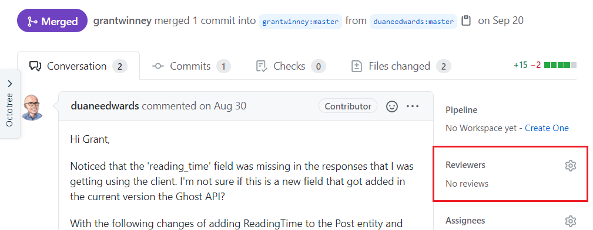
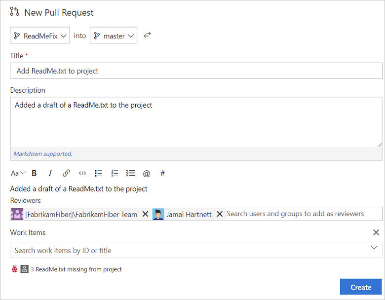
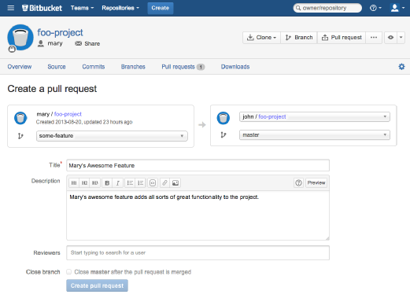

---
categories:
  - Questions
date: 2020-11-28T04:15:10Z
description: ""
draft: false
cover:
  image: photo-1531498860502-7c67cf02f657.jpg
slug: what-is-a-code-review
summary: Does the idea of submitting to a code review make you sweat bullets? Or do you brush it off as a necessary evil? It should be a (hopefully positive) conversation, wherein the team agrees to the code they're all going to have to help maintain, and maybe learns something new too.
tags:
title: What is a code review / pull request?
---
Has someone told you to submit your code for a review? Or to review someone else's code? You might be worrying about the criticism you'll receive, or that you won't have anything constructive to share. You might be concerned they'll poke holes in your code, or fear you're not good enough. Or maybe you feel it's all ridiculous - why should it matter anyway? If the code compiles, ship it! 🚢

The truth is that no one codes on an island _(thanks_ [_John Donne_](https://allpoetry.com/No-man-is-an-island)_),_ and eventually you'll be asked to participate in a code review - for school, for work, for an open source project. And that's a good thing, even if it doesn't feel like it yet. Most of the code you'll ever write will be meant for more than just one person, and it's likely that hundreds or even _thousands_ of people will eventually use it, support it, or (in the case of your fellow devs) help maintain and extend it.

It may not be an easy thing at first, opening yourself up to feedback on a regular basis, but it's a good way to catch bugs and prevent more problems down the road. It's also a good way to learn, if it's done well.

## What are the benefits?

A code review is, at its best, a chance to get constructive feedback about the code you just wrote, an opportunity to learn something new, and to gain a better picture about the system you're working on. Or if you're giving one, it's an opportunity to share what you know, and to teach someone else the same.

At the very least, it puts more sets of eyes (and a fresh perspective) on the thing you've been heads-down on for days or even weeks. That kind of focus is often required, but it's easy to lose sight of the forest for the trees too. That is, it's easy to miss how your piece fits into the larger system, when you're focused on the immediate requirements you're being asked to code.

Imagine, though, someone on an assembly line putting together the car you're going to drive everyday. How about an engineer adding 10 new floors to the skyscraper where you'll be working... or a mechanic repairing the engine in the jet you'll take on vacation. No matter how certified those people are, how well vetted, would you ever turn down an extra set of (experienced) eyes double-checking their work? No way!

Sure, most of us won't be working on mission critical systems that mean life and death - but that doesn't mean we couldn't benefit from a second opinion.

## What should you expect?

Every place is different, so your experience will be too. If you're in school, it might just mean zipping up your code and uploading it so a couple other students can provide some feedback. But most code reviews take place as the final step before merging new code (which usually lives on its own git branch) back into master (where it needs to play nicely with everyone else's code, the build environment, etc) - a process known as a [pull request](https://dzone.com/articles/learning-git-what-is-a-pull-request).

Some teams may have a loose requirement on their code review / pull request process, simply giving other developers a chance to approve it if they'd like. Other teams have a stricter requirement, which actually prevents merging (completing the pull request) before at least x number of devs review and approve it. Some are okay leaving code reviews open for days, while others prefer they be addressed within a few hours.

Whatever the differences, a code review should be a conversation. The kind of conversation it is, though, will depend on your experience as a developer - and in the codebase you're working in. If you're new to programming or the language being used, expect suggestions on how to improve your syntax. If you're new to the codebase, expect suggestions about how your code can "fit in" better, and warnings about pitfalls to avoid. You should also expect to explain your choices, because a code review is also an opportunity for the rest of your team to get familiar with the new code - and you may just teach them something too!

It'll also depend on _who's_ doing the review. If the person reviewing your code suggests a change to fit some set of team standards, and that person is a team lead or manager who helped _set_ those standards, well... you should still feel comfortable asking for clarification, but don't expect challenging the standards at that moment to bear much fruit!

Ideally, there should be a back and forth, while you explain why you made a particular decision, and the reviewer does too, until a consensus is made. The point is to make sure the best code possible is being merged back to master, and that once it is, everyone's comfortable maintaining it.

## How do you create one?

Like everything, it depends. The most popular platform is currently GitHub, but there are others too, like Azure DevOps and Atlassian Bitbucket (pictured below). No matter the system your team uses, you should always try to answer the various what's, why's, and how's. When someone steps in to review your code, they shouldn't have to guess why it exists or what it's purpose is.

GitHub, Azure DevOps, and Bitbucket

**What** requirements does this code fulfill? What bug does it fix? Most teams try to break down the work into small units - aka stories, cards, or issues. If the work you did completes one of those units, link to it, so reviewers have more context.

**How** does your code fulfill the requirements? If you fixed a bug, the "card" you were working from probably only stated the problem, so you could explain what you discovered, and how your code fixes it. Include screen captures of the code running, if it seems that'd help... a picture is worth a thousand words after all. Do before and after shots, using all the shapes and arrows in MS Paint if that's your thing. 😉

**Why** did you do things a certain way? If your code avoids some pitfall no one was aware of, it might help to spell it out. If a piece of code nags at you, but it works and you couldn't find a "better" way while you were writing it, ask for suggestions. If you refactored some method or removed some dead code, mention it. Get eyes on it; spur the conversations you want to have.

## How should you respond?

The very first thing you should do, especially if the feedback seems overly critical or negative, is take a step back and a deep breath. When too many people weigh in on anything, even constructive feedback can seem overwhelming - it feels like you're being piled on. You _are_ the focus, in as much as you wrote the code being reviewed, but a code review shouldn't be a negative thing.

Once feedback is given, address it. Don't feel pressured to blindly implement every suggestion made, nor to argue every point and defend every line of code you wrote. Think about what's being suggested, and the why behind it. Ask for clarification. Think intentionally about why you made the choices you did, and why the reviewer's suggestion might or might not work. Were your choices deliberate, or just the first thing that happened to work?

## What if you're the reviewer?

Reviewing someone's code is a different ballgame. Think about who you're reviewing - what's their experience and their level of knowledge about the codebase?

The easiest temptation is just to skim the code changes and, deciding it looks like there's probably not any bugs, hit the "approve" button. After all, if there's _really_ a problem, someone else will catch it right? Except someone else may be thinking the same thing about you!

Here's some things to consider:

- Why was the code written, and does it fulfill the original requirements? Check the original story / card / issue.
- Do you notice outdated or missing comments or documentation, especially if that documentation is public facing like with an API? It should be clear, useful, and up-to-date.
- Does the code compile and do the tests run? Is there an opportunity for more or better tests?
- Does the code run like it's supposed to? Does it break anything else, especially something in the vicinity of the code being changed (like the same screen if it's a UI change)?
- Do you see any potential bugs? Better to call them out and be wrong, than the customer finds it, goes through support, etc, etc, and it drops right back in your lap later on.
- Do you recognize any code smells? Did someone copy/paste a block of code instead of keeping things [DRY](https://code.tutsplus.com/tutorials/3-key-software-principles-you-must-understand--net-25161)? Did they write something in 10 lines, that you realize could've been a single line and still just as readable?
- Does it follow the team standards? Tabs vs spaces, 2 vs 4 spaces, pascal vs camel case, etc - ultimately they just don't matter. What _does_ matter is consistency! If the team generally goes in one direction, or formally agrees on something, and there's a difference, call it out.
- Be explicit about what needs addressing, why, and don't hesitate to include a suggested fix too. It makes your intention clearer, and the person you're reviewing is free to use it as-is or expand on it. Avoid things like, "This could be written better" or "That's not how we do it" without further explanation. If you can recognize a problem, you might as well help improve it too.
- Ask questions about things you suspect might be a problem, or just things you don't fully understand. If you're reviewing the code of someone with more experience, you might even learn something from them during the code review!

No matter which side of the fence you're on, don't hesitate to call out something good too - a useful refactoring or a sleek piece of code, some good tests or just a really helpful suggestion. Code reviews don't have to be negative - they should be an opportunity for a team to learn, teach, and grow, a little bit at a time!
