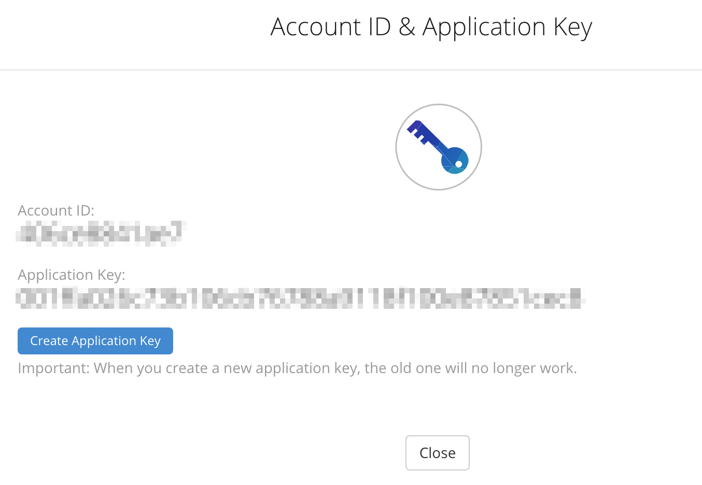
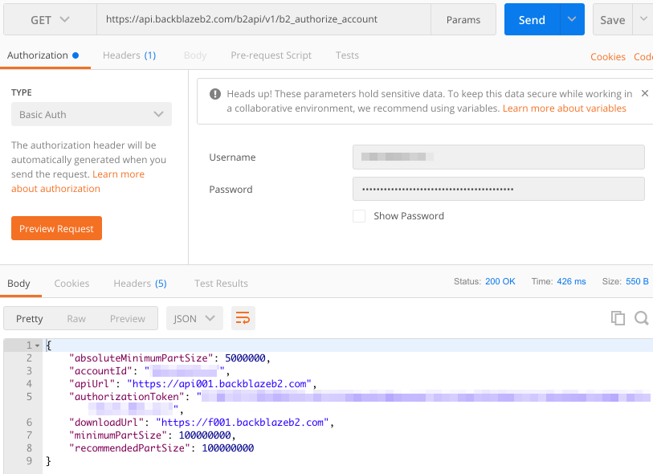
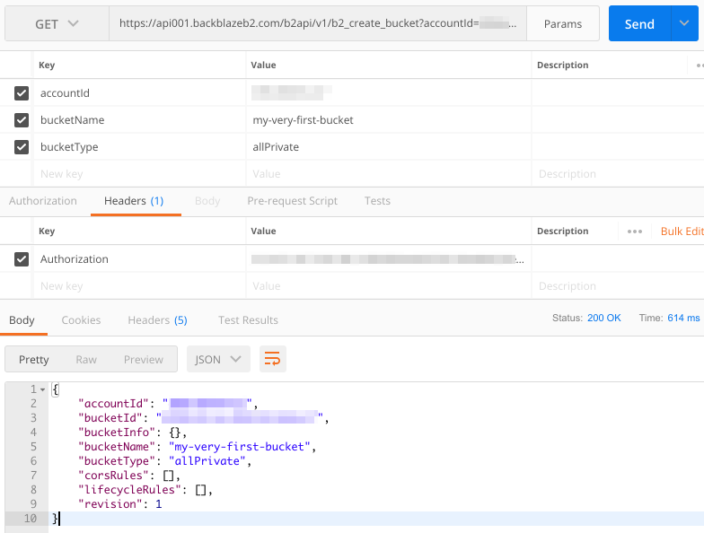
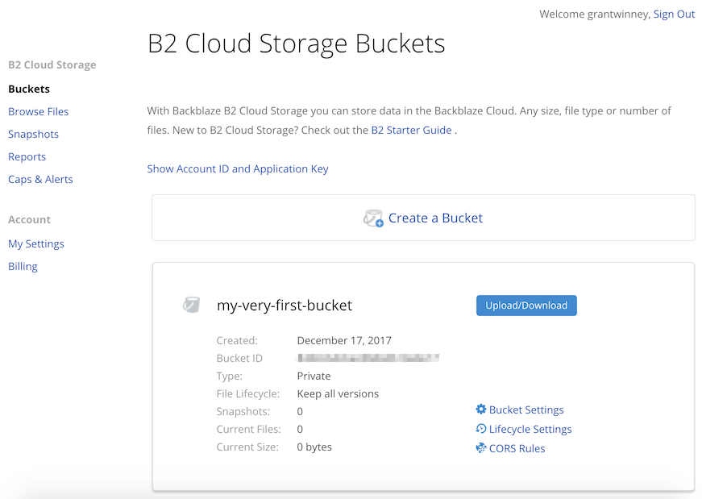
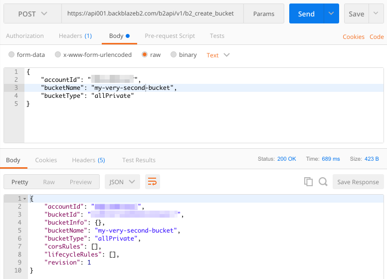
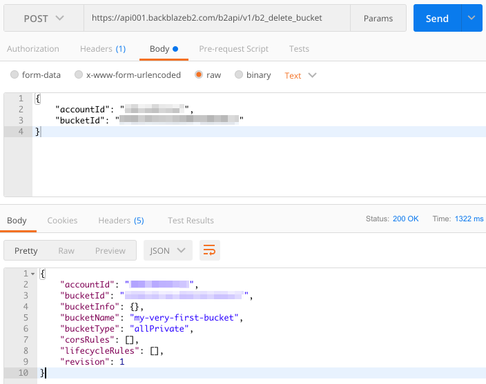

---
categories:
- API
date: "2017-12-17T19:37:29Z"
description: ""
draft: false
cover:
  image: photo-1584169417032-d34e8d805e8b.jpg
slug: what-is-backblaze-b2-api
summary: The Backblaze B2 Storage API, built on top of Backblaze's cloud storage,
  lets you access and manage your buckets. Let's check it out!
tags:
- API
title: Access Buckets and Files on Backblaze With the B2 Cloud Storage API
---
If you're not familiar with [Backblaze](https://secure.backblaze.com/r/00d15h), they're a handy and inexpensive service that backs up your computer. I've been using them for years, and I even had to restore files when my hard drive succumbed to the "click of death" a couple years ago, so totally worth it.

They have a cloud storage service too, in the same vein as AWS, Rackspace, etc, so [sign up](https://www.backblaze.com/b2/sign-up.html) and then we'll check out the [Backblaze B2 Storage API](https://www.backblaze.com/b2/docs/).

First though, two things to consider:

- If you're unfamiliar with APIs, [read this](https://grantwinney.com/what-is-an-api/) to familiarize yourself with the concept.
- Install [Postman](https://www.postman.com/), which allows you to access API endpoints without having to write an app, as well as save the calls you make and sync them online.

## Authenticating

As usual, you'll need to prove who you are before you can go making requests.

### Generate an Application Key

While logged in to the Backblaze site, click on the "My Account" link in the upper-right, then the "Show Account ID and Application Key" link. A dialog captioned "Account ID & Application Key" appears. Press the "Create Application Key" button and you'll have the two vital pieces of data you need for authenticating with Backblaze.



### Get an Authorization Token

You'll need to make an API call to get the authorization token, which then lets you make other more interesting API calls.

#### Using Curl

To [get the authorization token](https://www.backblaze.com/b2/docs/b2_authorize_account.html), you can do one of a couple of things. If you have `curl` available in your terminal, just run this, substituting `ACCOUNT_ID` and `APPLICATION_KEY` with the appropriate values.

```
curl https://api.backblazeb2.com/b2api/v1/b2_authorize_account -u "ACCOUNT_ID:APPLICATION_KEY"
```

```json
{
  "absoluteMinimumPartSize": 5000000,
  "accountId": <your_account_id>,
  "apiUrl": "https://api001.backblazeb2.com",
  "authorizationToken": <your_new_shiny_auth_token>,
  "downloadUrl": "https://f001.backblazeb2.com",
  "minimumPartSize": 100000000,
  "recommendedPartSize": 100000000
}
```

#### Using Postman

You can also do it from within Postman, by doing a `GET` on [https://api.backblazeb2.com/b2api/v1/b2_authorize_account](https://api.backblazeb2.com/b2api/v1/b2_authorize_account), and setting up authorization like in the following screenshot. Just add the `ACCOUNT_ID` and `APPLICATION_KEY` in the username and password fields, and click the "Preview Request" button. That adds a new "Authorization" field under the "Headers" tab, which is the base-64 encoded version of your account id and application key.



### A Quick Note on apiUrl

Take a look at the response you get with the auth token in it. There's a field called `apiUrl`, which is important too. When you make other API calls, if you try to use the same base url you used to authenticate, you'll get an error:

```
https://api.backblazeb2.com/b2api/v1/b2_create_bucket?accountId=...
```

```json
{
    "code": "bad_request",
    "message": "this request should go to a host name for B2_API",
    "status": 400
}
```

Just substitute `api.backblazeb2.com` with whatever value is in the `apiUrl` field:

```
https://api001.backblazeb2.com/b2api/v1/b2_create_bucket?accountId=...
```

---

## Testing It Out

There's a lot you can do - [check out the docs](https://www.backblaze.com/b2/docs/). I'll just touch the tip of the iceberg here.

### Create a Bucket

Let's try [creating a bucket](https://www.backblaze.com/b2/docs/b2_create_bucket.html). Use the `apiUrl` and `authorizationToken` values you got in the previous call. Notice that we're using the `GET` action here.



Flip over to the website if you want, and make sure it was created.



It's odd that they allow use of the `GET`, but it's documented. Usually you `GET` some piece of data, whereas creating something would generally be a `POST`. You can do it that way too. _(It's not shown here, but the Authorization token is still in the headers section.)_



I implemented it in C#, so you can try it out from an actual language and not just Postman. Either copy from here _(fill in your details)_ or [try it on DotNetFiddle](https://dotnetfiddle.net/tFcFdj).

```csharp
using System;
using System.Net;
					
public class Program
{
	public static void Main()
	{
		var apiUrl = "API_URL";                  //Provided by b2_authorize_account 
		var authToken = "AUTH_TOKEN";            //Provided by b2_authorize_account
		var accountId = "ACCOUNT_ID";            //B2 Cloud Storage AccountID
		var bucketName = "my-very-first-bucket"; //The unique bucket ID
		var bucketType = "allPrivate";
		
		var postUrl = $"{apiUrl}/b2api/v1/b2_create_bucket";
		var jsonData = $"{{\"accountId\":\"{accountId}\",\"bucketName\":\"{bucketName}\",\"bucketType\":\"{bucketType}\"}}";
		
		using (var client = new WebClient())
		{
			client.Headers.Add("Authorization", authToken);
			var response = client.UploadString(postUrl, jsonData);
			Console.WriteLine(response);
		}
	}
}
```

### Delete a Bucket

Might as well clean up after ourselves. Now that you've created a bucket, how about [deleting the bucket](https://www.backblaze.com/b2/docs/b2_delete_bucket.html)? That's as easy as posting to the right endpoint and providing the id of the bucket (returned in the creation above).



This highlights another odd decision though. REST provides a `DELETE` action that would've been more intuitive, so that a call like this could've worked (if they had designed it that way).

```
DELETE https://api001.backblazeb2.com/b2api/v1/b2_delete_bucket/<your_bucket_id>
```

One of the things I've noticed about REST is that there are few hard and fast rules... just a lot of guidelines, suggestions, and differing opinions. In this case it's not bad at all, but try hard enough and you can do some truly unintuitive stuff with REST.

I implemented this one in C# too. Copy the code below or [try it on DotNetFiddle](https://dotnetfiddle.net/QDAonx). Don't forget to fill in your own details.

```csharp
using System;
using System.Net;
					
public class Program
{
	public static void Main()
	{
		var apiUrl = "API_URL";        //Provided by b2_authorize_account 
		var authToken = "AUTH_TOKEN";  //Provided by b2_authorize_account
		var accountId = "ACCOUNT_ID";  //B2 Cloud Storage AccountID 
		var bucketId = "BUCKET_ID";    //The unique bucket ID		
		
		var postUrl = $"{apiUrl}/b2api/v1/b2_delete_bucket";
		var jsonData = $"{{\"accountId\":\"{accountId}\",\"bucketId\":\"{bucketId}\"}}";
		
		using (var client = new WebClient())
		{
			client.Headers.Add("Authorization", authToken);
			
			var response = client.UploadString(postUrl, jsonData);
			
			Console.WriteLine(response);
		}
	}
}
```

## Thoughts

It's great that the Backblaze API docs include sample usages in 6 different languages for each endpoint. This should make it far easier to get started, although I noticed the code snippets are a bit outdated, at least the C# snippet I started to use before I wrote my own.

The requirement to setup an "application", in order to generate an authentication token and allow calls to their API, seems to be pretty common. It makes sense, since any system - no matter how sophisticated - has limits. If a single user/account is found to be making too many requests, they can be throttled or disabled.
