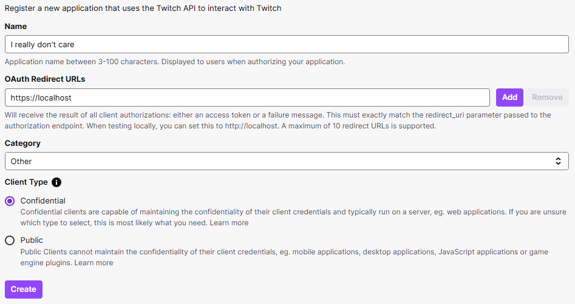
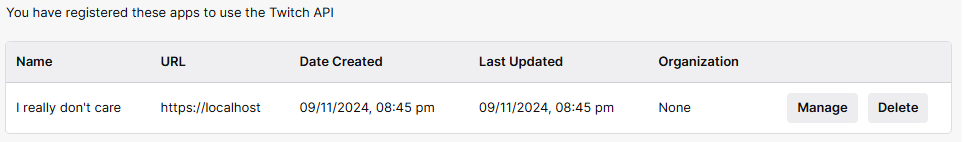
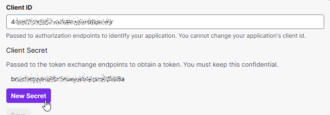

---
categories:
  - Explore
date: 2018-01-01T05:00:00Z
description: ""
draft: false
postimage: /banners/generic-api-banner.webp
slug: what-is-internet-game-database-api
summary: The Internet Game Database is a community-driven site that collects and shares information about games and game-related data. Let's check out the IGDB API!
tags:
title: Access Game Data with the IGDB API v4
aliases:
  - /day-15-igdb-api-internet-game-database
---
The [Internet Game Database (IGDB)](https://github.com/twitchtv/igdb-contribution-guidelines/wiki) is a community-driven site, now owned by Twitch, that collects and shares information about games and game-related data. They have an API to support the mission, so today let's check out the [IGDB API](https://www.igdb.com/api).

First though, two things to consider:

- If you're unfamiliar with APIs, you might want to [read this first](https://grantwinney.com/what-is-an-api/).
- Install [Postman](https://www.getpostman.com/), which allows you to access API endpoints without having to write an app, as well as save the calls you make and sync them online.

## Create an Account

There's a "[Getting Started](https://api-docs.igdb.com/#getting-started)" guide you should read, but here's the basic steps:

- [Sign up for a Twitch account](https://api.igdb.com/signup)
- Setup 2FA in your [profile](https://www.twitch.tv/settings/security) - you can't do the next step without it
- Open the [Twitch Developer Portal](https://dev.twitch.tv/console/apps/create) and create a new "application"
	- Redirect URL: https://localhost
    - Fill in anything for the name and category, and leave client type as-is
- Click the "Manage" button, scroll down, and write down the Client ID and Client Secret (after you create one).

Create an "application":



Click "Manage":



Get a Client ID and Client Secret so you can use the API:



## Authorization

The same doc I mentioned above tells you how to authenticate too.

- Do a `POST` to the endpoint they provide: _(Postman makes this easy)_  
    [`https://id.twitch.tv/oauth2/token?client_id={client_id}&client_secret={client_secret}&grant_type=client_credentials`](https://id.twitch.tv/oauth2/token?client_id=43w672tdd57vyfb9hzbin46akrsfjr&client_secret=44kjbao6xl57fd7lljyd04q8r2699u&grant_type=client_credentials)
- Note the access token you get back in the little block of JSON

Every request you make after this will have two headers:

- `Accept: application/json`
- `Client-ID: <same-client-id-as-before>`

And under the Authorization tab, choose "Bearer Token" and set the Token to whatever value you just got back in the JSON above.

## Find Games

When I first wrote this years ago for the first version of the API, it seemed a lot easier. Somehow, since Twitch got it I guess, it's gotten more complicated to use. It seems like they were going for extreme flexibility, but instead it's just counterintuitive.

To "get" game data, for instance, we need to do a `POST` (ugh) to `https://api.igdb.com/v4/games`, then pass a query via the body (set to "raw" and "text") like this:

```none
fields id,name,rating;
where id=1025;
```

That'll return JSON with information about one particular game, but it's so odd looking.. kind of a pseudo-sql query I guess. I don't know how we're supposed to know when to use a SQL keyword and when not to, or when an `=` sign is appropriate or why it doesn't need to be there after "fields".

Looking at the [docs for the `games` endpoint](https://api-docs.igdb.com/?shell#game), I'm also not sure what to use if I don't know the exact ID and just want anything starting with Zelda.

```json
[
    {
        "id": 1025,
        "name": "Zelda II: The Adventure of Link",
        "rating": 66.72145408447821
    }
]
```

Conveniently but strangely, it appears that many of the old `GET` requests from several versions ago still work. Like, I can do this to get all zelda games:

`https://api.igdb.com/v4/games/?search=zelda&fields=id,name,rating`

And it returns a reasonable block of JSON. I can work with that, grabbing the ID from the one(s) I'm interested in, and then querying again for the full record.

```json
[
    {
        "id": 1025,
        "name": "Zelda II: The Adventure of Link",
        "rating": 66.72145408447821
    },
    {
        "id": 1022,
        "name": "The Legend of Zelda",
        "rating": 80.37884373313888
    },
    {
        "id": 1041,
        "name": "The Legend of Zelda: Oracle of Ages",
        "rating": 84.5419859364635
    },
    {
        "id": 1032,
        "name": "The Legend of Zelda: Oracle of Seasons",
        "rating": 81.7140839079194
    },
    {
        "id": 150080,
        "name": "BS The Legend of Zelda \"MottZilla Patch\""
    },
    {
        "id": 45142,
        "name": "The Legend of Zelda: Ocarina of Time - Master Quest",
        "rating": 89.99133378448971
    },
    {
        "id": 237895,
        "name": "The Legend of Zelda: Breath of the Wild and The Legend of Zelda: Breath of the Wild Expansion Pass Bundle"
    },
    {
        "id": 38319,
        "name": "BS Zelda no Densetsu"
    },
    {
        "id": 152362,
        "name": "Zelda"
    },
    {
        "id": 1029,
        "name": "The Legend of Zelda: Ocarina of Time",
        "rating": 91.7500985899066
    }
]
```

The old endpoints don't seem to be documented anymore though, unless I missed them, and I don't see a field in the new docs that provides this same flexibility.

## Thoughts

There's plenty of documentation on [the available endpoints](https://api-docs.igdb.com/#endpoints), and I have no doubt there's a _ton_ of data available here. It's just that, after spending an hour updating this post, I have the distinct feeling that the latest version of this API aren't necessarily an improvement over the original one.

If you agree with me, or you think I'm clueless and need to give it another look, let me know below. The pseudo-query thing is kind of interesting in an academic way, but it seems like it'd be aggravating to have to figure out if I really needed to use this API on a daily basis.
