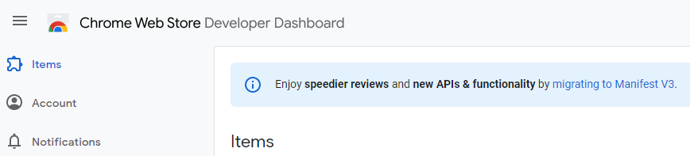
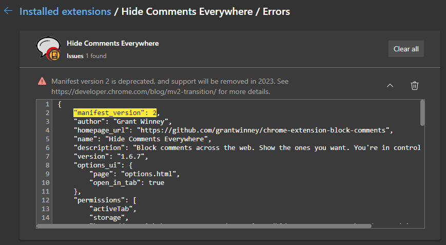
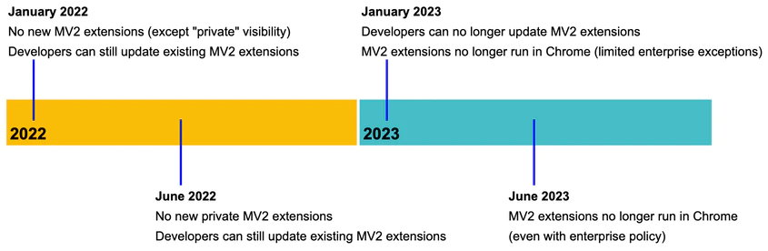
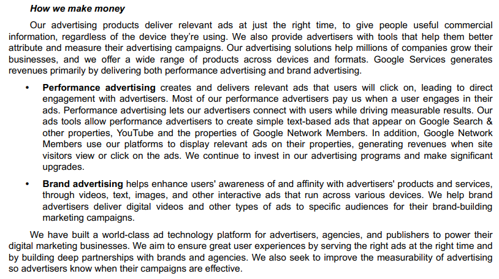
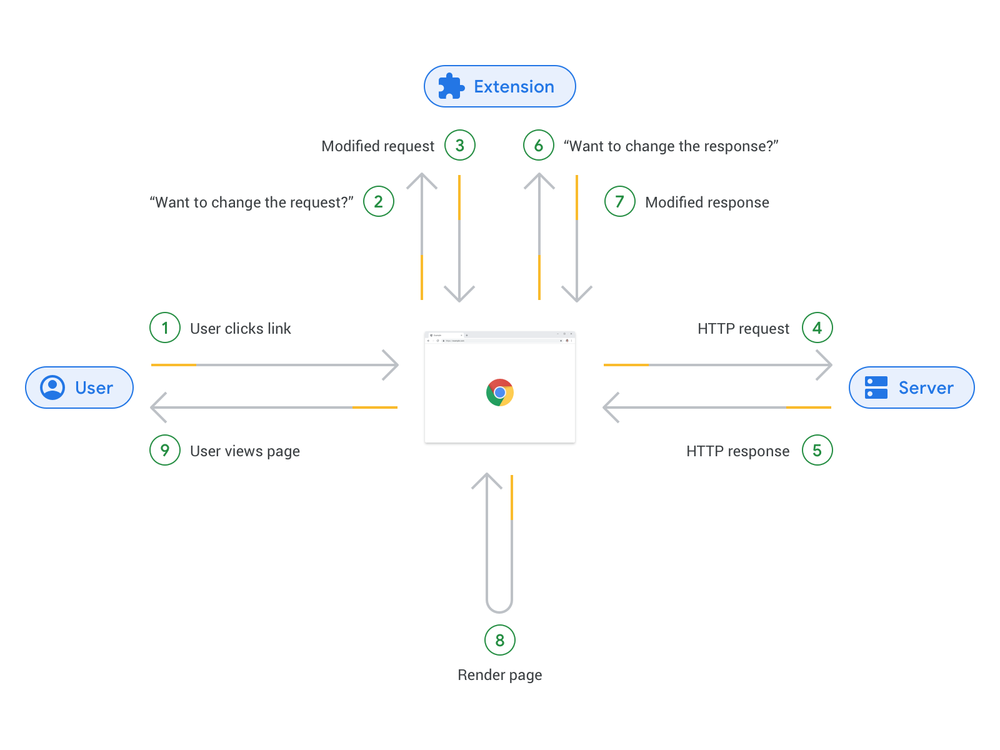
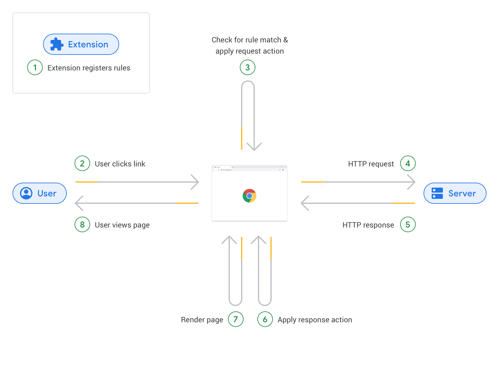

---
categories:
  - Explore
date: 2022-06-06T11:30:43Z
description: ""
draft: false
postimage: /banners/generic-explore-banner.webp
slug: what-is-manifest-v3-and-why-is-google-pestering-me
tags:
  - browser-extension
  - google
  - mv3
  - code-review
title: What is Manifest V3 and why is Google pestering me about it?
---
If you've ever dug into the underpinnings of a browser extension, or maybe even [created one yourself](https://grantwinney.com/making-your-first-chrome-extension), you've seen the manifest.json file that acts as a sort of usage guide for an extension. Not the kind of usage guide most people would want to read, but it's vital for browsers.

The manifest file tells them what name and version to display, who the author is, what permissions to request access to, which icons to display, what css and js files to load and when. It's important, but once you get the hang of it, pretty simple to implement. You create it and move on, only ever reopening it to bump the version when you've got something new to publish, and maybe requesting a new permission.

For quite awhile now, whenever I visit the Chrome dashboard, I get a notice at the top about migrating to Manifest V3 (aka MV3). Fair enough.



Apparently though that notice wasn't enough to make developers care, because they've sent emails with links to blog posts, and now when I load an extension to debug it, it immediately reports an error. Hm, is it related to the issue I wanted to debug? Nope, just Chromium abusing functionality to send me more reminders.



What they're badgering extension authors about though is _much_ more than just a change in format for a single file. Google is spearheading major changes to how extensions are written and interact with the browser, in the name of privacy and security, and those changes are coming soon. As of writing this post, no one can publish new extensions using version 2 (MV2) anymore. In 6 months, everyone has to update if they want to continue hosting their extension in the Chrome web store and having it work in Chromium-based browsers.



Source: [Manifest V2 support timeline](https://developer.chrome.com/docs/extensions/mv3/mv2-sunset/)

## What does MV3 bring to the table?

The very first thing [Google](https://blog.chromium.org/2020/12/manifest-v3-now-available-on-m88-beta.html) mentions is disallowing remotely hosted code. That's not a bad thing. In fact, it's incredibly and obviously good. Imagine the havoc I could wreak if I wrote an extension with one file in it that simply downloads and executes a dozen other files. The web store sees nothing suspicious, because there's barely anything _to_ see. Then you install my extension, and it's anyone's guess what all those external files are actually doing, and they could be changing daily and downloading and executing yet more files.

My gut instinct is that, like a politician trying to peddle a piece of legislation by touting the one good thing in it everyone can agree on, they're leading with this and then slipping in a handful of smaller and more contentious stuff. Let's check it out.

### Service Workers

No more background pages.

> First, we are introducing [service workers](https://developers.google.com/web/fundamentals/primers/service-workers) as a replacement for background pages. Unlike persistent background pages, which remain active in the background and consume system resources regardless of whether the extension is actively using them, service workers are ephemeral. This ephemerality allows Chrome to lower overall system resource utilization since the browser can start up and tear down service workers as needed.

This is interesting. It's already possible to tell a background page to not "remain active in the background and consume system resources", simply by setting the "persistent" flag to false in the manifest.json. They recommend it all over their documentation. Easy-peasy.

```json
"background": {
    "scripts": [
        "js/third-party/jquery-3.6.0.min.js",
        "js/third-party/axios.min.js",
        "js/third-party/toastr.min.js",
        "js/shared.js",
        "js/background.js"
    ],
    "persistent": false
},
```

It doesn't sound like this change offers much of a performance boost for end users, but for developers it'll be a hassle. Why not just force the persistent flag to false? Or add a new permission that asks the user to approve running the extension "persistently"?

I think most extensions are from people, like me, who had an idea to share and cranked something out in a weekend or two, but now I've got to learn about [what service workers are](https://developer.chrome.com/docs/workbox/service-worker-overview/), [how to migrate a background page to a service worker](https://developer.chrome.com/docs/extensions/mv3/migrating_to_service_workers/), and apparently about [ES modules in service workers](https://web.dev/es-modules-in-sw/) too because I have some shared code in a separate file that now needs to be imported instead of just listed out in the order they should be loaded (as in the snippet above). Best scenario, I spend a week or two learning new concepts and in the end, if all goes well, end users notice absolutely no change and don't get some weird error that breaks the extension.

### Declarative APIs

A new set of APIs that allow an extension to affect the page without being handed its entire contents.

> The `declarativeNetRequest` API is an example of how Chrome is working to enable extensions, including ad blockers, to continue delivering their core functionality without requiring the extension to have access to potentially sensitive user data. This will allow many of the powerful extensions in our ecosystem to continue to provide a seamless user experience while still respecting user privacy.

The above didn't mean much to me, other than making me smile (or is it a smirk?) at the idea that an ad company, whose [SEC filing](https://abc.xyz/investor/static/pdf/20210203_alphabet_10K.pdf?cache=b44182d) includes a section called "how we make money" that's _all_ about advertising, would claim to be working to enable ad blocker extensions. Maybe I'm just cynical, but that seems like a huge conflict of interest.



Their blog post titled [_Web Request and Declarative Net Request: Explaining the impact on Extensions in Manifest V3_](https://blog.chromium.org/2019/06/web-request-and-declarative-net-request.html) has a couple useful diagrams _(shown below)_ that make the changes clearer. In MV2, the browser hands over the whole page to an extension to modify as needed, but in V3 the browser will allow an extension to define what it wants to do under certain circumstances by setting up rules, and then apply those rules. No more handing over the whole page.





Source: [_Web Request and Declarative Net Request: Explaining the impact on Extensions in Manifest V3_](https://blog.chromium.org/2019/06/web-request-and-declarative-net-request.html)

That seems pretty smart at first glance, like a decoupling of concerns, but it leaves me wondering just what kind of rules can I create? How flexible are they? Is it possible to block content (ads, trackers, etc) being loaded by known third party sites? Do they each have to be listed in a separate internal "rule", changes requiring new uploads to the store, as opposed to [external block lists](https://help.getadblock.com/support/solutions/articles/6000066909-introduction-to-filter-lists/) that can be modified frequently by anyone who wishes to contribute? Per some other [docs](https://developer.chrome.com/docs/extensions/reference/declarativeNetRequest/), it _seems_ like there'll be a way in the [updateDynamicRules](https://developer.chrome.com/docs/extensions/reference/declarativeNetRequest/#method-updateDynamicRules) method... maybe.

In the case of [Hide Comments Everywhere](https://chrome.google.com/webstore/detail/hide-comments-everywhere/bmhkdngdngchlneelllmdennfpmepbnc), I need to block any elements of a page that show comments. These might be hosted by a third party like Disqus, but more frequently they're just embedded in the page and selectable by using a [CSS selector](https://developer.mozilla.org/en-US/docs/Web/CSS/CSS_Selectors). Will that still work? Maybe, maybe not.

## Does MV3 make things worse for us?

If you've gotten this far and it's not clear from above, I'm no expert in this. I've got some answers, and more questions. I've written a few addons, I know a few things, and I know enough to know I don't know much. There are some addons, however, that I use frequently and would really miss if they weren't around. Here's what they have to say.

### Ghostery: It's a "detrimental step back" and "ultimately user hostile"

Ghostery is a popular ad and tracker blocker, and clearly going through hell with the MV3 changes.

> With enforcement of Manifest V3, Google dramatically limits capabilities of browser extensions. It removes access to powerful APIs that allowed us to provide innovation in privacy protection. Being subjected to those constraints, we have to re-invent the way our extensions operate. Intended or not, Manifest V3 takes choice away from users, exposing them to new threats. Manifest V3 is ultimately user hostile.

That's the tl;dr version, but the rest of their post is a fascinating read and I'd suggest checking it out. The section _"no incremental updates"_ makes me think maybe my addon is screwed in its current state, although they mention dynamicRules as a possible workaround too (for their case though, it's far too limited).

> At Ghostery, we publish updates to our ad blocking list daily. Yet Manifest V3, which was designed to reduce extension review times, would force us to release a new extension version each time we update the block list. Some updates are allowed in a form of `dynamicRules`, but the number of entries is limited to 5,000 and it has to be shared with user controls, which makes it unusable.  
>   
> Manifest V3's idea was to simplify WebExtensions to speed up the review process. We will put that to test - we plan to release updates to our extension as often as needed, every single day if required. We hope that reviewers will be able to keep up with it.

They close with:

> Manifest V3 is an opinionated specification; it enforces technical limitations with the goal of improving user experience. That looks good on paper, but the reality is quite different.  
>   
> Manifest V3 is a detrimental step back for internet privacy. Instead of reinventing the wheel, we would prefer to focus on finding new ways to prevent tracking. This is after all what browser extensions are and should be, a playing field for innovation and the express lane for browser enhancement.

_Source:_ [_Manifest V3: The Ghostery perspective_](https://www.ghostery.com/blog/manifest-v3-the-ghostery-perspective)

### EFF: It's "outright harmful to privacy efforts"

The Electronic Frontier Foundation, author of privacy extensions like Privacy Badger and HTTPS Everywhere, has nothing kind to say about it either.

> It will restrict the capabilities of web extensions—especially those that are designed to monitor, modify, and compute alongside the conversation your browser has with the websites you visit. Under the new specifications, extensions like these– like some privacy-protective tracker blockers– will have greatly reduced capabilities. Google’s efforts to limit that access is concerning, especially considering that [Google has trackers installed on 75% of the top one million websites](https://spreadprivacy.com/biggest-tracker-networks/).

_Source:_ [_Chrome Users Beware: Manifest V3 is Deceitful and Threatening_](https://www.eff.org/deeplinks/2021/12/chrome-users-beware-manifest-v3-deceitful-and-threatening)

### uBlock Origin: It's "no more than the implementation of one specific filtering engine, and a rather limited one"

I've used uBlock Origin for a long time. There's a post from a few years ago in the Chromium forum where its author, Raymond Hill, expressed concern that [the new changes will kill off his addons](https://bugs.chromium.org/p/chromium/issues/detail?id=896897&desc=2#c23).

> If this (quite limited) declarativeNetRequest API ends up being the only way content blockers can accomplish their duty, this essentially means that two content blockers I have maintained for years, uBlock Origin ("uBO") and uMatrix, can no longer exist.

Somewhat ironically, the thread was closed on April Fools Day this year.

## What other options are there?

So if you're looking for alternatives, what options are there?

### Focus on Firefox support and avoid Chromium browsers

If you're looking to totally avoid MV3, then any [Chromium-based web browser](https://en.wikipedia.org/wiki/Chromium_\(web_browser\)#Active) is out. That includes Brave, [Edge](https://learn.microsoft.com/en-us/microsoft-edge/extensions-chromium/developer-guide/manifest-v3), Opera, and at least a couple dozen others. That's not realistic if your business model depends on it, but then at least you're getting paid to figure this stuff out for your customers. As for the rest of us, it's a pretty lousy situation.

[Mozilla is supporting MV3 in Firefox](https://blog.mozilla.org/addons/2022/05/18/manifest-v3-in-firefox-recap-next-steps/), in acknowledgement that Chromium-based browsers are a huge share of the market and no developer wants to maintain two versions of their extension. They're not tossing out MV2, using a more reasonable approach than Google is capable of. _(Read more about their approach in their_ [_Manifest V3 migration guide_](https://extensionworkshop.com/documentation/develop/manifest-v3-migration-guide/)_.)_

> Mozilla will maintain support for blocking WebRequest in MV3. To maximize compatibility with other browsers, we will also ship support for declarativeNetRequest. We will continue to work with content blockers and other key consumers of this API to identify current and future alternatives where appropriate. Content blocking is one of the most important use cases for extensions, and we are committed to ensuring that Firefox users have access to the best privacy tools available.

It seems like that should pay off for them. Anyone willing to learn MV3 will be able to cross-upload to the Firefox store. Anyone unwilling can continue with MV2, still upload to the Firefox store, and encourage friends and family to use Firefox. I like that Mozilla admits what Google will not - that rewriting extensions is going to _suck_ and everyone knows it.

> We’ve found Service Workers can’t fully support [various use cases](https://github.com/w3c/webextensions/issues/72) we consider important, especially around DOM-related features and APIs. Additionally, the worker environment is not as familiar to regular web developers, and our developer community has expressed that completely rewriting extensions can be tedious for thousands of independent developers of [existing extensions](https://addons.mozilla.org/en-US/firefox/extensions/).

### Start with MV2 on Firefox and gradually learn MV3

Since Firefox is supporting both, you could write an extension with MV2, for which there are tons of articles and resources to support it, then convert it at your leisure. When it's fully MV3, upload it to Google's store. True, it means double the effort in the long run, but it's an option for new extensions or existing extensions with low adoption in the Chrome web store where starting over later wouldn't be a big deal.

### Take five and get outside 🌞

It's nearly summer, so grab your beverage of choice and go hang outside for awhile. Okay, not a great longterm plan, and I hope that doesn't come off glibly, but the view right now from my swinging chair is warm sunlight streaming through green leaves, while a gentle breeze blows cottonwood fluff around like it's snowing. It's easy at the moment to forget about one company's arrogant behavior.


If you do decide to go for it, here's some solid places to start:

- [Welcome to Manifest V3](https://developer.chrome.com/docs/extensions/mv3/intro/) (intro from Google)
- [Web Request and Declarative Net Request: Explaining the impact on Extensions in Manifest V3](https://blog.chromium.org/2019/06/web-request-and-declarative-net-request.html) (blog post from Google)
- [chrome.declarativeNetRequest](https://developer.chrome.com/docs/extensions/reference/declarativeNetRequest/) (dev docs from Google)
- [Chromium Extensions - Google Groups](https://groups.google.com/a/chromium.org/g/chromium-extensions?pli=1) (forums to share stories and tears)
- [Thoughts on Manifest v3 | IT & Stuff](https://brawl.vivaldi.net/2021/12/15/thoughts-about-manifest-v3/) (someone who went through the conversion and made it work, but it sounds painful)

As for me, I haven't decided what I'll do yet. I'll keep my humble little extensions on Firefox and see how things shake out. Most of us have a lot on our plates, jobs to perform and families to support. For me, getting familiar with a host of new concepts to appease Google isn't on my priority list _at all,_ and I'd wager a lot of smaller yet useful extensions will simply cease to work come 2023.

**Edit (Nov 2022):** [I decided to give it a go](https://grantwinney.com/my-experience-migrating-to-mv3/). It was truly life-changing.
