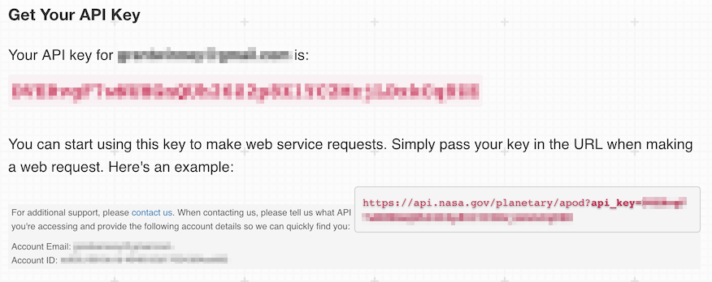
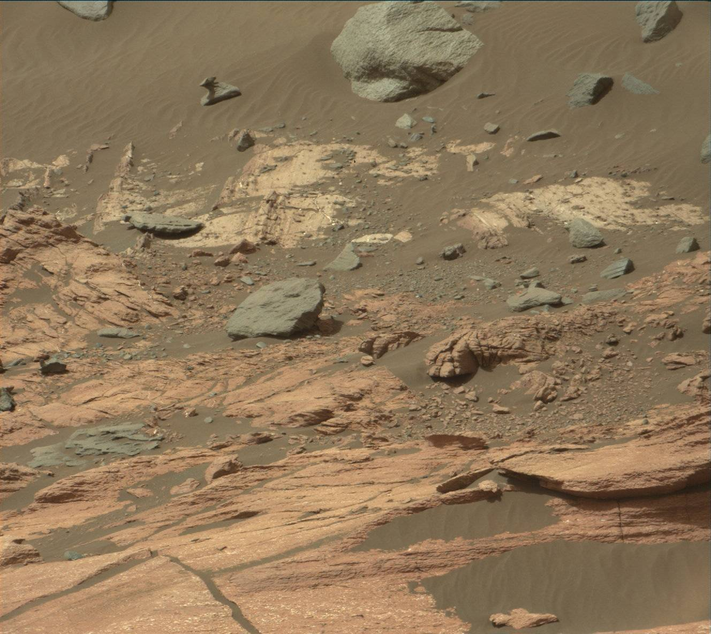

---
categories:
- API
- Space
date: "2017-12-24T19:06:14Z"
description: ""
draft: false
cover:
  image: mars-67522_1920.jpg
slug: what-is-nasa-api
summary: NASA's API makes their data (such as Mars rover photos) available to anyone who wants to consume it. It's an unprecedented wealth of knowledge, so let's dig in!
tags:
- api
- astronomy
title: View the Mars Rover, Landsat Images, and More with the NASA API
aliases:
- /day-8-nasa-api
---
[NASA's API](https://api.nasa.gov/) makes their data (such as Mars rover photos) available to anyone who wants to consume it. It's an unprecedented wealth of knowledge, so let's dig in!

First though, two things to consider:

- If you're unfamiliar with APIs, you might want to [read this first](https://grantwinney.com/what-is-an-api/) to familiarize yourself.
- Install [Postman](https://www.getpostman.com/), which allows you to access API endpoints without having to write an app, as well as save the calls you make and sync them online.

---

## Authorization

You aren't required to get an API key _(you can just use the string "DEMO_KEY" instead of an actual key),_ but you might as well. Without one, the limit is 50 requests per day - with one, it's (usually) 1000 requests per hour. [Fill out the form](https://api.nasa.gov/#signUp), and it immediately displays an API key on the same page.



Interestingly, they also refer to this as your api.data.gov API key ... not sure where else this key is supposed to work, or whether they just have plans for the future. But at the very least, it seems to work across the various APIs published by NASA.

## Requesting Data

Just append your API key as a parameter to any of the [available API requests](https://api.nasa.gov/#browseAPI) _(scroll down towards the bottom of the page if the link doesn't take you there)_. Try a simple one first, to make sure your API key works.

### Photo of the Day

There's one that returns [metadata about the photo of the day](https://api.nasa.gov/#apod).

```none
GET https://api.nasa.gov/planetary/apod?api_key=<your-api-key>
```

You could parse the result and display the photo on your personal site, for example.

```json
{
    "copyright": "Craig Bobchin",
    "date": "2017-12-24",
    "explanation": "What's happened to the sky? On Friday, the photogenic launch plume from a SpaceX rocket launch created quite a spectacle over parts of southern California and Arizona.  Looking at times like a giant space fish, the impressive rocket launch from Vandenberg Air Force Base near Lompoc, California, was so bright because it was backlit by the setting Sun. Lifting off during a minuscule one-second launch window, the Falcon 9 Heavy rocket successfully delivered to low Earth orbit ten Iridium NEXT satellites that are part of a developing global communications network. The plume from the first stage is seen on the right, while the soaring upper stage rocket is seen at the apex of the plume toward the left. Several good videos of the launch were taken.  The featured image was captured from Orange County, California, in a 2.5 second duration exposure.   Gallery: More images of the SpaceX launch",
    "hdurl": "https://apod.nasa.gov/apod/image/1712/SpaceXLaunch_Bobchin_5407.jpg",
    "media_type": "image",
    "service_version": "v1",
    "title": "SpaceX Rocket Launch Plume over California",
    "url": "https://apod.nasa.gov/apod/image/1712/SpaceXLaunch_Bobchin_960.jpg"
}
```


### Mars Rover Photos (Spirit)

More photos! There's an API someone created just for retrieving photos from the various cameras on the various Mars rovers, going back 15 years.

Here's a request for archived photos from May 9, 2009 (1900th "day" since landing), from the navigational camera aboard the [Mars Spirit Rover](https://www.jpl.nasa.gov/missions/mars-exploration-rover-spirit-mer-spirit/) (its mission ran from 2003 to 2011).

```none
GET https://api.nasa.gov/mars-photos/api/v1/rovers/spirit/photos?sol=1900&camera=NAVCAM&api_key=<your-api-key>
```

And here's the result. I had absolutely no idea all of this data was out there. Imagine, tens of thousands of photos spanning years and years, and it's all available for the querying.

```json
{
    "photos": [
        {
            "id": 292443,
            "sol": 1900,
            "camera": {
                "id": 29,
                "name": "NAVCAM",
                "rover_id": 7,
                "full_name": "Navigation Camera"
            },
            "img_src": "http://mars.nasa.gov/mer/gallery/all/2/n/1900/2N295043846EFFB1DNP1979L0M1-BR.JPG",
            "earth_date": "2009-05-09",
            "rover": {
                "id": 7,
                "name": "Spirit",
                "landing_date": "2004-01-04",
                "launch_date": "2003-06-10",
                "status": "complete",
                "max_sol": 2208,
                "max_date": "2010-03-21",
                "total_photos": 124550,
                "cameras": [
                    ...
                ]
            }
        },
        {
            "id": 292444,
            "sol": 1900,
            "camera": {
                "id": 29,
                "name": "NAVCAM",
                "rover_id": 7,
                "full_name": "Navigation Camera"
            },
            "img_src": "http://mars.nasa.gov/mer/gallery/all/2/n/1900/2N295043846EFFB1DNP1979R0M1-BR.JPG",
            "earth_date": "2009-05-09",
            "rover": {
                "id": 7,
                "name": "Spirit",
                "landing_date": "2004-01-04",
                "launch_date": "2003-06-10",
                "status": "complete",
                "max_sol": 2208,
                "max_date": "2010-03-21",
                "total_photos": 124550,
                "cameras": [
                    ...
                ]
            }
        },
        {
            "id": 292445,
            "sol": 1900,
            "camera": {
                "id": 29,
                "name": "NAVCAM",
                "rover_id": 7,
                "full_name": "Navigation Camera"
            },
            "img_src": "http://mars.nasa.gov/mer/gallery/all/2/n/1900/2N295043924EFFB1DNP1979L0M1-BR.JPG",
            "earth_date": "2009-05-09",
            "rover": {
                "id": 7,
                "name": "Spirit",
                "landing_date": "2004-01-04",
                "launch_date": "2003-06-10",
                "status": "complete",
                "max_sol": 2208,
                "max_date": "2010-03-21",
                "total_photos": 124550,
                "cameras": [
                    ...
                ]
            }
        },
        {
            "id": 292446,
            "sol": 1900,
            "camera": {
                "id": 29,
                "name": "NAVCAM",
                "rover_id": 7,
                "full_name": "Navigation Camera"
            },
            "img_src": "http://mars.nasa.gov/mer/gallery/all/2/n/1900/2N295043924EFFB1DNP1979R0M1-BR.JPG",
            "earth_date": "2009-05-09",
            "rover": {
                "id": 7,
                "name": "Spirit",
                "landing_date": "2004-01-04",
                "launch_date": "2003-06-10",
                "status": "complete",
                "max_sol": 2208,
                "max_date": "2010-03-21",
                "total_photos": 124550,
                "cameras": [
                    ...
                ]
            }
        }
    ]
}
```

### Mars Rover Photos (Curiosity)

Let's check the cameras on the Curiosity, which is currently still running. To get photos from earlier this year (Feb 4, the 1600th "day" since landing):

```none
GET https://api.nasa.gov/mars-photos/api/v1/rovers/curiosity/photos?sol=1600&api_key=<your-api-key>
```

The returned dataset includes over 13000 lines of JSON, so's here's a couple photos worth - and a few actual photos again.

```json
{
    "photos": [
        {
            "id": 612417,
            "sol": 1600,
            "camera": {
                "id": 20,
                "name": "FHAZ",
                "rover_id": 5,
                "full_name": "Front Hazard Avoidance Camera"
            },
            "img_src": "http://mars.jpl.nasa.gov/msl-raw-images/proj/msl/redops/ods/surface/sol/01600/opgs/edr/fcam/FLB_539548779EDR_F0602928FHAZ00337M_.JPG",
            "earth_date": "2017-02-04",
            "rover": {
                "id": 5,
                "name": "Curiosity",
                "landing_date": "2012-08-06",
                "launch_date": "2011-11-26",
                "status": "active",
                "max_sol": 1912,
                "max_date": "2017-12-22",
                "total_photos": 328169,
                "cameras": [
                    ...
                ]
            }
        },
        {
            "id": 612418,
            "sol": 1600,
            "camera": {
                "id": 20,
                "name": "FHAZ",
                "rover_id": 5,
                "full_name": "Front Hazard Avoidance Camera"
            },
            "img_src": "http://mars.jpl.nasa.gov/msl-raw-images/proj/msl/redops/ods/surface/sol/01600/opgs/edr/fcam/FRB_539548779EDR_F0602928FHAZ00337M_.JPG",
            "earth_date": "2017-02-04",
            "rover": {
                "id": 5,
                "name": "Curiosity",
                "landing_date": "2012-08-06",
                "launch_date": "2011-11-26",
                "status": "active",
                "max_sol": 1912,
                "max_date": "2017-12-22",
                "total_photos": 328169,
                "cameras": [
                    ...
                ]
            }
        },
        ...
    ]
}
```




## Thoughts

There are lots of other APIs to experiment with too, but it's Christmas Eve and I can't sit around playing forever. ;) This was a nice set of APIs to discover though, and I'm excited to discover more about them in the future.

It's great that NASA has made such an effort to publicize the data it's amassed over the years. Even more amazing is that this data - which could've been kept on a server somewhere inaccessible - is available to anyone in the _world_ who requests it!
