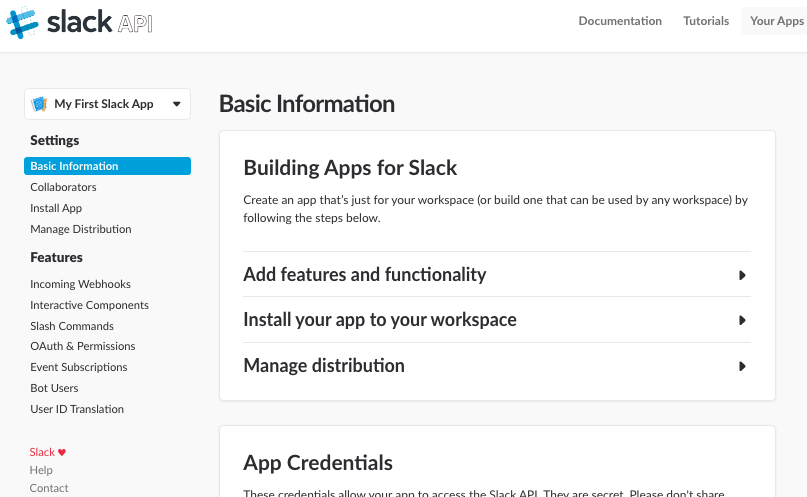
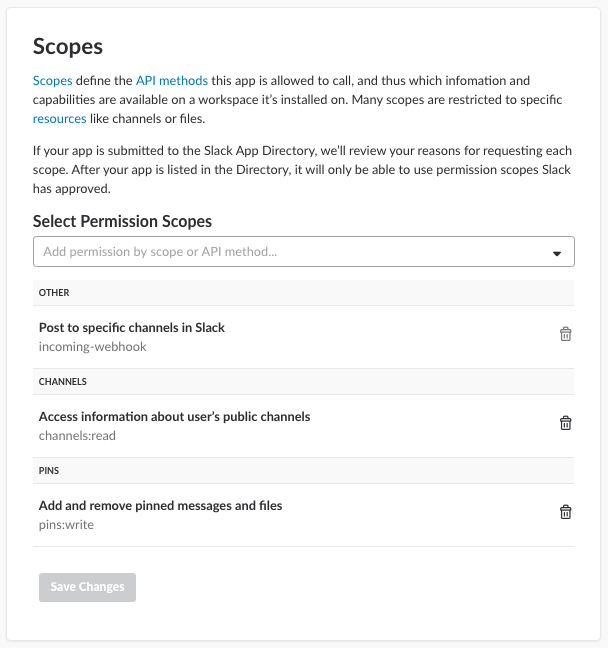
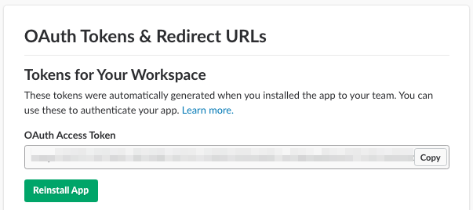
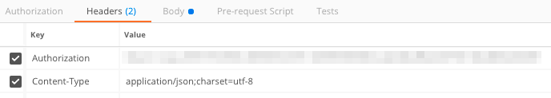
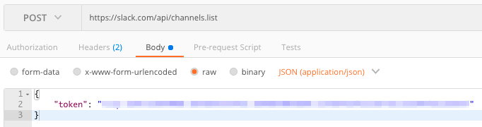
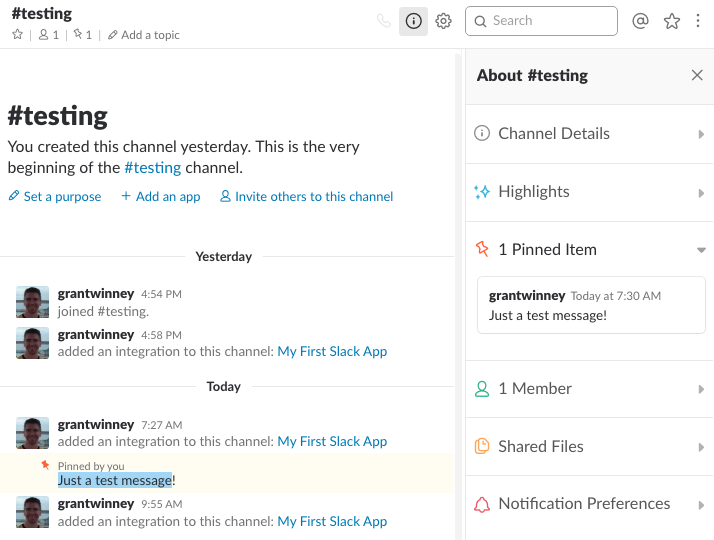
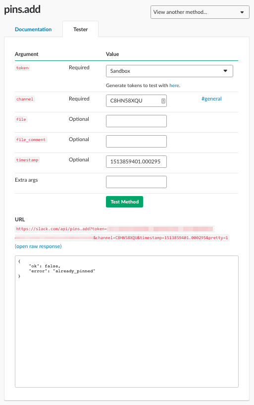

---
categories:
- API
date: "2017-12-21T18:09:09Z"
description: ""
draft: false
cover:
  image: photo-1577563908411-5077b6dc7624.jpg
slug: what-is-slack-api
summary: Slack is a popular communication and collaboration tool, and their API gives
  us access to channels, messages, and more. Let's check it out!
tags:
- API
title: Managing Workspaces and Channels With the Slack API
---
Slack is a popular communication and collaboration tool, and the [Slack API](https://api.slack.com/) gives us access to workspaces, channels, messages, and more.

First though, two things to consider:

- If you're unfamiliar with APIs, [read this first](https://grantwinney.com/what-is-an-api/) to familiarize yourself with the concept.
- Install [Postman](https://www.getpostman.com/), which allows you to access API endpoints without having to write an app, as well as save the calls you make and sync them online.

---

## Getting Started

### Create an account or sign in

First, you'll need to be signed in. [Create an account](https://slack.com/create) if you don't already have one. They'll ask for a few pieces of information. Well, we're just playing around so...

- About your "team" - _select "other" and "1-10 people"_
- The name of your group - _use "Sandbox" or whatever you'd like_
- The workspace url - _unique among everyone, so use your full name or a random phrase_
- Send invitations - _skip it_

### Create an app

Then, you'll need to [create an app](https://api.slack.com/apps/new). Give it whatever name you like, and choose the name of your group/workspace from the dropdown. Click "Create App". If all goes well, you should end up on a dashboard like this one:



### Choose some permissions

Now that you've got an app, you need to decide what you want it to do. I'm glad they have apps scoped like this - it's very similar to [creating browser extensions](https://grantwinney.com/making-your-first-chrome-extension/) and phone apps, where not everything has access to everything, and the user must explicitly "grant" permissions.

Click the "OAuth & Permissions" link on the left, and then scroll down to "Scopes". Choose a few permissions that sound interesting and then "Save Changes". I chose to access channel information and alter pinned messages. _(The incoming-webhook one got added, and can't be removed - guess it's required by the other two?)_



### Install your new app in your workspace

On the same page, scroll back to the top and press the "Install App to Workspace" button. You'll be notified about what permissions the app needs - just click "Authorize". I also created a new channel named "testing", so that I could select it here, but you can just select a built-in channel from the dropdown if you'd like.


### Auth Token (finally!)

It should've redirected back to the "OAuth & Permissions" section. This is the auth token you'll need when you make requests to the Slack API.



## Try it out

Now you can actually try some [API methods](https://api.slack.com/methods). For most of these, I think you need at least the `Authorization` and `Content-Type` headers - although the latter isn't _always_ required, it won't hurt to include it.



### List Channels

The first thing we'll try is [listing channels](https://api.slack.com/methods/channels.list). In Postman, do a `POST` and include the headers above. The JSON body only needs to have your auth token.



You should get a result similar to this. My results include three channels - the default "general" and "random" ones, and also my "testing" one. Note how each channel has an "id" too. It appears that many (most? all?) of the requests that operate on channels require an id, _not a name._

```json
{
    "ok": true,
    "channels": [
        {
            "id": "C8HLHBQLS",
            "name": "general",
            "is_channel": true,
            "created": 1513804198,
            "is_archived": false,
            "is_general": true,
            "unlinked": 0,
            "creator": "U8HQN49LM",
            "name_normalized": "general",
            "is_shared": false,
            "is_org_shared": false,
            "is_member": true,
            "is_private": false,
            "is_mpim": false,
            "members": [
                "U8HQN49LM"
            ],
            "topic": {
                "value": "Company-wide announcements and work-based matters",
                "creator": "U8HQN49LM",
                "last_set": 1513804198
            },
            "purpose": {
                "value": "This channel is for workspace-wide communication and announcements. All members are in this channel.",
                "creator": "U8HQN49LM",
                "last_set": 1513804198
            },
            "previous_names": [],
            "num_members": 1
        },
        {
            "id": "C8HLHBR3L",
            "name": "random",
            "is_channel": true,
            "created": 1513804198,
            "is_archived": false,
            "is_general": false,
            "unlinked": 0,
            "creator": "U8HQN49LM",
            "name_normalized": "random",
            "is_shared": false,
            "is_org_shared": false,
            "is_member": true,
            "is_private": false,
            "is_mpim": false,
            "members": [
                "U8HQN49LM"
            ],
            "topic": {
                "value": "Non-work banter and water cooler conversation",
                "creator": "U8HQN49LM",
                "last_set": 1513804198
            },
            "purpose": {
                "value": "A place for non-work-related flimflam, faffing, hodge-podge or jibber-jabber you'd prefer to keep out of more focused work-related channels.",
                "creator": "U8HQN49LM",
                "last_set": 1513804198
            },
            "previous_names": [],
            "num_members": 1
        },
        {
            "id": "C8HN58XQU",
            "name": "testing",
            "is_channel": true,
            "created": 1513806864,
            "is_archived": false,
            "is_general": false,
            "unlinked": 0,
            "creator": "U8HQN49LM",
            "name_normalized": "testing",
            "is_shared": false,
            "is_org_shared": false,
            "is_member": true,
            "is_private": false,
            "is_mpim": false,
            "members": [
                "U8HQN49LM"
            ],
            "topic": {
                "value": "",
                "creator": "",
                "last_set": 0
            },
            "purpose": {
                "value": "",
                "creator": "",
                "last_set": 0
            },
            "previous_names": [],
            "num_members": 1
        }
    ]
}
```

### List Messages

Now that you've got your channels, switch over to Slack and type a message into the channel you're interested in. Anything is fine - I typed _"Just a test message!"_ into my "testing" channel.

Try retrieving the messages from your channel, including the message you just added. Most of the API calls can be made in two ways - either with a JSON body like I did above, or as query string parameters, which seems to be what we _have_ to use with this one, as the JSON body doesn't work. Oddly, either a `POST` or `GET` works... a `GET` seems more intuitive for requesting information, so that's what I used.

```
GET https://slack.com/api/channels.history?token=<your-auth-token>&channel=C8HN58XQU
```

Here's the result I got back. See my test message? See the timestamp on it? If you're following along, grab the timestamp for your message too - you'll need it.

```json
{
    "ok": true,
    "messages": [
        {
            "text": "added an integration to this channel: <https://grantwinney.slack.com/services/B8J1BF0AE|My First Slack App>",
            "bot_id": "B8J1BF0AE",
            "bot_link": "<https://grantwinney.slack.com/services/B8J1BF0AE|My First Slack App>",
            "type": "message",
            "subtype": "bot_add",
            "user": "U8HQN49LM",
            "ts": "1513868109.000605"
        },
        {
            "type": "message",
            "user": "U8HQN49LM",
            "text": "Just a test message!",
            "ts": "1513859401.000295"
        },
        {
            "text": "added an integration to this channel: <https://grantwinney.slack.com/services/B8K17AGEB|My First Slack App>",
            "bot_id": "B8K17AGEB",
            "bot_link": "<https://grantwinney.slack.com/services/B8K17AGEB|My First Slack App>",
            "type": "message",
            "subtype": "bot_add",
            "user": "U8HQN49LM",
            "ts": "1513859275.000243"
        },
        {
            "text": "added an integration to this channel: <https://grantwinney.slack.com/services/B8HN70LHJ|My First Slack App>",
            "bot_id": "B8HN70LHJ",
            "bot_link": "<https://grantwinney.slack.com/services/B8HN70LHJ|My First Slack App>",
            "type": "message",
            "subtype": "bot_add",
            "user": "U8HQN49LM",
            "ts": "1513807083.000104"
        },
        {
            "user": "U8HQN49LM",
            "text": "<@U8HQN49LM> has joined the channel",
            "type": "message",
            "subtype": "channel_join",
            "ts": "1513806864.000379"
        }
    ],
    "has_more": false
}
```

### Add a pinned message

Now that you've got the id for your channel, and the timestamp for your message, you can use one of the [pin methods](https://api.slack.com/methods#pins) - the [pins.add](https://api.slack.com/methods/pins.add) API call - to pin the message to the channel.

Here's the request:

`POST` [https://slack.com/api/pins.add](https://slack.com/api/pins.add)

```json
{
	"channel": "C8HN58XQU",
	"timestamp": "1513859401.000295"
}
```

The result doesn't tell us much, other than it hopefully succeeded.

```json
{
    "ok": true
}
```

Checking the channel though, you should be able to confirm the message is pinned on the right side. Success!



## Thoughts

Similar to the [Dropbox API](https://grantwinney.com/what-is-dropbox-api/) and its API Explorer, the Slack API lets you explore it online too, generating the code for you to copy when you're satisfied. This is super convenient for trying things out. If you have an auth token already, there doesn't seem to be a place to paste it in here - just click the button and follow the prompts to generate another one.

Then check out the [pins.add](https://api.slack.com/methods/pins.add/test) method again. Here's what I got when I entered the same values that I put in Postman. (It's whining because the message is already pinned, but it works.)


