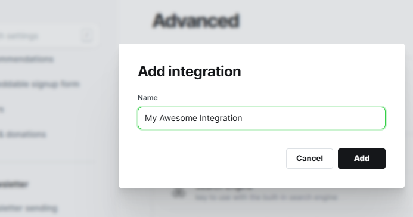
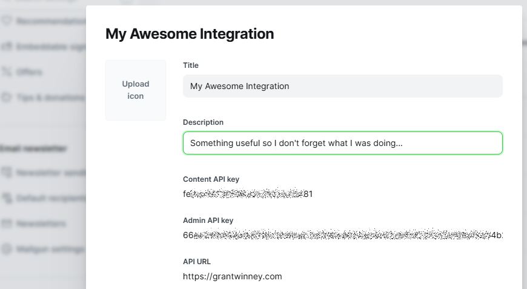

---
categories:
- Ghost Blog
- Deprecated API
date: "2018-02-08T04:12:44Z"
description: ""
draft: false
cover:
  image: photo-1476283721796-dd935b062838.jpg
slug: what-is-the-ghost-api
summary: The Ghost API provides access to your blog's posts, tags, and users. You
  can get items, as well as create them. Before accessing anything though, you'll
  need several pieces of data, depending on your blog settings and whether you're
  trying to get data or create it. Let's see what we can do with it.
tags:
- Ghost Blog
- Deprecated API
title: Manage blog posts, tags, and users with Ghost API v5.0
---
The [Ghost API](https://api.ghost.org/) provides access to your Ghost blog's posts, tags, and users. You can get items, as well as create them. Before accessing anything though, you'll need several pieces of data - which ones exactly depends on your blog settings and whether you're trying to use the public API or private API. I'll elaborate on the differences below.

Before we get started though...

- If you're unfamiliar with APIs, you might want to [read this first](https://grantwinney.com/what-is-an-api/) to familiarize yourself with them.
- You may want to install [Postman](https://www.getpostman.com/), which allows you to access API endpoints without having to write an app, as well as save the calls you make and sync them online between your computers.

## Authentication

The API is split into two parts. The public one, called the [Content API](https://ghost.org/docs/content-api/), provides read access to any public data that a user/reader of a blog would normally see.

The private one, called the [Admin API](https://ghost.org/docs/admin-api/), provides access to blog data in accordance with the permissions of the user making the request. This includes read and write access for any private data, managing users, uploading themes, etc. It's far more powerful, so obviously we need to be especially careful with that one.

Generating keys to use either of them is in site settings, under Advanced / Integrations, by choosing to add a custom integration. Even though we're only trying things out in Postman, it's the same process you'd have others go through for an integration of your own.





## Try the Content API

The full list of [available Content API endpoints](https://ghost.org/docs/content-api/#endpoints) is available in their dev docs, but let's try a couple here. In Postman, make a `GET` request like this one, substituting your own site and Content API key in place of mine:

`https://YOUR_SITE.com/ghost/api/content/posts/?key=CONTENT_API_KEY&limit=1&include=tags`

Every request needs to have an `Accept-Version` header with a value of `v5.0` or whatever version the API is. If everything goes well, we get a single post (which is what the `limit=1` param is doing):

```json
{
    "posts": [
        {
            "id": "65bb9bb5ba3ec405511fbd37",
            "uuid": "d8ea41b4-eaeb-4c6e-835c-e7e4eb118d85",
            "title": "Using TimeProvider and FakeTimeProvider in WinForms",
            "slug": "using-timeprovider-and-faketimeprovider-in-winforms",
            "html": "<p>Each new version of .NET brings great new tools. ...</p>",
            "comment_id": "65bb9bb5ba3ec405511fbd37",
            "feature_image": "https://images.unsplash.com/photo- ...",
            "featured": false,
            "visibility": "public",
            "created_at": "2024-02-01T08:25:09.000-05:00",
            "updated_at": "2024-09-09T14:04:05.000-04:00",
            "published_at": "2024-02-05T00:07:51.000-05:00",
            "custom_excerpt": "Testing .NET code involving time has always been a pain, but...",
        }
    ],
    "meta": {
        "pagination": {
            "page": 1,
            "limit": 1,
            "pages": 167,
            "total": 167,
            "next": 2,
            "prev": null
        }
    }
}
```

Here's one more, to get info about the an author by their slug:

`https://YOUR_SITE.com/ghost/api/content/authors/slug/AUTHOR_SLUG?key=CONTENT_API_KEY&include=count.posts&fields=id`

And the response from my site, when I query the only author on it... me:

```json
{
    "authors": [
        {
            "slug": "grant",
            "id": "1",
            "name": "Grant",
            "profile_image": "https://grantwinney.com/content/images/2020/05/profile.jpg",
            "cover_image": null,
            "bio": "I write when I've ...",
            "website": null,
            "location": null,
            "facebook": null,
            "twitter": null,
            "meta_title": null,
            "meta_description": null,
            "count": {
                "posts": 167
            }
        }
    ]
}
```

Notice there's nothing personal here. It's all information a visitor could figure out anyway, or that's available once a page is loaded. I removed most of the "html" field and a few others, since there's no reason to re-post the full responses here, but you get the idea.

## Try the Admin API

The Admin API used to be accessed very similiarly to the Content API, just using the Admin API key instead. Unfortunately, the implementation is more complicated now, and the documentation is difficult to understand and possibly inaccurate. Or maybe it's just me.

There's nothing in the docs about getting this to work from Postman, and try as I might, I couldn't figure it out. There's also a sample bash script that seems straight-forward enough, but it wasn't working for me either, as-is.

The Python script worked though, so we'll run with that. I've got this working in C# as well, in [GhostSharp](https://grantwinney.com/ghostsharp/), so maybe just sticking to existing libraries for whatever language you're interested in is the best way to go...

```python
import requests # pip install requests
import jwt	# pip install pyjwt
from datetime import datetime as date

# Admin API key goes here
key = 'YOUR_API_KEY'

# Split the key into ID and SECRET
id, secret = key.split(':')

# Prepare header and payload
iat = int(date.now().timestamp())

header = {'alg': 'HS256', 'typ': 'JWT', 'kid': id}
payload = {
    'iat': iat,
    'exp': iat + 5 * 60,
    'aud': '/admin/'
}

# Create the token (including decoding secret)
token = jwt.encode(payload, bytes.fromhex(secret), algorithm='HS256', headers=header)

# Make an authenticated request to create a post
url = 'https://YOUR_SITE.com/ghost/api/admin/tiers/'
headers = {'Authorization': 'Ghost {}'.format(token)}
r = requests.get(url, headers=headers)

print(r.content)
```

This produces a list of tiers, not surprisingly, which I've edited below to cut down on the amount of output:

```json
{
    "tiers": [
        {
            "id": "1",
            "name": "Free",
            "description": null,
            "slug": "1",
            "active": true,
            "type": "free",
            "welcome_page_url": "/",
            "created_at": "2022-02-04T13:44:55.000Z",
            "updated_at": null,
            "visibility": "public",
            "benefits": [
                "Access to all public posts"
            ],
            "trial_days": 0
        },
        {
            "id": "2",
            "name": "Test",
            "description": "test description",
            "slug": "2",
            "active": false,
            "type": "paid",
            "welcome_page_url": "/test-integration",
            "created_at": "2022-11-13T02:50:54.000Z",
            "updated_at": "2022-11-13T03:13:25.000Z",
            "visibility": "none",
            "benefits": [
                "Benefit 1",
                "Benefit 2"
            ],
            "currency": "USD",
            "monthly_price": 10,
            "yearly_price": 100,
            "trial_days": 0
        }
    ],
    "meta": {
        "pagination": {
            "page": 1,
            "pages": 1,
            "limit": 16,
            "total": 16,
            "prev": null,
            "next": null
        }
    }
}
```

Just like with the Content API, the full list of [available Admin API endpoints](https://ghost.org/docs/admin-api/#endpoints) is in their docs too.
