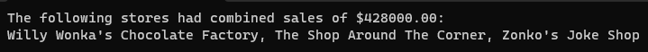

---
categories:
  - Coding
date: 2023-08-31T23:04:38Z
description: ""
draft: false
cover:
  image: google-deepmind-oUTugmSkagk-unsplash.jpg
slug: whats-a-list-pattern-in-csharp
summary: C# has been getting a lot of pattern matching love in recent years, like with list patterns in C# 11. The problem is knowing where and how to use it.
tags:
  - csharp
  - csharp-11
title: What are list patterns in C#?
---
There's very little I miss from my days of Erlang programming. One of the things I do miss, though, is pattern matching. Erlang does a _lot_ with it, and it's interesting to see C# doing more with it in the last few major releases too.

Imagine, for a moment, if we could do some kind of pattern matching while [overloading methods](https://learn.microsoft.com/en-us/dotnet/standard/design-guidelines/member-overloading). In the (completely invalid) code beow, the first method catches any call where the first parameter is "Anne", the second catches any call where the year is 1999, and the last one catches everything else. It's not a perfect analogy, but it's similar to what you can do in Erlang, without needing to have a bunch of `IF/ELSE` statements.

```csharp
public void RunAwfulBdayRoutine()
{
    WishHappyBirthday("Anne", new DateOnly(1990,1,1));
    WishHappyBirthday("Tom", new DateOnly(1999,2,2));
    WishHappyBirthday("Karen", new DateOnly(2005,3,3));
}

public void WishHappyBirthday("Anne", DateOnly birthdate)
{
    Console.WriteLine("Wow, it's your birthday Anne-iversary!")
}
public void WishHappyBirthday(string name, MM/dd/1999)
{
    Console.WriteLine($"Happy birthday {name}, party like it's 1999! So uh.. mash up some peas or something I guess. :/");
}
public void WishHappyBirthday(string name, DateOnly birthdate)
{
    var today = DateOnly.FromDateTime(DateTime.Now);
    Console.WriteLine($"You're {today.DayNumber - birthdate.DayNumber} days old, {name}... quite the uh, large number.");
}
```

Obviously C# doesn't allow anything like that (yet anyway), but they _did_ introduce something called [list patterns](https://learn.microsoft.com/en-us/dotnet/csharp/language-reference/operators/patterns#list-patterns) in C# 11 that's worth checking out. Unfortunately, although Microsoft's docs have improved a lot over the years, the docs aren't selling this feature well.. at least not to me.

I looked up some other examples around the web too, but they're all similarly unrealistic, typically showing a list of numbers being passed around and acted on. What these numbers mean is anyone's guess_,_ and then the new list pattern feature is used to make sure they all fall within certain ranges and whatnot.

Almost every time I've had a collection of _anything,_ it's coming from a db and represents a list of employees, security settings, subscriptions... things that should have their own class. If I had a list of seemingly-random numbers like in the examples I saw, I'd find a better way to represent that data first, and then using list patterns probably wouldn't apply anyway.

So I'm left wondering, what _are_ some realistic usages for this new feature? What can we use it for, and how can it make our lives as programmers a little easier? Let's look at a few use cases.

> The code in this post is available on [GitHub](https://github.com/grantwinney/CSharpDotNetExamples/tree/master/C%23%2011/ListPatternMatching), for you to use, expand upon, or just follow along while you read... and hopefully discover something new!

## Matching on CSV files with inconsistent formats

One possibility is using it to parse CSV files with somewhat unpredictable formats. CSV files are just comma-delimited files after all, so each line/record is easily split into a collection of strings. Let's assume a few things for a hypothetical scenario:

1. We've got an app that needs to import a variety of CSV files.
2. All the CSV files represent data about stores, but they all look slightly different.
3. The only thing we can rely on is that the first "column" is the store's name and the last "column" is the store's total sales. Some files have just those 2 columns, but others have dozens in between, none of which we care about.

Our data from the various files might look like this hodge-podge.

```csharp
// Pretend we're actually loading a variety of inconsistently formatted CSV files,
// which may have been exported from some third-party system
var inconsistentCSVFileRecords = new[]
{
    "Willy Wonka's Chocolate Factory, true, false, 400000.00",
    "The Shop Around The Corner, true, false, maybe, 12, 1200, M-F, 15000.00",
    "Zonko's Joke Shop, 13000.00",
};
```

After splitting each string, we can define a pattern that grabs the name and sales (first and last) values for further processing, while ignoring everything _(or nothing!)_ in between, with the `..` slice pattern.

```csharp
var stores = new List<string>();
var totalSales = 0m;

foreach (var record in inconsistentCSVFileRecords)
{
    if (record.Split(',') is [string name, .., string sales])
    {
        stores.Add(name);
        totalSales += decimal.Parse(sales);
    }
}

Console.WriteLine($"The following stores had combined sales of ${totalSales}:");
Console.WriteLine(string.Join(", ", stores));
```

The slice pattern is a special pattern that matches 0 or more elements, so we get only the values we're interested in, and toss out the rest.



## Matching on lists in an XML node

If you haven't had to before, there may be a time when you have to create or manipulate an XML file, such as when you're integrating with a [SOAP API](https://blog.postman.com/soap-api-definition/). Or maybe not, unless you're dealing with a legacy app.. you never know.

Let's assume we're getting a response back from some API endpoint that returns student info, with a node that contains a list of grades. There's nothing in the XML itself that says what the grades mean, but there's some documentation somewhere else that tells us which subjects each grade represents.

```csharp
// Pretend we're actually receiving XML like you might get from a SOAP API,
// but this could just as well be JSON from a REST API...
var xml = @"<students>
                <student><name>Greg</name><grades>92,91,77,89,85</grades></student>
                <student><name>Tina</name><grades>97,88,84,91,80</grades></student>
            </students>";
```

We know we want to parse them out, but don't want to create an entire class to store them because they won't be passed around or saved as-is. And we've been told to only use a couple of the grades, and toss out the rest.

Using list patterns, we can parse out each student's grades. The underscore discards the second value, because we're not interested in it... for invent-your-own reason. The slice pattern is used to discard everything after the third grade, but what's the `{ Length: 2 }` mean? That makes sure that the slice pattern matches on two elements, so if the list of grades for one record has 4 numbers, or 6 or more, the code below won't match on it and won't print it out.

```csharp
var xdoc = XDocument.Parse(xml);

foreach (var student in xdoc.Root.Elements("student"))
{
    var grades = student.Element("grades").Value.Split(',');
    if (grades is [var math, _, var art, .. { Length: 2 }])
    {
        var name = student.Element("name").Value;
        Console.WriteLine($"{name} got a {math}% in math and a {art}% in art.");
    }
}
```


## Matching on the header in some text files

It's also possible that you'll have some text files which have some pattern to them, some predictable portion, and that you'll need to extract that portion. The call to `File.ReadAllLines` returns (conveniently) all the lines of a file as a string array.

Imagine we have a series of text files, each with a different presidential speech in them, but no matter the content, there's always a header with the author, title, and the date of the speech.

```txt
Author: Abraham Lincoln
Title: Gettysburg Address
Date: 11/19/1863

Four score and seven years ago our fathers brought forth on this continent...
...
...
```

By reading the lines of each file and then using a list pattern, we can pull out the first three lines, discard the blank line that comes next, and then store all the rest (the speech itself) in another variable. The content that's matched by the slice pattern can actually be stored too, and not simply discarded.

```csharp
foreach (var filePath in Directory.GetFiles("c:\somefilepath\"))
{
    var file = File.ReadAllLines(filePath);
    if (file is [var author, var title, var publishDate, _, .. var speech])
    {
        author = author.Remove(0, 8);
        title = title.Remove(0, 7);
        publishDate = DateOnly.Parse(publishDate.Remove(0, 6)).ToShortDateString();

        Console.WriteLine($"""On {publishDate}, {author} gave the "{title}". ({speech.Length} lines)""");
    }
}
```


## Matching on arguments passed to a console app

Let's look at one more. It's possible for a console app to accepts a list of arguments. Maybe you wrote an app that can manipulate a file - create it, delete it, search through it, etc. You want users to specify the action with the first parameter, like "s" for search or "d" for delete.

Since `args` is just another string array, you can use list patterns on it as well, performing different logic depending on what that first parameter is.

```csharp
if (args is ["s", var fileToSearch, var searchTerm])
{
    // Search for specified file
    Console.WriteLine($"Searching for '{searchTerm}' in {fileToSearch}...");
}
else if (args is ["d", var fileToDelete])
{
    // Delete specified file
    Console.WriteLine($"Deleting {fileToDelete}...");
}
else if (args is ["c", var fileToCreate])
{
    // Create specified file
    Console.WriteLine($"Creating {fileToCreate}...");
}
else if (args is [..])
{
    Console.WriteLine("Invalid input for args!");
}
```

By passing in different parameter values, you can see the different results.


Are these examples more realistic? At the very least, I hope these show off more opportunities for using the list patterns feature than just a random series of numbers.

> If you want to mess around with any of the code yourself, [it's available on GitHub](https://github.com/grantwinney/CSharpDotNetExamples/tree/master/C%23%2011/ListPatternMatching) as usual. Get it, play with it, and see what you can do.

If you found this content useful, and want to learn more about a variety of [C#](https://grantwinney.com/tags/csharp/) features, check out [this GitHub repo](https://github.com/grantwinney/CSharpDotNetExamples), where you'll find links to plenty more blog posts and practical examples!
