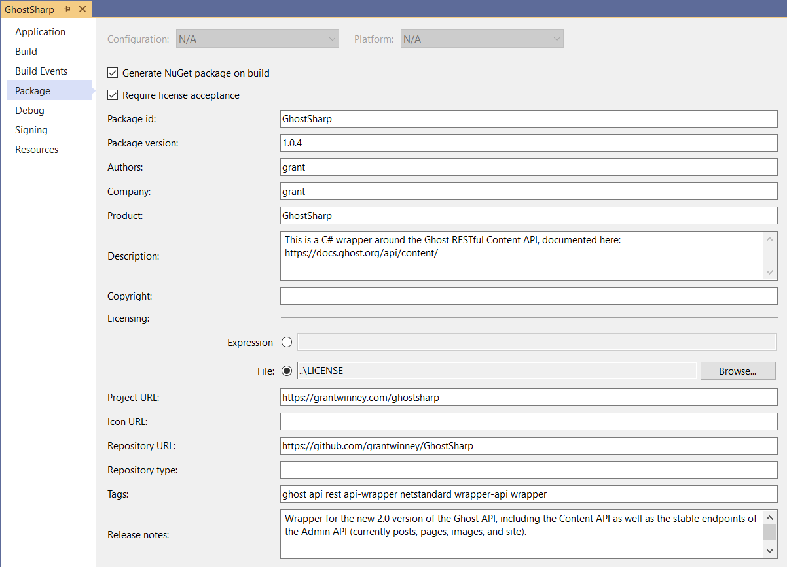

---
categories:
- NuGet
- Tools of the Trade
date: "2019-10-03T17:09:27Z"
description: ""
draft: false
cover:
  image: photo-1511351817482-e0d6127f20bb.jpg
slug: whats-a-package-manager
summary: If you've heard the term package manager, especially with GitHub announcing
  their own, you might be wondering what exactly it is. Well, it's a way to find,
  reuse, and share code, among other things.
tags:
- NuGet
- Tools of the Trade
title: What's a package manager?
---
None of us writes code in a vacuum.

You might've started out in school writing one-off apps in Java or Python. You may have created a basic website, cobbled together with HTML and the JavaScript saveur du jour. Either way, your code sits upon layers of fundamental building blocks, developed by thousands of others.

Eventually, you'll get to a point where you want to reuse someone else's code - or share your own! Hosting on a site like GitHub is only part of the solution, as you'd still have to include instructions on how to compile it, integrate it, etc.

If only we had a way to package up our code. 😐

## What's a package?

Every app you use depends on other software, some of it bundled with the app itself, and some of it installed with your OS. For example, Notepad++ depends on [libcurl.dll](https://github.com/curl/curl) for transferring data during updates. The authors of Notepad++ didn't write libcurl, but it depends on it. If you rename it, then Notepad++ can't work, because it can't find that bundle of code.

Removing or renaming the code an app depends on has predictable results...

It's the same with the code we write.

Take .NET for example. When you build a solution in Visual Studio, it compiles your code, zips it up into a series of DLL files (usually one per project), and dumps them into a "bin" directory (along with some other files, but let's ignore those).

Here's one of my projects, [GhostSharp](https://grantwinney.com/ghostsharp/). After building, I get "GhostSharp.dll" and "GhostSharp.Tests.dll" files _(for the code I wrote)_ and "[NUnit3.TestAdapter.dll](https://www.nuget.org/packages/NUnit3TestAdapter/)" _(because my test project depends on it)_.

All of these various DLL files _are_ packages - that is, they're just bundles of related code. And while I used .NET and libraries in my example, other languages have their own lingo - Ruby gems, Perl modules, Java JARs, etc.

You can send these files to a friend, email them, upload them to Dropbox, or post them on your blog. You can upload the source code to GitHub, with instructions on how to manually compile them. But then how do people find them, report bugs, get notified of updates, target a specific version...?

If only we had some way to _manage_ all these packages. 😏

---

## What's a package manager?

Your (library, gem, module, JAR, whatever) can be shared with other projects, which reference them and call their publicly accessible functions _(kind of like an API),_ but you have to decide how to make that code available in the first place.

- Provide the source code, so they can manually compile it.
- Provide the compiled code, so they can just drop it in their project.
- Provide a _link_ to the source code (GitHub). Some tools, like [rebar3](https://www.rebar3.org/docs/dependencies) for Erlang, can reference a GitHub link directly and include it in the build process, even targeting a specific branch or tag.
- Host the compiled code in some central location, where others can discover it, reference it, be notified of updates, maybe even discuss it and get help.

This is the problem a package manager solves, to one degree or another. It maintains each version of your code, along with metadata you provide about it, and makes it accessible to others. You could set one up on your machine, or on a corporate intranet, but there's a lot of good public ones out there, usually organized around the language you're working in.

- For .NET, there's [NuGet packages](https://docs.microsoft.com/en-us/nuget/what-is-nuget) and [NuGet.org](https://www.nuget.org/).
- For Ruby, there's [gems](https://guides.rubygems.org/what-is-a-gem/) and [RubyGems.org](https://rubygems.org).
- Node.js has [npm](https://www.npmjs.com/), Python [PyPi](https://pypi.org/), Java [Maven](https://search.maven.org/), PHP [Composer](https://packagist.org/), Perl [CPAN](https://www.cpan.org/), _etc..._

---

## A few words about NuGet

NuGet is the defacto package manager for the .NET ecosystem, and the one I'm most familiar with. Actually, the term "NuGet" refers to a few things, all closely related.

- It's a package management system for .NET.
- NuGet.org is the site that hosts these packages.
- It's also a Visual Studio extension that's used to reference those packages, installed in VS by default.

When you reference a NuGet package from Visual Studio and then build, VS helpfully pulls down the projects you're depending on, as well as any projects that _those_ projects depend on, etc, etc.

If you try publishing your own NuGet package, you can expect to see something like this. The first two images are in Visual Studio, while the last two show the contents of the generated `nupkg` file, and the `nuspec` file it contains.

Generating a NuGet package with Visual Studio

The metadata file in the upper right is typical of most package managers. You have to be able to tell the site, and people who might want to use your code, a little bit about your code. This might be a version, description, some tags the site could use to categorize it, etc.

If you want to learn more, Microsoft has a great set of intro docs covering the basics of how to use it. I found them informative even though I'm already familiar with it. You'll need [Visual Studio](https://visualstudio.microsoft.com/vs/) to get the most out of it.

- [What is NuGet and what does it do?](https://docs.microsoft.com/en-us/nuget/what-is-nuget)
- [Install and use a NuGet package in Visual Studio](https://docs.microsoft.com/en-us/nuget/quickstart/install-and-use-a-package-in-visual-studio)
- [Create and publish a .NET Standard NuGet package - Visual Studio on Windows](https://docs.microsoft.com/en-us/nuget/quickstart/create-and-publish-a-package-using-visual-studio?tabs=netcore-cli)
- [.nuspec File Reference for NuGet](https://docs.microsoft.com/en-us/nuget/reference/nuspec)

If you have any questions or need something clarified, just leave a comment below or [send me a message](https://grantwinney.com/contact/) and I'll try to help out. Happy coding!
