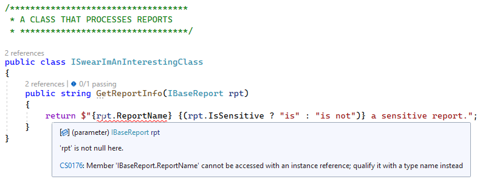
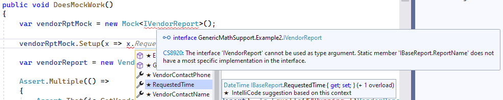

---
categories:
  - Coding
date: 2023-03-31T03:59:47Z
description: ""
draft: false
cover:
  image:
slug: whats-a-static-abstract-interface-method-in-c
summary: What are static abstract members (new in C# 11), what can we do with them, and how are they related to Generic Math? (part 1 of 3)
tags:
  - csharp-11
  - csharp
title: What is a static abstract interface method in C#?
---
This is post 1 in a 3-part series building up to the new C# 11 feature called [Generic Math](https://learn.microsoft.com/en-us/dotnet/csharp/whats-new/csharp-11#generic-math-support). Before tackling that though, let's check out another new C# 11 feature - the [static abstract interface method](https://learn.microsoft.com/en-us/dotnet/csharp/whats-new/tutorials/static-virtual-interface-members) (aka static virtual members).

1. What is a static abstract interface method in C#? *(this post)*
2. [Overloading arithmetic, equality, and comparison operators in C#](https://grantwinney.com/csharp-overload-arithmetic-equality-comparison-operators/)
3. [Generic Math Support in C# 11](https://grantwinney.com/csharp-generic-math-support/)

We'll look at how we use interfaces today, versus how we can use them with the new hotness in C# 11.

> The code in this article is available on [GitHub](https://github.com/grantwinney/CSharpDotNetExamples/tree/master/C%23%2011/GenericMathSupport/GenericMathSupport), if you'd like to use it in your own projects or just follow along while you read.

## The interfaces we know and love

We use interfaces a lot in C#. They're essentially contracts, so if a class implements a particular interface, then you can be confident that the class includes all the properties and methods defined in that interface. In the following example, `EmployeeReport` implements everything in `IEmployeeReport`, and `VendorReport` implements everything in `IVendorReport`.

Interfaces can extend one another too, like the two interfaces below are doing with `IBaseReport`. The classes need to implement everything in that base interface too, like the ones below are doing by defining `ReportName` and `IsSensitive`.

```csharp
/******************
 * BASE REPORT INTERFACE
 * *****************/

public interface IBaseReport
{
    string ReportName { get; }
    bool IsSensitive { get; }
}

/******************
 * EMPLOYEE REPORT w/ INTERFACE
 * *****************/

public interface IEmployeeReport : IBaseReport
{
    string Name { get; set; }
    DateTime HireDate { get; set; }
    DateTime? TermDate { get; set; }
}

public class EmployeeReport : IEmployeeReport
{
    public string ReportName => "Employee Profile";
    public bool IsSensitive => true;

    public string Name { get; set; }
    public DateTime HireDate { get; set; }
    public DateTime? TermDate { get; set; }
}

/******************
 * VENDOR REPORT CLASS w/ INTERFACE
 * *****************/

public interface IVendorReport : IBaseReport
{
    string VendorName { get; set; }
    string VendorContactName { get; set; }
    string VendorContactPhone { get; set; }
}

public class VendorReport : IVendorReport
{
    public string ReportName => "Vendor Summary";
    public bool IsSensitive => false;

    public string VendorName { get; set; }
    public string VendorContactName { get; set; }
    public string VendorContactPhone { get; set; }
}
```

Any method that might do something with one of these reports, can operate on the interface instead. The `GetReportInfo` method below is assured that anything implementing `IBaseReport` has 2 properties on it. And bonus - we don't need to define a method for each type of report, just one which can handle any report.

```csharp
/******************
 * A CLASS THAT PROCESSES REPORTS
 * *****************/

public class ISwearImAnInterestingClass
{
    public string GetVendorReportStatus(IVendorReport rpt)
    {
        // i.e. Running 'Vendor Summary' for: Acme Inc
        return $"Running '{rpt.ReportName}' for: {rpt.VendorName}";
    }

    public string GetReportInfo(IBaseReport rpt)
    {
        // i.e. Employee Profile is a sensitive report.
        return $"{rpt.ReportName} {(rpt.IsSensitive ? "is" : "is not")} a sensitive report.";
    }
}
```

Aside from acting as a contract and helping us write [DRY code](https://deviq.com/principles/dont-repeat-yourself), interfaces are useful for unit testing too. If you want to learn more about that, I've written before about how [interfaces help with mocking dependencies](https://grantwinney.com/what-is-mocking-a-dependency/) when unit testing.

However, something we _can't_ do with interfaces is define a static member and have classes implement those. For instance, if you knew you wanted every kind of report to have a `ReportName`, but you didn't want to have to instantiate a report just to get to a name that never changes, you couldn't do something like this...

```csharp
/******************
 * BASE REPORT INTERFACE
 * *****************/

public interface IBaseReport
{
    static string ReportName { get; }
    bool IsSensitive { get; }
}
```

The other method, the one that references the interface to get the `ReportName`, will suggest you use an actual instance to get to the static member. Ok sure... except this is an interface so you _can't_ just instantiate it. Maybe you could add some code in the `GetReportInfo` method below, to check for every possible report type that implements `IBaseReport` but then that'd make for some repetitive, hard-to-maintain code.



On top of that, the classes that implement the `IBaseReport` interface don't have to include that static member to satisfy the contract with the interface anymore. This _(which doesn't define ReportName)_ won't throw a compilation error:

```csharp
public class EmployeeReport : IEmployeeReport
{
    public bool IsSensitive => true;

    public string Name { get; set; }
    public DateTime HireDate { get; set; }
    public DateTime? TermDate { get; set; }
}
```

Okay, enough about interfaces...

## The new and improved interfaces

Just kidding! _More interfaces!_

The [static abstract](https://learn.microsoft.com/en-us/dotnet/csharp/whats-new/tutorials/static-virtual-interface-members) concept seems to have been mostly added to support [overloaded operators](https://learn.microsoft.com/en-us/dotnet/csharp/language-reference/operators/operator-overloading) and the other new concept of [generic math](https://learn.microsoft.com/en-us/dotnet/csharp/whats-new/csharp-11#generic-math-support), but let's take a look at what else we can do with it, without muddying the waters too much.

I've changed the `IBaseReport` interface (below) to use the new [static abstract](https://learn.microsoft.com/en-us/dotnet/csharp/whats-new/tutorials/static-virtual-interface-members) modifiers. For good measure, I've added in a `static abstract` method to show that those can be static too, and a normal property that's not static to demonstrate that we can have a mix.

Here's a few things to look for and keep in mind as you check out the similar, but not-quite-the-same block of code, below:

- The classes are _required_ to implement the static abstract members.
- The classes are required to implement the `GenerateUniqueId` method too, but _how_ they choose to implement that can differ wildly per class.
- The `GetReportInfo` method in that last class, and the `GetNewReportId` method I threw in too, are implemented differently than before. They're capable of accessing the normal members of an instance, as well as the static members of the class too.

```csharp
/******************
 * BASE REPORT INTERFACE WITH
 * STATIC ABSTRACT MEMBERS
 * *****************/

public interface IBaseReport
{
    static abstract string ReportName { get; }
    static abstract bool IsSensitive { get; }
    static abstract string GenerateUniqueId();
    DateTime RequestedTime { get; set; }
}

/******************
 * EMPLOYEE REPORT w/ INTERFACE
 * AND IMPLEMENTING STATIC MEMBERS
 * *****************/

public interface IEmployeeReport : IBaseReport
{
    string Name { get; set; }
    DateTime HireDate { get; set; }
    DateTime? TermDate { get; set; }
}

public class EmployeeReport : IEmployeeReport
{
    public static string ReportName => "Employee Profile";
    public static bool IsSensitive => true;
    public DateTime RequestedTime { get; set; }
    public static string GenerateUniqueId() =>
        $"{ReportName.Replace(" ","")}-{DateTime.Now:yyyy-MM-dd-hh-mm-ss:ffffff}";

    public string Name { get; set; }
    public DateTime HireDate { get; set; }
    public DateTime? TermDate { get; set; }
}

/******************
 * VENDOR REPORT CLASS w/ INTERFACE
 * AND IMPLEMENTING STATIC MEMBERS
 * *****************/

public interface IVendorReport : IBaseReport
{
    string VendorName { get; set; }
    string VendorContactName { get; set; }
    string VendorContactPhone { get; set; }
}

public class VendorReport : IVendorReport
{
    public static string ReportName => "Vendor Summary";
    public static bool IsSensitive => false;
    public DateTime RequestedTime { get; set; }
    public static string GenerateUniqueId() => $"{Guid.NewGuid()}";

    public string VendorName { get; set; }
    public string VendorContactName { get; set; }
    public string VendorContactPhone { get; set; }
}

/******************
 * A CLASS THAT PROCESSES REPORTS
 * *****************/

public class ISwearImAnInterestingClass
{
    public string GetVendorReportStatus(IVendorReport rpt)
    {
        return $"Running '{VendorReport.ReportName}' for: {rpt.VendorName}";
    }

    public string GetReportInfo<T>(T rpt) where T : IBaseReport
    {
        return $"{T.ReportName} was requested on {rpt.RequestedTime:d}.";
    }

    public string GetNewReportId<T>() where T : IBaseReport
        => T.GenerateUniqueId();
}
```

## What about unit tests?

Of course, it's always a good idea to create some tests _(and if you're using WinForms, you might want to brush up on_ [_using MVP to help with testing_](https://grantwinney.com/its-possible-to-test-a-winforms-app-using-mvp/)_)_ to make sure everything looks good, and to prove that the static abstract interface members, as weird as they might look, _do_ actually work.

```csharp
ISwearImAnInterestingClass ic;

[SetUp]
public void Setup()
{
    ic = new();
}

[Test]
public void ISwearImAnInterestingClass_ReturnsExpectedValues_ForEmployeeReport()
{
    var employeeReport = new EmployeeReport { Name = "Bob", HireDate = new DateTime(2010, 1, 1), RequestedTime = DateTime.Now };

    Assert.Multiple(() =>
    {
        Assert.That(ic.GetReportInfo(employeeReport), Does.StartWith($"{EmployeeReport.ReportName} was requested on "));
        Assert.That(ic.GetNewReportId<EmployeeReport>(), Does.StartWith("EmployeeProfile-20"));  // will fail in 2100 :p
    });
}

[Test]
public void ISwearImAnInterestingClass_ReturnsExpectedValues_ForVendorReport()
{
    var vendorReport = new VendorReport { VendorName = "Acme Inc", VendorContactName = "Mary", RequestedTime = DateTime.Now };

    Assert.Multiple(() =>
    {
        Assert.That(ic.GetVendorReportStatus(vendorReport), Is.EqualTo($"Running '{VendorReport.ReportName}' for: {vendorReport.VendorName}"));
        Assert.That(ic.GetReportInfo(vendorReport), Does.StartWith($"{VendorReport.ReportName} was requested on "));
        Assert.That(Guid.TryParse(ic.GetNewReportId<VendorReport>(), out var _), Is.True);
    });
}
```

Unfortunately, this new construct doesn't seem to play nicely yet with the popular [Moq](https://github.com/Moq/moq4?ref=grant-winney) framework that helps you mock out interface calls during testing. I'm most familiar with Moq, but maybe [JustMock](https://www.telerik.com/products/mocking.aspx?ref=grant-winney) or [TypeMock](http://www.typemock.com/?ref=grant-winney) supports it?



Next up, we'll check out another C# feature we've had for a long time - [operator overloading](https://grantwinney.com/csharp-overload-arithmetic-equality-comparison-operators/). After that, we'll take a closer look at what this [Generic Math](https://grantwinney.com/csharp-generic-math-support/) thing is all about.

If you found this content useful, and want to learn more about a variety of [C#](https://grantwinney.com/tags/csharp/) features, check out [this GitHub repo](https://github.com/grantwinney/CSharpDotNetExamples), where you'll find links to plenty more blog posts and practical examples!
