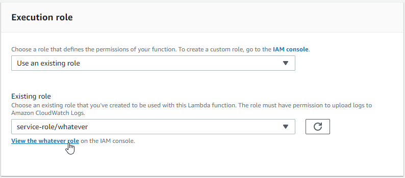
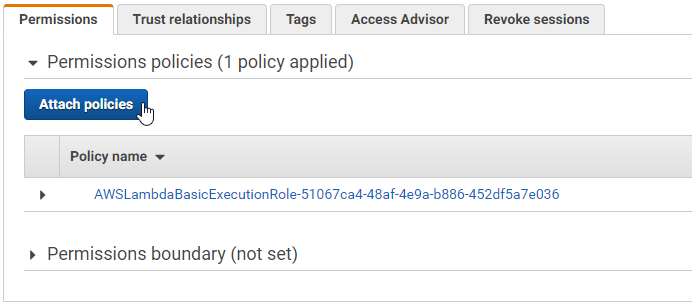
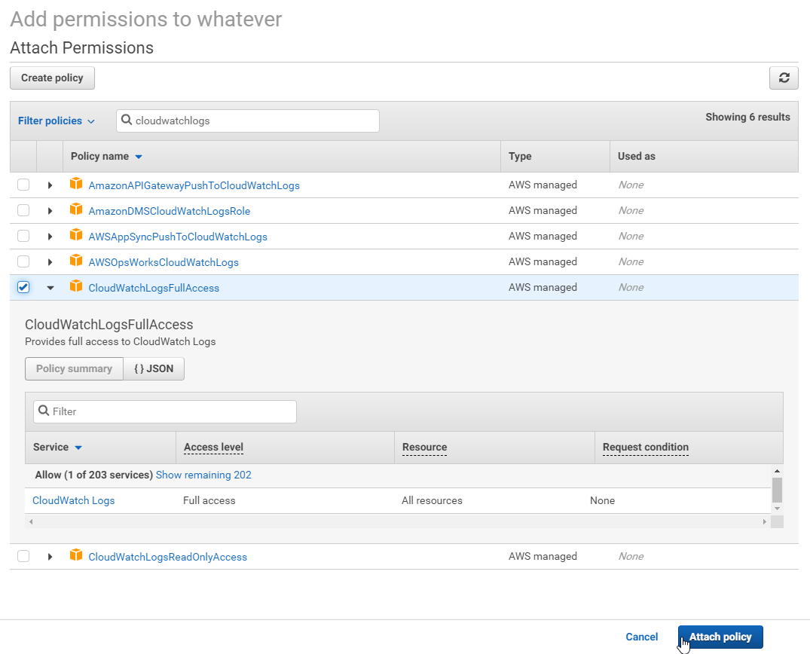
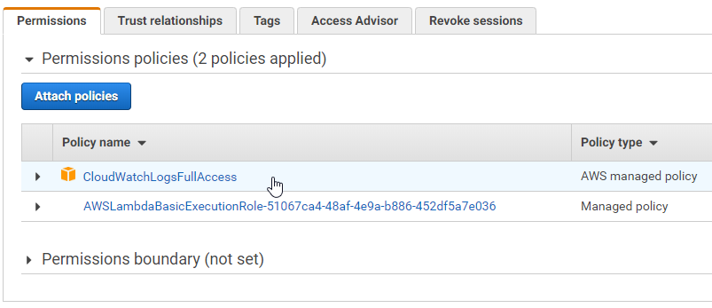
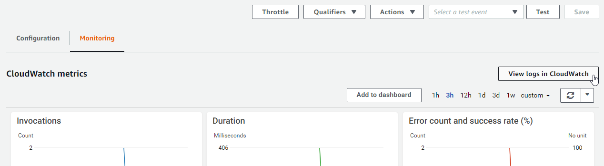
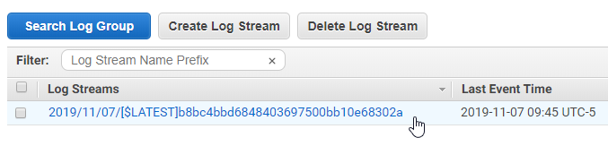
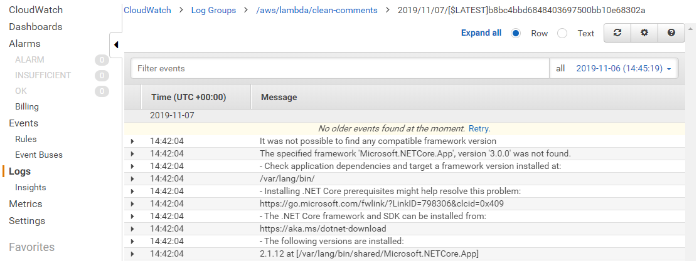
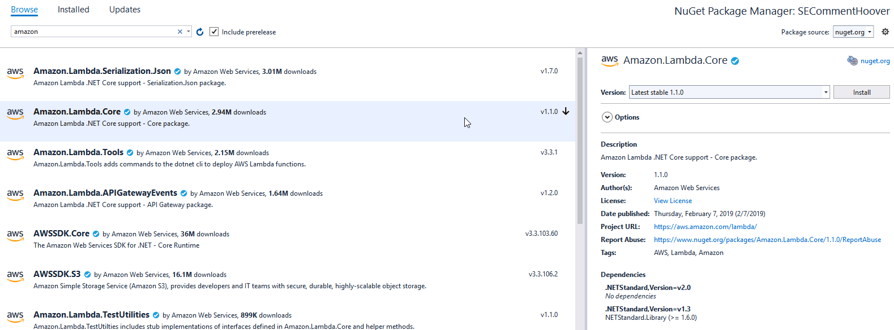

---
categories:
- AWS Lambda
date: "2019-11-07T18:04:08Z"
description: ""
draft: false
slug: where-are-my-logs-in-aws-lambda
summary: In a new AWS Lambda function, logging is initially disabled. Lets see how
  to enable it, for those times where additional detail is needed.
tags:
- AWS Lambda
title: Enable logging for an AWS Lambda job
---
I setup an AWS Lambda job recently, and then added a trigger to run it every morning. I checked it one morning and realized:

1. The job failed for some reason.
2. I had no idea what that reason _was,_ because nothing was written to the logs.

According to the [docs](https://docs.aws.amazon.com/lambda/latest/dg/dotnet-logging.html), all `Console.WriteLine` statements are logged:

> To output logs from your function code, you can use methods on the Console class, or any logging library that writes to stdout or stderr.

But all I got on the logs page was an error message... an awful, unhelpful message. I needed more detail into the failure, but how?

> There was an error loading Log Streams. Please try again by refreshing this page.

When creating a new Lambda job, logging is not configured by default. I'm sure there's reasons for it, but considering this is a service where jobs run headless, it seems pretty important to be able to jump in and quickly see _exactly_ why a job is failing. The metrics screens aren't enough.

So, if you've just setup a job and you're running into this same problem, check the execution role for your job, which "defines the permissions of your function". These permissions include the ability to write out to the logs (or a "log group" as they call it).

Look for this panel halfway down the screen for your function. Click the "View role" link:

You want to add a new policy, so click the big button that says "Attach policies".:

Type "cloudwatchlogs" into the filter, select "CloudWatchLogsFullAccess", and attach it:

Verify the new policy shows up on the previous screen.:

*Run your job again*, then click "View logs in CloudWatch".

You should see an entry, assuming your job wrote anything out.

Yay, logs. 🎉

My issue ended up being two separate problems:

- I targeted .NET Core 2.1 when I created the Lambda function (because that's the only one available), but my C# project targeted .NET Core 3.0. Oops.
- I also forgot to add a reference to `Amazon.Lambda.Core`, which is really easy to do since it's not used in the project nor required by any part of the project, but its absence will cause the job to fail when it runs on AWS. 🤦‍♂️

If that didn't do it for you, or you already had a comparable permission selected, here's some more helpful suggestions in this post by Dora Hodanic:

[Amazon Connect and Lambda logs: Error loading Log Streams / Blogs / Perficient](https://blogs.perficient.com/2018/02/12/error-loading-log-streams/)
