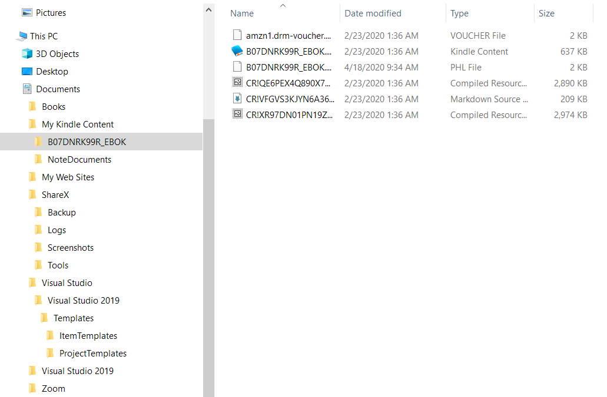
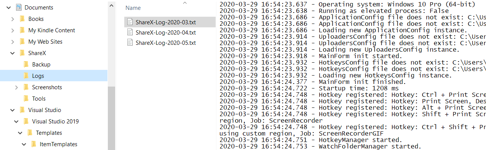
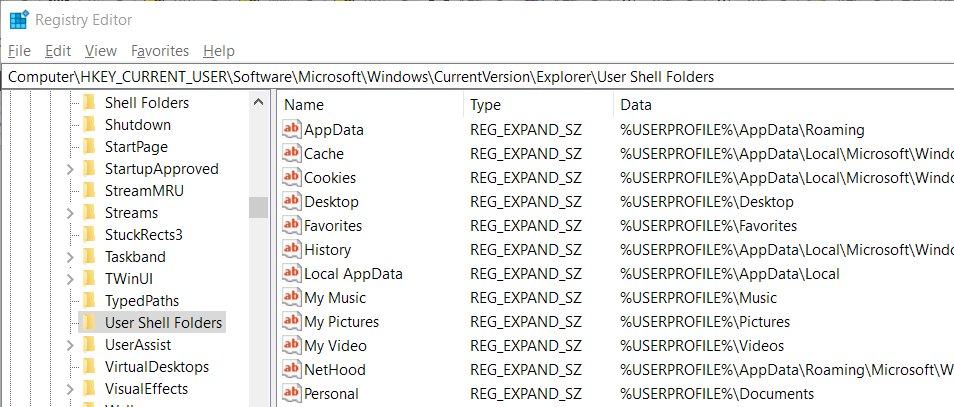

---
categories:
- Software Design
- Coding
date: "2020-05-22T03:59:32Z"
description: ""
draft: false
cover:
  image: photo-1569235186275-626cb53b83ce.jpg
slug: where-should-i-store-app-data-in-windows
summary: Windows sets certain locations aside for apps, and makes them easily discoverable
  for devs to use. Let's see how.
tags:
- Software Design
- Coding
title: Where should I store application data in Windows?
---
When it comes to writing software and deciding where to store the files an application needs to run, Windows makes it easy by setting certain areas of the system aside, and grouping them into two general categories.

- Files an app requires to run, or creates while running (i.e. logs), should go in program files, application data, etc. Keep them away from the user - they generally shouldn't know they're there.
- Files a user creates with the app (i.e. a spreadsheet in Excel) should go in my documents, music, desktop, etc. Keep them near and dear to the user, so they can find them again, back them up, sync them using Dropbox, share them, whatever. They're interested in those for sure.

These special folders aren't necessarily a specific location. They vary by version of Windows, and users can even change their location manually. But that doesn't matter, because Windows abstracts away the exact location to make life easier for developers, and you should take advantage of that.

## Why's it matter?

Here's what my _My Documents_ currently looks like - loads of stuff I shouldn't be aware most of the time. Amazon is storing encrypted ebook files that are useless outside their app, ShareX is storing log files and plugins, Microsoft some default templates, and Zoom.. an empty directory.





I've got this nice little area that's supposed to be just mine, but everyone decided to run everything through it. If I want to sync _My Documents_ between several machines, I don't need ShareX's logs on both. I can install the Kindle app on multiple machines and it'll download books, so those encrypted files are unnecessary.

## What can we do?

Windows has had the concept of special folders for decades, going all the way back to Windows 95. The folders are visible in the registry editor, but don't rely on them there.. it's a [long and sad story](https://devblogs.microsoft.com/oldnewthing/20031103-00/?p=41973) apparently. On a side note, let no one say Microsoft takes backwards compatibility lightly.



Special folders in the registry editor

Raymond Chen's article references the outdated Windows API calls for getting special folders, but the new hotness is [SHGetKnownFolderPath](https://docs.microsoft.com/en-us/windows/win32/api/shlobj_core/nf-shlobj_core-shgetknownfolderpath) (although [SHGetFolderPath](https://docs.microsoft.com/en-us/windows/win32/api/shlobj_core/nf-shlobj_core-shgetfolderpatha) works as well, and simply calls the former).

### Example: C++

If you're using c++, here's something I cobbled together that uses the `SHGetKnownFolderPath` function directly.

```c++
#include <windows.h>
#include <iostream>
#include <shlobj.h>
using namespace std;

#pragma comment(lib, "shell32.lib")

int main() {
    PWSTR path = NULL;
    HRESULT result = SHGetKnownFolderPath(FOLDERID_Documents, 0, NULL, &path);

    if (result != S_OK)
        std::cout << "Error: " << result << "\n";
    else
        wprintf(L"%ls\n", path);

    cin.get();  // pause to view result
    return 0;
}

// output: C:\Users\Grant\Documents
```

### Example: C\#

The .NET Framework makes life easier, by [wrapping the API call](https://referencesource.microsoft.com/#mscorlib/system/environment.cs,1445) for us.

```csharp
using System
using static System.Environment;

namespace GetKnownFolder
{
    class Program
    {
        static void Main(string[] args)
        {
            Console.WriteLine(GetFolderPath(SpecialFolder.MyDocuments));
            Console.ReadLine();
        }
    }
}

// output: C:\Users\Grant\Documents
```

.NET Framework

```csharp
int hresult =
  Win32Native.SHGetFolderPath(
    IntPtr.Zero,                    /* hwndOwner: [in] Reserved */
    ((int)folder | (int)option),    /* nFolder:   [in] CSIDL    */
    IntPtr.Zero,                    /* hToken:    [in] access token */
    Win32Native.SHGFP_TYPE_CURRENT, /* dwFlags:   [in] retrieve current path */
    sb);                            /* pszPath:   [out]resultant path */
```

Behind the scenes

### Example: Python

In Python, you can [install pywin32](https://pypi.org/project/pywin32/227/) (a wrapper for the Win32 API calls) and specify a [constant special item ID list](https://docs.microsoft.com/en-us/windows/win32/shell/csidl) (CSIDL) value. _(I don't know Python that well, so this might only work for Python 2, and there might be newer constructs in Python 2 and 3.)_

```python
from win32com.shell import shell, shellcon
print shell.SHGetFolderPath(0, shellcon.CSIDL_MYPICTURES, None, 0)
print shell.SHGetFolderPath(0, shellcon.CSIDL_PERSONAL, None, 0)

# Output:
# C:\Users\Grant\Pictures
# C:\Users\Grant\Documents
```

The point is, when we're writing something for Windows that needs access to the file system, in _any_ language, it's highly likely there's a way to access the special system folders.

We should strive to store anything our apps need in application data, or local data, or local application data, or really anything with "application" or "program" in the name. Because _My Documents_ is mine all mine. 🙂
