---
categories:
  - Coding
date: 2022-12-31T17:18:11Z
description: ""
draft: false
cover:
  image: photo-1515378960530-7c0da6231fb1.jpg
slug: why-do-i-need-to-install-an-extension-just-to-copy-paste
summary: I was creating a document in Office365 the other day - something I've done a hundred times - but when I tried to paste with their custom right-click menu I was greeted with a popup telling me to download a browser addon. Well, that's weird.
tags:
  - security
  - browser-extension
  - code-review
title: Why do I need to install an extension just to copy/paste?
---
I was creating a document in Office365 the other day - something I've done a hundred times - but when I tried to paste something into the document with their custom right-click menu (the keyword here is "custom", but more on that later), I was greeted with the following popup. Well, that's weird.

Apparently, every time I've pasted into a document the past few years, I've just hit Ctrl+V without thinking about it? That seems unlikely, but it's even less likely that the online app was just upgraded and was using the native context menu before. Either way, I don't know why I decided to right-click this time, but since I did and got an oddball popup, it begs the question... _why_?

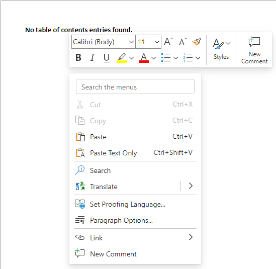

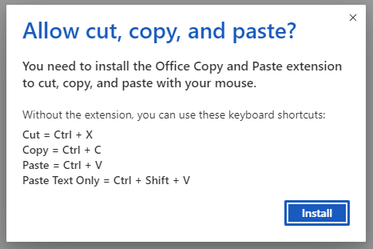

Judging by the ten million users of the [Office - Enable Copy and Paste](https://chrome.google.com/webstore/detail/office-enable-copy-and-pa/ifbmcpbgkhlpfcodhjhdbllhiaomkdej/related) extension, versus a few hundred reviews, it's pretty obvious most people just figure whatever, you present a hoop so I jump. Can't blame them.. technology is weird and confusing, and getting weirder and more confusing all the time.

Are the comments fair though? People assume that Microsoft has somehow managed to screw up something as basic as copy/paste, and instead of fixing said basic issue, they've decided to write an entire extension that simply shouldn't be required.

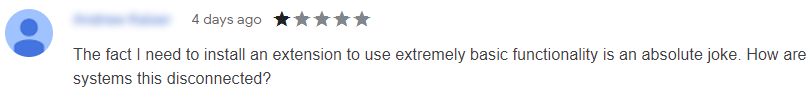


The last one is really amusing. It's much easier to write a scathing review than spend 10 seconds checking the obvious thing first. Google Docs has a custom context menu too.. do they know something Microsoft doesn't?

Nope.

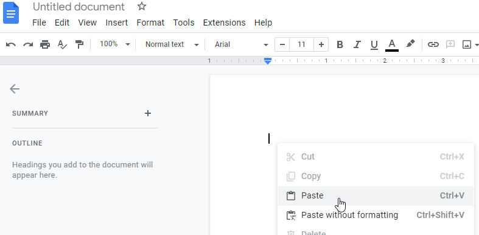

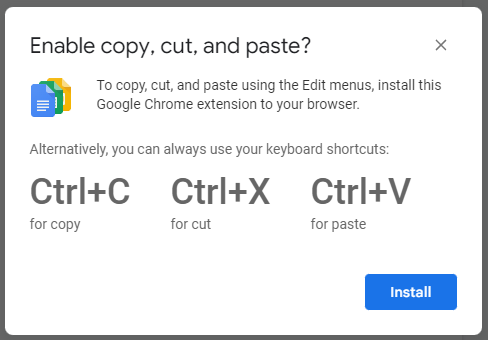

The [Google Docs Offline](https://chrome.google.com/webstore/detail/google-docs-offline/ghbmnnjooekpmoecnnnilnnbdlolhkhi) extension bundles way more than just enabling copy/paste into their addon. They have a similar number of users as Microsoft's, but 10x as many poor reviews, because apparently it's all kinds of broken. But the copy/paste functionality is required for the same reason as Microsoft's - they created a custom context menu.

## What if websites could (still) read your clipboard without you knowing?

Time for a short history lesson.

Going way back, it used to be possible for _any_ website to [read from your clipboard](https://devblogs.microsoft.com/scripting/how-can-i-grab-a-url-from-the-clipboard-and-then-open-that-web-site-in-a-browser/) in IE, without you having to choose to "paste" it. That article was actually posted on Microsoft's dev blogs, of all places, and ScriptingGuy1 seemed to feel it was an undocumented _feature,_ and not a horrible glaring oversight. Other sites clearly recognized it for [the exploit that it was](https://www.arstdesign.com/articles/clipboardexploit.html). Imagine how many of us were screwed by this and never realized it.

You'd think if the site you were visiting was legit then you'd be fine, but check out that second article above. How much do you want to bet some very legit sites had commenting systems that would allow someone to post a bit of script, which would then get run every time someone visited the page and all the comments loaded? Imagine you were just on your banking website and had your password on the clipboard for some reason? Or maybe your checking account routing number? Or really, anything in the world that you happened to copy, and figured was safe.

Just as nefarious sites, and legit sites with nefarious code, can no longer access your clipboard without your manual intervention, Office365 and Google Docs can't either. Copying something _to_ your clipboard isn't as big a deal, because at least that doesn't tell them anything, but they definitely shouldn't be able to read _from_ it (when you choose to do a "paste") without your consent.

## Microsoft's and Google's workaround - custom browser addons

If they had stuck with the standard context menu like practically every other site does, there wouldn't be an issue. The browser handles the copy/paste, you trust the browser, and it won't just send that stuff to a website without your manual intervention (i.e. pressing Ctrl+V).

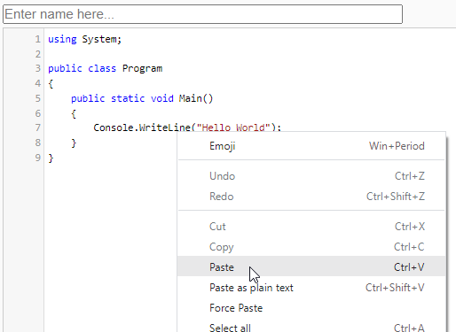

Instead, they decided to write lengthy addons that allow their custom context menus to work by requesting access to the [clipboardRead permission](https://developer.mozilla.org/en-US/docs/Mozilla/Add-ons/WebExtensions/Interact_with_the_clipboard#reading_from_the_clipboard).

### Microsoft

[Microsoft's](https://chrome.google.com/webstore/detail/office-enable-copy-and-pa/ifbmcpbgkhlpfcodhjhdbllhiaomkdej) is the more basic of the two, requesting the [clipboardRead permission](https://developer.mozilla.org/en-US/docs/Mozilla/Add-ons/WebExtensions/Interact_with_the_clipboard#reading_from_the_clipboard) and running on the following sites (all Microsoft domains, except that last one that seems to be a DoD site). There's a lot of code to handle different types of data that might be stored on the clipboard, but from what I can tell that's pretty much all it's doing.

```json
"externally_connectable": {
    "matches": [
        "https://*.officeapps.live.com/*",
        "https://*.partner.officewebapps.cn/*",
        "https://*.gov.online.office365.us/*",
        "https://*.dod.online.office365.us/*",
        "https://project.microsoft.com/*",
        "https://*.whiteboard.microsoft.com/*",
        "https://whiteboard.office.com/*",
        "https://whiteboard.office365.us/*",
        "https://whiteboard.apps.mil/*"
    ]
},
"permissions": [
    "clipboardRead"
],
```

When you install it, you get a straight-forward prompt to allow the permission.

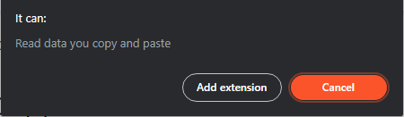

### Google

[Google's](https://chrome.google.com/webstore/detail/google-docs-offline/ghbmnnjooekpmoecnnnilnnbdlolhkhi) is bundled with a bunch of other functionality, as I mentioned earlier. They request the clipboardRead permission too, but in a funny way. First, they request access to unlimited storage, alarms, etc., for a series of sites:

```json
"externally_connectable": {
    "matches": [
        "https://docs.google.com/*",
        "https://drive.google.com/*",
        "https://drive-daily-0.corp.google.com/*",
        "https://drive-daily-1.corp.google.com/*",
        "https://drive-daily-2.corp.google.com/*",
        "https://drive-daily-3.corp.google.com/*",
        "https://drive-daily-4.corp.google.com/*",
        "https://drive-daily-5.corp.google.com/*",
        "https://drive-daily-6.corp.google.com/*"
    ]
},
"permissions": [
    "alarms",
    "storage",
    "unlimitedStorage",
    "https://docs.google.com/*",
    "https://drive.google.com/*"
],
```

Then in a separate section, they request the clipboard permissions. I can't find anything on "content_capabilities", except a bit of [source code](https://source.chromium.org/chromium/chromium/src/+/main:extensions/common/api/_manifest_features.json;l=96) in Chromium that suggests it's only allowed for a few Google sites. Ooookay.

```json
"content_capabilities": {
    "matches": [
        "https://docs.google.com/*",
        "https://drive.google.com/*",
        "https://drive-daily-0.corp.google.com/*",
        "https://drive-daily-1.corp.google.com/*",
        "https://drive-daily-2.corp.google.com/*",
        "https://drive-daily-3.corp.google.com/*",
        "https://drive-daily-4.corp.google.com/*",
        "https://drive-daily-5.corp.google.com/*",
        "https://drive-daily-6.corp.google.com/*"
    ],
    "permissions": [
        "clipboardRead",
        "clipboardWrite",
        "unlimitedStorage"
    ]
},
```

Even though installing the addon adds the ability to read from your clipboard in Google Docs, you don't get a prompt warning you of that fact when you install it.

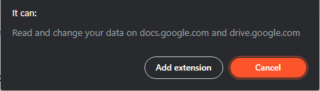

## The Clipboard API - a better solution?

What's interesting to me is how Microsoft and Google have chosen to handle the issue. There's a whole [Clipboard API](https://developer.mozilla.org/en-US/docs/Web/API/Clipboard_API) that would eliminate the need for these addons, and it seems far easier to use than what they've created. The [clipboard.readText](https://developer.mozilla.org/en-US/docs/Web/API/Clipboard/readText) function, for example, just requests the browser to allow access to the clipboard. Then the browser prompts you, and asks if you'd like to honor that request, and if so then for how long?


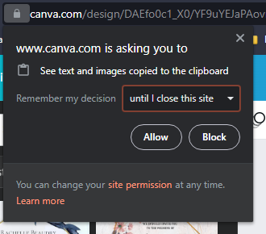

You can easily use it yourself with very minimal coding, like I did below. Before you play with it, two things:

1. The code below is entirely client-side.. I don't know what's on your clipboard, nor do I care.
2. After you try it, you can open settings and set Clipboard back to the default "ask" here: chrome://settings/content/siteDetails?site=https%3A%2F%2Fgrantwinney.com%2F

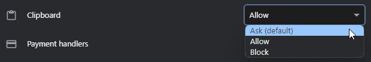

Back to the example. Select some text from somewhere (anywhere), and press "Read Clipboard". You'll be prompted to allow this site to access your clipboard, which is the whole point. You're in control. If you allow access, it'll read whatever text is on the clipboard and display it in the input field.

```html
<button id="testButton">Read Clipboard</button>
<input id="testOutput" type="text">

<script>
document.getElementById("testButton").addEventListener('click', () =>
  navigator.clipboard.readText()
    .then((clipText) => document.getElementById("testOutput").value = clipText));
</script>
```

If you need to read other [mime types](https://developer.mozilla.org/en-US/docs/Web/HTTP/Basics_of_HTTP/MIME_types) (like images), then there's a more general [clipboard.read](https://developer.mozilla.org/en-US/docs/Web/API/Clipboard/read) API call. It does more, allowing you to iterate through all the various types of items on the clipboard, but it's more complicated to implement. Per the MDN link above, it looks like there's decent support for it, but not full support yet. Edge and Opera seem to support it, Chrome supports it somewhat, and Firefox doesn't really yet.

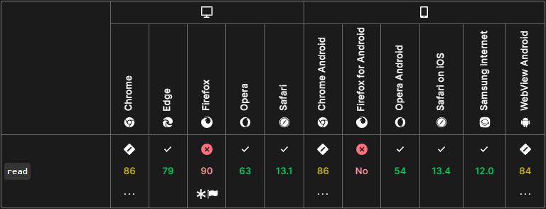

		And that, I think, is why Microsoft and Chrome still need their extensions. They probably wrote them before the above API existed in any form, and even now they can't really dump them because the support isn't fully there. Hopefully it will be soon.

If you want to learn more, here's a couple other interesting articles too:

- [Why can't I copy and paste in Google Docs? | Zapier](https://zapier.com/blog/why-cant-you-copy-and-paste-in-google-docs/)
- [Why your browser doesn't like copy and paste](https://www.usatoday.com/story/tech/columnist/2014/04/13/copy-and-paste-in-google-docs/7568661/)
