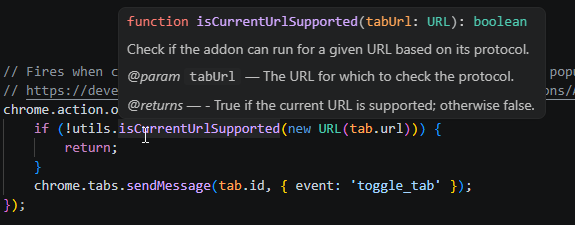

It's probably a good sign that you've found the right career for yourself, when you spend time over the weekend on a small project that uses the same skills you spent all week using professionally! Or maybe it's unhealthy, who's to say? 🙄

I spent a few hours this weekend cleaning up, commenting, and bug-fixing a browser addon I created quite a few years ago. I rarely touch it more than once a year or so, which is good since uploading new versions is a multi-step process involving an "approval" [that](https://techgyo.com/researcher-uncovers-sketchy-chrome-extensions-with-4-million-installs) [has](https://www.kaspersky.com/blog/suspicious-chrome-extensions-with-6-million-installs/53529/) [questionable](https://www.malwarebytes.com/blog/news/2025/07/millions-of-people-spied-on-by-malicious-browser-extensions-in-chrome-and-edge) [value](https://www.techradar.com/pro/security/fake-chrome-ai-extensions-targeted-over-300-000-users-to-steal-emails-personal-data-and-more). But I digress...

## Better code reuse with ES modules

Keeping a codebase [DRY](https://www.geeksforgeeks.org/software-engineering/dont-repeat-yourselfdry-in-software-development/) is something every dev should strive for, as much as possible. If the same code is copied several times, then they all need to be updated every time there's a change. At some point, they'll start to diverge as one gets updated and the others don't, until nothing's quite the same anymore. No es bueno.

I had some duplicate code though, because I couldn't figure out how to reference it from all the various parts of the addon, but I fixed that and learned a few things in the process.

### Calling ES modules from a service worker

[Background service workers](https://developer.mozilla.org/en-US/docs/Mozilla/Add-ons/WebExtensions/manifest.json/background) can be specified as ES modules in the `manifest.json` file, which allows them to import code from other files, simply by adding a "type":

```json
"background": {
    "service_worker": "js/bg-service-worker.js",
    "type": "module"
},
```

After that, add `export` to the front of any "shared" functions:

```js
export function log(message, isError = false) {
    if (isError) {
        console.error(`[${chrome.runtime.getManifest().name}]: ${message}`);
    } else {
        console.info(`[${chrome.runtime.getManifest().name}]: ${message}`);
    }
}
```

And import them into the service worker:

```js
import * as utils from './shared-utils.js';

chrome.runtime.onMessage.addListener(function (message, sender, sendResponse) {
    if (message.event !== 'comments_hidden' && message.event !== 'comments_shown') {
        utils.log(`background script not configured to run for message event: '${message.event}'`);
        return;
    }
    ...
    ...
}
```

I didn't _need_ to do this, but it's a nice thing to learn about, that JS code can be organized and encapsulated in a way that seems similar to other languages. Reminds me of Python.

### Calling ES modules from a content script

The context for a background service worker is outside of any individual tab, and the code above works for those. Annoyingly, content scripts, which run inside of individual tabs, don't play nicely with ES modules. That was a big reason I had duplicate code.

But then I came across a [post from 2018](https://stackoverflow.com/a/53033388) where user [otiai10](https://otiai10.com/) suggested using a dynamic [import()](https://developer.mozilla.org/en-US/docs/Web/JavaScript/Reference/Operators/import). From the MDN page, this sounds like exactly what I needed to load an ES module from vanilla JS.

> The **`import()`** syntax, commonly called _dynamic import_, is a function-like expression that allows loading an ECMAScript module asynchronously and dynamically into a potentially non-module environment.

To get it to work, I just had to take the entry point code in the content script that's called whenever the content script loads:

```js
chrome.runtime.onMessage.addListener(function (message, _sender, _sendResponse) {
    switch (message.event) {
        case 'update_tab':
            adjustCommentsVisibility();
            break;
        case 'toggle_tab':
            toggleCommentVisibility()
            break;
        default:
            log(`content script received unexpected event: ${message.event}`, true);
    }
});

insertStylesIntoPage();
```

And put it in an exported function (which I named "main"):

```js
export function main() {
    chrome.runtime.onMessage.addListener(function (message, _sender, _sendResponse) {
        switch (message.event) {
            case 'update_tab':
                adjustCommentsVisibility();
                break;
            case 'toggle_tab':
                toggleCommentVisibility()
                break;
            default:
                utils.log(`content script received unexpected event: ${message.event}`, true);
        }
    });

    insertStylesIntoPage();
```

Then create a _new_ content script, whose sole purpose is to call the exported `main` function in the file that was _previously_ the content script:

```js
(async () => {
  const src = chrome.runtime.getURL('js/content-main.js');
  const contentScript = await import(src);
  contentScript.main();
})();
```

And finally, declare the imported script in the "manifest.json" file as a web-accessible resource. I'm not sure I had to add "js/shared-utils.js" actually, but it doesn't seem to hurt anything. Might not be necessary though.

```json
"content_scripts": [
    {
        "matches": ["<all_urls>"],
        "js": ["js/content-script.js"],
        "run_at": "document_start"
    }
],
"web_accessible_resources": [{
    "matches": ["<all_urls>"],
    "resources": [
        "js/shared-utils.js",
        "js/content-main.js"
    ]
}],
```

## Better file change detection with etag headers

When I started this addon, I created two separate JSON files that it checks on a regular basis. One has a list of all the CSS elements to block for each website, but the other had only a single value - a version number. Both are cached in `storage.local` and checked daily. Every time I modified the list of CSS elements, I also bumped the version number in the other file.

My thinking was that updates are fairly rare, and downloading a small JSON file with a version number in it, and then comparing that before downloading the larger file, was better. A tiny optimization, but why not. The caveat was that if I forgot to bump the version, then whatever changes I made to the other file would go unnoticed. The addon wouldn't grab them if the version number didn't change.

And then I read about the [If-None-Match](https://developer.mozilla.org/en-US/docs/Web/HTTP/Reference/Headers/If-None-Match) and [If-Modified-Since](https://developer.mozilla.org/en-US/docs/Web/HTTP/Reference/Headers/If-Modified-Since) headers, which is much better. My thinking was correct, but my approach reinvented the wheel. You can [read more here](https://web.dev/articles/http-cache), but if a server supports the etag header, then:

- Requesting data can also return a unique hash code representing that data, which can be cached.
- Subsequent requests using that cached value cause a 304 Not Modified response if the data hasn't changed.
- If the data _has_ changed, the request returns a 200 with the data, and a new hash code to cache.
- GitHub [supports the etag header](https://docs.github.com/en/rest/using-the-rest-api/best-practices-for-using-the-rest-api?apiVersion=2026-03-10&utm_source=chatgpt.com#use-conditional-requests-if-appropriate) from api.github.com, and after a little testing, it supports it when requesting files from raw.githubusercontent.com too.

So a block of code like the one I use in the addon makes a request and passes the etag value. If the data hasn't changed, it'll get only a 304; otherwise, it receives a 200 and caches the updated CSS elements.

```js
const eTagData = await chrome.storage.local.get('etag');
const eTag = eTagData.etag;
const response = await fetch(SITES_JSON, {
    headers: eTag  ? { 'If-None-Match': eTag  } : {}
});
if (response.status === 304) { /* Not modified since last check, so no need to update local definitions */
    await chrome.storage.local.set({ 'definition_version_last_check': getCurrentSeconds() });
    if (notUpdatedAction) {
        notUpdatedAction();
    }
} else if (response.status === 200) { /* Updated definitions retrieved successfully */
    await chrome.storage.local.set({ 'definition_version_last_check': getCurrentSeconds() });
    let newEtag = response.headers.get("ETag");
    if (newEtag) {
        await chrome.storage.local.set({ 'etag': newEtag });
        let data = await response.json();
        await chrome.storage.local.set({ 'global_definitions': JSON.stringify(data) });
        if (updatedAction) {
            updatedAction();
        }
    }
} else {
    log(`Unable to retrieve the latest definitions: (${response.status}) ${response.statusText}`, true);
}
```

That's better than what I had before, since it only requires a single request no matter what. The server determines whether it sends the data back with a 200, or just sends a 304 response.

## Better comments with JSDoc

I have a lot of comments in the addon, all using the `//` symbol. After reading up on [JSDoc](https://jsdoc.app/), I updated quite a few of them (but not nearly all yet) to use the JSDoc syntax. I'm not running any tool over the codebase to create documentation or anything.. what I really wanted was to get tooltips in VSCode to make life a little easier when I'm updating the code, and VSCode can use the JSDoc comments to do that.

As a bonus, it forces me to think about what each parameter does, and what the type is that the function expects.

```js
/**
 * Check if the addon can run for a given URL based on its protocol.
 * 
 * @param {URL} tabUrl - The URL for which to check the protocol.
 * @returns {boolean} - True if the current URL is supported; otherwise false.
 */
export function isCurrentUrlSupported(tabUrl) {
    return !INVALID_PROTOCOLS.some(p => tabUrl.protocol.startsWith(p))
        && !INVALID_SITES.some(p => tabUrl.hostname.startsWith(p));
}
```



I'll probably get around to updating the other comments too, at some point, and switching out all my `.then` promise types of calls to be `async/await` (there's some heavily nested chunks of code that are kinda ugly), but right now the addon works well and after spending a weekend updating it I think I'm good to shelve it again for awhile!
