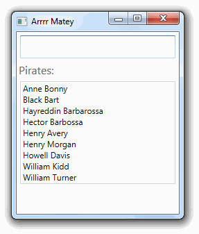

---
categories:
  - Coding
date: 2014-12-07T09:13:17Z
description: ""
draft: false
cover:
  image: photo-1514927298007-a2b56e5270e1.jpg
slug: wpf-filtering-listview-using-textbox-and-collectionviewsource
summary: In WPF, a ListView allows for quite a bit of flexibility. Let's take a look at filtering a ListView, using input being typed into a TextBox.
tags:
  - wpf
  - csharp
title: Filtering a ListView in WPF Using a TextBox and CollectionViewSource
---
I was recently asked to provide a field users could type in, that would filter a ListView with up to a couple hundred names in real-time.

> If you'd like to follow along while you read, the code in this article is available on <a href="https://github.com/grantwinney/BlogCodeSamples/tree/master/Frameworks/WPF/CollectionViewSourceSample">GitHub</a>.

In WinForms, filtering is easy – a few settings on a ComboBox control, set the data source, and off you go. Although WPF is a bit more complex, it provides for more flexibility out of the box like grouping and sorting, although we'll only look at filtering for now.

## Data Binding in a ListView

One of the biggest strengths in WPF is in binding. As developers, we regularly bind to data – collections of numbers and strings, dates and classes. We present these to our users in grids, combo boxes, list views, etc.

*When we bind a collection to a `ListView` in WPF, there's another layer between the control and the collection it's binding to, and that's the `CollectionView`.*

### The CollectionView Class

Much like a database table vs a view, or a `DataTable` vs a `DataView`, *the `CollectionView` allows us to manipulate the _presentation_ of a collection of data without affecting the underlying data.* Per [MSDN](http://msdn.microsoft.com/en-us/library/system.windows.data.collectionview\(v=vs.110\).aspx):

> You can think of a collection view as a layer on top of a binding source collection that allows you to navigate and display the collection based on sort, filter, and group queries, all without having to manipulate the underlying source collection itself.

But the documentation advises against creating a `CollectionView` ourselves, so how do we take advantage of its capabilities? From the same source:

> In WPF applications, all collections have an associated default collection view. Rather than working with the collection directly, the binding engine always accesses the collection through the associated view.

We don’t have to create a `CollectionView` because WPF does it for us. That's convenient! Let's find out how to access and manipulate that default view.

### The CollectionViewSource Class

Similar to how you can access the default view of a `DataTable` using the (appropriately named) `DataTable.DefaultView`, we can also access a collection's default view using `CollectionViewSource.GetDefaultView()`.

From [MSDN](http://msdn.microsoft.com/en-us/library/system.windows.data.collectionviewsource.getdefaultview\(v=vs.110\).aspx) again, the following restates some of what we just learned, but with an additional important note about how the default binding works for multiple controls _(emphasis mine)_.

> All collections have a default CollectionView. WPF always binds to a view rather than a collection. **If you bind directly to a collection, WPF actually binds to the default view for that collection.** This default view is shared by all bindings to the collection, which causes all direct bindings to the collection to share the sort, filter, group, and current item characteristics of the one default view.

Once we have a reference to the default view, what can we do with it?

> Views allow the same data collection to be viewed in different ways, depending on sorting, filtering, or grouping criteria. Every collection has one shared default view, which is used as the actual binding source when a binding specifies a collection as its source.

Let's take a look at filtering in action.

## Filtering in a ListView

We'll start by creating a `Pirate` class, to eventually bind to a `ListView`:

```csharp
public class Pirate
{
    public Pirate(string firstName, string lastName)
    {
        FirstName = firstName;
        LastName = lastName;
    }
 
    public string FirstName { get; private set; }
    public string LastName { get; private set; }
 
    public string FullName
    {
        get { return string.Format("{0} {1}", FirstName, LastName); }
    }
}
```

Then we'll create a `ViewModel` that create a list of pirates:

```csharp
public class MainWindowViewModel
{
    public MainWindowViewModel()
    {
        Pirates = new List<Pirate>
                  {
                      new Pirate("Anne", "Bonny"),
                      new Pirate("Black", "Bart"),
                      new Pirate("Hayreddin", "Barbarossa"),
                      new Pirate("Hector", "Barbossa"),
                      new Pirate("Henry", "Avery"),
                      new Pirate("Henry", "Morgan"),
                      new Pirate("Howell", "Davis"),
                      new Pirate("William", "Kidd"),
                      new Pirate("William", "Turner"),
                  };
    }
 
    public List<Pirate> Pirates { get; set; }
 
    public Pirate SelectedPirate { get; set; }
}
```

Now we need the XAML, with a `ListView` and `TextBox`:

```xaml
<Window x:Class="CollectionViewSourceSample.MainWindow"
        xmlns="http://schemas.microsoft.com/winfx/2006/xaml/presentation"
        xmlns:x="http://schemas.microsoft.com/winfx/2006/xaml"
        xmlns:mc="http://schemas.openxmlformats.org/markup-compatibility/2006"
        mc:Ignorable="d"
        xmlns:d="http://schemas.microsoft.com/expression/blend/2008"
        xmlns:collectionViewSourceSample="clr-namespace:CollectionViewSourceSample"
        d:DataContext="{d:DesignInstance collectionViewSourceSample:MainWindowViewModel}"
        Title="Arrrr Matey" Width="250" Height="300" Background="WhiteSmoke"
        Loaded="MainWindow_OnLoaded">
    <StackPanel>
        <TextBox Name="PiratesFilter"
                 TextChanged="PiratesFilter_OnTextChanged"
                 Margin="5" FontSize="20" />
 
        <TextBox IsEnabled="False" Text="Pirates:"
                 FontSize="16" BorderThickness="0" />
 
        <ListView Name="PiratesListView"
                  ItemsSource="{Binding Path=Pirates}"
                  SelectedValue="{Binding Path=SelectedPirate}"
                  DisplayMemberPath="FullName"
                  BorderBrush="LightGray" Margin="5" />
    </StackPanel>
</Window>
```

Here we're binding the `Pirates` collection to `PiratesListView`, and using the `TextBox` named `PiratesFilter` to help filter the contents of the list.

Finally, a few lines of code in the code-behind file help us wire up the filtering mechanism. _(If there's a way to define this in the XAML too, I'd like to hear about it, but this works just fine too.)_

```csharp
public partial class MainWindow
{
    public MainWindow()
    {
        InitializeComponent();
 
        DataContext = new MainWindowViewModel();
    }
 
    private void MainWindow_OnLoaded(object sender, RoutedEventArgs e)
    {
        CollectionViewSource.GetDefaultView(PiratesListView.ItemsSource).Filter = UserFilter;
    }
 
    private void PiratesFilter_OnTextChanged(object sender, TextChangedEventArgs e)
    {
        CollectionViewSource.GetDefaultView(PiratesListView.ItemsSource).Refresh();
    }
 
    private bool UserFilter(object item)
    {
        if (String.IsNullOrEmpty(PiratesFilter.Text))
            return true;
 
        var pirate = (Pirate)item;
 
        return (pirate.FirstName.StartsWith(PiratesFilter.Text, StringComparison.OrdinalIgnoreCase)
                || pirate.LastName.StartsWith(PiratesFilter.Text, StringComparison.OrdinalIgnoreCase));
    }
}
```

In the `OnLoaded` event, we've attached a delegate to the [Filter](http://msdn.microsoft.com/en-us/library/system.windows.data.collectionview.filter\(v=vs.110\).aspx) property, which runs the `UserFilter` method against each item in the collection to determine if it should be displayed in the `ListView`. That's it!



### Manually Refreshing the View

Most of the time, WPF applies the filter automatically for us, without doing anything extra. However, if our code is performing some heavy calculations, we may want to have more control over the timing of when the filter is applied.

**It's possible to manually** [**refresh**](http://msdn.microsoft.com/en-us/library/system.windows.data.collectionview.refresh\(v=vs.110\).aspx) **the view, even though most of the time it's unnecessary**:

> When you set the [Filter](https://learn.microsoft.com/en-us/dotnet/api/system.windows.data.collectionview.filter?view=windowsdesktop-8.0), [SortDescriptions](https://learn.microsoft.com/en-us/dotnet/api/system.windows.data.collectionview.sortdescriptions?view=windowsdesktop-8.0), or [GroupDescriptions](https://learn.microsoft.com/en-us/dotnet/api/system.windows.data.collectionview.groupdescriptions?view=windowsdesktop-8.0) property; a refresh occurs. You do not have to call the [Refresh](https://learn.microsoft.com/en-us/dotnet/api/system.windows.data.collectionview.refresh?view=windowsdesktop-8.0) method immediately after you set one of those properties. For information about how to delay automatic refresh, see [DeferRefresh](https://learn.microsoft.com/en-us/dotnet/api/system.windows.data.collectionview.deferrefresh?view=windowsdesktop-8.0).

Ultimately, we're in control of how often the view is refreshed. And now that's _really_ it. 😄
