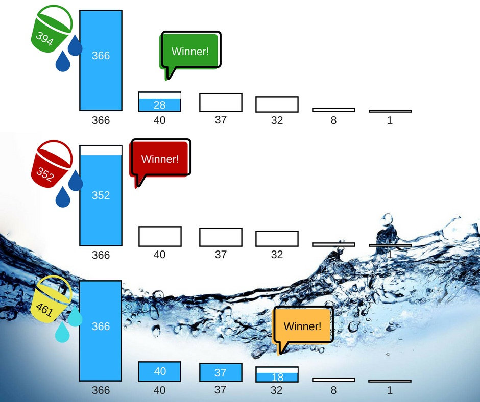

---
categories:
  - Build
date: 2018-06-07T03:44:14Z
description: ""
draft: false
postimage: /banners/generic-build-banner.webp
slug: writing-a-random-selection-algorithm-that-factors-in-the-age-of-an-item
summary: Have you ever had a collection of items and needed to select a random one from the lot? What if you have a class with some property (i.e. 'age' or 'weight') that you want to take into account when doing the random selection? Let's see how we might approach that...
tags:
  - algorithms
title: A random selection algorithm that factors in age (weighted selection)
---
## Random Selection

Have you ever had a collection of items and needed to select a random one from the lot? That's easy enough in most languages, since they generally provide a way to generate a random number which you can use as the index.

C# has its [Random](https://msdn.microsoft.com/en-us/library/2dx6wyd4\(v=vs.110\).aspx) class:

```csharp
using System;
using System.Collections.Generic;
using System.Linq;

public class Program
{	
	static Random rnd = new Random();
	public static void Main()
	{
		var names = new List<string> { "Tom", "Mary", "Sam" };
		Console.WriteLine($"Random name: {names[rnd.Next(names.Count())]}");
	}
}
```

Ruby also has a [Random](https://ruby-doc.org/core-2.4.0/Random.html) class:

```ruby
names = ['Tom','Mary','Sam']
puts "Random name: #{names[Random.rand(names.length)]}"
```

And Python has a [Random](https://docs.python.org/3.5/library/random.html) module:

```python
from random import randint
names = ['Tom','Mary','Sam']
print(names[randint(0, len(names)-1)])
```

## Weighted Random Selection

But what if you have a class with some property (i.e. "age" or "weight") that you want to take into account when doing the random selection? For example, I recently wrote an app to [randomly tweet blog posts](https://grantwinney.com/using-aws-lambda-and-tweetinvi-to-tweet-a-random-ghost-blog-post/), and I wanted to make sure newer posts were far more likely to be selected than older ones... but I wanted even the oldest post to still have some tiny chance of being selected.

Here's a sample of the object I was dealing with. I was interested in the `PublishedAt` field, where a post that had been published more recently should be more likely to be selected.

```csharp
public class Post
{
    public string Id { get; set; }
    public string Title { get; set; }
    public string CreatedAt { get; set; }
    public string CreatedBy { get; set; }
    public string UpdatedAt { get; set; }
    public string UpdatedBy { get; set; }
    public string PublishedAt { get; set; }
    public string PublishedBy { get; set; }
}
```

### Attempt 1: Raffle Ticket System


My first attempt was to use my oldest post as "ground 0" and give all posts after it a "weight" that was calculated using the number of days that had passed since that original post. So the oldest published post would have a "weight" of 1, but a post written a week later would have a "weight" of 8, and one a year later a weight of 366. It's almost like a raffle drawing where one person got 1 ticket to try and win, but someone else got hundreds. The person with hundreds is more likely to win, but not guaranteed.

Using that weight, I created a second collection, which included a post's ID a number of times equal to its "weight". So the ID of that week-old post would occur 8 times in the list, but the oldest post would only occur once. _(The_ _`_posts_`_ _variable is ordered so that the latest (newest) post is first.)_

```csharp
static string GetRandomPostId(List<Post> posts)
{
    var lastDate = DateTime.Parse(posts.Last().PublishedAt);
    var postIds = new List<string>();
    foreach (var p in posts)
    {
        var weight = (DateTime.Parse(p.PublishedAt) - lastDate).Days + 1;
        postIds.AddRange(Enumerable.Repeat(p.Id, weight);
    }
    return postIds[rnd.Next(0, postIds.Count)];
}
```

Assuming I started with some posts like these ones:

I'd end up with a collection of strings like this, which I'd call Random on to get a random item.

```none
3456-qwer-8
3456-qwer-8
3456-qwer-8
... repeated 363 more times
2345-zxcv-6
2345-zxcv-6
2345-zxcv-6
2345-zxcv-6
2345-zxcv-6
2345-zxcv-6
2345-zxcv-6
2345-zxcv-6
1234-abcd-9
```

The problem with that approach was the potential to gobble up a ton of memory with a huge list, and I'm trying to run this job on the free AWS Lambda tier. My oldest posts are from years ago, which means the most recent ones had a weight of nearly 2000, so they show in the list 2000 times. The list was a quarter-million strings - and each post afterwards would continue to increase it. I was curious if there was a more efficient way to tackle this.

### Attempt 2: Overflow System



I came across a Stack Overflow post on [weighted choice](https://stackoverflow.com/q/56692/301857), which led to this bit of code. It's still calculating a weight dependent on the earliest post's publish date compared with each subsequent's post publish date. _(Again, posts are organized with most recent on the top.)_

```csharp
static string GetRandomPostIdWeightedOnAge(List<Post> posts)
{
    var firstPubDate = DateTime.Parse(posts.Last().PublishedAt);
    var postIdsAndWeights
        = posts.Select(p => Tuple.Create(p.Id, (DateTime.Parse(p.PublishedAt) - firstPubDate).Days));
    var randomWeight = rnd.Next(0, postIdsAndWeights.Sum(p => p.Item2));

    foreach (var p in postIdsAndWeights)
    {
        if (randomWeight <= p.Item2)
            return p.Item1;
        randomWeight -= p.Item2;
    }
    return null;  // required to compile, but won't happen unless there are no posts
}
```

Assuming I started with some posts like these ones:

I end up with a list of tuples like this, with the post ID and its "weight" (age in days).

```none
{ 6789-mnbv-3, 366 },
{ 5678-poiu-4, 40 },
{ 4567-lkjh-6, 37 },
{ 3456-qwer-8, 32 },
{ 2345-zxcv-6, 8 },
{ 1234-abcd-9, 1 }
```

I added even more weight, thus skewing the random selection even _more_ in favor of newer posts, by replacing the second line above with this:

```csharp
var postsCount = posts.Count;
var postIdsAndWeights
    = posts.Select((p, i) => Tuple.Create(posts[i].Id, ((DateTime.Parse(posts[i].PublishedAt) - earliestPublishDate).Days * (postsCount - i)));
```

Giving something more akin to this:

```none
{ 6789-mnbv-3, 1996 },
{ 5678-poiu-4, 200 },
{ 4567-lkjh-6, 148 },
{ 3456-qwer-8, 96 },
{ 2345-zxcv-6, 16 },
{ 1234-abcd-9, 1 }
```

The total weight of all six posts is 2457, so the random number will fall between 0 and 2456 (upper limit is exclusive, at least in C#). When the `foreach` loop in the above code executes, the first thing it'll test is whether the random selected number is less than or equal to the weight of the first post - 1996.

```csharp
foreach (var p in postIdsAndWeights)
{
    if (randomWeight <= p.Item2)
        return p.Item1;
    randomWeight -= p.Item2;
}
```

Let's say the randomly selected weight is 2048. That's not less than the first record, so it'll skip that record and subtract the weight of the first record from the random number. So now we have `2048 - 1996 = 52`. That's definitely less than the weight of the second record, so the second record is the winner.

Over many test runs, 1996 out of 2457 random numbers (81%) will favor the first record. 2196 out of 2457 random numbers (89%) will favor one of the first two records. It's still possible for the last record to be selected, but only in 1 out of 2457 times (0.04%). And with each newer post that gets added, the less likely it is that older posts will be randomly selected.

When I ran it against my blog 50 times, which has about 200 posts going back nearly 5 years, these were the results. There are 26 from 2018 (and it's only June), 18 from 2017, 4 from 2016, and nothing earlier. Seems to be working as expected to me.

```
Selected post from: 2018-05-23T18:00:44.000Z
Selected post from: 2018-01-05T19:06:40.000Z
Selected post from: 2016-12-03T16:03:01.000Z
Selected post from: 2018-02-26T01:11:54.000Z
Selected post from: 2018-02-12T04:59:35.000Z
Selected post from: 2018-01-05T19:06:40.000Z
Selected post from: 2018-04-13T17:10:14.000Z
Selected post from: 2016-04-03T09:03:25.000Z
Selected post from: 2017-09-12T23:18:32.000Z
Selected post from: 2018-04-24T12:21:13.000Z
Selected post from: 2017-05-19T10:15:00.000Z
Selected post from: 2018-01-31T00:07:00.000Z
Selected post from: 2017-05-28T05:07:53.000Z
Selected post from: 2018-02-04T03:03:21.000Z
Selected post from: 2018-02-03T14:08:21.000Z
Selected post from: 2017-12-16T04:58:47.000Z
Selected post from: 2017-06-16T12:30:21.000Z
Selected post from: 2017-06-30T12:14:21.000Z
Selected post from: 2016-10-31T13:23:44.000Z
Selected post from: 2017-02-14T13:04:24.000Z
Selected post from: 2017-12-16T21:32:52.000Z
Selected post from: 2018-06-02T12:32:54.000Z
Selected post from: 2017-12-23T04:10:01.000Z
Selected post from: 2017-06-30T12:14:21.000Z
Selected post from: 2018-01-21T04:56:35.000Z
Selected post from: 2018-01-31T00:07:00.000Z
Selected post from: 2017-02-17T09:03:29.000Z
Selected post from: 2017-01-04T08:17:32.000Z
Selected post from: 2018-03-03T18:52:51.000Z
Selected post from: 2018-03-14T11:57:50.000Z
Selected post from: 2018-06-02T12:32:54.000Z
Selected post from: 2017-10-09T12:28:11.000Z
Selected post from: 2018-04-24T12:21:13.000Z
Selected post from: 2016-09-24T13:30:49.000Z
Selected post from: 2018-04-13T17:10:14.000Z
Selected post from: 2017-12-29T15:33:04.000Z
Selected post from: 2018-06-01T17:28:01.000Z
Selected post from: 2017-10-16T17:31:00.000Z
Selected post from: 2018-05-22T16:55:18.000Z
Selected post from: 2018-01-25T04:59:32.000Z
Selected post from: 2017-12-23T04:10:01.000Z
Selected post from: 2018-06-02T12:32:54.000Z
Selected post from: 2018-01-01T05:00:00.000Z
Selected post from: 2018-05-22T16:55:18.000Z
Selected post from: 2017-07-23T19:41:19.000Z
Selected post from: 2018-05-22T16:55:18.000Z
Selected post from: 2017-12-17T19:37:29.000Z
Selected post from: 2018-02-06T12:36:34.000Z
Selected post from: 2017-10-09T12:28:11.000Z
Selected post from: 2018-01-25T04:59:32.000Z
```
